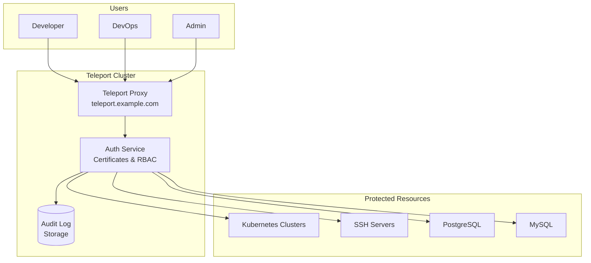

# How to Configure Teleport for Secure Access

Author: [nawazdhandala](https://www.github.com/nawazdhandala)

Tags: Teleport, Security, Zero Trust, Kubernetes, SSH, Access Management, Identity

Description: A comprehensive guide to deploying Teleport for secure access to Kubernetes clusters, SSH servers, and databases. Learn how to implement certificate-based authentication and session recording.

---

> Teleport is an open-source access plane that provides secure, audited access to infrastructure. It replaces VPNs and shared credentials with certificate-based authentication and fine-grained access controls.

Managing access to Kubernetes clusters, SSH servers, and databases traditionally involves juggling multiple tools, credentials, and access patterns. Teleport unifies these under a single platform with built-in audit logging and session recording.

---

## Why Teleport for Kubernetes Access

Traditional Kubernetes access management presents several challenges:

- Long-lived kubeconfig files with static credentials
- No visibility into who accessed what resources
- Complex RBAC configurations across multiple clusters
- Difficulty revoking access when employees leave

Teleport addresses these by providing:

- Short-lived certificates that expire automatically
- Complete audit trails of all access and commands
- Session recording for compliance requirements
- Single sign-on integration with your identity provider

---

## Prerequisites

Before deploying Teleport:

- Kubernetes cluster (v1.21+)
- Helm 3.x installed
- DNS name for Teleport proxy (e.g., teleport.example.com)
- TLS certificate (Let's Encrypt or your CA)
- OIDC provider for SSO (optional but recommended)

---

## Architecture Overview

Understanding Teleport's architecture helps with deployment planning:



---

## Installing Teleport with Helm

Create a values file for Teleport configuration:

```yaml
# teleport-values.yaml
# Helm values for Teleport deployment

chartMode: standalone

# Cluster name appears in certificates and audit logs
clusterName: teleport.example.com

# Authentication configuration
authentication:
  # Use local users initially, switch to OIDC later
  type: local
  localAuth: true
  secondFactor: "otp"  # Enable TOTP 2FA

# Proxy service configuration
proxyListenerMode: multiplex
proxy:
  highAvailability:
    replicaCount: 2
    requireAntiAffinity: true

# Enable Kubernetes access
kubeClusterName: production-cluster

# Storage backend for cluster state and audit logs
persistence:
  enabled: true
  storageClassName: standard
  volumeSize: 50Gi

# TLS configuration
acme: false  # Set true for Let's Encrypt
highAvailability:
  certSecret:
    name: teleport-tls
    create: false  # Create secret manually or use cert-manager

# Ingress configuration
ingress:
  enabled: false  # Using LoadBalancer instead

service:
  type: LoadBalancer
  annotations:
    # Cloud provider specific annotations
    service.beta.kubernetes.io/aws-load-balancer-type: nlb

# Resource limits
resources:
  requests:
    cpu: 500m
    memory: 512Mi
  limits:
    cpu: 2000m
    memory: 2Gi
```

Deploy Teleport:

```bash
# Add the Teleport Helm repository
helm repo add teleport https://charts.releases.teleport.dev
helm repo update

# Create namespace
kubectl create namespace teleport

# Create TLS secret (if not using cert-manager)
kubectl create secret tls teleport-tls \
  --cert=tls.crt \
  --key=tls.key \
  -n teleport

# Install Teleport
helm install teleport teleport/teleport-cluster \
  --namespace teleport \
  --values teleport-values.yaml \
  --wait
```

---

## Creating the First Admin User

After deployment, create an administrative user:

```bash
# Get the Teleport pod name
TELEPORT_POD=$(kubectl get pods -n teleport -l app=teleport -o jsonpath='{.items[0].metadata.name}')

# Create admin user with all permissions
kubectl exec -n teleport $TELEPORT_POD -- tctl users add admin \
  --roles=editor,access \
  --logins=root,ubuntu

# The command outputs a signup URL - use it to set password and 2FA
```

---

## Configuring RBAC Roles

Define roles for different access patterns:

```yaml
# teleport-roles.yaml
# Developer role with limited access
kind: role
version: v5
metadata:
  name: developer
spec:
  # Allow access to specific Kubernetes groups
  allow:
    # Kubernetes access
    kubernetes_groups:
    - developers
    kubernetes_labels:
      env: ["dev", "staging"]

    # SSH access to development servers
    node_labels:
      env: dev

    logins:
    - developer
    - "{{internal.logins}}"

    # Session recording
    rules:
    - resources: ["session"]
      verbs: ["list", "read"]

  # Deny access to production
  deny:
    kubernetes_labels:
      env: production
    node_labels:
      env: production

  # Options
  options:
    # Sessions expire after 8 hours
    max_session_ttl: 8h
    # Require 2FA
    require_session_mfa: true

---
# SRE role with production access
kind: role
version: v5
metadata:
  name: sre
spec:
  allow:
    kubernetes_groups:
    - system:masters
    kubernetes_labels:
      '*': '*'

    node_labels:
      '*': '*'

    logins:
    - root
    - ubuntu
    - "{{internal.logins}}"

    # Database access
    db_labels:
      '*': '*'
    db_names:
    - '*'
    db_users:
    - admin
    - readonly

    rules:
    - resources: ["session", "audit"]
      verbs: ["list", "read"]

  options:
    max_session_ttl: 4h
    require_session_mfa: true
    # Record all sessions
    record_session:
      default: best_effort
      desktop: true
      ssh: true
```

Apply the roles:

```bash
# Apply roles via tctl
kubectl exec -n teleport $TELEPORT_POD -- tctl create -f - <<EOF
$(cat teleport-roles.yaml)
EOF
```

---

## Registering Kubernetes Clusters

Register your Kubernetes cluster with Teleport:

```yaml
# kubernetes-agent-values.yaml
# Configuration for Teleport Kubernetes agent

proxyAddr: teleport.example.com:443

# Join token for initial registration
authToken: <join-token>

# Kubernetes cluster configuration
kubeClusterName: production-east

# Labels for RBAC matching
labels:
  env: production
  region: us-east-1
  team: platform

# Resource limits
resources:
  requests:
    cpu: 100m
    memory: 128Mi
  limits:
    cpu: 500m
    memory: 256Mi
```

Generate a join token and deploy the agent:

```bash
# Generate a join token
kubectl exec -n teleport $TELEPORT_POD -- tctl tokens add \
  --type=kube \
  --ttl=1h

# Install the Kubernetes agent
helm install teleport-kube-agent teleport/teleport-kube-agent \
  --namespace teleport \
  --values kubernetes-agent-values.yaml
```

---

## Setting Up SSH Access

Deploy Teleport node agents on SSH servers:

```bash
#!/bin/bash
# install-teleport-node.sh
# Installs Teleport SSH agent on a server

TELEPORT_VERSION="14.0.0"
PROXY_ADDR="teleport.example.com:443"
JOIN_TOKEN="${1}"

# Download and install Teleport
curl https://get.gravitational.com/teleport-v${TELEPORT_VERSION}-linux-amd64-bin.tar.gz \
  -o teleport.tar.gz

tar -xzf teleport.tar.gz
sudo mv teleport/teleport teleport/tctl teleport/tsh /usr/local/bin/

# Create configuration
sudo mkdir -p /etc/teleport
cat <<EOF | sudo tee /etc/teleport/teleport.yaml
version: v3
teleport:
  nodename: $(hostname)
  data_dir: /var/lib/teleport
  # Connect to Teleport proxy
  proxy_server: ${PROXY_ADDR}
  auth_token: ${JOIN_TOKEN}
  log:
    output: stderr
    severity: INFO

ssh_service:
  enabled: true
  labels:
    env: production
    app: webserver
    region: us-east-1

# Disable other services on this node
auth_service:
  enabled: false
proxy_service:
  enabled: false
EOF

# Create systemd service
cat <<EOF | sudo tee /etc/systemd/system/teleport.service
[Unit]
Description=Teleport SSH Service
After=network.target

[Service]
Type=simple
ExecStart=/usr/local/bin/teleport start --config=/etc/teleport/teleport.yaml
ExecReload=/bin/kill -HUP \$MAINPID
Restart=on-failure
RestartSec=5

[Install]
WantedBy=multi-user.target
EOF

# Start the service
sudo systemctl daemon-reload
sudo systemctl enable teleport
sudo systemctl start teleport

echo "Teleport node agent installed and started"
```

---

## Configuring SSO with OIDC

Integrate with your identity provider:

```yaml
# oidc-connector.yaml
# OIDC connector for Google Workspace
kind: oidc
version: v3
metadata:
  name: google
spec:
  # OAuth2 client credentials
  client_id: "your-client-id.apps.googleusercontent.com"
  client_secret: "your-client-secret"

  # OIDC issuer URL
  issuer_url: https://accounts.google.com

  # Redirect URL after authentication
  redirect_url: https://teleport.example.com/v1/webapi/oidc/callback

  # Map OIDC groups to Teleport roles
  claims_to_roles:
  - claim: groups
    value: engineering@example.com
    roles:
    - developer

  - claim: groups
    value: sre@example.com
    roles:
    - sre

  - claim: groups
    value: admin@example.com
    roles:
    - editor
    - access

  # Display name in login screen
  display: "Google Workspace"
```

Apply and set as default:

```bash
# Create the OIDC connector
kubectl exec -n teleport $TELEPORT_POD -- tctl create -f - <<EOF
$(cat oidc-connector.yaml)
EOF

# Update cluster auth preference
kubectl exec -n teleport $TELEPORT_POD -- tctl create -f - <<EOF
kind: cluster_auth_preference
version: v2
metadata:
  name: cluster-auth-preference
spec:
  type: oidc
  connector_name: google
  second_factor: otp
  webauthn:
    rp_id: teleport.example.com
EOF
```

---

## Client Configuration

Install and configure the Teleport client (tsh):

```bash
# Install tsh client
# macOS
brew install teleport

# Linux
curl https://get.gravitational.com/teleport-v14.0.0-linux-amd64-bin.tar.gz \
  -o teleport.tar.gz
tar -xzf teleport.tar.gz
sudo mv teleport/tsh /usr/local/bin/

# Login to Teleport
tsh login --proxy=teleport.example.com

# List available Kubernetes clusters
tsh kube ls

# Connect to a cluster
tsh kube login production-east

# Now kubectl commands work through Teleport
kubectl get pods

# List SSH servers
tsh ls

# SSH to a server
tsh ssh user@server-name
```

---

## Session Recording and Audit

Configure session recording storage:

```yaml
# session-recording.yaml
# Store recordings in S3
kind: cluster_recording_config
version: v2
metadata:
  name: cluster-recording-config
spec:
  mode: best_effort
  proxy_checks_host_keys: true

---
# External audit storage
kind: cluster_audit_config
version: v2
metadata:
  name: cluster-audit-config
spec:
  # Store audit events in S3
  audit_events_uri:
  - s3://teleport-audit-logs/events
  # Store session recordings in S3
  audit_sessions_uri: s3://teleport-audit-logs/sessions
  # Retention period
  retention:
    max_age: 365d
```

Query audit logs:

```bash
# Search audit logs for specific user
kubectl exec -n teleport $TELEPORT_POD -- tctl events ls \
  --from=2024-01-01 \
  --to=2024-01-31 \
  --user=developer@example.com

# Export events to JSON
kubectl exec -n teleport $TELEPORT_POD -- tctl events ls \
  --format=json > audit-export.json
```

---

## Access Requests and Approvals

Enable just-in-time access with approval workflows:

```yaml
# access-request-role.yaml
kind: role
version: v5
metadata:
  name: contractor
spec:
  allow:
    # Basic access only
    kubernetes_labels:
      env: dev

    # Can request elevated access
    request:
      roles:
      - developer
      - sre
      # Requests expire after 4 hours
      max_duration: 4h

---
# Role that can approve requests
kind: role
version: v5
metadata:
  name: approver
spec:
  allow:
    # Can review and approve access requests
    review_requests:
      roles:
      - developer
      - sre
```

---

## Conclusion

Teleport provides a comprehensive solution for secure infrastructure access. By replacing static credentials with certificate-based authentication and adding audit logging, you significantly improve your security posture while simplifying access management.

The combination of SSO integration, role-based access control, and session recording makes Teleport particularly valuable for organizations with compliance requirements. Start with a single cluster and expand as you standardize on Teleport for all infrastructure access.

---

*Need to correlate infrastructure access with application performance? [OneUptime](https://oneuptime.com) provides unified observability and incident management. Track when access events correlate with production incidents.*
