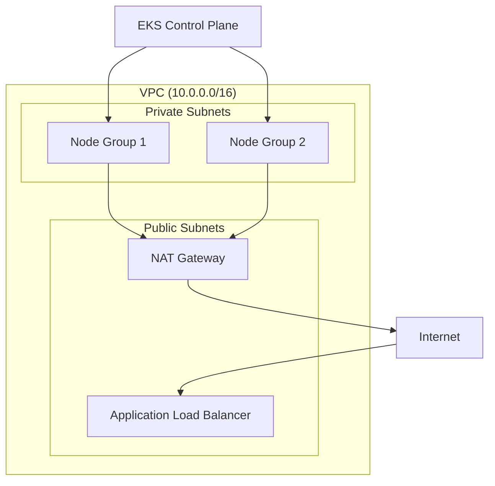

# How to Deploy AWS EKS with Terraform

Author: [nawazdhandala](https://www.github.com/nawazdhandala)

Tags: Terraform, AWS, EKS, Kubernetes, Infrastructure as Code, DevOps

Description: A complete guide to deploying Amazon EKS clusters with Terraform, including VPC setup, node groups, IAM roles, and cluster add-ons for production workloads.

---

Amazon EKS is a managed Kubernetes service that handles the control plane while you manage worker nodes. Terraform makes EKS deployments reproducible and version-controlled. This guide walks through a production-ready setup.

## Architecture Overview



## Project Structure

```
eks-terraform/
├── main.tf
├── variables.tf
├── outputs.tf
├── vpc.tf
├── eks.tf
├── node-groups.tf
├── iam.tf
└── versions.tf
```

## Provider Configuration

```hcl
# versions.tf

terraform {
  required_version = ">= 1.0"

  required_providers {
    aws = {
      source  = "hashicorp/aws"
      version = "~> 5.0"
    }
    kubernetes = {
      source  = "hashicorp/kubernetes"
      version = "~> 2.23"
    }
  }
}

provider "aws" {
  region = var.aws_region

  default_tags {
    tags = {
      Project     = var.project_name
      Environment = var.environment
      ManagedBy   = "terraform"
    }
  }
}

# Configure Kubernetes provider to use EKS credentials
provider "kubernetes" {
  host                   = module.eks.cluster_endpoint
  cluster_ca_certificate = base64decode(module.eks.cluster_certificate_authority_data)

  exec {
    api_version = "client.authentication.k8s.io/v1beta1"
    command     = "aws"
    args        = ["eks", "get-token", "--cluster-name", module.eks.cluster_name]
  }
}
```

## Variables

```hcl
# variables.tf

variable "aws_region" {
  description = "AWS region for EKS cluster"
  type        = string
  default     = "us-east-1"
}

variable "project_name" {
  description = "Project name for resource naming"
  type        = string
  default     = "myapp"
}

variable "environment" {
  description = "Environment (dev, staging, prod)"
  type        = string
  default     = "dev"
}

variable "cluster_version" {
  description = "Kubernetes version for EKS"
  type        = string
  default     = "1.28"
}

variable "vpc_cidr" {
  description = "CIDR block for VPC"
  type        = string
  default     = "10.0.0.0/16"
}

variable "node_instance_types" {
  description = "Instance types for EKS nodes"
  type        = list(string)
  default     = ["t3.medium"]
}

variable "node_desired_size" {
  description = "Desired number of nodes"
  type        = number
  default     = 2
}

variable "node_min_size" {
  description = "Minimum number of nodes"
  type        = number
  default     = 1
}

variable "node_max_size" {
  description = "Maximum number of nodes"
  type        = number
  default     = 5
}
```

## VPC Configuration

```hcl
# vpc.tf

# Get available AZs in the region
data "aws_availability_zones" "available" {
  state = "available"
}

locals {
  azs         = slice(data.aws_availability_zones.available.names, 0, 3)
  cluster_name = "${var.project_name}-${var.environment}"
}

# VPC using the official AWS module
module "vpc" {
  source  = "terraform-aws-modules/vpc/aws"
  version = "5.1.0"

  name = "${local.cluster_name}-vpc"
  cidr = var.vpc_cidr

  azs             = local.azs
  private_subnets = [for i, az in local.azs : cidrsubnet(var.vpc_cidr, 4, i)]
  public_subnets  = [for i, az in local.azs : cidrsubnet(var.vpc_cidr, 4, i + 4)]

  # NAT Gateway for private subnet internet access
  enable_nat_gateway     = true
  single_nat_gateway     = var.environment != "prod"  # One NAT in dev/staging
  one_nat_gateway_per_az = var.environment == "prod"  # HA in prod

  # DNS settings required for EKS
  enable_dns_hostnames = true
  enable_dns_support   = true

  # Tags required for EKS to discover subnets
  public_subnet_tags = {
    "kubernetes.io/cluster/${local.cluster_name}" = "shared"
    "kubernetes.io/role/elb"                      = 1
  }

  private_subnet_tags = {
    "kubernetes.io/cluster/${local.cluster_name}" = "shared"
    "kubernetes.io/role/internal-elb"             = 1
  }
}
```

## EKS Cluster

```hcl
# eks.tf

module "eks" {
  source  = "terraform-aws-modules/eks/aws"
  version = "19.21.0"

  cluster_name    = local.cluster_name
  cluster_version = var.cluster_version

  vpc_id     = module.vpc.vpc_id
  subnet_ids = module.vpc.private_subnets

  # Allow access from public internet (for kubectl)
  cluster_endpoint_public_access = true

  # Restrict public access to specific IPs in production
  cluster_endpoint_public_access_cidrs = var.environment == "prod" ? var.allowed_cidrs : ["0.0.0.0/0"]

  # Enable private endpoint for node communication
  cluster_endpoint_private_access = true

  # Enable cluster logging
  cluster_enabled_log_types = ["api", "audit", "authenticator", "controllerManager", "scheduler"]

  # EKS Add-ons
  cluster_addons = {
    coredns = {
      most_recent = true
    }
    kube-proxy = {
      most_recent = true
    }
    vpc-cni = {
      most_recent              = true
      before_compute           = true  # Deploy before nodes
      service_account_role_arn = module.vpc_cni_irsa.iam_role_arn
      configuration_values = jsonencode({
        env = {
          ENABLE_PREFIX_DELEGATION = "true"
          WARM_PREFIX_TARGET       = "1"
        }
      })
    }
  }

  # Fargate profiles (optional, for serverless pods)
  fargate_profiles = var.enable_fargate ? {
    default = {
      name = "default"
      selectors = [
        {
          namespace = "kube-system"
          labels = {
            k8s-app = "kube-dns"
          }
        }
      ]
    }
  } : {}
}

# IRSA for VPC CNI
module "vpc_cni_irsa" {
  source  = "terraform-aws-modules/iam/aws//modules/iam-role-for-service-accounts-eks"
  version = "5.30.0"

  role_name             = "${local.cluster_name}-vpc-cni"
  attach_vpc_cni_policy = true
  vpc_cni_enable_ipv4   = true

  oidc_providers = {
    main = {
      provider_arn               = module.eks.oidc_provider_arn
      namespace_service_accounts = ["kube-system:aws-node"]
    }
  }
}
```

## Node Groups

```hcl
# node-groups.tf

# Managed node group for general workloads
resource "aws_eks_node_group" "general" {
  cluster_name    = module.eks.cluster_name
  node_group_name = "${local.cluster_name}-general"
  node_role_arn   = aws_iam_role.node_group.arn
  subnet_ids      = module.vpc.private_subnets

  instance_types = var.node_instance_types
  capacity_type  = "ON_DEMAND"

  scaling_config {
    desired_size = var.node_desired_size
    min_size     = var.node_min_size
    max_size     = var.node_max_size
  }

  update_config {
    max_unavailable = 1
  }

  # Use latest EKS-optimized AMI
  ami_type = "AL2_x86_64"

  labels = {
    role        = "general"
    environment = var.environment
  }

  tags = {
    Name = "${local.cluster_name}-node"
  }

  depends_on = [
    aws_iam_role_policy_attachment.node_AmazonEKSWorkerNodePolicy,
    aws_iam_role_policy_attachment.node_AmazonEKS_CNI_Policy,
    aws_iam_role_policy_attachment.node_AmazonEC2ContainerRegistryReadOnly,
  ]
}

# Spot instance node group for cost savings
resource "aws_eks_node_group" "spot" {
  count = var.environment != "prod" ? 1 : 0

  cluster_name    = module.eks.cluster_name
  node_group_name = "${local.cluster_name}-spot"
  node_role_arn   = aws_iam_role.node_group.arn
  subnet_ids      = module.vpc.private_subnets

  instance_types = ["t3.medium", "t3.large", "t3a.medium", "t3a.large"]
  capacity_type  = "SPOT"

  scaling_config {
    desired_size = 2
    min_size     = 0
    max_size     = 10
  }

  labels = {
    role     = "spot"
    nodeType = "spot"
  }

  taint {
    key    = "spot"
    value  = "true"
    effect = "NO_SCHEDULE"
  }

  depends_on = [
    aws_iam_role_policy_attachment.node_AmazonEKSWorkerNodePolicy,
    aws_iam_role_policy_attachment.node_AmazonEKS_CNI_Policy,
    aws_iam_role_policy_attachment.node_AmazonEC2ContainerRegistryReadOnly,
  ]
}
```

## IAM Roles

```hcl
# iam.tf

# IAM role for EKS node groups
resource "aws_iam_role" "node_group" {
  name = "${local.cluster_name}-node-group"

  assume_role_policy = jsonencode({
    Version = "2012-10-17"
    Statement = [{
      Action = "sts:AssumeRole"
      Effect = "Allow"
      Principal = {
        Service = "ec2.amazonaws.com"
      }
    }]
  })
}

# Required policies for node groups
resource "aws_iam_role_policy_attachment" "node_AmazonEKSWorkerNodePolicy" {
  policy_arn = "arn:aws:iam::aws:policy/AmazonEKSWorkerNodePolicy"
  role       = aws_iam_role.node_group.name
}

resource "aws_iam_role_policy_attachment" "node_AmazonEKS_CNI_Policy" {
  policy_arn = "arn:aws:iam::aws:policy/AmazonEKS_CNI_Policy"
  role       = aws_iam_role.node_group.name
}

resource "aws_iam_role_policy_attachment" "node_AmazonEC2ContainerRegistryReadOnly" {
  policy_arn = "arn:aws:iam::aws:policy/AmazonEC2ContainerRegistryReadOnly"
  role       = aws_iam_role.node_group.name
}

# IRSA for AWS Load Balancer Controller
module "lb_controller_irsa" {
  source  = "terraform-aws-modules/iam/aws//modules/iam-role-for-service-accounts-eks"
  version = "5.30.0"

  role_name                              = "${local.cluster_name}-lb-controller"
  attach_load_balancer_controller_policy = true

  oidc_providers = {
    main = {
      provider_arn               = module.eks.oidc_provider_arn
      namespace_service_accounts = ["kube-system:aws-load-balancer-controller"]
    }
  }
}

# IRSA for External DNS
module "external_dns_irsa" {
  source  = "terraform-aws-modules/iam/aws//modules/iam-role-for-service-accounts-eks"
  version = "5.30.0"

  role_name                     = "${local.cluster_name}-external-dns"
  attach_external_dns_policy    = true
  external_dns_hosted_zone_arns = var.hosted_zone_arns

  oidc_providers = {
    main = {
      provider_arn               = module.eks.oidc_provider_arn
      namespace_service_accounts = ["kube-system:external-dns"]
    }
  }
}
```

## Outputs

```hcl
# outputs.tf

output "cluster_name" {
  description = "EKS cluster name"
  value       = module.eks.cluster_name
}

output "cluster_endpoint" {
  description = "EKS cluster endpoint"
  value       = module.eks.cluster_endpoint
}

output "cluster_security_group_id" {
  description = "Security group ID for EKS cluster"
  value       = module.eks.cluster_security_group_id
}

output "cluster_oidc_issuer_url" {
  description = "OIDC issuer URL for the cluster"
  value       = module.eks.cluster_oidc_issuer_url
}

output "configure_kubectl" {
  description = "Command to configure kubectl"
  value       = "aws eks update-kubeconfig --region ${var.aws_region} --name ${module.eks.cluster_name}"
}

output "lb_controller_role_arn" {
  description = "IAM role ARN for AWS Load Balancer Controller"
  value       = module.lb_controller_irsa.iam_role_arn
}
```

## Deployment Steps

```bash
# Initialize Terraform
terraform init

# Review the plan
terraform plan -out=eks.plan

# Apply the configuration (takes 15-20 minutes)
terraform apply eks.plan

# Configure kubectl
aws eks update-kubeconfig --region us-east-1 --name myapp-dev

# Verify cluster access
kubectl get nodes
kubectl get pods -A
```

## Installing Essential Add-ons

After the cluster is up, install common add-ons:

```bash
# Install AWS Load Balancer Controller using Helm
helm repo add eks https://aws.github.io/eks-charts
helm repo update

helm install aws-load-balancer-controller eks/aws-load-balancer-controller \
  -n kube-system \
  --set clusterName=myapp-dev \
  --set serviceAccount.create=true \
  --set serviceAccount.annotations."eks\.amazonaws\.com/role-arn"=$(terraform output -raw lb_controller_role_arn)

# Install metrics-server
kubectl apply -f https://github.com/kubernetes-sigs/metrics-server/releases/latest/download/components.yaml

# Verify installation
kubectl get deployment -n kube-system aws-load-balancer-controller
```

## Cost Optimization Tips

1. **Use Spot instances** for non-critical workloads
2. **Right-size nodes** based on actual workload requirements
3. **Use Cluster Autoscaler** to scale nodes based on demand
4. **Single NAT Gateway** in non-production environments
5. **Karpenter** for more efficient node provisioning

## Security Best Practices

1. **Enable encryption** at rest for EKS secrets
2. **Use IRSA** instead of node-level IAM roles
3. **Restrict API access** with CIDR blocks in production
4. **Enable audit logging** for compliance
5. **Use private subnets** for worker nodes

---

This setup gives you a production-ready EKS cluster with proper networking, IAM, and add-ons. Customize the variables for your environment and scale node groups based on workload requirements.
