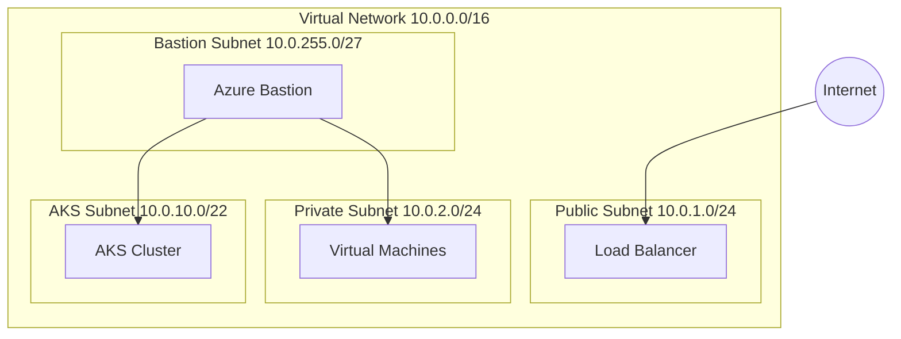

# How to Deploy Azure Resources with Terraform

Author: [nawazdhandala](https://www.github.com/nawazdhandala)

Tags: Terraform, Azure, Infrastructure as Code, DevOps, Cloud, Microsoft Azure

Description: A hands-on guide to deploying Azure infrastructure with Terraform, covering resource groups, virtual networks, VMs, AKS clusters, and Azure SQL databases with production-ready examples.

---

Azure and Terraform work together to provision cloud infrastructure declaratively. This guide covers deploying common Azure resources, from networking fundamentals to managed Kubernetes and databases. You will learn the Azure-specific patterns that differ from AWS and GCP.

## Provider Setup

Configure the AzureRM provider with your subscription.

```hcl
terraform {
  required_version = ">= 1.0"

  required_providers {
    azurerm = {
      source  = "hashicorp/azurerm"
      version = "~> 3.0"
    }
  }
}

provider "azurerm" {
  features {
    # Soft delete protection for key vaults
    key_vault {
      purge_soft_delete_on_destroy    = false
      recover_soft_deleted_key_vaults = true
    }

    # Prevent accidental resource group deletion
    resource_group {
      prevent_deletion_if_contains_resources = true
    }
  }
}

# Data source for current subscription
data "azurerm_subscription" "current" {}

# Data source for current client (user/service principal)
data "azurerm_client_config" "current" {}
```

## Resource Groups

Everything in Azure lives in a resource group. Create them first.

```hcl
variable "location" {
  description = "Azure region"
  type        = string
  default     = "eastus"
}

variable "environment" {
  description = "Environment name"
  type        = string
  default     = "production"
}

# Main resource group
resource "azurerm_resource_group" "main" {
  name     = "rg-app-${var.environment}"
  location = var.location

  tags = {
    Environment = var.environment
    ManagedBy   = "terraform"
  }
}

# Separate resource group for networking
resource "azurerm_resource_group" "network" {
  name     = "rg-network-${var.environment}"
  location = var.location

  tags = {
    Environment = var.environment
    ManagedBy   = "terraform"
  }
}
```

## Virtual Network and Subnets

Azure VNets contain subnets for organizing resources.

```hcl
# Virtual Network
resource "azurerm_virtual_network" "main" {
  name                = "vnet-main"
  location            = azurerm_resource_group.network.location
  resource_group_name = azurerm_resource_group.network.name
  address_space       = ["10.0.0.0/16"]

  tags = {
    Environment = var.environment
  }
}

# Public subnet for load balancers and bastion
resource "azurerm_subnet" "public" {
  name                 = "snet-public"
  resource_group_name  = azurerm_resource_group.network.name
  virtual_network_name = azurerm_virtual_network.main.name
  address_prefixes     = ["10.0.1.0/24"]
}

# Private subnet for application workloads
resource "azurerm_subnet" "private" {
  name                 = "snet-private"
  resource_group_name  = azurerm_resource_group.network.name
  virtual_network_name = azurerm_virtual_network.main.name
  address_prefixes     = ["10.0.2.0/24"]

  # Enable service endpoints for secure access to PaaS services
  service_endpoints = [
    "Microsoft.Sql",
    "Microsoft.Storage",
    "Microsoft.KeyVault"
  ]
}

# Subnet for AKS cluster
resource "azurerm_subnet" "aks" {
  name                 = "snet-aks"
  resource_group_name  = azurerm_resource_group.network.name
  virtual_network_name = azurerm_virtual_network.main.name
  address_prefixes     = ["10.0.10.0/22"]  # /22 for AKS node scaling
}

# Subnet for Azure Bastion
resource "azurerm_subnet" "bastion" {
  name                 = "AzureBastionSubnet"  # Must be named exactly this
  resource_group_name  = azurerm_resource_group.network.name
  virtual_network_name = azurerm_virtual_network.main.name
  address_prefixes     = ["10.0.255.0/27"]
}
```



## Network Security Groups

NSGs filter traffic to subnets and network interfaces.

```hcl
# NSG for web tier
resource "azurerm_network_security_group" "web" {
  name                = "nsg-web"
  location            = azurerm_resource_group.network.location
  resource_group_name = azurerm_resource_group.network.name

  # Allow HTTP
  security_rule {
    name                       = "AllowHTTP"
    priority                   = 100
    direction                  = "Inbound"
    access                     = "Allow"
    protocol                   = "Tcp"
    source_port_range          = "*"
    destination_port_range     = "80"
    source_address_prefix      = "*"
    destination_address_prefix = "*"
  }

  # Allow HTTPS
  security_rule {
    name                       = "AllowHTTPS"
    priority                   = 110
    direction                  = "Inbound"
    access                     = "Allow"
    protocol                   = "Tcp"
    source_port_range          = "*"
    destination_port_range     = "443"
    source_address_prefix      = "*"
    destination_address_prefix = "*"
  }

  # Allow Azure Load Balancer health probes
  security_rule {
    name                       = "AllowAzureLB"
    priority                   = 200
    direction                  = "Inbound"
    access                     = "Allow"
    protocol                   = "*"
    source_port_range          = "*"
    destination_port_range     = "*"
    source_address_prefix      = "AzureLoadBalancer"
    destination_address_prefix = "*"
  }

  # Deny all other inbound
  security_rule {
    name                       = "DenyAllInbound"
    priority                   = 4096
    direction                  = "Inbound"
    access                     = "Deny"
    protocol                   = "*"
    source_port_range          = "*"
    destination_port_range     = "*"
    source_address_prefix      = "*"
    destination_address_prefix = "*"
  }

  tags = {
    Environment = var.environment
  }
}

# Associate NSG with subnet
resource "azurerm_subnet_network_security_group_association" "public" {
  subnet_id                 = azurerm_subnet.public.id
  network_security_group_id = azurerm_network_security_group.web.id
}
```

## Linux Virtual Machines

Deploy VMs with managed disks and public IPs.

```hcl
# Public IP for the VM
resource "azurerm_public_ip" "web" {
  name                = "pip-web"
  location            = azurerm_resource_group.main.location
  resource_group_name = azurerm_resource_group.main.name
  allocation_method   = "Static"
  sku                 = "Standard"

  tags = {
    Environment = var.environment
  }
}

# Network interface
resource "azurerm_network_interface" "web" {
  name                = "nic-web"
  location            = azurerm_resource_group.main.location
  resource_group_name = azurerm_resource_group.main.name

  ip_configuration {
    name                          = "internal"
    subnet_id                     = azurerm_subnet.private.id
    private_ip_address_allocation = "Dynamic"
    public_ip_address_id          = azurerm_public_ip.web.id
  }

  tags = {
    Environment = var.environment
  }
}

# Linux VM
resource "azurerm_linux_virtual_machine" "web" {
  name                = "vm-web"
  location            = azurerm_resource_group.main.location
  resource_group_name = azurerm_resource_group.main.name
  size                = "Standard_B2s"
  admin_username      = "azureuser"

  network_interface_ids = [azurerm_network_interface.web.id]

  admin_ssh_key {
    username   = "azureuser"
    public_key = file("~/.ssh/id_rsa.pub")
  }

  os_disk {
    caching              = "ReadWrite"
    storage_account_type = "Premium_LRS"
    disk_size_gb         = 30
  }

  source_image_reference {
    publisher = "Canonical"
    offer     = "0001-com-ubuntu-server-jammy"
    sku       = "22_04-lts-gen2"
    version   = "latest"
  }

  # Enable boot diagnostics
  boot_diagnostics {
    storage_account_uri = null  # Use managed storage account
  }

  # Custom data for cloud-init
  custom_data = base64encode(<<-EOF
    #!/bin/bash
    apt-get update
    apt-get install -y nginx
    systemctl enable nginx
    systemctl start nginx
  EOF
  )

  tags = {
    Environment = var.environment
    Role        = "web-server"
  }
}
```

## Azure Kubernetes Service (AKS)

Deploy a production-ready AKS cluster.

```hcl
# User-assigned identity for AKS
resource "azurerm_user_assigned_identity" "aks" {
  name                = "id-aks"
  location            = azurerm_resource_group.main.location
  resource_group_name = azurerm_resource_group.main.name
}

# Grant network contributor for AKS to manage load balancers
resource "azurerm_role_assignment" "aks_network" {
  scope                = azurerm_resource_group.network.id
  role_definition_name = "Network Contributor"
  principal_id         = azurerm_user_assigned_identity.aks.principal_id
}

# AKS Cluster
resource "azurerm_kubernetes_cluster" "main" {
  name                = "aks-main"
  location            = azurerm_resource_group.main.location
  resource_group_name = azurerm_resource_group.main.name
  dns_prefix          = "aks-main"
  kubernetes_version  = "1.28"

  default_node_pool {
    name                = "system"
    node_count          = 2
    vm_size             = "Standard_D2s_v3"
    vnet_subnet_id      = azurerm_subnet.aks.id
    enable_auto_scaling = true
    min_count           = 2
    max_count           = 5
    os_disk_size_gb     = 50
    os_disk_type        = "Managed"

    # Availability zones for HA
    zones = ["1", "2", "3"]

    tags = {
      Environment = var.environment
    }
  }

  identity {
    type         = "UserAssigned"
    identity_ids = [azurerm_user_assigned_identity.aks.id]
  }

  network_profile {
    network_plugin    = "azure"
    network_policy    = "azure"
    load_balancer_sku = "standard"
    service_cidr      = "10.1.0.0/16"
    dns_service_ip    = "10.1.0.10"
  }

  # Enable Azure AD integration
  azure_active_directory_role_based_access_control {
    managed            = true
    azure_rbac_enabled = true
  }

  # Enable monitoring
  oms_agent {
    log_analytics_workspace_id = azurerm_log_analytics_workspace.main.id
  }

  tags = {
    Environment = var.environment
  }

  depends_on = [
    azurerm_role_assignment.aks_network
  ]
}

# Additional node pool for workloads
resource "azurerm_kubernetes_cluster_node_pool" "workload" {
  name                  = "workload"
  kubernetes_cluster_id = azurerm_kubernetes_cluster.main.id
  vm_size               = "Standard_D4s_v3"
  node_count            = 2
  vnet_subnet_id        = azurerm_subnet.aks.id
  enable_auto_scaling   = true
  min_count             = 2
  max_count             = 10

  node_labels = {
    "workload-type" = "application"
  }

  zones = ["1", "2", "3"]

  tags = {
    Environment = var.environment
  }
}

# Log Analytics for AKS monitoring
resource "azurerm_log_analytics_workspace" "main" {
  name                = "log-aks-main"
  location            = azurerm_resource_group.main.location
  resource_group_name = azurerm_resource_group.main.name
  sku                 = "PerGB2018"
  retention_in_days   = 30

  tags = {
    Environment = var.environment
  }
}
```

## Azure SQL Database

Deploy a managed SQL database.

```hcl
# SQL Server
resource "azurerm_mssql_server" "main" {
  name                         = "sql-main-${var.environment}"
  location                     = azurerm_resource_group.main.location
  resource_group_name          = azurerm_resource_group.main.name
  version                      = "12.0"
  administrator_login          = "sqladmin"
  administrator_login_password = var.sql_admin_password
  minimum_tls_version          = "1.2"

  azuread_administrator {
    login_username = "AzureAD Admin"
    object_id      = data.azurerm_client_config.current.object_id
  }

  tags = {
    Environment = var.environment
  }
}

# SQL Database
resource "azurerm_mssql_database" "app" {
  name         = "db-app"
  server_id    = azurerm_mssql_server.main.id
  collation    = "SQL_Latin1_General_CP1_CI_AS"
  license_type = "LicenseIncluded"
  sku_name     = "S1"  # Standard tier
  max_size_gb  = 50

  short_term_retention_policy {
    retention_days = 7
  }

  long_term_retention_policy {
    weekly_retention  = "P4W"
    monthly_retention = "P12M"
    yearly_retention  = "P5Y"
    week_of_year      = 1
  }

  tags = {
    Environment = var.environment
  }
}

# Virtual network rule for private access
resource "azurerm_mssql_virtual_network_rule" "main" {
  name      = "vnet-rule"
  server_id = azurerm_mssql_server.main.id
  subnet_id = azurerm_subnet.private.id
}

# Firewall rule for Azure services (if needed)
resource "azurerm_mssql_firewall_rule" "azure_services" {
  name             = "AllowAzureServices"
  server_id        = azurerm_mssql_server.main.id
  start_ip_address = "0.0.0.0"
  end_ip_address   = "0.0.0.0"
}

variable "sql_admin_password" {
  description = "SQL Server admin password"
  type        = string
  sensitive   = true
}
```

## Storage Account

```hcl
# Storage account with private endpoint
resource "azurerm_storage_account" "main" {
  name                     = "stmain${var.environment}"
  resource_group_name      = azurerm_resource_group.main.name
  location                 = azurerm_resource_group.main.location
  account_tier             = "Standard"
  account_replication_type = "GRS"
  min_tls_version          = "TLS1_2"

  blob_properties {
    versioning_enabled = true

    delete_retention_policy {
      days = 30
    }

    container_delete_retention_policy {
      days = 30
    }
  }

  network_rules {
    default_action             = "Deny"
    virtual_network_subnet_ids = [azurerm_subnet.private.id]
    bypass                     = ["AzureServices"]
  }

  tags = {
    Environment = var.environment
  }
}

# Blob container
resource "azurerm_storage_container" "data" {
  name                  = "data"
  storage_account_name  = azurerm_storage_account.main.name
  container_access_type = "private"
}
```

## Outputs

```hcl
output "resource_group_name" {
  value = azurerm_resource_group.main.name
}

output "aks_cluster_name" {
  value = azurerm_kubernetes_cluster.main.name
}

output "aks_kube_config" {
  value     = azurerm_kubernetes_cluster.main.kube_config_raw
  sensitive = true
}

output "sql_server_fqdn" {
  value = azurerm_mssql_server.main.fully_qualified_domain_name
}

output "storage_account_name" {
  value = azurerm_storage_account.main.name
}
```

---

Azure infrastructure with Terraform follows familiar patterns but with Azure-specific resources and naming conventions. Resource groups organize related resources, VNets provide networking, and managed services like AKS and Azure SQL reduce operational burden. Start with networking, add compute resources, then layer on managed services for a complete infrastructure stack.
