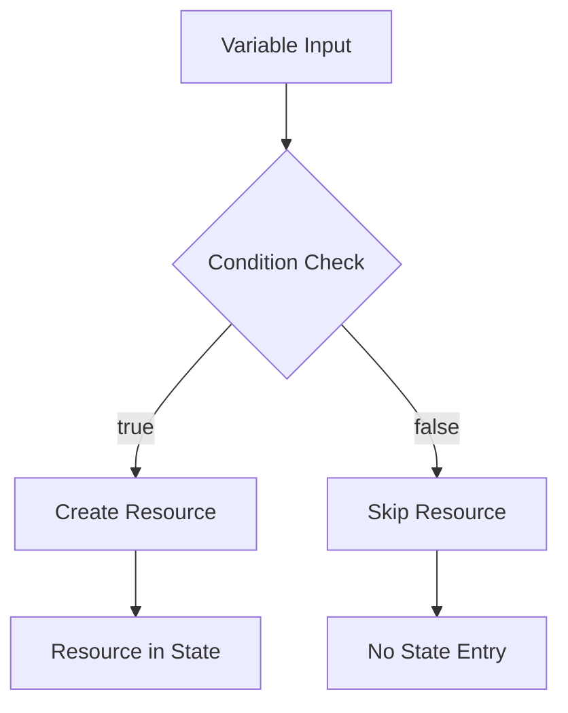

# How to Create Conditional Resources in Terraform

Author: [nawazdhandala](https://www.github.com/nawazdhandala)

Tags: Terraform, Infrastructure as Code, Conditionals, DevOps, Cloud Automation

Description: Learn how to create resources conditionally in Terraform using count, for_each, and conditional expressions to build flexible, environment-aware infrastructure configurations.

---

Not every resource needs to exist in every environment. You might want a bastion host in development but not production, or extra logging in staging. Terraform provides several mechanisms to conditionally create resources based on variables, environment settings, or other conditions.

## The Count Trick for Conditionals

The most common pattern for conditional resources uses `count` with a ternary expression. When `count = 0`, Terraform skips the resource entirely.

```hcl
variable "create_bastion" {
  description = "Whether to create a bastion host"
  type        = bool
  default     = false
}

# Only create bastion if variable is true
resource "aws_instance" "bastion" {
  count = var.create_bastion ? 1 : 0

  ami           = data.aws_ami.ubuntu.id
  instance_type = "t3.micro"
  subnet_id     = aws_subnet.public.id

  tags = {
    Name = "bastion-host"
  }
}

# Reference the conditional resource
output "bastion_ip" {
  value = var.create_bastion ? aws_instance.bastion[0].public_ip : null
}
```

The ternary syntax `condition ? true_value : false_value` evaluates to `1` or `0`, creating or skipping the resource.

## Environment-Based Conditionals

Different environments often need different infrastructure. Use variables to control what gets created.

```hcl
variable "environment" {
  description = "Deployment environment"
  type        = string
  validation {
    condition     = contains(["dev", "staging", "production"], var.environment)
    error_message = "Environment must be dev, staging, or production."
  }
}

# NAT Gateway only in production (it's expensive)
resource "aws_nat_gateway" "main" {
  count = var.environment == "production" ? 1 : 0

  allocation_id = aws_eip.nat[0].id
  subnet_id     = aws_subnet.public.id

  tags = {
    Name = "${var.environment}-nat-gateway"
  }
}

# Elastic IP for NAT Gateway
resource "aws_eip" "nat" {
  count  = var.environment == "production" ? 1 : 0
  domain = "vpc"

  tags = {
    Name = "${var.environment}-nat-eip"
  }
}

# In non-production, route through internet gateway directly
resource "aws_route" "private_nat" {
  count = var.environment == "production" ? 1 : 0

  route_table_id         = aws_route_table.private.id
  destination_cidr_block = "0.0.0.0/0"
  nat_gateway_id         = aws_nat_gateway.main[0].id
}

resource "aws_route" "private_igw" {
  count = var.environment != "production" ? 1 : 0

  route_table_id         = aws_route_table.private.id
  destination_cidr_block = "0.0.0.0/0"
  gateway_id             = aws_internet_gateway.main.id
}
```

## Using Locals for Complex Conditions

When conditions get complex, move them to locals for readability.

```hcl
variable "environment" {
  type = string
}

variable "enable_monitoring" {
  type    = bool
  default = null  # Let environment decide if not specified
}

locals {
  # Default monitoring based on environment
  monitoring_enabled = coalesce(
    var.enable_monitoring,
    var.environment == "production"
  )

  # Determine instance size by environment
  instance_type = {
    dev        = "t3.micro"
    staging    = "t3.small"
    production = "t3.medium"
  }[var.environment]

  # Multi-AZ only in production
  multi_az = var.environment == "production"

  # Number of replicas based on environment
  replica_count = {
    dev        = 0
    staging    = 1
    production = 2
  }[var.environment]
}

# Use locals in resources
resource "aws_db_instance" "main" {
  identifier        = "${var.environment}-database"
  instance_class    = "db.${local.instance_type}"
  multi_az          = local.multi_az
  allocated_storage = 20
  engine            = "postgres"
  engine_version    = "15"
  username          = "admin"
  password          = var.db_password

  monitoring_interval = local.monitoring_enabled ? 60 : 0
  monitoring_role_arn = local.monitoring_enabled ? aws_iam_role.rds_monitoring[0].arn : null
}

# Read replicas
resource "aws_db_instance" "replica" {
  count = local.replica_count

  identifier          = "${var.environment}-database-replica-${count.index}"
  instance_class      = "db.${local.instance_type}"
  replicate_source_db = aws_db_instance.main.identifier
}
```

## Conditional Blocks with Dynamic

Use `dynamic` blocks to conditionally include configuration blocks within a resource.

```hcl
variable "enable_encryption" {
  type    = bool
  default = true
}

variable "enable_logging" {
  type    = bool
  default = false
}

resource "aws_s3_bucket" "data" {
  bucket = "my-data-bucket"
}

resource "aws_s3_bucket_server_side_encryption_configuration" "data" {
  count  = var.enable_encryption ? 1 : 0
  bucket = aws_s3_bucket.data.id

  rule {
    apply_server_side_encryption_by_default {
      sse_algorithm = "aws:kms"
    }
  }
}

resource "aws_s3_bucket_logging" "data" {
  count  = var.enable_logging ? 1 : 0
  bucket = aws_s3_bucket.data.id

  target_bucket = aws_s3_bucket.logs.id
  target_prefix = "s3-access-logs/"
}
```



## Multiple Conditional Resources with for_each

When you need conditional logic with multiple resources, combine `for_each` with conditionals.

```hcl
variable "features" {
  description = "Features to enable"
  type = object({
    cdn           = bool
    waf           = bool
    api_gateway   = bool
  })
  default = {
    cdn           = false
    waf           = false
    api_gateway   = true
  }
}

# Create resources for enabled features
locals {
  enabled_features = {
    for k, v in var.features : k => v if v == true
  }
}

# CloudFront distribution
resource "aws_cloudfront_distribution" "main" {
  count = var.features.cdn ? 1 : 0

  origin {
    domain_name = aws_s3_bucket.static.bucket_regional_domain_name
    origin_id   = "S3-static"
  }

  enabled             = true
  default_root_object = "index.html"

  default_cache_behavior {
    allowed_methods  = ["GET", "HEAD"]
    cached_methods   = ["GET", "HEAD"]
    target_origin_id = "S3-static"

    forwarded_values {
      query_string = false
      cookies {
        forward = "none"
      }
    }

    viewer_protocol_policy = "redirect-to-https"
  }

  restrictions {
    geo_restriction {
      restriction_type = "none"
    }
  }

  viewer_certificate {
    cloudfront_default_certificate = true
  }
}

# WAF Web ACL
resource "aws_wafv2_web_acl" "main" {
  count = var.features.waf ? 1 : 0

  name        = "main-web-acl"
  description = "Main WAF rules"
  scope       = "REGIONAL"

  default_action {
    allow {}
  }

  rule {
    name     = "AWSManagedRulesCommonRuleSet"
    priority = 1

    override_action {
      none {}
    }

    statement {
      managed_rule_group_statement {
        name        = "AWSManagedRulesCommonRuleSet"
        vendor_name = "AWS"
      }
    }

    visibility_config {
      cloudwatch_metrics_enabled = true
      metric_name                = "CommonRuleSetMetric"
      sampled_requests_enabled   = true
    }
  }

  visibility_config {
    cloudwatch_metrics_enabled = true
    metric_name                = "MainWebACLMetric"
    sampled_requests_enabled   = true
  }
}
```

## Conditional Module Calls

Modules also support conditional creation with count or for_each.

```hcl
variable "deploy_monitoring" {
  type    = bool
  default = true
}

module "monitoring" {
  count  = var.deploy_monitoring ? 1 : 0
  source = "./modules/monitoring"

  environment   = var.environment
  alert_email   = var.alert_email
  sns_topic_arn = aws_sns_topic.alerts.arn
}

# Reference module outputs carefully
output "dashboard_url" {
  value = var.deploy_monitoring ? module.monitoring[0].dashboard_url : null
}
```

## Handling Conditional Resource References

When referencing conditional resources, you must account for them potentially not existing.

```hcl
variable "create_load_balancer" {
  type    = bool
  default = true
}

resource "aws_lb" "main" {
  count = var.create_load_balancer ? 1 : 0

  name               = "main-lb"
  internal           = false
  load_balancer_type = "application"
  security_groups    = [aws_security_group.lb.id]
  subnets            = aws_subnet.public[*].id
}

# Use one() for cleaner single-resource references
locals {
  lb_arn = one(aws_lb.main[*].arn)
  lb_dns = one(aws_lb.main[*].dns_name)
}

# Conditional listener
resource "aws_lb_listener" "http" {
  count = var.create_load_balancer ? 1 : 0

  load_balancer_arn = local.lb_arn
  port              = 80
  protocol          = "HTTP"

  default_action {
    type             = "forward"
    target_group_arn = aws_lb_target_group.main.arn
  }
}

# Output using try() for safety
output "lb_dns_name" {
  value       = try(aws_lb.main[0].dns_name, "No load balancer created")
  description = "DNS name of the load balancer"
}
```

## Conditional Security Rules

```hcl
variable "allow_ssh" {
  description = "Allow SSH access from specified CIDR"
  type        = string
  default     = ""  # Empty means no SSH
}

resource "aws_security_group" "web" {
  name        = "web-servers"
  description = "Security group for web servers"
  vpc_id      = aws_vpc.main.id

  # Always allow HTTP
  ingress {
    from_port   = 80
    to_port     = 80
    protocol    = "tcp"
    cidr_blocks = ["0.0.0.0/0"]
  }

  # Always allow HTTPS
  ingress {
    from_port   = 443
    to_port     = 443
    protocol    = "tcp"
    cidr_blocks = ["0.0.0.0/0"]
  }

  egress {
    from_port   = 0
    to_port     = 0
    protocol    = "-1"
    cidr_blocks = ["0.0.0.0/0"]
  }
}

# Conditional SSH rule
resource "aws_security_group_rule" "ssh" {
  count = var.allow_ssh != "" ? 1 : 0

  type              = "ingress"
  from_port         = 22
  to_port           = 22
  protocol          = "tcp"
  cidr_blocks       = [var.allow_ssh]
  security_group_id = aws_security_group.web.id
  description       = "SSH access from ${var.allow_ssh}"
}
```

## Best Practices

1. **Use descriptive variable names** - `create_bastion` is clearer than `bastion`.

2. **Document conditional behavior** - Add descriptions explaining when resources get created.

3. **Keep conditions simple** - Move complex logic to locals with meaningful names.

4. **Test both paths** - Verify your configuration works with conditionals both true and false.

5. **Handle missing references** - Use `try()`, `one()`, or explicit null checks when referencing conditional resources.

6. **Consider module separation** - If many resources are conditional, maybe they belong in a separate module.

---

Conditional resources let you build flexible configurations that adapt to different environments without maintaining separate codebases. Start simple with count-based conditionals, and reach for for_each and dynamic blocks when your logic grows more complex.
