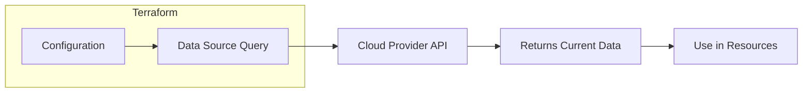

# How to Use Data Sources in Terraform

Author: [nawazdhandala](https://www.github.com/nawazdhandala)

Tags: Terraform, Infrastructure as Code, Data Sources, DevOps, Cloud

Description: Learn how to use Terraform data sources to query and reference existing infrastructure, fetch external data, and build dynamic configurations without hardcoding values.

---

Data sources in Terraform let you fetch information from your cloud provider or external systems without managing those resources. Think of them as read-only queries that pull in existing infrastructure details, making your configurations more dynamic and less brittle.

## Why Data Sources Matter

Hardcoding values like AMI IDs, subnet IDs, or security group names creates maintenance nightmares. When infrastructure changes, you have to hunt through code updating references. Data sources solve this by querying the actual state of your infrastructure at plan and apply time.



## Basic Data Source Syntax

Every data source follows the same pattern. You declare it with the `data` block, give it a local name, and specify filter criteria.

```hcl
# Basic data source structure
data "aws_ami" "ubuntu" {
  most_recent = true

  filter {
    name   = "name"
    values = ["ubuntu/images/hvm-ssd/ubuntu-jammy-22.04-amd64-server-*"]
  }

  filter {
    name   = "virtualization-type"
    values = ["hvm"]
  }

  owners = ["099720109477"]  # Canonical's AWS account ID
}

# Use the data source in a resource
resource "aws_instance" "web" {
  ami           = data.aws_ami.ubuntu.id
  instance_type = "t3.micro"

  tags = {
    Name = "web-server"
  }
}
```

The `data.aws_ami.ubuntu.id` reference pulls the latest Ubuntu AMI ID automatically. No more manually looking up AMI IDs when deploying to new regions.

## Common AWS Data Sources

### Fetching VPC Information

```hcl
# Get the default VPC
data "aws_vpc" "default" {
  default = true
}

# Get a VPC by tag
data "aws_vpc" "production" {
  filter {
    name   = "tag:Environment"
    values = ["production"]
  }
}

# Get all subnets in a VPC
data "aws_subnets" "private" {
  filter {
    name   = "vpc-id"
    values = [data.aws_vpc.production.id]
  }

  filter {
    name   = "tag:Tier"
    values = ["private"]
  }
}

# Use subnets in an Auto Scaling Group
resource "aws_autoscaling_group" "web" {
  vpc_zone_identifier = data.aws_subnets.private.ids
  min_size            = 2
  max_size            = 10

  launch_template {
    id      = aws_launch_template.web.id
    version = "$Latest"
  }
}
```

### Looking Up Security Groups

```hcl
# Find security group by name
data "aws_security_group" "web" {
  name = "web-servers"
}

# Find security group by tags
data "aws_security_groups" "database" {
  filter {
    name   = "group-name"
    values = ["*database*"]
  }

  filter {
    name   = "vpc-id"
    values = [data.aws_vpc.production.id]
  }
}

# Reference in a new resource
resource "aws_instance" "api" {
  ami                    = data.aws_ami.ubuntu.id
  instance_type          = "t3.small"
  vpc_security_group_ids = [data.aws_security_group.web.id]
}
```

### Fetching IAM Information

```hcl
# Get current AWS account ID and region
data "aws_caller_identity" "current" {}

data "aws_region" "current" {}

# Use in IAM policy
data "aws_iam_policy_document" "s3_access" {
  statement {
    actions = [
      "s3:GetObject",
      "s3:PutObject"
    ]

    resources = [
      "arn:aws:s3:::my-bucket-${data.aws_caller_identity.current.account_id}/*"
    ]
  }
}

# Get existing IAM role
data "aws_iam_role" "lambda_execution" {
  name = "lambda-execution-role"
}

resource "aws_lambda_function" "processor" {
  function_name = "data-processor"
  role          = data.aws_iam_role.lambda_execution.arn
  handler       = "index.handler"
  runtime       = "nodejs18.x"
  filename      = "function.zip"
}
```

## Data Sources for Other Providers

### Azure Data Sources

```hcl
# Get Azure subscription info
data "azurerm_subscription" "current" {}

# Find existing resource group
data "azurerm_resource_group" "existing" {
  name = "production-rg"
}

# Get virtual network
data "azurerm_virtual_network" "main" {
  name                = "production-vnet"
  resource_group_name = data.azurerm_resource_group.existing.name
}

# Get subnet within the vnet
data "azurerm_subnet" "backend" {
  name                 = "backend-subnet"
  virtual_network_name = data.azurerm_virtual_network.main.name
  resource_group_name  = data.azurerm_resource_group.existing.name
}

# Use in a VM
resource "azurerm_linux_virtual_machine" "api" {
  name                = "api-server"
  resource_group_name = data.azurerm_resource_group.existing.name
  location            = data.azurerm_resource_group.existing.location
  size                = "Standard_B2s"

  network_interface_ids = [azurerm_network_interface.api.id]

  admin_username = "adminuser"

  admin_ssh_key {
    username   = "adminuser"
    public_key = file("~/.ssh/id_rsa.pub")
  }

  os_disk {
    caching              = "ReadWrite"
    storage_account_type = "Standard_LRS"
  }

  source_image_reference {
    publisher = "Canonical"
    offer     = "0001-com-ubuntu-server-jammy"
    sku       = "22_04-lts"
    version   = "latest"
  }
}
```

### Google Cloud Data Sources

```hcl
# Get project info
data "google_project" "current" {}

# Find compute image
data "google_compute_image" "debian" {
  family  = "debian-11"
  project = "debian-cloud"
}

# Get existing network
data "google_compute_network" "main" {
  name = "production-network"
}

# Get subnetwork
data "google_compute_subnetwork" "private" {
  name   = "private-subnet"
  region = "us-central1"
}

# Create instance using data sources
resource "google_compute_instance" "web" {
  name         = "web-server"
  machine_type = "e2-medium"
  zone         = "us-central1-a"

  boot_disk {
    initialize_params {
      image = data.google_compute_image.debian.self_link
    }
  }

  network_interface {
    network    = data.google_compute_network.main.id
    subnetwork = data.google_compute_subnetwork.private.id
  }
}
```

## External Data Sources

Terraform can also fetch data from external programs or HTTP endpoints.

### HTTP Data Source

```hcl
# Fetch data from an API
data "http" "ip_ranges" {
  url = "https://ip-ranges.amazonaws.com/ip-ranges.json"

  request_headers = {
    Accept = "application/json"
  }
}

# Parse and use the response
locals {
  aws_ip_ranges = jsondecode(data.http.ip_ranges.response_body)
  cloudfront_ips = [
    for prefix in local.aws_ip_ranges.prefixes :
    prefix.ip_prefix
    if prefix.service == "CLOUDFRONT"
  ]
}
```

### External Program Data Source

```hcl
# Run a script and use its output
data "external" "git_info" {
  program = ["bash", "-c", "echo '{\"commit\": \"'$(git rev-parse HEAD)'\", \"branch\": \"'$(git branch --show-current)'\"}'"]
}

resource "aws_instance" "web" {
  ami           = data.aws_ami.ubuntu.id
  instance_type = "t3.micro"

  tags = {
    Name       = "web-server"
    GitCommit  = data.external.git_info.result.commit
    GitBranch  = data.external.git_info.result.branch
  }
}
```

## Data Source Dependencies

Data sources can depend on other data sources or resources. Terraform handles the ordering automatically.

```hcl
# First, get the VPC
data "aws_vpc" "main" {
  filter {
    name   = "tag:Name"
    values = ["production"]
  }
}

# Then, get subnets within that VPC
data "aws_subnets" "application" {
  filter {
    name   = "vpc-id"
    values = [data.aws_vpc.main.id]  # Depends on the VPC data source
  }

  filter {
    name   = "tag:Tier"
    values = ["application"]
  }
}

# Get details for each subnet
data "aws_subnet" "application" {
  for_each = toset(data.aws_subnets.application.ids)
  id       = each.value
}

# Output CIDR blocks
output "subnet_cidrs" {
  value = [for s in data.aws_subnet.application : s.cidr_block]
}
```

## Error Handling

Data sources fail if they cannot find the requested resource. Handle this with lifecycle conditions or by checking if optional resources exist.

```hcl
# Check if a resource exists before using it
data "aws_secretsmanager_secret" "api_key" {
  name = "production/api-key"
}

# Use try() for optional values
locals {
  api_key_arn = try(data.aws_secretsmanager_secret.api_key.arn, null)
}
```

## Best Practices

1. **Use data sources instead of hardcoding IDs** - This makes your code portable across environments and regions.

2. **Filter narrowly** - Multiple filters reduce the chance of matching the wrong resource.

3. **Pin AMIs for production** - While `most_recent = true` is convenient for development, production should use specific AMI IDs for reproducibility.

4. **Cache expensive lookups** - Some data sources query slow APIs. Store results in locals if referenced multiple times.

5. **Document expected resources** - Add comments explaining what infrastructure must exist before running Terraform.

```hcl
# This data source expects a VPC with tag Environment=production
# to exist before running terraform apply
data "aws_vpc" "production" {
  filter {
    name   = "tag:Environment"
    values = ["production"]
  }
}
```

---

Data sources bridge the gap between manually created infrastructure and Terraform-managed resources. They make your configurations adaptive to the current state of your environment rather than dependent on static values that inevitably become stale.
