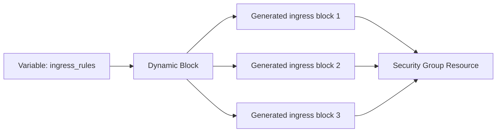

# How to Use Dynamic Blocks in Terraform

Author: [nawazdhandala](https://www.github.com/nawazdhandala)

Tags: Terraform, Infrastructure as Code, Dynamic Blocks, DevOps, Automation

Description: Learn how to use Terraform dynamic blocks to generate repeating nested configurations from variables and data structures, reducing code duplication and enabling flexible infrastructure definitions.

---

Dynamic blocks in Terraform let you generate repeated nested blocks within a resource from a collection. Instead of copying the same configuration block multiple times, you define it once and iterate over your data. This keeps configurations DRY and makes them adaptable to varying inputs.

## The Problem Dynamic Blocks Solve

Consider a security group with multiple ingress rules. Without dynamic blocks, you write each rule separately.

```hcl
# Without dynamic blocks - repetitive and hard to maintain
resource "aws_security_group" "web" {
  name = "web-servers"

  ingress {
    from_port   = 80
    to_port     = 80
    protocol    = "tcp"
    cidr_blocks = ["0.0.0.0/0"]
  }

  ingress {
    from_port   = 443
    to_port     = 443
    protocol    = "tcp"
    cidr_blocks = ["0.0.0.0/0"]
  }

  ingress {
    from_port   = 22
    to_port     = 22
    protocol    = "tcp"
    cidr_blocks = ["10.0.0.0/8"]
  }

  # More rules...
}
```

With dynamic blocks, you define the rules as data and generate the blocks.

## Dynamic Block Syntax

```hcl
dynamic "block_name" {
  for_each = collection

  content {
    # Use block_name.value to access current item
    # Use block_name.key for the index or map key
  }
}
```

## Basic Example: Security Group Rules

```hcl
variable "ingress_rules" {
  description = "List of ingress rules"
  type = list(object({
    port        = number
    protocol    = string
    cidr_blocks = list(string)
    description = string
  }))
  default = [
    {
      port        = 80
      protocol    = "tcp"
      cidr_blocks = ["0.0.0.0/0"]
      description = "HTTP"
    },
    {
      port        = 443
      protocol    = "tcp"
      cidr_blocks = ["0.0.0.0/0"]
      description = "HTTPS"
    },
    {
      port        = 22
      protocol    = "tcp"
      cidr_blocks = ["10.0.0.0/8"]
      description = "SSH from internal"
    }
  ]
}

resource "aws_security_group" "web" {
  name        = "web-servers"
  description = "Security group for web servers"
  vpc_id      = aws_vpc.main.id

  dynamic "ingress" {
    for_each = var.ingress_rules

    content {
      from_port   = ingress.value.port
      to_port     = ingress.value.port
      protocol    = ingress.value.protocol
      cidr_blocks = ingress.value.cidr_blocks
      description = ingress.value.description
    }
  }

  egress {
    from_port   = 0
    to_port     = 0
    protocol    = "-1"
    cidr_blocks = ["0.0.0.0/0"]
  }
}
```



## Using Maps with Dynamic Blocks

Maps work well when each item has a unique identifier.

```hcl
variable "environments" {
  type = map(object({
    instance_type = string
    min_size      = number
    max_size      = number
    subnet_ids    = list(string)
  }))
  default = {
    production = {
      instance_type = "t3.large"
      min_size      = 3
      max_size      = 10
      subnet_ids    = ["subnet-1", "subnet-2"]
    }
    staging = {
      instance_type = "t3.medium"
      min_size      = 1
      max_size      = 3
      subnet_ids    = ["subnet-3"]
    }
  }
}

# AWS Auto Scaling with dynamic tags
resource "aws_autoscaling_group" "app" {
  for_each = var.environments

  name             = "${each.key}-asg"
  min_size         = each.value.min_size
  max_size         = each.value.max_size
  desired_capacity = each.value.min_size

  vpc_zone_identifier = each.value.subnet_ids

  launch_template {
    id      = aws_launch_template.app[each.key].id
    version = "$Latest"
  }

  dynamic "tag" {
    for_each = {
      Name        = "${each.key}-instance"
      Environment = each.key
      ManagedBy   = "terraform"
    }

    content {
      key                 = tag.key
      value               = tag.value
      propagate_at_launch = true
    }
  }
}
```

## Nested Dynamic Blocks

Dynamic blocks can be nested for complex structures.

```hcl
variable "load_balancer_config" {
  type = object({
    listeners = list(object({
      port     = number
      protocol = string
      actions = list(object({
        type             = string
        target_group_key = string
      }))
    }))
  })
  default = {
    listeners = [
      {
        port     = 80
        protocol = "HTTP"
        actions = [
          {
            type             = "forward"
            target_group_key = "web"
          }
        ]
      },
      {
        port     = 443
        protocol = "HTTPS"
        actions = [
          {
            type             = "forward"
            target_group_key = "web"
          }
        ]
      }
    ]
  }
}

resource "aws_lb_listener" "main" {
  for_each = { for l in var.load_balancer_config.listeners : l.port => l }

  load_balancer_arn = aws_lb.main.arn
  port              = each.value.port
  protocol          = each.value.protocol

  dynamic "default_action" {
    for_each = each.value.actions

    content {
      type             = default_action.value.type
      target_group_arn = aws_lb_target_group.main[default_action.value.target_group_key].arn
    }
  }
}
```

## Conditional Dynamic Blocks

Combine dynamic blocks with conditionals to optionally include configurations.

```hcl
variable "enable_encryption" {
  type    = bool
  default = true
}

variable "encryption_settings" {
  type = object({
    kms_key_id = string
    algorithm  = string
  })
  default = {
    kms_key_id = ""
    algorithm  = "aws:kms"
  }
}

resource "aws_s3_bucket_server_side_encryption_configuration" "main" {
  bucket = aws_s3_bucket.main.id

  # Only include encryption rule if enabled
  dynamic "rule" {
    for_each = var.enable_encryption ? [1] : []

    content {
      apply_server_side_encryption_by_default {
        sse_algorithm     = var.encryption_settings.algorithm
        kms_master_key_id = var.encryption_settings.kms_key_id != "" ? var.encryption_settings.kms_key_id : null
      }
    }
  }
}
```

## Dynamic Blocks in Modules

Modules can expose dynamic block configuration through variables.

```hcl
# modules/vpc/variables.tf
variable "subnets" {
  description = "Subnet configurations"
  type = list(object({
    name              = string
    cidr_block        = string
    availability_zone = string
    public            = bool
  }))
}

# modules/vpc/main.tf
resource "aws_subnet" "main" {
  for_each = { for s in var.subnets : s.name => s }

  vpc_id                  = aws_vpc.main.id
  cidr_block              = each.value.cidr_block
  availability_zone       = each.value.availability_zone
  map_public_ip_on_launch = each.value.public

  tags = {
    Name   = each.value.name
    Public = each.value.public
  }
}

# Root module usage
module "vpc" {
  source = "./modules/vpc"

  subnets = [
    {
      name              = "public-1"
      cidr_block        = "10.0.1.0/24"
      availability_zone = "us-east-1a"
      public            = true
    },
    {
      name              = "public-2"
      cidr_block        = "10.0.2.0/24"
      availability_zone = "us-east-1b"
      public            = true
    },
    {
      name              = "private-1"
      cidr_block        = "10.0.10.0/24"
      availability_zone = "us-east-1a"
      public            = false
    }
  ]
}
```

## IAM Policy Documents with Dynamic Blocks

```hcl
variable "s3_bucket_permissions" {
  type = map(object({
    bucket_name = string
    actions     = list(string)
  }))
  default = {
    read_data = {
      bucket_name = "data-bucket"
      actions     = ["s3:GetObject", "s3:ListBucket"]
    }
    write_logs = {
      bucket_name = "logs-bucket"
      actions     = ["s3:PutObject"]
    }
  }
}

data "aws_iam_policy_document" "s3_access" {
  dynamic "statement" {
    for_each = var.s3_bucket_permissions

    content {
      sid    = statement.key
      effect = "Allow"

      actions = statement.value.actions

      resources = [
        "arn:aws:s3:::${statement.value.bucket_name}",
        "arn:aws:s3:::${statement.value.bucket_name}/*"
      ]
    }
  }
}

resource "aws_iam_policy" "s3_access" {
  name   = "s3-access-policy"
  policy = data.aws_iam_policy_document.s3_access.json
}
```

## GCP Firewall Rules with Dynamic Blocks

```hcl
variable "firewall_rules" {
  type = map(object({
    direction = string
    priority  = number
    ranges    = list(string)
    allow = list(object({
      protocol = string
      ports    = list(string)
    }))
    target_tags = list(string)
  }))
  default = {
    allow-http = {
      direction   = "INGRESS"
      priority    = 1000
      ranges      = ["0.0.0.0/0"]
      allow = [
        {
          protocol = "tcp"
          ports    = ["80", "443"]
        }
      ]
      target_tags = ["web-server"]
    }
    allow-ssh = {
      direction   = "INGRESS"
      priority    = 1001
      ranges      = ["10.0.0.0/8"]
      allow = [
        {
          protocol = "tcp"
          ports    = ["22"]
        }
      ]
      target_tags = ["allow-ssh"]
    }
  }
}

resource "google_compute_firewall" "rules" {
  for_each = var.firewall_rules

  name      = each.key
  network   = google_compute_network.main.id
  direction = each.value.direction
  priority  = each.value.priority

  source_ranges = each.value.direction == "INGRESS" ? each.value.ranges : null
  target_tags   = each.value.target_tags

  dynamic "allow" {
    for_each = each.value.allow

    content {
      protocol = allow.value.protocol
      ports    = allow.value.ports
    }
  }
}
```

## Custom Iterator Names

Use the `iterator` argument for clearer code when nesting.

```hcl
variable "services" {
  type = list(object({
    name  = string
    ports = list(number)
  }))
  default = [
    { name = "web", ports = [80, 443] },
    { name = "api", ports = [8080] }
  ]
}

resource "aws_security_group" "services" {
  name   = "services-sg"
  vpc_id = aws_vpc.main.id

  dynamic "ingress" {
    for_each = var.services
    iterator = service  # Custom name instead of "ingress"

    content {
      description = "Allow traffic to ${service.value.name}"
      from_port   = service.value.ports[0]
      to_port     = service.value.ports[length(service.value.ports) - 1]
      protocol    = "tcp"
      cidr_blocks = ["0.0.0.0/0"]
    }
  }
}
```

## Best Practices

1. **Keep it readable** - If a dynamic block becomes too complex, consider using locals to transform data first.

2. **Use meaningful iterator names** - The default iterator name is the block name, but custom names improve clarity.

3. **Validate input types** - Define explicit types for variables used in dynamic blocks to catch errors early.

4. **Document the expected structure** - Complex nested objects benefit from examples in variable descriptions.

5. **Test with minimal data first** - Start with one or two items in your collection before scaling up.

```hcl
# Example: Transform data in locals before using in dynamic block
locals {
  normalized_rules = [
    for rule in var.raw_rules : {
      port        = rule.port
      protocol    = lower(rule.protocol)
      cidr_blocks = rule.sources
      description = coalesce(rule.description, "Rule for port ${rule.port}")
    }
  ]
}

resource "aws_security_group" "main" {
  name = "example"

  dynamic "ingress" {
    for_each = local.normalized_rules
    content {
      from_port   = ingress.value.port
      to_port     = ingress.value.port
      protocol    = ingress.value.protocol
      cidr_blocks = ingress.value.cidr_blocks
      description = ingress.value.description
    }
  }
}
```

---

Dynamic blocks eliminate repetition and make configurations data-driven. They shine when you have variable numbers of similar configurations, like firewall rules, tags, or environment-specific settings. Start simple, validate your data structures, and add complexity as needed.
