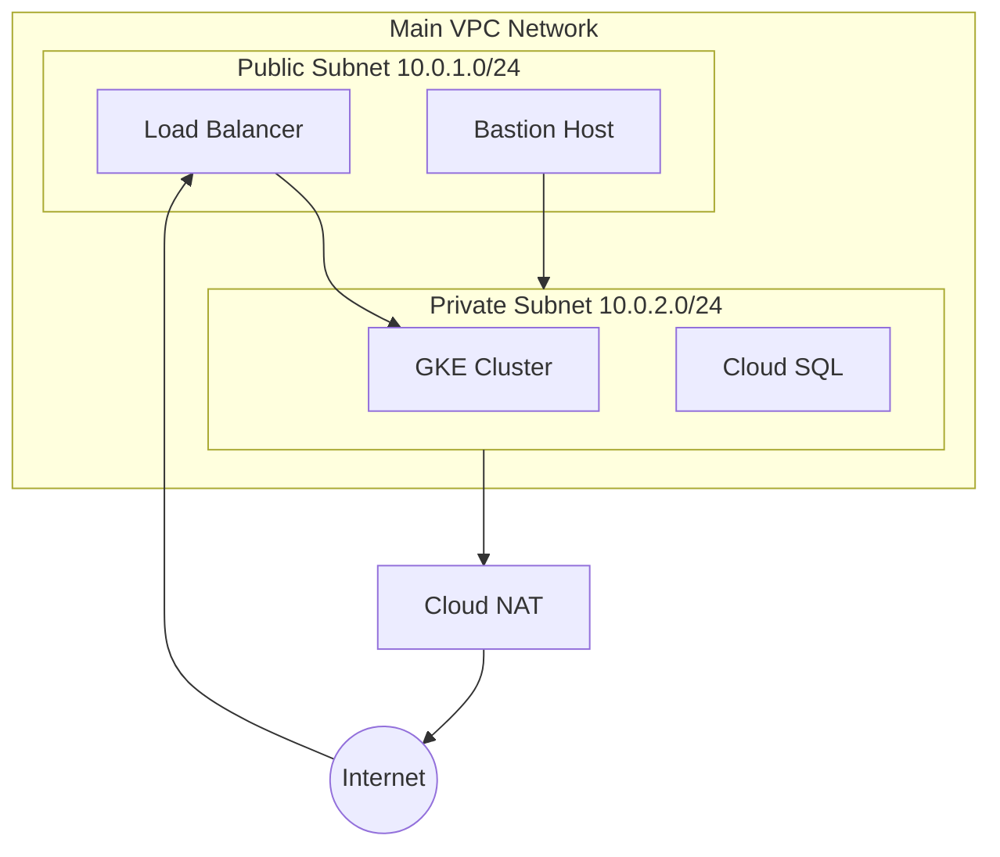

# How to Deploy GCP Infrastructure with Terraform

Author: [nawazdhandala](https://www.github.com/nawazdhandala)

Tags: Terraform, Google Cloud Platform, GCP, Infrastructure as Code, DevOps, Cloud

Description: A practical guide to deploying Google Cloud Platform infrastructure with Terraform, covering VPC networks, compute instances, GKE clusters, Cloud SQL, and Cloud Storage with working examples.

---

Google Cloud Platform offers a rich set of services that Terraform can provision and manage. This guide walks through deploying common GCP resources, from basic VPC networks to production-ready GKE clusters and managed databases.

## Provider Configuration

Start by configuring the Google provider with your project and region.

```hcl
terraform {
  required_version = ">= 1.0"

  required_providers {
    google = {
      source  = "hashicorp/google"
      version = "~> 5.0"
    }
  }
}

provider "google" {
  project = var.project_id
  region  = var.region
}

# Beta provider for preview features
provider "google-beta" {
  project = var.project_id
  region  = var.region
}

variable "project_id" {
  description = "GCP project ID"
  type        = string
}

variable "region" {
  description = "GCP region"
  type        = string
  default     = "us-central1"
}
```

## VPC Network Setup

GCP networking uses VPC networks with subnets. Unlike AWS, subnets in GCP are regional, not zonal.

```hcl
# Create a custom VPC network
resource "google_compute_network" "main" {
  name                    = "main-network"
  auto_create_subnetworks = false  # We'll create our own subnets
  routing_mode            = "REGIONAL"
}

# Public subnet for load balancers and bastion hosts
resource "google_compute_subnetwork" "public" {
  name          = "public-subnet"
  ip_cidr_range = "10.0.1.0/24"
  region        = var.region
  network       = google_compute_network.main.id

  # Enable private Google access for VMs without external IPs
  private_ip_google_access = true
}

# Private subnet for application workloads
resource "google_compute_subnetwork" "private" {
  name          = "private-subnet"
  ip_cidr_range = "10.0.2.0/24"
  region        = var.region
  network       = google_compute_network.main.id

  private_ip_google_access = true

  # Secondary ranges for GKE pods and services
  secondary_ip_range {
    range_name    = "gke-pods"
    ip_cidr_range = "10.1.0.0/16"
  }

  secondary_ip_range {
    range_name    = "gke-services"
    ip_cidr_range = "10.2.0.0/20"
  }
}

# Cloud NAT for private instances to reach the internet
resource "google_compute_router" "main" {
  name    = "main-router"
  region  = var.region
  network = google_compute_network.main.id
}

resource "google_compute_router_nat" "main" {
  name                               = "main-nat"
  router                             = google_compute_router.main.name
  region                             = var.region
  nat_ip_allocate_option             = "AUTO_ONLY"
  source_subnetwork_ip_ranges_to_nat = "ALL_SUBNETWORKS_ALL_IP_RANGES"

  log_config {
    enable = true
    filter = "ERRORS_ONLY"
  }
}
```



## Firewall Rules

GCP uses firewall rules attached to VPC networks. They can target instances by network tags.

```hcl
# Allow internal communication within the VPC
resource "google_compute_firewall" "internal" {
  name    = "allow-internal"
  network = google_compute_network.main.id

  allow {
    protocol = "icmp"
  }

  allow {
    protocol = "tcp"
    ports    = ["0-65535"]
  }

  allow {
    protocol = "udp"
    ports    = ["0-65535"]
  }

  source_ranges = ["10.0.0.0/8"]
}

# Allow SSH from specific IPs
resource "google_compute_firewall" "ssh" {
  name    = "allow-ssh"
  network = google_compute_network.main.id

  allow {
    protocol = "tcp"
    ports    = ["22"]
  }

  source_ranges = var.ssh_source_ranges
  target_tags   = ["allow-ssh"]
}

# Allow HTTP/HTTPS to web servers
resource "google_compute_firewall" "web" {
  name    = "allow-web"
  network = google_compute_network.main.id

  allow {
    protocol = "tcp"
    ports    = ["80", "443"]
  }

  source_ranges = ["0.0.0.0/0"]
  target_tags   = ["web-server"]
}

# Allow health checks from Google's health check ranges
resource "google_compute_firewall" "health_check" {
  name    = "allow-health-check"
  network = google_compute_network.main.id

  allow {
    protocol = "tcp"
  }

  source_ranges = [
    "130.211.0.0/22",   # Google health check IPs
    "35.191.0.0/16"
  ]
  target_tags = ["allow-health-check"]
}

variable "ssh_source_ranges" {
  description = "CIDR ranges allowed to SSH"
  type        = list(string)
  default     = ["0.0.0.0/0"]  # Restrict this in production
}
```

## Compute Engine Instances

Deploy virtual machines with Compute Engine.

```hcl
# Get the latest Ubuntu image
data "google_compute_image" "ubuntu" {
  family  = "ubuntu-2204-lts"
  project = "ubuntu-os-cloud"
}

# Service account for the VM
resource "google_service_account" "vm" {
  account_id   = "vm-service-account"
  display_name = "VM Service Account"
}

# Grant minimal permissions
resource "google_project_iam_member" "vm_log_writer" {
  project = var.project_id
  role    = "roles/logging.logWriter"
  member  = "serviceAccount:${google_service_account.vm.email}"
}

# Create a compute instance
resource "google_compute_instance" "web" {
  name         = "web-server"
  machine_type = "e2-medium"
  zone         = "${var.region}-a"

  tags = ["web-server", "allow-health-check"]

  boot_disk {
    initialize_params {
      image = data.google_compute_image.ubuntu.self_link
      size  = 20
      type  = "pd-ssd"
    }
  }

  network_interface {
    network    = google_compute_network.main.id
    subnetwork = google_compute_subnetwork.private.id

    # Uncomment for external IP
    # access_config {}
  }

  service_account {
    email  = google_service_account.vm.email
    scopes = ["cloud-platform"]
  }

  metadata_startup_script = <<-EOF
    #!/bin/bash
    apt-get update
    apt-get install -y nginx
    systemctl start nginx
  EOF

  labels = {
    environment = "production"
    app         = "web"
  }
}
```

## GKE Kubernetes Cluster

Deploy a production-ready GKE cluster with private nodes.

```hcl
# Service account for GKE nodes
resource "google_service_account" "gke_nodes" {
  account_id   = "gke-node-sa"
  display_name = "GKE Node Service Account"
}

# Minimal permissions for nodes
resource "google_project_iam_member" "gke_nodes" {
  for_each = toset([
    "roles/logging.logWriter",
    "roles/monitoring.metricWriter",
    "roles/monitoring.viewer",
    "roles/stackdriver.resourceMetadata.writer",
    "roles/artifactregistry.reader"
  ])

  project = var.project_id
  role    = each.value
  member  = "serviceAccount:${google_service_account.gke_nodes.email}"
}

# GKE cluster
resource "google_container_cluster" "main" {
  name     = "main-cluster"
  location = var.region

  # Use regional cluster for high availability
  # Or use zone for a zonal cluster: location = "${var.region}-a"

  network    = google_compute_network.main.id
  subnetwork = google_compute_subnetwork.private.id

  # Enable Autopilot for fully managed nodes
  # enable_autopilot = true

  # Or use standard mode with node pools
  remove_default_node_pool = true
  initial_node_count       = 1

  # Private cluster configuration
  private_cluster_config {
    enable_private_nodes    = true
    enable_private_endpoint = false  # Allow public access to control plane
    master_ipv4_cidr_block  = "172.16.0.0/28"
  }

  # IP allocation for pods and services
  ip_allocation_policy {
    cluster_secondary_range_name  = "gke-pods"
    services_secondary_range_name = "gke-services"
  }

  # Master authorized networks
  master_authorized_networks_config {
    cidr_blocks {
      cidr_block   = "0.0.0.0/0"  # Restrict in production
      display_name = "All"
    }
  }

  # Workload Identity for secure pod authentication
  workload_identity_config {
    workload_pool = "${var.project_id}.svc.id.goog"
  }

  # Enable Dataplane V2 (Cilium-based networking)
  datapath_provider = "ADVANCED_DATAPATH"

  # Release channel for automatic upgrades
  release_channel {
    channel = "REGULAR"
  }
}

# Node pool
resource "google_container_node_pool" "main" {
  name       = "main-pool"
  location   = var.region
  cluster    = google_container_cluster.main.name
  node_count = 1  # Per zone

  autoscaling {
    min_node_count = 1
    max_node_count = 5
  }

  management {
    auto_repair  = true
    auto_upgrade = true
  }

  node_config {
    machine_type = "e2-medium"
    disk_size_gb = 50
    disk_type    = "pd-ssd"

    service_account = google_service_account.gke_nodes.email
    oauth_scopes    = ["https://www.googleapis.com/auth/cloud-platform"]

    # Workload Identity
    workload_metadata_config {
      mode = "GKE_METADATA"
    }

    labels = {
      environment = "production"
    }

    tags = ["gke-node"]
  }
}
```

## Cloud SQL Database

Deploy a managed PostgreSQL instance.

```hcl
# Private IP for Cloud SQL
resource "google_compute_global_address" "sql_private_ip" {
  name          = "sql-private-ip"
  purpose       = "VPC_PEERING"
  address_type  = "INTERNAL"
  prefix_length = 16
  network       = google_compute_network.main.id
}

# Private services connection
resource "google_service_networking_connection" "private_vpc_connection" {
  network                 = google_compute_network.main.id
  service                 = "servicenetworking.googleapis.com"
  reserved_peering_ranges = [google_compute_global_address.sql_private_ip.name]
}

# Cloud SQL instance
resource "google_sql_database_instance" "main" {
  name             = "main-db-instance"
  database_version = "POSTGRES_15"
  region           = var.region

  depends_on = [google_service_networking_connection.private_vpc_connection]

  settings {
    tier              = "db-custom-2-4096"  # 2 vCPUs, 4GB RAM
    availability_type = "REGIONAL"          # High availability
    disk_size         = 20
    disk_type         = "PD_SSD"

    ip_configuration {
      ipv4_enabled    = false
      private_network = google_compute_network.main.id
    }

    backup_configuration {
      enabled                        = true
      point_in_time_recovery_enabled = true
      start_time                     = "03:00"
      location                       = var.region

      backup_retention_settings {
        retained_backups = 7
      }
    }

    maintenance_window {
      day          = 7  # Sunday
      hour         = 3  # 3 AM
      update_track = "stable"
    }

    database_flags {
      name  = "log_connections"
      value = "on"
    }
  }

  deletion_protection = true
}

# Database
resource "google_sql_database" "app" {
  name     = "application"
  instance = google_sql_database_instance.main.name
}

# Database user
resource "google_sql_user" "app" {
  name     = "app_user"
  instance = google_sql_database_instance.main.name
  password = var.db_password
}

variable "db_password" {
  description = "Database password"
  type        = string
  sensitive   = true
}
```

## Cloud Storage Buckets

```hcl
# Application data bucket
resource "google_storage_bucket" "data" {
  name          = "${var.project_id}-app-data"
  location      = var.region
  storage_class = "STANDARD"

  uniform_bucket_level_access = true

  versioning {
    enabled = true
  }

  lifecycle_rule {
    condition {
      age = 90
    }
    action {
      type          = "SetStorageClass"
      storage_class = "NEARLINE"
    }
  }

  lifecycle_rule {
    condition {
      age = 365
    }
    action {
      type          = "SetStorageClass"
      storage_class = "COLDLINE"
    }
  }
}

# Grant access to service account
resource "google_storage_bucket_iam_member" "data_access" {
  bucket = google_storage_bucket.data.name
  role   = "roles/storage.objectAdmin"
  member = "serviceAccount:${google_service_account.vm.email}"
}
```

## Outputs

```hcl
output "gke_cluster_name" {
  value       = google_container_cluster.main.name
  description = "GKE cluster name"
}

output "gke_cluster_endpoint" {
  value       = google_container_cluster.main.endpoint
  description = "GKE cluster endpoint"
  sensitive   = true
}

output "database_connection_name" {
  value       = google_sql_database_instance.main.connection_name
  description = "Cloud SQL connection name for Cloud SQL Proxy"
}

output "storage_bucket_url" {
  value       = google_storage_bucket.data.url
  description = "Storage bucket URL"
}
```

---

GCP infrastructure with Terraform follows patterns similar to other clouds but with GCP-specific resources and naming. The key differences are regional subnets, network tags for firewall targeting, and tight IAM integration. Start with a VPC, add networking components, then layer on compute and managed services.
