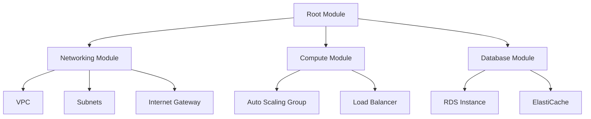

# How to Organize Terraform Projects with Modules

Author: [nawazdhandala](https://www.github.com/nawazdhandala)

Tags: Terraform, Infrastructure as Code, DevOps, Modules, Best Practices

Description: Learn how to structure Terraform projects using modules for reusability, maintainability, and team collaboration. This guide covers module design patterns, file organization, and practical examples.

---

As Terraform projects grow, a single directory with all resources becomes unmanageable. Modules solve this by breaking infrastructure into reusable, testable components. Think of modules like functions in programming: they encapsulate logic, accept inputs, and return outputs.

## Why Use Modules?

Without modules, you end up with:
- Hundreds of resources in one directory
- Copy-pasted code across environments
- No separation of concerns
- Difficult collaboration

Modules provide:
- **Reusability**: Write once, deploy many times
- **Encapsulation**: Hide complexity behind clean interfaces
- **Testing**: Test infrastructure components in isolation
- **Versioning**: Pin module versions for stability

## Project Structure

Here is a battle-tested structure for medium to large Terraform projects:

```
terraform/
├── modules/                    # Reusable modules
│   ├── networking/
│   │   ├── main.tf
│   │   ├── variables.tf
│   │   ├── outputs.tf
│   │   └── README.md
│   ├── compute/
│   │   ├── main.tf
│   │   ├── variables.tf
│   │   └── outputs.tf
│   └── database/
│       ├── main.tf
│       ├── variables.tf
│       └── outputs.tf
├── environments/               # Environment-specific configs
│   ├── dev/
│   │   ├── main.tf
│   │   ├── variables.tf
│   │   ├── terraform.tfvars
│   │   └── backend.tf
│   ├── staging/
│   │   └── ...
│   └── prod/
│       └── ...
└── global/                     # Shared resources (IAM, DNS)
    ├── iam/
    └── dns/
```

## Creating Your First Module

Let's build a networking module that creates a VPC with subnets:

```hcl
# modules/networking/variables.tf
# Define all inputs the module needs

variable "vpc_cidr" {
  description = "CIDR block for the VPC"
  type        = string
  default     = "10.0.0.0/16"
}

variable "environment" {
  description = "Environment name (dev, staging, prod)"
  type        = string
}

variable "availability_zones" {
  description = "List of AZs to use for subnets"
  type        = list(string)
}

variable "private_subnet_cidrs" {
  description = "CIDR blocks for private subnets"
  type        = list(string)
}

variable "public_subnet_cidrs" {
  description = "CIDR blocks for public subnets"
  type        = list(string)
}
```

```hcl
# modules/networking/main.tf
# Core networking resources

resource "aws_vpc" "main" {
  cidr_block           = var.vpc_cidr
  enable_dns_hostnames = true
  enable_dns_support   = true

  tags = {
    Name        = "${var.environment}-vpc"
    Environment = var.environment
    ManagedBy   = "terraform"
  }
}

# Create public subnets across availability zones
resource "aws_subnet" "public" {
  count                   = length(var.public_subnet_cidrs)
  vpc_id                  = aws_vpc.main.id
  cidr_block              = var.public_subnet_cidrs[count.index]
  availability_zone       = var.availability_zones[count.index]
  map_public_ip_on_launch = true

  tags = {
    Name        = "${var.environment}-public-${count.index + 1}"
    Environment = var.environment
    Type        = "public"
  }
}

# Create private subnets for application workloads
resource "aws_subnet" "private" {
  count             = length(var.private_subnet_cidrs)
  vpc_id            = aws_vpc.main.id
  cidr_block        = var.private_subnet_cidrs[count.index]
  availability_zone = var.availability_zones[count.index]

  tags = {
    Name        = "${var.environment}-private-${count.index + 1}"
    Environment = var.environment
    Type        = "private"
  }
}

# Internet gateway for public subnet access
resource "aws_internet_gateway" "main" {
  vpc_id = aws_vpc.main.id

  tags = {
    Name        = "${var.environment}-igw"
    Environment = var.environment
  }
}

# Route table for public subnets
resource "aws_route_table" "public" {
  vpc_id = aws_vpc.main.id

  route {
    cidr_block = "0.0.0.0/0"
    gateway_id = aws_internet_gateway.main.id
  }

  tags = {
    Name = "${var.environment}-public-rt"
  }
}

# Associate public subnets with the route table
resource "aws_route_table_association" "public" {
  count          = length(aws_subnet.public)
  subnet_id      = aws_subnet.public[count.index].id
  route_table_id = aws_route_table.public.id
}
```

```hcl
# modules/networking/outputs.tf
# Expose values other modules need

output "vpc_id" {
  description = "ID of the created VPC"
  value       = aws_vpc.main.id
}

output "vpc_cidr" {
  description = "CIDR block of the VPC"
  value       = aws_vpc.main.cidr_block
}

output "public_subnet_ids" {
  description = "IDs of public subnets"
  value       = aws_subnet.public[*].id
}

output "private_subnet_ids" {
  description = "IDs of private subnets"
  value       = aws_subnet.private[*].id
}
```

## Using Modules in Environments

Now use this module in your dev environment:

```hcl
# environments/dev/main.tf

terraform {
  required_version = ">= 1.0.0"
  required_providers {
    aws = {
      source  = "hashicorp/aws"
      version = "~> 5.0"
    }
  }
}

provider "aws" {
  region = var.aws_region
}

# Call the networking module with dev-specific values
module "networking" {
  source = "../../modules/networking"

  environment          = "dev"
  vpc_cidr             = "10.0.0.0/16"
  availability_zones   = ["us-east-1a", "us-east-1b"]
  public_subnet_cidrs  = ["10.0.1.0/24", "10.0.2.0/24"]
  private_subnet_cidrs = ["10.0.10.0/24", "10.0.11.0/24"]
}

# Use outputs from networking in compute module
module "compute" {
  source = "../../modules/compute"

  environment       = "dev"
  vpc_id            = module.networking.vpc_id
  subnet_ids        = module.networking.private_subnet_ids
  instance_type     = "t3.medium"
  desired_capacity  = 2
}

# Pass networking outputs to database module
module "database" {
  source = "../../modules/database"

  environment     = "dev"
  vpc_id          = module.networking.vpc_id
  subnet_ids      = module.networking.private_subnet_ids
  instance_class  = "db.t3.medium"
  allocated_storage = 20
}
```

## Module Design Principles

### 1. Single Responsibility

Each module should do one thing well. Don't create a module that handles networking, compute, and databases together.

```hcl
# Bad: One module does everything
module "everything" {
  source = "./modules/kitchen-sink"
  # 50 different variables...
}

# Good: Separate concerns
module "networking" { ... }
module "compute" { ... }
module "database" { ... }
```

### 2. Sensible Defaults

Provide defaults for common cases while allowing customization:

```hcl
variable "instance_type" {
  description = "EC2 instance type"
  type        = string
  default     = "t3.medium"  # Good default for most workloads
}

variable "enable_deletion_protection" {
  description = "Prevent accidental deletion"
  type        = bool
  default     = true  # Safe default
}
```

### 3. Validate Inputs

Use validation blocks to catch errors early:

```hcl
variable "environment" {
  description = "Environment name"
  type        = string

  validation {
    condition     = contains(["dev", "staging", "prod"], var.environment)
    error_message = "Environment must be dev, staging, or prod."
  }
}

variable "instance_count" {
  description = "Number of instances"
  type        = number

  validation {
    condition     = var.instance_count > 0 && var.instance_count <= 10
    error_message = "Instance count must be between 1 and 10."
  }
}
```

## Using Remote Modules

For shared modules across teams, publish to a registry or Git:

```hcl
# From Terraform Registry
module "vpc" {
  source  = "terraform-aws-modules/vpc/aws"
  version = "5.1.0"

  name = "my-vpc"
  cidr = "10.0.0.0/16"
}

# From Git repository with version tag
module "custom_module" {
  source = "git::https://github.com/company/terraform-modules.git//networking?ref=v1.2.0"

  environment = "prod"
}

# From S3 bucket
module "internal" {
  source = "s3::https://s3-us-east-1.amazonaws.com/bucket/modules/networking.zip"
}
```

## Module Composition

Build complex infrastructure by composing simple modules:



## Handling Module Dependencies

Terraform automatically handles dependencies based on references:

```hcl
# Database module depends on networking outputs
# Terraform builds the graph automatically
module "database" {
  source     = "../../modules/database"
  vpc_id     = module.networking.vpc_id      # Implicit dependency
  subnet_ids = module.networking.private_subnet_ids
}
```

For explicit dependencies when there's no reference:

```hcl
module "application" {
  source = "../../modules/application"

  depends_on = [module.database]  # Wait for database first
}
```

## Testing Modules

Create a test directory within each module:

```
modules/networking/
├── main.tf
├── variables.tf
├── outputs.tf
└── test/
    └── networking_test.go
```

Use tools like Terratest or the built-in `terraform test`:

```hcl
# modules/networking/tests/valid_vpc.tftest.hcl

run "vpc_creation" {
  command = plan

  variables {
    environment          = "test"
    vpc_cidr             = "10.0.0.0/16"
    availability_zones   = ["us-east-1a"]
    public_subnet_cidrs  = ["10.0.1.0/24"]
    private_subnet_cidrs = ["10.0.10.0/24"]
  }

  assert {
    condition     = aws_vpc.main.cidr_block == "10.0.0.0/16"
    error_message = "VPC CIDR does not match"
  }
}
```

## Best Practices Summary

1. **Keep modules focused** - One module per logical component
2. **Version everything** - Pin module versions in production
3. **Document inputs and outputs** - Add descriptions to all variables
4. **Use consistent naming** - Follow a naming convention across modules
5. **Avoid hardcoding** - Pass values through variables
6. **Test modules** - Validate behavior before production use
7. **Review module changes** - Treat modules like application code

---

Well-organized Terraform modules make infrastructure manageable at scale. Start with simple modules for your core components, then compose them into complete environments. The initial investment in structure pays off as your infrastructure grows and teams expand.
