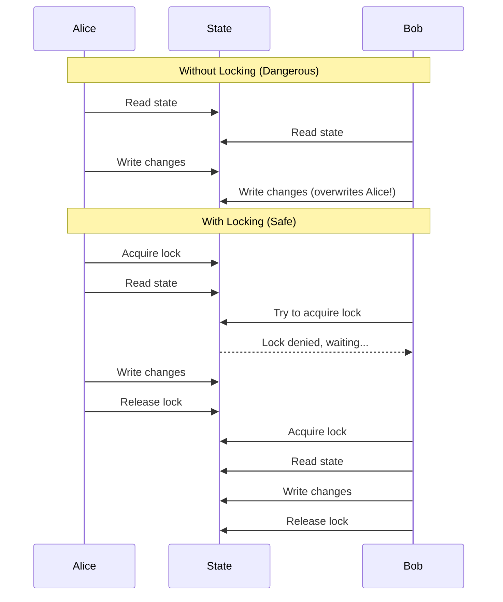

# How to Configure State Locking in Terraform

Author: [nawazdhandala](https://www.github.com/nawazdhandala)

Tags: Terraform, State Management, DevOps, Infrastructure as Code, DynamoDB

Description: Learn how to implement state locking in Terraform to prevent concurrent modifications and state corruption. Covers DynamoDB for AWS, Blob leases for Azure, and Terraform Cloud locking.

---

When multiple engineers run Terraform simultaneously, without state locking, one operation can overwrite another's changes. State locking prevents this by ensuring only one operation can modify state at a time.

## Why State Locking Matters

Without locking, two concurrent `terraform apply` commands can:

1. Read the same initial state
2. Both plan changes based on that state
3. Both write back, with the second overwriting the first
4. Result: Lost infrastructure, corrupted state, or orphaned resources



## DynamoDB Locking for S3 Backend

The most common setup for AWS users combines S3 for state storage with DynamoDB for locking.

### Step 1: Create the DynamoDB Table

```hcl
# lock-table.tf

resource "aws_dynamodb_table" "terraform_locks" {
  name         = "terraform-state-locks"
  billing_mode = "PAY_PER_REQUEST"  # No capacity planning needed
  hash_key     = "LockID"

  attribute {
    name = "LockID"
    type = "S"  # String type required by Terraform
  }

  # Enable point-in-time recovery for safety
  point_in_time_recovery {
    enabled = true
  }

  tags = {
    Name    = "Terraform State Lock Table"
    Purpose = "terraform-locking"
  }
}
```

Alternatively, create it with AWS CLI:

```bash
aws dynamodb create-table \
  --table-name terraform-state-locks \
  --attribute-definitions AttributeName=LockID,AttributeType=S \
  --key-schema AttributeName=LockID,KeyType=HASH \
  --billing-mode PAY_PER_REQUEST \
  --region us-east-1
```

### Step 2: Configure the Backend

```hcl
# backend.tf

terraform {
  backend "s3" {
    bucket         = "mycompany-terraform-state"
    key            = "prod/infrastructure/terraform.tfstate"
    region         = "us-east-1"
    encrypt        = true

    # Enable state locking
    dynamodb_table = "terraform-state-locks"
  }
}
```

### Step 3: Initialize and Verify

```bash
# Initialize with the backend
terraform init

# Run a plan to verify locking works
terraform plan

# You'll see locking messages:
# Acquiring state lock. This may take a few moments...
# ...
# Releasing state lock. This may take a few moments...
```

## How DynamoDB Locking Works

When you run `terraform apply`:

1. Terraform creates a lock entry in DynamoDB with a unique ID
2. The entry includes: lock ID, who acquired it, when, and operation type
3. Other Terraform operations see the lock and wait or fail
4. After completion, Terraform deletes the lock entry

View active locks:

```bash
# List items in the lock table
aws dynamodb scan --table-name terraform-state-locks

# Example lock entry:
{
  "LockID": {"S": "mycompany-terraform-state/prod/infrastructure/terraform.tfstate"},
  "Info": {"S": "{\"ID\":\"abc123\",\"Operation\":\"OperationTypeApply\",\"Who\":\"alice@laptop\",\"Version\":\"1.6.0\",\"Created\":\"2024-01-15T10:30:00Z\",\"Path\":\"prod/infrastructure/terraform.tfstate\"}"}
}
```

## Handling Lock Timeouts

If a process crashes while holding a lock, the lock remains. Handle this carefully:

```bash
# Check who holds the lock
aws dynamodb get-item \
  --table-name terraform-state-locks \
  --key '{"LockID": {"S": "mycompany-terraform-state/prod/infrastructure/terraform.tfstate"}}'

# Force unlock (only if you're certain no operation is running)
terraform force-unlock LOCK_ID

# The LOCK_ID comes from the error message or the DynamoDB item
```

## Azure Blob Locking

Azure Blob Storage uses blob leases for native locking. No separate table needed.

```hcl
terraform {
  backend "azurerm" {
    resource_group_name  = "terraform-state-rg"
    storage_account_name = "tfstatecompany"
    container_name       = "tfstate"
    key                  = "prod/infrastructure.tfstate"

    # Locking is automatic with Azure blobs
    # Uses 60-second lease that auto-renews
  }
}
```

Azure blob leases:
- Automatically acquired when Terraform starts
- Auto-renewed every 60 seconds during operation
- Released when operation completes
- Expire after 60 seconds if process crashes

## Google Cloud Storage Locking

GCS supports object locking natively:

```hcl
terraform {
  backend "gcs" {
    bucket = "mycompany-terraform-state"
    prefix = "prod/infrastructure"

    # Locking is enabled by default
    # Uses object metadata for coordination
  }
}
```

## Terraform Cloud Locking

Terraform Cloud and Enterprise handle locking automatically:

```hcl
terraform {
  cloud {
    organization = "mycompany"

    workspaces {
      name = "prod-infrastructure"
    }
  }
}
```

Terraform Cloud features:
- Built-in locking per workspace
- Lock information visible in UI
- Admin can unlock stuck workspaces
- Run queue prevents concurrent operations

## Consul Backend Locking

For on-premises setups, Consul provides distributed locking:

```hcl
terraform {
  backend "consul" {
    address = "consul.example.com:8500"
    scheme  = "https"
    path    = "terraform/prod/infrastructure"
    lock    = true  # Enable locking

    # Optional: Use ACL token for security
    access_token = var.consul_token
  }
}
```

## Disable Locking (Not Recommended)

In rare cases, you might need to disable locking:

```bash
# Disable locking for this operation only
terraform apply -lock=false

# Set lock timeout (default is 0, which waits indefinitely)
terraform apply -lock-timeout=5m
```

When to disable:
- During disaster recovery when lock table is unavailable
- Never in normal operations

## IAM Permissions for Locking

Your Terraform execution role needs these permissions:

```json
{
  "Version": "2012-10-17",
  "Statement": [
    {
      "Effect": "Allow",
      "Action": [
        "s3:GetObject",
        "s3:PutObject",
        "s3:DeleteObject",
        "s3:ListBucket"
      ],
      "Resource": [
        "arn:aws:s3:::mycompany-terraform-state",
        "arn:aws:s3:::mycompany-terraform-state/*"
      ]
    },
    {
      "Effect": "Allow",
      "Action": [
        "dynamodb:GetItem",
        "dynamodb:PutItem",
        "dynamodb:DeleteItem"
      ],
      "Resource": "arn:aws:dynamodb:us-east-1:*:table/terraform-state-locks"
    }
  ]
}
```

## Lock Table Per Environment

For better isolation, use separate lock tables:

```hcl
# environments/dev/backend.tf
terraform {
  backend "s3" {
    bucket         = "mycompany-terraform-state"
    key            = "dev/infrastructure/terraform.tfstate"
    dynamodb_table = "terraform-locks-dev"
    region         = "us-east-1"
    encrypt        = true
  }
}

# environments/prod/backend.tf
terraform {
  backend "s3" {
    bucket         = "mycompany-terraform-state"
    key            = "prod/infrastructure/terraform.tfstate"
    dynamodb_table = "terraform-locks-prod"
    region         = "us-east-1"
    encrypt        = true
  }
}
```

## Monitoring Lock Activity

Set up CloudWatch alarms for stuck locks:

```hcl
# Alert if a lock exists for more than 1 hour
resource "aws_cloudwatch_metric_alarm" "stuck_lock" {
  alarm_name          = "terraform-stuck-lock"
  comparison_operator = "GreaterThanThreshold"
  evaluation_periods  = 1
  metric_name         = "ConsumedReadCapacityUnits"
  namespace           = "AWS/DynamoDB"
  period              = 3600
  statistic           = "Sum"
  threshold           = 100
  alarm_description   = "Possible stuck Terraform lock"

  dimensions = {
    TableName = "terraform-state-locks"
  }

  alarm_actions = [aws_sns_topic.alerts.arn]
}
```

## Best Practices

1. **Always enable locking** in team environments
2. **Use PAY_PER_REQUEST** billing for DynamoDB to avoid capacity issues
3. **Never force-unlock** without verifying no operation is running
4. **Set lock timeouts** in CI/CD to fail fast
5. **Monitor for stuck locks** with alerts
6. **Document unlock procedures** for your team

## Troubleshooting

### Lock Acquisition Timeout

```
Error: Error acquiring the state lock

Lock Info:
  ID:        abc123
  Path:      prod/infrastructure/terraform.tfstate
  Operation: OperationTypeApply
  Who:       jenkins@build-server
  Created:   2024-01-15 10:30:00.000000
```

Steps:
1. Check if the listed operation is still running
2. Contact the person/system shown in "Who"
3. If crashed, verify and then force-unlock

### DynamoDB Table Not Found

```
Error: Error acquiring state lock: ResourceNotFoundException
```

Solution: Create the DynamoDB table or check the table name spelling.

### Insufficient Permissions

```
Error: Error acquiring state lock: AccessDeniedException
```

Solution: Add the required DynamoDB permissions to your IAM role.

---

State locking is essential for team collaboration with Terraform. DynamoDB provides reliable locking for AWS backends, while other providers have their own mechanisms. Always enable locking and document your unlock procedures for emergencies.
