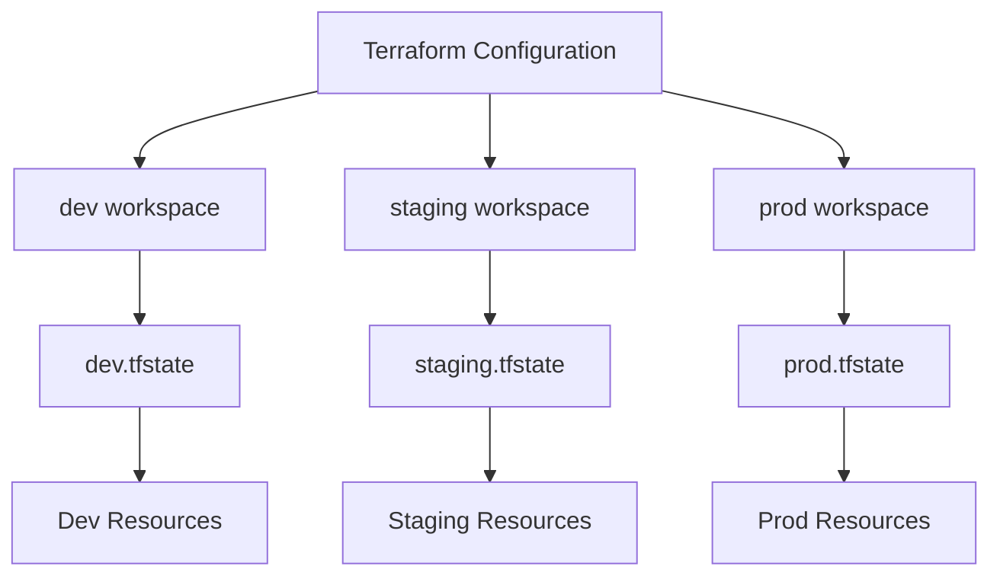

# How to Use Terraform Workspaces for Environments

Author: [nawazdhandala](https://www.github.com/nawazdhandala)

Tags: Terraform, Infrastructure as Code, Workspaces, Environments, DevOps

Description: Learn how to use Terraform workspaces to manage multiple environments like dev, staging, and production from a single configuration. Includes practical examples and best practices.

---

Terraform workspaces let you manage multiple environments from a single configuration. Instead of duplicating code across directories, you switch workspaces and apply the same infrastructure with different variables.

## Understanding Workspaces

Every Terraform configuration starts with a `default` workspace. Workspaces create isolated state files, so resources in the `dev` workspace don't affect `prod`.



## Basic Workspace Commands

```bash
# List all workspaces (asterisk marks current)
terraform workspace list
# * default

# Create a new workspace
terraform workspace new dev
# Created and switched to workspace "dev"!

# Switch to existing workspace
terraform workspace select prod

# Show current workspace
terraform workspace show
# prod

# Delete a workspace (must switch away first)
terraform workspace select default
terraform workspace delete dev
```

## Using Workspaces in Configuration

Access the current workspace name with `terraform.workspace`:

```hcl
# main.tf

provider "aws" {
  region = "us-east-1"
}

# Use workspace name in resource naming
resource "aws_instance" "app" {
  ami           = "ami-0c55b159cbfafe1f0"
  instance_type = var.instance_types[terraform.workspace]

  tags = {
    Name        = "app-${terraform.workspace}"
    Environment = terraform.workspace
  }
}

resource "aws_s3_bucket" "data" {
  bucket = "mycompany-data-${terraform.workspace}"

  tags = {
    Environment = terraform.workspace
  }
}
```

## Environment-Specific Variables

Define different values per workspace using maps:

```hcl
# variables.tf

variable "instance_types" {
  description = "Instance type per environment"
  type        = map(string)
  default = {
    dev     = "t3.micro"
    staging = "t3.small"
    prod    = "t3.large"
  }
}

variable "instance_counts" {
  description = "Number of instances per environment"
  type        = map(number)
  default = {
    dev     = 1
    staging = 2
    prod    = 4
  }
}

variable "enable_monitoring" {
  description = "Enable detailed monitoring per environment"
  type        = map(bool)
  default = {
    dev     = false
    staging = false
    prod    = true
  }
}
```

```hcl
# main.tf

resource "aws_instance" "app" {
  count = var.instance_counts[terraform.workspace]

  ami           = data.aws_ami.amazon_linux.id
  instance_type = var.instance_types[terraform.workspace]
  monitoring    = var.enable_monitoring[terraform.workspace]

  tags = {
    Name        = "app-${terraform.workspace}-${count.index + 1}"
    Environment = terraform.workspace
  }
}
```

## Workspace-Specific Backends

Each workspace stores state in a separate path:

```hcl
# backend.tf

terraform {
  backend "s3" {
    bucket         = "mycompany-terraform-state"
    key            = "infrastructure/terraform.tfstate"
    region         = "us-east-1"
    dynamodb_table = "terraform-locks"

    # Workspaces create paths like:
    # env:/dev/infrastructure/terraform.tfstate
    # env:/staging/infrastructure/terraform.tfstate
    # env:/prod/infrastructure/terraform.tfstate
  }
}
```

For more control, use workspace-specific key prefixes:

```hcl
terraform {
  backend "s3" {
    bucket               = "mycompany-terraform-state"
    key                  = "infrastructure/terraform.tfstate"
    region               = "us-east-1"
    workspace_key_prefix = "environments"
    dynamodb_table       = "terraform-locks"

    # Results in:
    # environments/dev/infrastructure/terraform.tfstate
    # environments/staging/infrastructure/terraform.tfstate
  }
}
```

## Complete Example: Multi-Environment Web Application

Here's a full example deploying a web application across environments:

```hcl
# variables.tf

variable "aws_region" {
  default = "us-east-1"
}

# Environment-specific configurations
variable "configs" {
  type = map(object({
    instance_type    = string
    min_size         = number
    max_size         = number
    desired_capacity = number
    domain_prefix    = string
  }))
  default = {
    dev = {
      instance_type    = "t3.micro"
      min_size         = 1
      max_size         = 2
      desired_capacity = 1
      domain_prefix    = "dev"
    }
    staging = {
      instance_type    = "t3.small"
      min_size         = 2
      max_size         = 4
      desired_capacity = 2
      domain_prefix    = "staging"
    }
    prod = {
      instance_type    = "t3.medium"
      min_size         = 3
      max_size         = 10
      desired_capacity = 3
      domain_prefix    = "www"
    }
  }
}

# Local values for cleaner code
locals {
  env    = terraform.workspace
  config = var.configs[local.env]
}
```

```hcl
# main.tf

provider "aws" {
  region = var.aws_region
}

# VPC for the environment
module "vpc" {
  source = "terraform-aws-modules/vpc/aws"

  name = "vpc-${local.env}"
  cidr = "10.0.0.0/16"

  azs             = ["${var.aws_region}a", "${var.aws_region}b"]
  private_subnets = ["10.0.1.0/24", "10.0.2.0/24"]
  public_subnets  = ["10.0.101.0/24", "10.0.102.0/24"]

  enable_nat_gateway = local.env == "prod" ? true : false
  single_nat_gateway = local.env != "prod"

  tags = {
    Environment = local.env
  }
}

# Application Load Balancer
resource "aws_lb" "app" {
  name               = "alb-${local.env}"
  internal           = false
  load_balancer_type = "application"
  subnets            = module.vpc.public_subnets

  tags = {
    Environment = local.env
  }
}

# Auto Scaling Group
resource "aws_autoscaling_group" "app" {
  name                = "asg-${local.env}"
  vpc_zone_identifier = module.vpc.private_subnets
  target_group_arns   = [aws_lb_target_group.app.arn]

  min_size         = local.config.min_size
  max_size         = local.config.max_size
  desired_capacity = local.config.desired_capacity

  launch_template {
    id      = aws_launch_template.app.id
    version = "$Latest"
  }

  tag {
    key                 = "Name"
    value               = "app-${local.env}"
    propagate_at_launch = true
  }

  tag {
    key                 = "Environment"
    value               = local.env
    propagate_at_launch = true
  }
}

# Launch Template
resource "aws_launch_template" "app" {
  name_prefix   = "app-${local.env}-"
  image_id      = data.aws_ami.amazon_linux.id
  instance_type = local.config.instance_type

  user_data = base64encode(templatefile("${path.module}/userdata.sh", {
    environment = local.env
  }))

  tag_specifications {
    resource_type = "instance"
    tags = {
      Name        = "app-${local.env}"
      Environment = local.env
    }
  }
}

# Target Group
resource "aws_lb_target_group" "app" {
  name     = "tg-${local.env}"
  port     = 80
  protocol = "HTTP"
  vpc_id   = module.vpc.vpc_id

  health_check {
    path                = "/health"
    healthy_threshold   = 2
    unhealthy_threshold = 10
  }
}

data "aws_ami" "amazon_linux" {
  most_recent = true
  owners      = ["amazon"]

  filter {
    name   = "name"
    values = ["amzn2-ami-hvm-*-x86_64-gp2"]
  }
}
```

```hcl
# outputs.tf

output "environment" {
  value = local.env
}

output "lb_dns_name" {
  value = aws_lb.app.dns_name
}

output "vpc_id" {
  value = module.vpc.vpc_id
}
```

## Deploying to Each Environment

```bash
# Deploy to dev
terraform workspace select dev
terraform plan -out=dev.plan
terraform apply dev.plan

# Deploy to staging
terraform workspace select staging
terraform plan -out=staging.plan
terraform apply staging.plan

# Deploy to prod (with extra caution)
terraform workspace select prod
terraform plan -out=prod.plan
# Review the plan carefully!
terraform apply prod.plan
```

## Workspace Best Practices

### 1. Validate Workspace Before Apply

Add a check to prevent accidental production deploys:

```hcl
# Prevent using default workspace
resource "null_resource" "workspace_check" {
  count = terraform.workspace == "default" ? "ERROR: Do not use default workspace" : 0
}
```

### 2. Use Locals for Clarity

```hcl
locals {
  env        = terraform.workspace
  is_prod    = terraform.workspace == "prod"
  name_prefix = "myapp-${terraform.workspace}"
}

resource "aws_instance" "app" {
  # Use locals instead of terraform.workspace everywhere
  instance_type = local.is_prod ? "t3.large" : "t3.micro"

  tags = {
    Name = "${local.name_prefix}-app"
  }
}
```

### 3. Protect Production

```hcl
resource "aws_db_instance" "main" {
  # Only enable deletion protection in prod
  deletion_protection = terraform.workspace == "prod"

  # Longer backup retention in prod
  backup_retention_period = terraform.workspace == "prod" ? 30 : 7
}
```

## Workspaces vs Directories

When to use workspaces:

- **Similar infrastructure**: All environments have the same structure
- **Single team**: One team manages all environments
- **Quick switching**: Need to rapidly switch between environments

When to use separate directories:

- **Different infrastructure**: Environments have unique components
- **Different teams**: Each environment has different owners
- **Strict isolation**: Regulatory requirements for separation

## Alternatives to Workspaces

### Directory-Based Approach

```
terraform/
├── modules/
├── environments/
│   ├── dev/
│   │   ├── main.tf
│   │   └── terraform.tfvars
│   ├── staging/
│   │   ├── main.tf
│   │   └── terraform.tfvars
│   └── prod/
│       ├── main.tf
│       └── terraform.tfvars
```

### Terragrunt

For complex multi-environment setups, consider Terragrunt:

```hcl
# terragrunt.hcl in environments/dev/
include {
  path = find_in_parent_folders()
}

terraform {
  source = "../../modules/app"
}

inputs = {
  environment   = "dev"
  instance_type = "t3.micro"
}
```

---

Workspaces simplify managing multiple environments when your infrastructure is similar across them. Use the current workspace to parameterize resource names, sizes, and configurations. For significantly different environments or strict isolation requirements, consider the directory-based approach instead.
