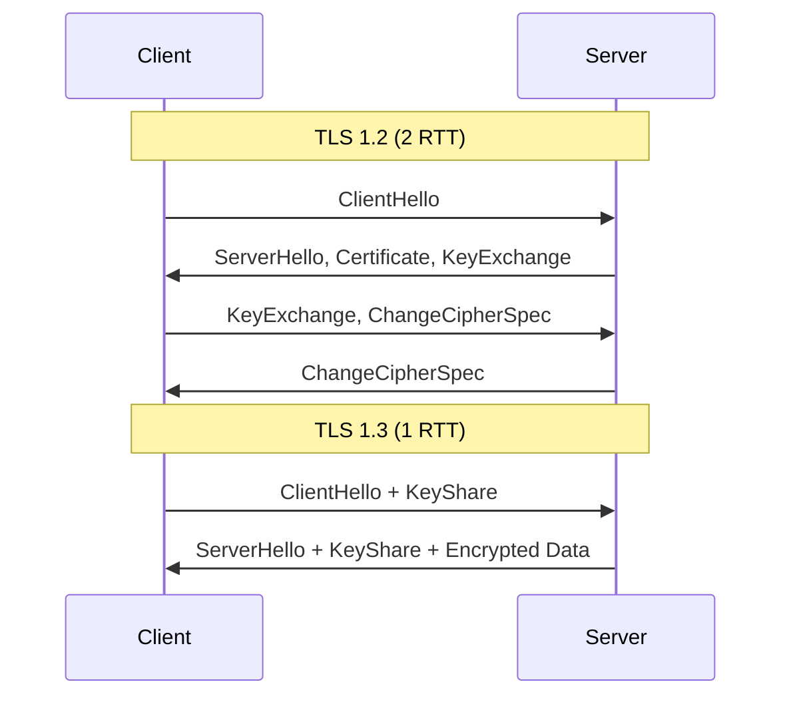
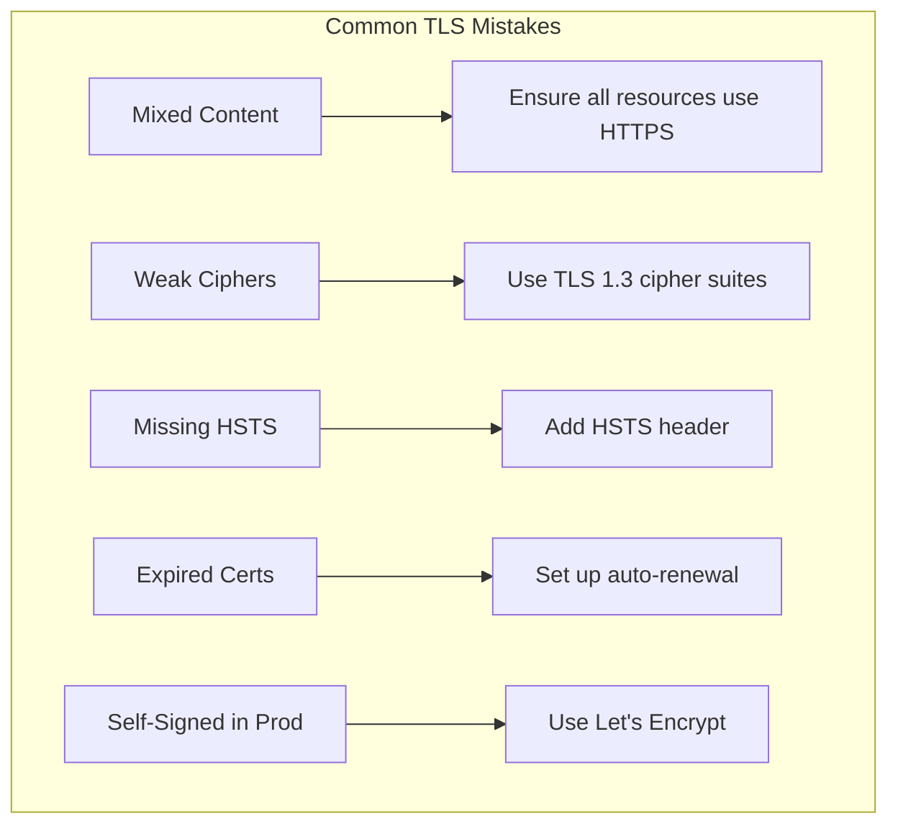

# How to Configure TLS 1.3 Best Practices

Author: [nawazdhandala](https://www.github.com/nawazdhandala)

Tags: TLS, Security, HTTPS, Networking, SSL, Encryption

Description: A practical guide to configuring TLS 1.3 with security best practices, covering cipher suites, certificate management, HSTS, OCSP stapling, and performance optimization.

---

TLS 1.3 is the latest version of the Transport Layer Security protocol, offering improved security and performance over TLS 1.2. This guide covers how to configure TLS 1.3 properly across different servers and avoid common pitfalls.

## TLS 1.3 vs TLS 1.2



### Key Improvements in TLS 1.3

- **Faster handshake**: 1-RTT instead of 2-RTT
- **0-RTT resumption**: Send data on first packet
- **Removed weak ciphers**: No RC4, 3DES, or SHA-1
- **Forward secrecy required**: Every connection uses ephemeral keys
- **Simplified cipher suites**: Only five secure suites

## Nginx TLS 1.3 Configuration

### Basic Secure Configuration

```nginx
server {
    listen 443 ssl http2;
    server_name example.com;

    # Certificate files
    ssl_certificate /etc/ssl/certs/example.com.crt;
    ssl_certificate_key /etc/ssl/private/example.com.key;

    # Protocol versions - TLS 1.2 and 1.3 only
    ssl_protocols TLSv1.2 TLSv1.3;

    # TLS 1.3 cipher suites (preferred)
    ssl_ciphers TLS_AES_256_GCM_SHA384:TLS_CHACHA20_POLY1305_SHA256:TLS_AES_128_GCM_SHA256:ECDHE-ECDSA-AES256-GCM-SHA384:ECDHE-RSA-AES256-GCM-SHA384;

    # Use server's cipher preference
    ssl_prefer_server_ciphers on;

    # ECDH curve
    ssl_ecdh_curve X25519:secp384r1;

    # Session settings
    ssl_session_timeout 1d;
    ssl_session_cache shared:SSL:50m;
    ssl_session_tickets off;  # Disable for perfect forward secrecy

    # OCSP Stapling
    ssl_stapling on;
    ssl_stapling_verify on;
    ssl_trusted_certificate /etc/ssl/certs/ca-bundle.crt;
    resolver 8.8.8.8 8.8.4.4 valid=300s;
    resolver_timeout 5s;

    # Security headers
    add_header Strict-Transport-Security "max-age=31536000; includeSubDomains; preload" always;
}
```

### TLS 1.3 Only Configuration

```nginx
server {
    listen 443 ssl http2;
    server_name secure.example.com;

    ssl_certificate /etc/ssl/certs/example.com.crt;
    ssl_certificate_key /etc/ssl/private/example.com.key;

    # TLS 1.3 only - maximum security
    ssl_protocols TLSv1.3;

    # TLS 1.3 only has these cipher suites
    # They are automatically selected, but you can specify preference
    ssl_ciphers TLS_AES_256_GCM_SHA384:TLS_CHACHA20_POLY1305_SHA256:TLS_AES_128_GCM_SHA256;

    # 0-RTT (early data) - enable with caution
    ssl_early_data on;

    # Pass early data status to application
    proxy_set_header Early-Data $ssl_early_data;

    location / {
        # Reject early data for state-changing requests
        if ($ssl_early_data = 1) {
            return 425;
        }
        proxy_pass http://backend;
    }
}
```

## Apache TLS 1.3 Configuration

```apache
# /etc/apache2/sites-available/example.conf

<VirtualHost *:443>
    ServerName example.com

    SSLEngine on
    SSLCertificateFile /etc/ssl/certs/example.com.crt
    SSLCertificateKeyFile /etc/ssl/private/example.com.key

    # Protocol versions
    SSLProtocol -all +TLSv1.2 +TLSv1.3

    # Cipher suites
    SSLCipherSuite TLSv1.3 TLS_AES_256_GCM_SHA384:TLS_CHACHA20_POLY1305_SHA256:TLS_AES_128_GCM_SHA256
    SSLCipherSuite ECDHE-ECDSA-AES256-GCM-SHA384:ECDHE-RSA-AES256-GCM-SHA384:ECDHE-ECDSA-CHACHA20-POLY1305

    SSLHonorCipherOrder on

    # OCSP Stapling
    SSLUseStapling on
    SSLStaplingCache shmcb:/var/run/ocsp(128000)
    SSLStaplingResponderTimeout 5
    SSLStaplingReturnResponderErrors off

    # HSTS
    Header always set Strict-Transport-Security "max-age=31536000; includeSubDomains"

    # HTTP/2
    Protocols h2 http/1.1
</VirtualHost>
```

## Certificate Best Practices

### Generate Strong Keys

```bash
# Generate ECDSA P-384 key (recommended)
openssl ecparam -genkey -name secp384r1 -out server.key

# Or RSA 4096 for broader compatibility
openssl genrsa -out server.key 4096

# Generate CSR
openssl req -new -key server.key -out server.csr \
    -subj "/C=US/ST=State/L=City/O=Organization/CN=example.com"

# Self-signed certificate for testing
openssl x509 -req -days 365 -in server.csr -signkey server.key -out server.crt
```

### Let's Encrypt with Certbot

```bash
# Install certbot
apt install certbot python3-certbot-nginx

# Obtain certificate with ECDSA key
certbot certonly --nginx -d example.com -d www.example.com \
    --key-type ecdsa \
    --elliptic-curve secp384r1

# Auto-renewal with post-hook
certbot renew --post-hook "systemctl reload nginx"
```

### Certificate Chain Verification

```bash
#!/bin/bash
# verify-cert.sh - Verify certificate chain and configuration

DOMAIN=$1

echo "=== Certificate Chain ==="
openssl s_client -connect $DOMAIN:443 -servername $DOMAIN </dev/null 2>/dev/null | \
    openssl x509 -noout -dates -subject -issuer

echo -e "\n=== TLS Version ==="
openssl s_client -connect $DOMAIN:443 -servername $DOMAIN </dev/null 2>/dev/null | \
    grep "Protocol"

echo -e "\n=== Cipher Suite ==="
openssl s_client -connect $DOMAIN:443 -servername $DOMAIN </dev/null 2>/dev/null | \
    grep "Cipher"

echo -e "\n=== Certificate Expiry ==="
echo | openssl s_client -connect $DOMAIN:443 -servername $DOMAIN 2>/dev/null | \
    openssl x509 -noout -enddate
```

## HSTS Configuration

HTTP Strict Transport Security forces browsers to use HTTPS.

```nginx
# Standard HSTS header
add_header Strict-Transport-Security "max-age=31536000" always;

# Include subdomains
add_header Strict-Transport-Security "max-age=31536000; includeSubDomains" always;

# Preload list (be careful - hard to undo)
add_header Strict-Transport-Security "max-age=31536000; includeSubDomains; preload" always;
```

### HSTS Preload Checklist

Before submitting to the HSTS preload list:

```bash
# Test HSTS configuration
curl -sI https://example.com | grep -i strict

# Check preload eligibility
# Visit: https://hstspreload.org/?domain=example.com
```

## OCSP Stapling

OCSP stapling improves performance and privacy by having the server fetch certificate revocation status.

```nginx
# Enable OCSP stapling
ssl_stapling on;
ssl_stapling_verify on;

# Certificate chain for verification
ssl_trusted_certificate /etc/ssl/certs/chain.pem;

# DNS resolver for OCSP
resolver 8.8.8.8 1.1.1.1 valid=300s;
resolver_timeout 5s;
```

### Verify OCSP Stapling

```bash
# Check if OCSP stapling is working
openssl s_client -connect example.com:443 -servername example.com -status </dev/null 2>/dev/null | \
    grep -A 20 "OCSP Response"

# Expected output should include "OCSP Response Status: successful"
```

## Security Headers

```nginx
server {
    # Existing TLS configuration...

    # HSTS
    add_header Strict-Transport-Security "max-age=31536000; includeSubDomains" always;

    # Prevent clickjacking
    add_header X-Frame-Options "SAMEORIGIN" always;

    # Prevent MIME type sniffing
    add_header X-Content-Type-Options "nosniff" always;

    # XSS protection
    add_header X-XSS-Protection "1; mode=block" always;

    # Referrer policy
    add_header Referrer-Policy "strict-origin-when-cross-origin" always;

    # Content Security Policy (customize for your application)
    add_header Content-Security-Policy "default-src 'self'; script-src 'self'; style-src 'self' 'unsafe-inline'" always;

    # Permissions Policy
    add_header Permissions-Policy "geolocation=(), microphone=(), camera=()" always;
}
```

## Performance Optimization

### Session Resumption

```nginx
# Session cache for TLS 1.2 (TLS 1.3 uses different mechanism)
ssl_session_cache shared:SSL:50m;
ssl_session_timeout 1d;

# Disable session tickets for perfect forward secrecy
# (Optional - enables faster resumption but slightly reduces security)
ssl_session_tickets off;

# If enabling session tickets, rotate keys regularly
# ssl_session_ticket_key /etc/nginx/ssl/ticket.key;
```

### 0-RTT Early Data

```nginx
# Enable 0-RTT for TLS 1.3
ssl_early_data on;

# Size limit for early data
# Default is 16384 bytes

location / {
    # Protect against replay attacks
    # Reject early data for non-idempotent requests

    set $reject_early 0;

    if ($request_method != GET) {
        set $reject_early 1;
    }

    if ($ssl_early_data = 1) {
        set $reject_early "${reject_early}1";
    }

    if ($reject_early = 11) {
        return 425;  # Too Early
    }

    proxy_pass http://backend;
    proxy_set_header Early-Data $ssl_early_data;
}
```

## Testing TLS Configuration

### Command Line Testing

```bash
#!/bin/bash
# tls-test.sh - Comprehensive TLS testing

DOMAIN=$1

echo "=== Supported Protocols ==="
for proto in tls1 tls1_1 tls1_2 tls1_3; do
    if openssl s_client -connect $DOMAIN:443 -$proto </dev/null 2>/dev/null | grep -q "Cipher"; then
        echo "$proto: SUPPORTED"
    else
        echo "$proto: NOT SUPPORTED"
    fi
done

echo -e "\n=== TLS 1.3 Cipher Suites ==="
openssl s_client -connect $DOMAIN:443 -tls1_3 </dev/null 2>/dev/null | \
    grep "Cipher"

echo -e "\n=== Certificate Details ==="
openssl s_client -connect $DOMAIN:443 </dev/null 2>/dev/null | \
    openssl x509 -noout -text | grep -E "(Subject:|Issuer:|Not Before:|Not After:|Public Key Algorithm:)"

echo -e "\n=== HSTS Header ==="
curl -sI https://$DOMAIN | grep -i strict-transport

echo -e "\n=== OCSP Stapling ==="
openssl s_client -connect $DOMAIN:443 -status </dev/null 2>/dev/null | \
    grep -E "(OCSP Response Status:|Cert Status:)"
```

### Online Testing Tools

```bash
# Use SSL Labs for comprehensive testing
echo "Test at: https://www.ssllabs.com/ssltest/analyze.html?d=$DOMAIN"

# testssl.sh for local testing
./testssl.sh example.com

# Mozilla Observatory
echo "Test at: https://observatory.mozilla.org/analyze/$DOMAIN"
```

## Common Mistakes to Avoid



### Configuration Checklist

- [ ] TLS 1.2 minimum (TLS 1.3 preferred)
- [ ] Strong cipher suites only
- [ ] Valid certificate from trusted CA
- [ ] Complete certificate chain
- [ ] HSTS header enabled
- [ ] OCSP stapling enabled
- [ ] No mixed content
- [ ] Automatic certificate renewal
- [ ] Regular security testing

---

TLS 1.3 provides stronger security with better performance. Enable it alongside TLS 1.2 for maximum compatibility, use ECDSA certificates for better performance, and always test your configuration after changes. Security is not a one-time setup but an ongoing process.
