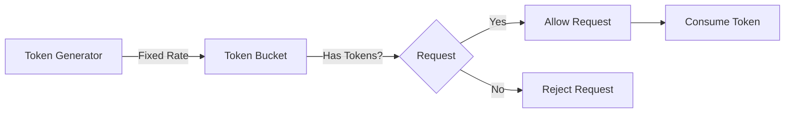

# How to Implement Token Bucket Rate Limiting in Node.js

Author: [nawazdhandala](https://www.github.com/nawazdhandala)

Tags: Node.js, Rate Limiting, Token Bucket, API, Performance, Express

Description: A practical guide to implementing the token bucket algorithm for rate limiting in Node.js, with production-ready code examples for Express applications and Redis-backed distributed rate limiting.

---

> Rate limiting protects your APIs from abuse and ensures fair usage across clients. The token bucket algorithm offers a flexible approach that allows controlled bursts while maintaining long-term rate limits.

Whether you are building a public API or protecting internal services, rate limiting is essential for maintaining stability. This guide walks you through implementing the token bucket algorithm from scratch in Node.js, covering both in-memory and distributed scenarios.

---

## Understanding the Token Bucket Algorithm

The token bucket algorithm works like a bucket that holds tokens. Tokens are added at a fixed rate, and each request consumes one or more tokens. If the bucket is empty, requests are rejected until tokens refill.



Key parameters:
- **Bucket capacity**: Maximum tokens the bucket can hold (controls burst size)
- **Refill rate**: How many tokens are added per time interval
- **Tokens per request**: How many tokens each request consumes

---

## Basic In-Memory Implementation

Let's start with a simple in-memory token bucket implementation. This works well for single-server deployments.

```typescript
// token-bucket.ts
// A simple in-memory token bucket implementation

interface TokenBucketConfig {
  capacity: number;      // Maximum tokens in the bucket
  refillRate: number;    // Tokens added per interval
  refillInterval: number; // Interval in milliseconds
}

interface BucketState {
  tokens: number;
  lastRefill: number;
}

class TokenBucket {
  private buckets: Map<string, BucketState> = new Map();
  private config: TokenBucketConfig;

  constructor(config: TokenBucketConfig) {
    this.config = config;
  }

  // Refill tokens based on elapsed time since last refill
  private refill(bucket: BucketState): void {
    const now = Date.now();
    const timePassed = now - bucket.lastRefill;

    // Calculate how many tokens should be added
    const tokensToAdd = Math.floor(
      (timePassed / this.config.refillInterval) * this.config.refillRate
    );

    if (tokensToAdd > 0) {
      // Add tokens but don't exceed capacity
      bucket.tokens = Math.min(
        this.config.capacity,
        bucket.tokens + tokensToAdd
      );
      bucket.lastRefill = now;
    }
  }

  // Try to consume tokens for a given key (e.g., IP address or user ID)
  consume(key: string, tokensRequired: number = 1): boolean {
    let bucket = this.buckets.get(key);

    // Create a new bucket if this is a new client
    if (!bucket) {
      bucket = {
        tokens: this.config.capacity,
        lastRefill: Date.now()
      };
      this.buckets.set(key, bucket);
    }

    // Refill tokens based on elapsed time
    this.refill(bucket);

    // Check if we have enough tokens
    if (bucket.tokens >= tokensRequired) {
      bucket.tokens -= tokensRequired;
      return true;
    }

    return false;
  }

  // Get current state for a key (useful for headers)
  getState(key: string): { remaining: number; resetMs: number } {
    const bucket = this.buckets.get(key);

    if (!bucket) {
      return {
        remaining: this.config.capacity,
        resetMs: 0
      };
    }

    // Calculate when the bucket will be full again
    const tokensNeeded = this.config.capacity - bucket.tokens;
    const resetMs = Math.ceil(
      (tokensNeeded / this.config.refillRate) * this.config.refillInterval
    );

    return {
      remaining: Math.floor(bucket.tokens),
      resetMs
    };
  }

  // Clean up old buckets to prevent memory leaks
  cleanup(maxAgeMs: number = 3600000): void {
    const now = Date.now();

    for (const [key, bucket] of this.buckets.entries()) {
      if (now - bucket.lastRefill > maxAgeMs) {
        this.buckets.delete(key);
      }
    }
  }
}

export { TokenBucket, TokenBucketConfig };
```

---

## Express Middleware Integration

Now let's create an Express middleware that uses our token bucket.

```typescript
// rate-limit-middleware.ts
import { Request, Response, NextFunction } from 'express';
import { TokenBucket } from './token-bucket';

// Configuration for the rate limiter
const rateLimiter = new TokenBucket({
  capacity: 100,        // Allow up to 100 requests in a burst
  refillRate: 10,       // Add 10 tokens per second
  refillInterval: 1000  // Refill interval of 1 second
});

// Run cleanup every 5 minutes to prevent memory buildup
setInterval(() => rateLimiter.cleanup(), 300000);

// Extract client identifier from request
function getClientKey(req: Request): string {
  // Use X-Forwarded-For header if behind a proxy
  const forwarded = req.headers['x-forwarded-for'];

  if (forwarded) {
    // X-Forwarded-For can contain multiple IPs, take the first one
    const forwardedIp = Array.isArray(forwarded)
      ? forwarded[0]
      : forwarded.split(',')[0];
    return forwardedIp.trim();
  }

  // Fall back to direct IP address
  return req.ip || req.socket.remoteAddress || 'unknown';
}

// Rate limiting middleware
export function rateLimitMiddleware(
  req: Request,
  res: Response,
  next: NextFunction
): void {
  const clientKey = getClientKey(req);
  const allowed = rateLimiter.consume(clientKey);

  // Get current state for response headers
  const state = rateLimiter.getState(clientKey);

  // Always set rate limit headers so clients can monitor their usage
  res.setHeader('X-RateLimit-Limit', '100');
  res.setHeader('X-RateLimit-Remaining', state.remaining.toString());
  res.setHeader('X-RateLimit-Reset', state.resetMs.toString());

  if (!allowed) {
    // Request rejected due to rate limiting
    res.status(429).json({
      error: 'Too Many Requests',
      message: 'Rate limit exceeded. Please slow down.',
      retryAfter: Math.ceil(state.resetMs / 1000)
    });
    return;
  }

  next();
}

// Apply rate limiting to Express app
// Example usage in your main app file:
// app.use(rateLimitMiddleware);
```

---

## Redis-Backed Distributed Rate Limiting

For applications running on multiple servers, you need a distributed rate limiter. Redis provides atomic operations that make this straightforward.

```typescript
// distributed-token-bucket.ts
import Redis from 'ioredis';

interface DistributedBucketConfig {
  capacity: number;
  refillRate: number;
  refillInterval: number;
  keyPrefix: string;
}

class DistributedTokenBucket {
  private redis: Redis;
  private config: DistributedBucketConfig;

  constructor(redis: Redis, config: DistributedBucketConfig) {
    this.redis = redis;
    this.config = config;
  }

  // Lua script for atomic token bucket operations
  // This ensures consistency even with multiple servers
  private luaScript = `
    local key = KEYS[1]
    local capacity = tonumber(ARGV[1])
    local refill_rate = tonumber(ARGV[2])
    local refill_interval = tonumber(ARGV[3])
    local tokens_required = tonumber(ARGV[4])
    local now = tonumber(ARGV[5])

    -- Get current bucket state
    local bucket = redis.call('HMGET', key, 'tokens', 'last_refill')
    local tokens = tonumber(bucket[1])
    local last_refill = tonumber(bucket[2])

    -- Initialize if bucket does not exist
    if tokens == nil then
      tokens = capacity
      last_refill = now
    end

    -- Calculate tokens to add based on time elapsed
    local time_passed = now - last_refill
    local tokens_to_add = math.floor(
      (time_passed / refill_interval) * refill_rate
    )

    -- Refill the bucket
    if tokens_to_add > 0 then
      tokens = math.min(capacity, tokens + tokens_to_add)
      last_refill = now
    end

    -- Check if request is allowed
    local allowed = 0
    if tokens >= tokens_required then
      tokens = tokens - tokens_required
      allowed = 1
    end

    -- Save updated state
    redis.call('HMSET', key, 'tokens', tokens, 'last_refill', last_refill)

    -- Set TTL to clean up old keys automatically
    redis.call('EXPIRE', key, 3600)

    return {allowed, tokens}
  `;

  async consume(key: string, tokensRequired: number = 1): Promise<boolean> {
    const bucketKey = `${this.config.keyPrefix}:${key}`;
    const now = Date.now();

    const result = await this.redis.eval(
      this.luaScript,
      1,
      bucketKey,
      this.config.capacity,
      this.config.refillRate,
      this.config.refillInterval,
      tokensRequired,
      now
    ) as [number, number];

    return result[0] === 1;
  }

  async getState(key: string): Promise<{ remaining: number; resetMs: number }> {
    const bucketKey = `${this.config.keyPrefix}:${key}`;
    const data = await this.redis.hmget(bucketKey, 'tokens', 'last_refill');

    const tokens = parseFloat(data[0] || String(this.config.capacity));
    const remaining = Math.floor(tokens);

    // Calculate reset time
    const tokensNeeded = this.config.capacity - remaining;
    const resetMs = Math.ceil(
      (tokensNeeded / this.config.refillRate) * this.config.refillInterval
    );

    return { remaining, resetMs };
  }
}

export { DistributedTokenBucket, DistributedBucketConfig };
```

---

## Using the Distributed Rate Limiter

Here is how to integrate the distributed rate limiter with Express.

```typescript
// app.ts
import express from 'express';
import Redis from 'ioredis';
import { DistributedTokenBucket } from './distributed-token-bucket';

const app = express();

// Connect to Redis
const redis = new Redis({
  host: process.env.REDIS_HOST || 'localhost',
  port: parseInt(process.env.REDIS_PORT || '6379'),
  password: process.env.REDIS_PASSWORD
});

// Create distributed rate limiter
const rateLimiter = new DistributedTokenBucket(redis, {
  capacity: 100,
  refillRate: 10,
  refillInterval: 1000,
  keyPrefix: 'ratelimit'
});

// Middleware factory for different rate limits
function createRateLimitMiddleware(tokensPerRequest: number = 1) {
  return async (
    req: express.Request,
    res: express.Response,
    next: express.NextFunction
  ) => {
    // Use API key if available, otherwise use IP
    const clientKey = req.headers['x-api-key'] as string || req.ip;

    try {
      const allowed = await rateLimiter.consume(clientKey, tokensPerRequest);
      const state = await rateLimiter.getState(clientKey);

      res.setHeader('X-RateLimit-Remaining', state.remaining.toString());

      if (!allowed) {
        res.status(429).json({
          error: 'Rate limit exceeded',
          retryAfter: Math.ceil(state.resetMs / 1000)
        });
        return;
      }

      next();
    } catch (error) {
      // If Redis fails, allow the request but log the error
      console.error('Rate limiter error:', error);
      next();
    }
  };
}

// Apply different rate limits to different endpoints
app.use('/api', createRateLimitMiddleware(1));

// Expensive endpoints consume more tokens
app.post('/api/export', createRateLimitMiddleware(10));

app.get('/api/data', (req, res) => {
  res.json({ message: 'Success' });
});

app.listen(3000, () => {
  console.log('Server running on port 3000');
});
```

---

## Advanced Features

### Sliding Window Enhancement

You can improve fairness by combining the token bucket with a sliding window approach.

```typescript
// sliding-token-bucket.ts
// Combines token bucket with sliding window for smoother rate limiting

interface SlidingWindowConfig {
  windowSize: number;    // Window size in milliseconds
  maxRequests: number;   // Maximum requests per window
}

class SlidingTokenBucket {
  private windows: Map<string, number[]> = new Map();
  private config: SlidingWindowConfig;

  constructor(config: SlidingWindowConfig) {
    this.config = config;
  }

  consume(key: string): boolean {
    const now = Date.now();
    const windowStart = now - this.config.windowSize;

    // Get or create request timestamps for this client
    let timestamps = this.windows.get(key) || [];

    // Remove timestamps outside the current window
    timestamps = timestamps.filter(ts => ts > windowStart);

    // Check if we are under the limit
    if (timestamps.length < this.config.maxRequests) {
      timestamps.push(now);
      this.windows.set(key, timestamps);
      return true;
    }

    // Update the window even if rejected
    this.windows.set(key, timestamps);
    return false;
  }

  getState(key: string): { remaining: number; resetMs: number } {
    const now = Date.now();
    const windowStart = now - this.config.windowSize;
    const timestamps = this.windows.get(key) || [];
    const validTimestamps = timestamps.filter(ts => ts > windowStart);

    const remaining = Math.max(0, this.config.maxRequests - validTimestamps.length);

    // Calculate when the oldest request will expire
    const oldestTimestamp = validTimestamps[0] || now;
    const resetMs = Math.max(0, oldestTimestamp + this.config.windowSize - now);

    return { remaining, resetMs };
  }
}
```

---

## Testing Your Rate Limiter

Always test your rate limiter to ensure it behaves correctly under load.

```typescript
// rate-limiter.test.ts
import { TokenBucket } from './token-bucket';

describe('TokenBucket', () => {
  it('should allow requests within the limit', () => {
    const bucket = new TokenBucket({
      capacity: 10,
      refillRate: 1,
      refillInterval: 1000
    });

    // Should allow 10 requests immediately
    for (let i = 0; i < 10; i++) {
      expect(bucket.consume('test-client')).toBe(true);
    }
  });

  it('should reject requests when bucket is empty', () => {
    const bucket = new TokenBucket({
      capacity: 5,
      refillRate: 1,
      refillInterval: 1000
    });

    // Exhaust the bucket
    for (let i = 0; i < 5; i++) {
      bucket.consume('test-client');
    }

    // Next request should be rejected
    expect(bucket.consume('test-client')).toBe(false);
  });

  it('should refill tokens over time', async () => {
    const bucket = new TokenBucket({
      capacity: 5,
      refillRate: 5,
      refillInterval: 100
    });

    // Exhaust the bucket
    for (let i = 0; i < 5; i++) {
      bucket.consume('test-client');
    }

    // Wait for refill
    await new Promise(resolve => setTimeout(resolve, 150));

    // Should have tokens again
    expect(bucket.consume('test-client')).toBe(true);
  });
});
```

---

## Best Practices

When implementing rate limiting in production, keep these points in mind:

1. **Fail open**: If your rate limiter fails (e.g., Redis is unavailable), allow requests rather than blocking all traffic
2. **Use appropriate keys**: Consider using user IDs for authenticated requests and IP addresses for anonymous requests
3. **Set response headers**: Always include rate limit headers so clients can adjust their behavior
4. **Different limits for different endpoints**: Expensive operations should consume more tokens
5. **Monitor and alert**: Track rate limit hits to detect abuse patterns

---

## Conclusion

The token bucket algorithm provides a flexible and efficient way to implement rate limiting in Node.js applications. Starting with an in-memory implementation works well for single-server setups, while Redis-backed solutions handle distributed environments gracefully.

Key takeaways:
- Token bucket allows controlled bursts while maintaining long-term limits
- Use Lua scripts for atomic Redis operations in distributed setups
- Always set rate limit headers to help clients manage their usage
- Test your implementation thoroughly under load

The flexibility of token bucket makes it suitable for most API rate limiting scenarios, from simple public endpoints to complex multi-tier pricing models.

---

*Need to monitor your API rate limits? [OneUptime](https://oneuptime.com) provides real-time metrics and alerting to help you understand how your rate limits affect users.*
