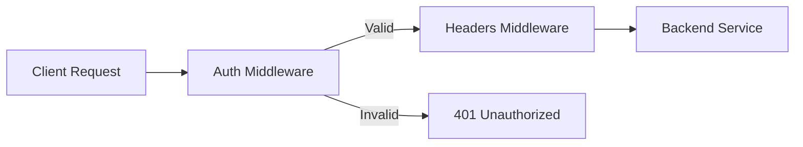

# How to Implement Authentication Middleware in Traefik

Author: [nawazdhandala](https://www.github.com/nawazdhandala)

Tags: Traefik, Authentication, Middleware, Security, DevOps

Description: Learn how to add authentication to your Traefik routes using Basic Auth, Digest Auth, and custom authentication middleware for securing your services.

---

Adding authentication to your services should not require application code changes. Traefik's middleware system lets you enforce authentication at the proxy layer, protecting services without modifying them. This approach works especially well for internal tools, admin panels, and APIs that need an extra security layer.

In this guide, we will implement several authentication methods in Traefik: Basic Auth, Digest Auth, and integration with external authentication services.

## Understanding Traefik Middleware

Middleware in Traefik intercepts requests before they reach your backend services. You can chain multiple middlewares together to build complex request processing pipelines. Authentication middleware validates credentials and either allows the request to proceed or returns an error response.



## Basic Authentication

Basic Auth is the simplest form of HTTP authentication. The browser prompts for username and password, which are sent in the Authorization header (base64 encoded).

### Step 1: Generate Password Hashes

Traefik requires passwords in htpasswd format. Use the htpasswd utility or an online generator:

```bash
# Install htpasswd (part of apache2-utils on Debian/Ubuntu)
sudo apt-get install apache2-utils

# Generate a password hash for user "admin"
# The -nb flag outputs to stdout, -B uses bcrypt
htpasswd -nbB admin "your-secure-password"
# Output: admin:$2y$05$...

# For multiple users, create a file
htpasswd -cB users.htpasswd admin
htpasswd -B users.htpasswd developer
```

### Step 2: Create a Secret

Store credentials in a Kubernetes Secret:

```yaml
# basic-auth-secret.yaml
apiVersion: v1
kind: Secret
metadata:
  name: basic-auth-credentials
  namespace: default
type: Opaque
stringData:
  # Format: username:password-hash
  # Multiple users separated by newlines
  users: |
    admin:$2y$05$WRHb7C3kQsKGbPmKxLrDpOQJPXI.txjGRNHcU7WG3zIgmJPvjLCOi
    developer:$2y$05$8RqW3.xSfE0PvZGNxVSROef3xT1HJcE5kdfNBfL.4KVQZ/nBcNhSe
```

Apply the secret:

```bash
# Create the secret containing user credentials
kubectl apply -f basic-auth-secret.yaml
```

### Step 3: Create the BasicAuth Middleware

```yaml
# basic-auth-middleware.yaml
apiVersion: traefik.io/v1alpha1
kind: Middleware
metadata:
  name: basic-auth
  namespace: default
spec:
  basicAuth:
    # Reference the secret containing credentials
    secret: basic-auth-credentials
    # Remove Authorization header before forwarding (optional)
    removeHeader: true
    # Custom realm shown in browser prompt
    realm: "Protected Area"
```

### Step 4: Apply Middleware to Routes

Attach the middleware to your IngressRoute:

```yaml
# protected-route.yaml
apiVersion: traefik.io/v1alpha1
kind: IngressRoute
metadata:
  name: admin-panel
  namespace: default
spec:
  entryPoints:
    - websecure
  routes:
    - match: Host(`admin.example.com`)
      kind: Rule
      middlewares:
        - name: basic-auth  # Apply the authentication middleware
      services:
        - name: admin-service
          port: 80
  tls: {}  # Enable TLS - critical for Basic Auth
```

Always use TLS with Basic Auth. Without it, credentials are transmitted in plain text.

## Digest Authentication

Digest Auth is more secure than Basic Auth because it does not send passwords over the wire. Instead, it uses a challenge-response mechanism.

```yaml
# digest-auth-middleware.yaml
apiVersion: traefik.io/v1alpha1
kind: Middleware
metadata:
  name: digest-auth
  namespace: default
spec:
  digestAuth:
    secret: digest-auth-credentials
    realm: "Secure Zone"
    # Remove header after authentication
    removeHeader: true
```

The secret format for Digest Auth differs from Basic Auth:

```yaml
# digest-auth-secret.yaml
apiVersion: v1
kind: Secret
metadata:
  name: digest-auth-credentials
  namespace: default
type: Opaque
stringData:
  # Format: username:realm:MD5(username:realm:password)
  users: |
    admin:Secure Zone:a94a8fe5ccb19ba61c4c0873d391e987
```

Generate the hash with:

```bash
# Generate MD5 hash for Digest Auth
# Format: username:realm:password
echo -n "admin:Secure Zone:password123" | md5sum
```

## Combining Multiple Middlewares

You can chain middlewares for layered security. For example, add rate limiting after authentication:

```yaml
# chained-middlewares.yaml
apiVersion: traefik.io/v1alpha1
kind: Middleware
metadata:
  name: rate-limit
  namespace: default
spec:
  rateLimit:
    average: 100
    burst: 50
---
apiVersion: traefik.io/v1alpha1
kind: IngressRoute
metadata:
  name: api-with-auth-and-limits
  namespace: default
spec:
  entryPoints:
    - websecure
  routes:
    - match: Host(`api.example.com`)
      kind: Rule
      middlewares:
        # Middlewares execute in order
        - name: basic-auth      # First: authenticate
        - name: rate-limit      # Then: apply rate limits
      services:
        - name: api-service
          port: 8080
  tls: {}
```

## User Information Headers

After authentication, you may want to pass user information to your backend. Traefik can add headers with the authenticated username:

```yaml
# auth-with-headers.yaml
apiVersion: traefik.io/v1alpha1
kind: Middleware
metadata:
  name: basic-auth-with-headers
  namespace: default
spec:
  basicAuth:
    secret: basic-auth-credentials
    # Header name that will contain the authenticated username
    headerField: X-Authenticated-User
```

Your backend service will receive the `X-Authenticated-User` header containing the username that passed authentication.

## Per-Route Authentication

Different routes may need different authentication levels. Create multiple middleware definitions:

```yaml
# multi-level-auth.yaml
# Admin-level auth with strict credentials
apiVersion: traefik.io/v1alpha1
kind: Middleware
metadata:
  name: admin-auth
  namespace: default
spec:
  basicAuth:
    secret: admin-credentials
---
# Developer-level auth with broader access
apiVersion: traefik.io/v1alpha1
kind: Middleware
metadata:
  name: dev-auth
  namespace: default
spec:
  basicAuth:
    secret: developer-credentials
---
apiVersion: traefik.io/v1alpha1
kind: IngressRoute
metadata:
  name: tiered-access
  namespace: default
spec:
  entryPoints:
    - websecure
  routes:
    # Admin routes require admin credentials
    - match: Host(`app.example.com`) && PathPrefix(`/admin`)
      kind: Rule
      middlewares:
        - name: admin-auth
      services:
        - name: admin-service
          port: 80
    # API routes accept developer credentials
    - match: Host(`app.example.com`) && PathPrefix(`/api`)
      kind: Rule
      middlewares:
        - name: dev-auth
      services:
        - name: api-service
          port: 8080
    # Public routes have no authentication
    - match: Host(`app.example.com`)
      kind: Rule
      services:
        - name: public-service
          port: 80
  tls: {}
```

## Testing Your Configuration

Verify authentication is working correctly:

```bash
# Test without credentials - should return 401
curl -v https://admin.example.com/

# Test with valid credentials - should return 200
curl -u admin:your-secure-password https://admin.example.com/

# Test with invalid credentials - should return 401
curl -u admin:wrong-password https://admin.example.com/

# Check that user header is passed to backend
curl -u admin:your-secure-password -v https://api.example.com/ 2>&1 | grep X-Authenticated-User
```

## Security Best Practices

1. **Always use TLS**: Basic Auth credentials are base64 encoded, not encrypted
2. **Use strong passwords**: Minimum 16 characters with mixed case, numbers, and symbols
3. **Rotate credentials regularly**: Update secrets and redeploy middlewares
4. **Limit authentication scope**: Apply auth only where needed
5. **Monitor failed attempts**: Check Traefik access logs for repeated 401 responses
6. **Consider Forward Auth**: For complex authentication needs, use an external auth service

## Troubleshooting

**401 after entering correct credentials**: Check that the password hash format matches what Traefik expects. Bcrypt hashes must start with `$2y$`.

**Middleware not applied**: Verify the middleware name matches exactly in the IngressRoute reference and both resources are in the same namespace.

**Credentials not working after Secret update**: Traefik watches Secrets automatically, but you may need to restart pods if using mounted volumes.

---

Traefik middleware provides a clean separation between authentication and application logic. Your services remain focused on their core functionality while Traefik handles credential verification at the edge. Start with Basic Auth for internal tools and consider Forward Auth for production applications requiring integration with identity providers.
