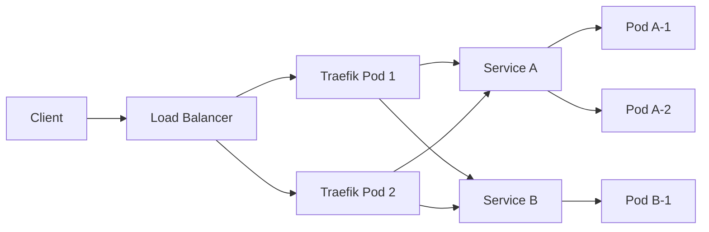

# How to Configure Traefik as Kubernetes Ingress

Author: [nawazdhandala](https://www.github.com/nawazdhandala)

Tags: Traefik, Kubernetes, Ingress, DevOps, Load Balancing

Description: Learn how to deploy and configure Traefik as an Ingress Controller in Kubernetes, including routing rules, TLS termination, and automatic service discovery.

---

Traefik has become one of the most popular Ingress controllers for Kubernetes, and for good reason. It offers automatic service discovery, dynamic configuration, and a clean dashboard for monitoring your routes. Unlike traditional reverse proxies that require manual configuration updates, Traefik watches Kubernetes resources and updates its routing table automatically.

In this guide, we will walk through deploying Traefik as a Kubernetes Ingress controller from scratch.

## Why Traefik for Kubernetes?

Before diving into the configuration, let's understand what makes Traefik a solid choice:

- **Automatic service discovery**: Traefik watches Kubernetes API for changes and updates routes without restarts
- **Native Kubernetes support**: Uses Custom Resource Definitions (CRDs) for advanced routing
- **Built-in dashboard**: Visual overview of routes, services, and middlewares
- **Let's Encrypt integration**: Automatic TLS certificate management
- **Middleware support**: Add authentication, rate limiting, and headers without application changes

## Prerequisites

You will need a running Kubernetes cluster (version 1.19 or later) and kubectl configured to communicate with it. Helm 3 is optional but recommended for easier installation.

## Step 1: Create a Namespace for Traefik

Keeping Traefik in its own namespace helps with organization and RBAC policies.

```yaml
# traefik-namespace.yaml
# Create a dedicated namespace for Traefik components
apiVersion: v1
kind: Namespace
metadata:
  name: traefik
  labels:
    app.kubernetes.io/name: traefik
```

Apply the namespace:

```bash
# Create the traefik namespace
kubectl apply -f traefik-namespace.yaml
```

## Step 2: Set Up RBAC Permissions

Traefik needs permissions to watch and read Kubernetes resources. Create a ServiceAccount, ClusterRole, and ClusterRoleBinding.

```yaml
# traefik-rbac.yaml
# ServiceAccount for Traefik pods
apiVersion: v1
kind: ServiceAccount
metadata:
  name: traefik-ingress-controller
  namespace: traefik
---
# ClusterRole defines what resources Traefik can access
apiVersion: rbac.authorization.k8s.io/v1
kind: ClusterRole
metadata:
  name: traefik-ingress-controller
rules:
  # Core resources for service discovery
  - apiGroups:
      - ""
    resources:
      - services
      - endpoints
      - secrets
    verbs:
      - get
      - list
      - watch
  # Ingress resources for routing configuration
  - apiGroups:
      - networking.k8s.io
    resources:
      - ingresses
      - ingressclasses
    verbs:
      - get
      - list
      - watch
  # Allow updating ingress status
  - apiGroups:
      - networking.k8s.io
    resources:
      - ingresses/status
    verbs:
      - update
  # Traefik CRDs for advanced routing
  - apiGroups:
      - traefik.io
    resources:
      - middlewares
      - middlewaretcps
      - ingressroutes
      - traefikservices
      - ingressroutetcps
      - ingressrouteudps
      - tlsoptions
      - tlsstores
      - serverstransports
    verbs:
      - get
      - list
      - watch
---
# Bind the ClusterRole to the ServiceAccount
apiVersion: rbac.authorization.k8s.io/v1
kind: ClusterRoleBinding
metadata:
  name: traefik-ingress-controller
roleRef:
  apiGroup: rbac.authorization.k8s.io
  kind: ClusterRole
  name: traefik-ingress-controller
subjects:
  - kind: ServiceAccount
    name: traefik-ingress-controller
    namespace: traefik
```

Apply the RBAC configuration:

```bash
# Set up permissions for Traefik
kubectl apply -f traefik-rbac.yaml
```

## Step 3: Install Traefik CRDs

Traefik uses Custom Resource Definitions for IngressRoute and Middleware configurations. Install them before deploying Traefik.

```bash
# Install Traefik CRDs from the official repository
kubectl apply -f https://raw.githubusercontent.com/traefik/traefik/v3.0/docs/content/reference/dynamic-configuration/kubernetes-crd-definition-v1.yml
```

## Step 4: Deploy Traefik

Now create the Traefik Deployment and Service. This configuration exposes both HTTP (80) and HTTPS (443) entrypoints.

```yaml
# traefik-deployment.yaml
apiVersion: apps/v1
kind: Deployment
metadata:
  name: traefik
  namespace: traefik
  labels:
    app: traefik
spec:
  replicas: 2  # Run multiple replicas for high availability
  selector:
    matchLabels:
      app: traefik
  template:
    metadata:
      labels:
        app: traefik
    spec:
      serviceAccountName: traefik-ingress-controller
      containers:
        - name: traefik
          image: traefik:v3.0
          args:
            # Enable Kubernetes provider for service discovery
            - --providers.kubernetescrd
            - --providers.kubernetesingress
            # Define entrypoints for HTTP and HTTPS traffic
            - --entrypoints.web.address=:80
            - --entrypoints.websecure.address=:443
            # Enable the dashboard (accessible via port-forward)
            - --api.dashboard=true
            - --api.insecure=true
            # Log level for debugging
            - --log.level=INFO
          ports:
            - name: web
              containerPort: 80
            - name: websecure
              containerPort: 443
            - name: dashboard
              containerPort: 8080
          # Resource limits prevent runaway memory usage
          resources:
            requests:
              cpu: 100m
              memory: 128Mi
            limits:
              cpu: 500m
              memory: 256Mi
          # Liveness probe ensures unhealthy pods get restarted
          livenessProbe:
            httpGet:
              path: /ping
              port: 8080
            initialDelaySeconds: 10
            periodSeconds: 10
          # Readiness probe controls traffic routing
          readinessProbe:
            httpGet:
              path: /ping
              port: 8080
            initialDelaySeconds: 5
            periodSeconds: 5
```

Create a Service to expose Traefik:

```yaml
# traefik-service.yaml
apiVersion: v1
kind: Service
metadata:
  name: traefik
  namespace: traefik
spec:
  type: LoadBalancer  # Use NodePort if LoadBalancer is unavailable
  selector:
    app: traefik
  ports:
    - name: web
      port: 80
      targetPort: 80
    - name: websecure
      port: 443
      targetPort: 443
```

Deploy both resources:

```bash
# Deploy Traefik Deployment and Service
kubectl apply -f traefik-deployment.yaml
kubectl apply -f traefik-service.yaml
```

## Step 5: Create an IngressRoute

With Traefik running, let's route traffic to a sample application. The IngressRoute CRD provides more flexibility than standard Kubernetes Ingress.

```yaml
# sample-app-ingress.yaml
apiVersion: traefik.io/v1alpha1
kind: IngressRoute
metadata:
  name: sample-app
  namespace: default
spec:
  entryPoints:
    - web  # Listen on HTTP entrypoint
  routes:
    - match: Host(`app.example.com`)  # Route based on hostname
      kind: Rule
      services:
        - name: sample-app  # Target service name
          port: 80          # Target service port
```

For path-based routing, modify the match rule:

```yaml
# Path-based routing example
apiVersion: traefik.io/v1alpha1
kind: IngressRoute
metadata:
  name: api-routes
  namespace: default
spec:
  entryPoints:
    - web
  routes:
    # Route /api requests to the API service
    - match: Host(`example.com`) && PathPrefix(`/api`)
      kind: Rule
      services:
        - name: api-service
          port: 8080
    # Route everything else to the frontend
    - match: Host(`example.com`)
      kind: Rule
      services:
        - name: frontend-service
          port: 3000
```

## Step 6: Verify the Setup

Check that Traefik pods are running and routes are registered:

```bash
# Verify Traefik pods are healthy
kubectl get pods -n traefik

# Check the IngressRoute was created
kubectl get ingressroutes -A

# Access the dashboard via port-forward
kubectl port-forward -n traefik deployment/traefik 9000:8080
```

Open http://localhost:9000/dashboard/ in your browser to see the Traefik dashboard showing all configured routes.

## Architecture Overview

Here is how traffic flows through the Traefik Ingress setup:



## Troubleshooting Common Issues

**Pods not receiving traffic**: Check that the Service selector matches your pod labels and the IngressRoute references the correct service name.

**404 errors**: Verify the Host header matches your IngressRoute match rule. Use curl with `-H "Host: app.example.com"` to test.

**Traefik not discovering services**: Confirm RBAC permissions are correct and Traefik has access to the namespace where your services run.

## Production Recommendations

1. **Enable TLS**: Configure Let's Encrypt for automatic certificate management
2. **Set resource limits**: Prevent Traefik from consuming excessive cluster resources
3. **Use multiple replicas**: Run at least 2 Traefik pods for high availability
4. **Monitor metrics**: Export Prometheus metrics for observability
5. **Enable access logs**: Track requests for debugging and auditing

---

Traefik simplifies Kubernetes ingress management by automatically discovering services and updating routes. Once configured, you rarely need to touch the Traefik deployment itself. Just create IngressRoutes alongside your applications, and Traefik handles the rest.
