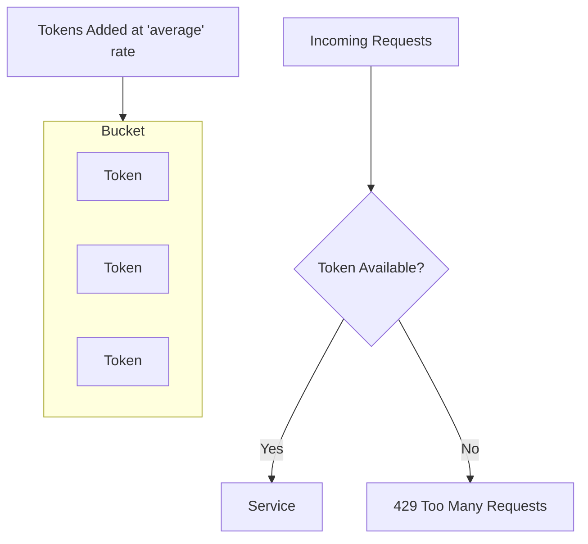

# How to Implement Rate Limiting in Traefik

Author: [nawazdhandala](https://www.github.com/nawazdhandala)

Tags: Traefik, Rate Limiting, API Gateway, Security, Traffic Management

Description: Configure rate limiting middleware in Traefik to protect your services from abuse, implement fair usage policies, and prevent resource exhaustion.

---

Rate limiting protects your services from being overwhelmed by too many requests. Whether it is a misbehaving client, a DDoS attack, or simply enforcing API quotas, Traefik's rate limiting middleware gives you control over traffic flow without changing application code.

This guide covers configuring rate limits in Traefik, from basic setup to advanced patterns like per-user limits and burst handling.

## How Traefik Rate Limiting Works

Traefik uses a token bucket algorithm for rate limiting. Think of it as a bucket that holds tokens:

- Tokens are added at a constant rate (the `average` parameter)
- Each request consumes one token
- Requests without available tokens get rejected (HTTP 429)
- The bucket has a maximum capacity (the `burst` parameter)



## Basic Rate Limit Configuration

Create a middleware that limits requests to 100 per second with a burst capacity of 50:

```yaml
# rate-limit-middleware.yaml
apiVersion: traefik.io/v1alpha1
kind: Middleware
metadata:
  name: rate-limit
  namespace: default
spec:
  rateLimit:
    # Average requests per second allowed
    average: 100
    # Maximum burst above the average
    burst: 50
```

Apply the middleware to a route:

```yaml
# rate-limited-route.yaml
apiVersion: traefik.io/v1alpha1
kind: IngressRoute
metadata:
  name: api
  namespace: default
spec:
  entryPoints:
    - websecure
  routes:
    - match: Host(`api.example.com`)
      kind: Rule
      middlewares:
        - name: rate-limit
      services:
        - name: api-service
          port: 8080
  tls: {}
```

## Understanding Average and Burst

The relationship between `average` and `burst` determines how traffic is shaped:

- **average: 100, burst: 50**: Sustained rate of 100/s, can handle short spikes up to 150/s
- **average: 10, burst: 100**: Low sustained rate but tolerant of occasional traffic bursts
- **average: 100, burst: 1**: Strict limiting, no bursting allowed

```yaml
# Examples for different use cases

# API with consistent traffic pattern
apiVersion: traefik.io/v1alpha1
kind: Middleware
metadata:
  name: api-rate-limit
  namespace: default
spec:
  rateLimit:
    average: 100   # 100 requests per second baseline
    burst: 50      # Allow brief spikes to 150/s

---
# Login endpoint - stricter to prevent brute force
apiVersion: traefik.io/v1alpha1
kind: Middleware
metadata:
  name: login-rate-limit
  namespace: default
spec:
  rateLimit:
    average: 5     # Only 5 attempts per second
    burst: 10      # Small burst allowance

---
# Webhook receiver - handle occasional large batches
apiVersion: traefik.io/v1alpha1
kind: Middleware
metadata:
  name: webhook-rate-limit
  namespace: default
spec:
  rateLimit:
    average: 10    # Low baseline
    burst: 200     # Accept large webhook batches
```

## Rate Limiting by Source IP

By default, Traefik applies a single rate limit across all clients. To limit per client IP:

```yaml
# ip-based-rate-limit.yaml
apiVersion: traefik.io/v1alpha1
kind: Middleware
metadata:
  name: per-ip-rate-limit
  namespace: default
spec:
  rateLimit:
    average: 50
    burst: 100
    # Extract client identifier from request
    sourceCriterion:
      ipStrategy:
        # Depth determines which IP in X-Forwarded-For to use
        # depth: 0 uses the immediate client IP
        depth: 0
```

When behind a load balancer or CDN, adjust the depth:

```yaml
# rate-limit-behind-proxy.yaml
apiVersion: traefik.io/v1alpha1
kind: Middleware
metadata:
  name: rate-limit-with-proxy
  namespace: default
spec:
  rateLimit:
    average: 50
    burst: 100
    sourceCriterion:
      ipStrategy:
        # depth: 1 skips the first IP (load balancer)
        # and uses the actual client IP
        depth: 1
        # Or exclude specific trusted proxy IPs
        excludedIPs:
          - 10.0.0.0/8
          - 172.16.0.0/12
```

## Rate Limiting by Header

For API key-based limiting, extract the identifier from a header:

```yaml
# header-based-rate-limit.yaml
apiVersion: traefik.io/v1alpha1
kind: Middleware
metadata:
  name: apikey-rate-limit
  namespace: default
spec:
  rateLimit:
    average: 1000
    burst: 500
    sourceCriterion:
      # Use X-API-Key header as the rate limit key
      requestHeaderName: X-API-Key
```

This creates separate rate limit buckets for each unique API key value.

## Combining Rate Limits with Request Headers

Extract identifiers from requests using header matching:

```yaml
# combined-rate-limit.yaml
apiVersion: traefik.io/v1alpha1
kind: Middleware
metadata:
  name: user-rate-limit
  namespace: default
spec:
  rateLimit:
    average: 100
    burst: 200
    sourceCriterion:
      # Use authenticated user ID from header
      requestHeaderName: X-User-ID
```

Your authentication layer should set the X-User-ID header before the rate limit middleware runs.

## Different Limits for Different Routes

Apply varying limits based on the endpoint:

```yaml
# tiered-rate-limits.yaml
# Strict limit for expensive operations
apiVersion: traefik.io/v1alpha1
kind: Middleware
metadata:
  name: search-rate-limit
  namespace: default
spec:
  rateLimit:
    average: 10
    burst: 20
---
# Relaxed limit for read operations
apiVersion: traefik.io/v1alpha1
kind: Middleware
metadata:
  name: read-rate-limit
  namespace: default
spec:
  rateLimit:
    average: 500
    burst: 1000
---
apiVersion: traefik.io/v1alpha1
kind: IngressRoute
metadata:
  name: api-routes
  namespace: default
spec:
  entryPoints:
    - websecure
  routes:
    # Search endpoint has strict limits
    - match: Host(`api.example.com`) && PathPrefix(`/search`)
      kind: Rule
      middlewares:
        - name: search-rate-limit
      services:
        - name: search-service
          port: 8080
    # General API has relaxed limits
    - match: Host(`api.example.com`) && PathPrefix(`/api`)
      kind: Rule
      middlewares:
        - name: read-rate-limit
      services:
        - name: api-service
          port: 8080
  tls: {}
```

## Handling Rate Limit Period

Traefik 3.0 introduced the `period` parameter for more precise control:

```yaml
# period-based-rate-limit.yaml
apiVersion: traefik.io/v1alpha1
kind: Middleware
metadata:
  name: minute-rate-limit
  namespace: default
spec:
  rateLimit:
    # 1000 requests per minute instead of per second
    average: 1000
    period: 1m
    burst: 100
```

This allows rate limits like "1000 requests per minute" rather than translating to requests per second.

## Customizing the 429 Response

When rate limited, clients receive HTTP 429 Too Many Requests. You can add headers to help clients understand the limit:

```yaml
# rate-limit-with-headers.yaml
apiVersion: traefik.io/v1alpha1
kind: Middleware
metadata:
  name: rate-limit-headers
  namespace: default
spec:
  headers:
    customResponseHeaders:
      # Inform clients of rate limit policy
      X-RateLimit-Limit: "100"
      Retry-After: "60"
---
apiVersion: traefik.io/v1alpha1
kind: Middleware
metadata:
  name: rate-limit
  namespace: default
spec:
  rateLimit:
    average: 100
    burst: 50
```

Chain both middlewares on your route to include headers with 429 responses.

## Monitoring Rate Limits

Track rate limiting effectiveness using Traefik metrics:

```bash
# Enable Prometheus metrics in Traefik config
# Then query for rate limit info
curl http://traefik:8080/metrics | grep ratelimit
```

Key metrics to monitor:
- `traefik_entrypoint_requests_total`: Total requests
- `traefik_middleware_rate_limit_total`: Requests handled by rate limiter
- Custom application metrics for 429 responses

## Testing Rate Limits

Verify your configuration works as expected:

```bash
# Send rapid requests to trigger rate limiting
for i in {1..200}; do
  curl -s -o /dev/null -w "%{http_code}\n" https://api.example.com/test
done | sort | uniq -c

# Expected output shows mix of 200 and 429 responses
# 150 200
#  50 429

# Test with specific header
for i in {1..100}; do
  curl -s -o /dev/null -w "%{http_code}\n" \
    -H "X-API-Key: test-key-123" \
    https://api.example.com/test
done
```

## Production Recommendations

1. **Start conservative**: Begin with higher limits and tighten based on actual traffic patterns
2. **Monitor before enforcing**: Use metrics to understand normal traffic before setting limits
3. **Provide client guidance**: Include Retry-After headers so clients can back off gracefully
4. **Separate concerns**: Use different rate limits for authentication, API, and static content
5. **Plan for legitimate bursts**: Set burst high enough for normal usage spikes
6. **Document limits**: Publish rate limit policies in your API documentation

---

Rate limiting is your first line of defense against traffic surges and abuse. Traefik makes it straightforward to implement limits at the proxy layer, protecting your services without requiring application changes. Start with generous limits, monitor the results, and adjust based on real usage patterns.
