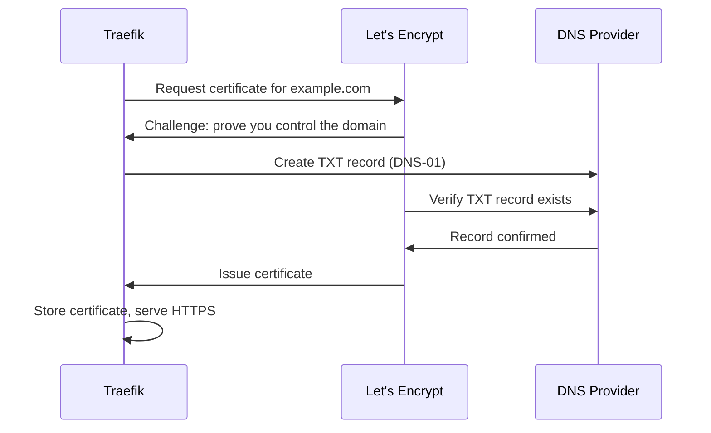

# How to Configure SSL/TLS with Let's Encrypt in Traefik

Author: [nawazdhandala](https://www.github.com/nawazdhandala)

Tags: Traefik, SSL, TLS, Let's Encrypt, Security, HTTPS

Description: Set up automatic SSL/TLS certificate management in Traefik using Let's Encrypt, including HTTP and DNS challenges, certificate storage, and production best practices.

---

Manual SSL certificate management is tedious and error-prone. Certificates expire, renewals get forgotten, and suddenly your site shows security warnings. Traefik solves this by integrating directly with Let's Encrypt for automatic certificate provisioning and renewal.

This guide covers setting up Let's Encrypt with Traefik, including both HTTP-01 and DNS-01 challenges, persistent storage for certificates, and production configuration.

## How Let's Encrypt Works with Traefik

Let's Encrypt validates that you control a domain before issuing certificates. Traefik handles this validation automatically using one of two challenge types:

- **HTTP-01**: Let's Encrypt makes an HTTP request to your domain. Traefik responds with a token proving control.
- **DNS-01**: Traefik creates a DNS TXT record proving domain ownership. Required for wildcard certificates.



## HTTP-01 Challenge Configuration

The HTTP-01 challenge is simpler to set up but requires port 80 to be accessible from the internet.

### Step 1: Configure Traefik Static Configuration

Create a ConfigMap with Traefik's static configuration:

```yaml
# traefik-configmap.yaml
apiVersion: v1
kind: ConfigMap
metadata:
  name: traefik-config
  namespace: traefik
data:
  traefik.yaml: |
    # Entrypoints define the ports Traefik listens on
    entryPoints:
      web:
        address: ":80"
        # Redirect all HTTP to HTTPS
        http:
          redirections:
            entryPoint:
              to: websecure
              scheme: https
      websecure:
        address: ":443"

    # Certificate resolvers handle Let's Encrypt integration
    certificatesResolvers:
      letsencrypt:
        acme:
          # Email for certificate expiration notifications
          email: admin@example.com
          # Use staging for testing to avoid rate limits
          # Production: https://acme-v02.api.letsencrypt.org/directory
          caServer: https://acme-staging-v02.api.letsencrypt.org/directory
          # Storage location for certificates and account key
          storage: /data/acme.json
          # Use HTTP-01 challenge
          httpChallenge:
            entryPoint: web

    # Enable Kubernetes providers
    providers:
      kubernetesCRD: {}
      kubernetesIngress: {}
```

### Step 2: Create Persistent Storage

Certificates must persist across pod restarts. Create a PersistentVolumeClaim:

```yaml
# traefik-pvc.yaml
apiVersion: v1
kind: PersistentVolumeClaim
metadata:
  name: traefik-certificates
  namespace: traefik
spec:
  accessModes:
    - ReadWriteOnce
  resources:
    requests:
      storage: 1Gi
  # Specify storage class if needed
  # storageClassName: standard
```

### Step 3: Update the Traefik Deployment

Mount the ConfigMap and PVC in your Traefik deployment:

```yaml
# traefik-deployment-tls.yaml
apiVersion: apps/v1
kind: Deployment
metadata:
  name: traefik
  namespace: traefik
spec:
  replicas: 1  # Must be 1 when using file-based storage
  selector:
    matchLabels:
      app: traefik
  template:
    metadata:
      labels:
        app: traefik
    spec:
      serviceAccountName: traefik-ingress-controller
      containers:
        - name: traefik
          image: traefik:v3.0
          args:
            # Load configuration from file
            - --configFile=/config/traefik.yaml
          ports:
            - name: web
              containerPort: 80
            - name: websecure
              containerPort: 443
          volumeMounts:
            # Mount the static configuration
            - name: config
              mountPath: /config
              readOnly: true
            # Mount persistent storage for certificates
            - name: certificates
              mountPath: /data
          resources:
            requests:
              cpu: 100m
              memory: 128Mi
            limits:
              cpu: 500m
              memory: 256Mi
      volumes:
        - name: config
          configMap:
            name: traefik-config
        - name: certificates
          persistentVolumeClaim:
            claimName: traefik-certificates
```

### Step 4: Create an IngressRoute with TLS

Tell Traefik to obtain a certificate for your route:

```yaml
# secure-ingress.yaml
apiVersion: traefik.io/v1alpha1
kind: IngressRoute
metadata:
  name: secure-app
  namespace: default
spec:
  entryPoints:
    - websecure
  routes:
    - match: Host(`app.example.com`)
      kind: Rule
      services:
        - name: my-app
          port: 80
  tls:
    # Use the Let's Encrypt resolver we configured
    certResolver: letsencrypt
```

## DNS-01 Challenge for Wildcard Certificates

Wildcard certificates (*.example.com) require DNS-01 validation. This involves creating a TXT record, which Traefik can do automatically if you provide DNS provider credentials.

### Step 1: Create DNS Provider Secret

Each DNS provider has different credential requirements. Here is an example for Cloudflare:

```yaml
# cloudflare-credentials.yaml
apiVersion: v1
kind: Secret
metadata:
  name: cloudflare-credentials
  namespace: traefik
type: Opaque
stringData:
  # Use API Token (recommended) or Global API Key
  CF_API_EMAIL: your-email@example.com
  CF_API_KEY: your-cloudflare-api-key
```

### Step 2: Configure DNS Challenge

Update the Traefik configuration:

```yaml
# traefik-dns-config.yaml
apiVersion: v1
kind: ConfigMap
metadata:
  name: traefik-config
  namespace: traefik
data:
  traefik.yaml: |
    entryPoints:
      web:
        address: ":80"
        http:
          redirections:
            entryPoint:
              to: websecure
              scheme: https
      websecure:
        address: ":443"

    certificatesResolvers:
      letsencrypt-dns:
        acme:
          email: admin@example.com
          storage: /data/acme.json
          caServer: https://acme-v02.api.letsencrypt.org/directory
          dnsChallenge:
            # Cloudflare DNS provider
            provider: cloudflare
            # Wait for DNS propagation before validation
            delayBeforeCheck: 30s
            resolvers:
              - "1.1.1.1:53"
              - "8.8.8.8:53"

    providers:
      kubernetesCRD: {}
```

### Step 3: Pass Environment Variables to Traefik

Update the Deployment to include DNS credentials:

```yaml
# traefik-dns-deployment.yaml
apiVersion: apps/v1
kind: Deployment
metadata:
  name: traefik
  namespace: traefik
spec:
  replicas: 1
  selector:
    matchLabels:
      app: traefik
  template:
    metadata:
      labels:
        app: traefik
    spec:
      serviceAccountName: traefik-ingress-controller
      containers:
        - name: traefik
          image: traefik:v3.0
          args:
            - --configFile=/config/traefik.yaml
          # DNS provider credentials from secret
          envFrom:
            - secretRef:
                name: cloudflare-credentials
          ports:
            - name: web
              containerPort: 80
            - name: websecure
              containerPort: 443
          volumeMounts:
            - name: config
              mountPath: /config
              readOnly: true
            - name: certificates
              mountPath: /data
      volumes:
        - name: config
          configMap:
            name: traefik-config
        - name: certificates
          persistentVolumeClaim:
            claimName: traefik-certificates
```

### Step 4: Request Wildcard Certificate

```yaml
# wildcard-ingress.yaml
apiVersion: traefik.io/v1alpha1
kind: IngressRoute
metadata:
  name: wildcard-routes
  namespace: default
spec:
  entryPoints:
    - websecure
  routes:
    - match: Host(`api.example.com`)
      kind: Rule
      services:
        - name: api-service
          port: 8080
    - match: Host(`admin.example.com`)
      kind: Rule
      services:
        - name: admin-service
          port: 80
  tls:
    certResolver: letsencrypt-dns
    domains:
      # Request wildcard certificate
      - main: example.com
        sans:
          - "*.example.com"
```

## TLS Options and Security Hardening

Configure TLS versions and cipher suites for security compliance:

```yaml
# tls-options.yaml
apiVersion: traefik.io/v1alpha1
kind: TLSOption
metadata:
  name: secure
  namespace: default
spec:
  # Minimum TLS version (1.2 or 1.3 recommended)
  minVersion: VersionTLS12
  # Allowed cipher suites - modern and secure
  cipherSuites:
    - TLS_ECDHE_RSA_WITH_AES_256_GCM_SHA384
    - TLS_ECDHE_RSA_WITH_CHACHA20_POLY1305
    - TLS_ECDHE_RSA_WITH_AES_128_GCM_SHA256
  # Prefer server cipher suite order
  preferServerCipherSuites: true
  # Enable ALPN for HTTP/2
  alpnProtocols:
    - h2
    - http/1.1
```

Apply TLS options to a route:

```yaml
# route-with-tls-options.yaml
apiVersion: traefik.io/v1alpha1
kind: IngressRoute
metadata:
  name: hardened-app
  namespace: default
spec:
  entryPoints:
    - websecure
  routes:
    - match: Host(`secure.example.com`)
      kind: Rule
      services:
        - name: secure-app
          port: 443
  tls:
    certResolver: letsencrypt
    options:
      name: secure  # Reference the TLSOption
```

## Monitoring Certificate Status

Check certificate status and expiration:

```bash
# View the acme.json file (contains all certificates)
kubectl exec -n traefik deployment/traefik -- cat /data/acme.json | jq '.letsencrypt.Certificates'

# Check Traefik logs for certificate operations
kubectl logs -n traefik deployment/traefik | grep -i certificate

# Test TLS configuration
openssl s_client -connect app.example.com:443 -servername app.example.com
```

## Production Checklist

1. **Switch to production CA**: Remove or change the staging caServer URL
2. **Enable certificate storage**: Use PVC or distributed storage like Consul/etcd
3. **Set up monitoring**: Alert on certificate expiration (< 14 days)
4. **Configure redirects**: Force HTTPS on all routes
5. **Harden TLS**: Set minimum TLS 1.2, disable weak ciphers
6. **Test renewal**: Certificates renew at 30 days remaining

---

Let's Encrypt integration transforms certificate management from a manual chore into an automatic background process. Configure it once, and Traefik handles provisioning, renewal, and serving certificates without intervention.
