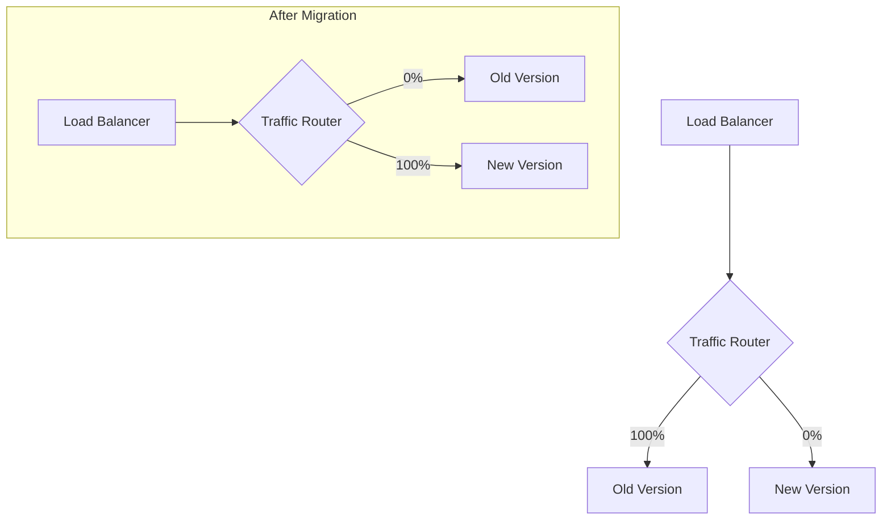

# How to Migrate Traffic Without Downtime in Node.js

Author: [nawazdhandala](https://www.github.com/nawazdhandala)

Tags: Node.js, Traffic Migration, Zero Downtime, DevOps, Deployment, Blue-Green

Description: A practical guide to migrating traffic between service versions in Node.js without downtime, covering blue-green deployments, canary releases, and gradual traffic shifting strategies.

---

> Deploying new versions without disrupting users is a critical skill for production systems. Traffic migration techniques let you shift users gradually, validate new versions in production, and roll back instantly if problems arise.

Whether you are replacing a legacy service, updating an API version, or deploying a major refactor, zero-downtime migration is essential. This guide shows you how to implement traffic migration patterns in Node.js applications.

---

## Traffic Migration Strategies

There are several approaches to migrating traffic between service versions.



Common strategies include:
1. **Blue-Green**: Switch all traffic at once between two identical environments
2. **Canary**: Route a small percentage to the new version, then gradually increase
3. **Feature Flags**: Control which version handles specific features or user segments

---

## Building a Traffic Router

Let's build a traffic router that can shift traffic between service versions.

```typescript
// traffic-router.ts
import express, { Request, Response, NextFunction } from 'express';
import { createProxyMiddleware, Options } from 'http-proxy-middleware';

interface ServiceVersion {
  name: string;
  url: string;
  weight: number;  // 0-100, percentage of traffic
  healthy: boolean;
}

interface RouterConfig {
  services: ServiceVersion[];
  stickySession: boolean;
  healthCheckInterval: number;
}

class TrafficRouter {
  private services: ServiceVersion[] = [];
  private stickySession: boolean;
  private sessionMap: Map<string, string> = new Map();
  private healthCheckTimer: NodeJS.Timeout | null = null;

  constructor(config: RouterConfig) {
    this.services = config.services;
    this.stickySession = config.stickySession;

    if (config.healthCheckInterval > 0) {
      this.startHealthChecks(config.healthCheckInterval);
    }
  }

  // Select a service version based on weights
  selectService(sessionId?: string): ServiceVersion | null {
    // Check for sticky session
    if (this.stickySession && sessionId) {
      const cached = this.sessionMap.get(sessionId);
      if (cached) {
        const service = this.services.find(s => s.name === cached && s.healthy);
        if (service) {
          return service;
        }
        // Clear stale session mapping
        this.sessionMap.delete(sessionId);
      }
    }

    // Filter to healthy services only
    const healthyServices = this.services.filter(s => s.healthy && s.weight > 0);

    if (healthyServices.length === 0) {
      return null;
    }

    // Weighted random selection
    const totalWeight = healthyServices.reduce((sum, s) => sum + s.weight, 0);
    let random = Math.random() * totalWeight;

    for (const service of healthyServices) {
      random -= service.weight;
      if (random <= 0) {
        // Cache for sticky sessions
        if (this.stickySession && sessionId) {
          this.sessionMap.set(sessionId, service.name);
        }
        return service;
      }
    }

    return healthyServices[0];
  }

  // Update traffic weights
  setWeights(weights: Record<string, number>): void {
    for (const service of this.services) {
      if (weights[service.name] !== undefined) {
        service.weight = Math.max(0, Math.min(100, weights[service.name]));
      }
    }

    // Normalize weights to sum to 100
    const total = this.services.reduce((sum, s) => sum + s.weight, 0);
    if (total > 0 && total !== 100) {
      for (const service of this.services) {
        service.weight = (service.weight / total) * 100;
      }
    }

    console.log('Updated traffic weights:', this.services.map(s => ({
      name: s.name,
      weight: s.weight.toFixed(1)
    })));
  }

  // Health check all services
  private async startHealthChecks(intervalMs: number): Promise<void> {
    const checkHealth = async () => {
      for (const service of this.services) {
        try {
          const response = await fetch(`${service.url}/health`, {
            method: 'GET',
            signal: AbortSignal.timeout(5000)
          });

          const wasHealthy = service.healthy;
          service.healthy = response.ok;

          if (wasHealthy !== service.healthy) {
            console.log(
              `Service ${service.name} health changed: ${service.healthy ? 'healthy' : 'unhealthy'}`
            );
          }
        } catch (error) {
          service.healthy = false;
          console.error(`Health check failed for ${service.name}:`, error);
        }
      }
    };

    // Initial check
    await checkHealth();

    // Periodic checks
    this.healthCheckTimer = setInterval(checkHealth, intervalMs);
  }

  // Get current status
  getStatus(): object {
    return {
      services: this.services.map(s => ({
        name: s.name,
        url: s.url,
        weight: s.weight,
        healthy: s.healthy
      })),
      totalSessions: this.sessionMap.size
    };
  }

  // Clean up
  stop(): void {
    if (this.healthCheckTimer) {
      clearInterval(this.healthCheckTimer);
    }
  }
}

export { TrafficRouter, RouterConfig, ServiceVersion };
```

---

## Express Proxy Server

Create an Express server that routes traffic based on weights.

```typescript
// proxy-server.ts
import express, { Request, Response, NextFunction } from 'express';
import { createProxyMiddleware } from 'http-proxy-middleware';
import { TrafficRouter } from './traffic-router';

const app = express();

// Initialize traffic router
const router = new TrafficRouter({
  services: [
    { name: 'v1', url: 'http://localhost:3001', weight: 100, healthy: true },
    { name: 'v2', url: 'http://localhost:3002', weight: 0, healthy: true }
  ],
  stickySession: true,
  healthCheckInterval: 10000
});

// Get session ID from request
function getSessionId(req: Request): string | undefined {
  // Try to get from cookie
  const sessionCookie = req.cookies?.sessionId;
  if (sessionCookie) return sessionCookie;

  // Try to get from header
  const sessionHeader = req.headers['x-session-id'];
  if (sessionHeader) return sessionHeader as string;

  // Fall back to IP address
  return req.ip;
}

// Dynamic proxy middleware
app.use('/api', (req: Request, res: Response, next: NextFunction) => {
  const sessionId = getSessionId(req);
  const service = router.selectService(sessionId);

  if (!service) {
    res.status(503).json({
      error: 'Service Unavailable',
      message: 'No healthy service instances available'
    });
    return;
  }

  // Add headers for debugging
  res.setHeader('X-Routed-To', service.name);

  // Create proxy for this request
  const proxy = createProxyMiddleware({
    target: service.url,
    changeOrigin: true,
    pathRewrite: { '^/api': '' },
    onError: (err, req, res) => {
      console.error(`Proxy error to ${service.name}:`, err);
      // Mark service as unhealthy
      service.healthy = false;

      // Try to failover
      const fallback = router.selectService();
      if (fallback && fallback.name !== service.name) {
        console.log(`Failing over to ${fallback.name}`);
        // Retry with different service
        createProxyMiddleware({
          target: fallback.url,
          changeOrigin: true
        })(req, res, next);
      } else {
        (res as Response).status(502).json({
          error: 'Bad Gateway',
          message: 'All upstream services are unavailable'
        });
      }
    }
  });

  proxy(req, res, next);
});

// Admin endpoints for traffic management
app.get('/admin/status', (req, res) => {
  res.json(router.getStatus());
});

// Shift traffic weights
app.post('/admin/weights', express.json(), (req: Request, res: Response) => {
  const { weights } = req.body;

  if (!weights || typeof weights !== 'object') {
    res.status(400).json({ error: 'Invalid weights object' });
    return;
  }

  router.setWeights(weights);
  res.json({
    message: 'Weights updated',
    status: router.getStatus()
  });
});

app.listen(3000, () => {
  console.log('Traffic router running on port 3000');
});
```

---

## Gradual Traffic Shifting

Implement automated gradual traffic shifting with rollback support.

```typescript
// gradual-migration.ts
import { TrafficRouter } from './traffic-router';

interface MigrationConfig {
  sourceService: string;
  targetService: string;
  steps: number[];         // Percentage at each step
  stepDuration: number;    // Time in ms between steps
  rollbackThreshold: number; // Error rate to trigger rollback
}

class GradualMigration {
  private router: TrafficRouter;
  private config: MigrationConfig;
  private currentStep: number = 0;
  private isRunning: boolean = false;
  private errorCounts: { source: number; target: number } = { source: 0, target: 0 };
  private requestCounts: { source: number; target: number } = { source: 0, target: 0 };

  constructor(router: TrafficRouter, config: MigrationConfig) {
    this.router = router;
    this.config = config;
  }

  // Start the gradual migration
  async start(): Promise<void> {
    if (this.isRunning) {
      console.log('Migration already in progress');
      return;
    }

    this.isRunning = true;
    this.currentStep = 0;
    console.log('Starting gradual migration');

    await this.runMigration();
  }

  // Run through migration steps
  private async runMigration(): Promise<void> {
    while (this.isRunning && this.currentStep < this.config.steps.length) {
      const targetWeight = this.config.steps[this.currentStep];
      const sourceWeight = 100 - targetWeight;

      console.log(`Migration step ${this.currentStep + 1}: ${targetWeight}% to target`);

      // Update weights
      this.router.setWeights({
        [this.config.sourceService]: sourceWeight,
        [this.config.targetService]: targetWeight
      });

      // Wait and monitor
      await this.waitAndMonitor();

      // Check if we should continue
      if (this.shouldRollback()) {
        await this.rollback();
        return;
      }

      this.currentStep++;
    }

    if (this.isRunning) {
      console.log('Migration completed successfully');
      this.isRunning = false;
    }
  }

  // Wait for step duration while monitoring errors
  private async waitAndMonitor(): Promise<void> {
    return new Promise((resolve) => {
      setTimeout(resolve, this.config.stepDuration);
    });
  }

  // Record request results for monitoring
  recordRequest(service: string, success: boolean): void {
    if (service === this.config.sourceService) {
      this.requestCounts.source++;
      if (!success) this.errorCounts.source++;
    } else if (service === this.config.targetService) {
      this.requestCounts.target++;
      if (!success) this.errorCounts.target++;
    }
  }

  // Check if error rate exceeds threshold
  private shouldRollback(): boolean {
    if (this.requestCounts.target === 0) {
      return false;
    }

    const errorRate = this.errorCounts.target / this.requestCounts.target;
    const shouldRollback = errorRate > this.config.rollbackThreshold;

    if (shouldRollback) {
      console.log(
        `Target error rate ${(errorRate * 100).toFixed(1)}% exceeds threshold ` +
        `${(this.config.rollbackThreshold * 100).toFixed(1)}%`
      );
    }

    return shouldRollback;
  }

  // Rollback to source
  private async rollback(): Promise<void> {
    console.log('Rolling back to source service');

    this.isRunning = false;
    this.router.setWeights({
      [this.config.sourceService]: 100,
      [this.config.targetService]: 0
    });

    console.log('Rollback complete');
  }

  // Manually stop migration
  stop(): void {
    this.isRunning = false;
    console.log('Migration stopped manually');
  }

  // Get migration status
  getStatus(): object {
    const targetErrorRate = this.requestCounts.target > 0
      ? this.errorCounts.target / this.requestCounts.target
      : 0;

    return {
      isRunning: this.isRunning,
      currentStep: this.currentStep,
      totalSteps: this.config.steps.length,
      currentTargetWeight: this.config.steps[this.currentStep] || 0,
      targetErrorRate: (targetErrorRate * 100).toFixed(2) + '%',
      requestCounts: this.requestCounts,
      errorCounts: this.errorCounts
    };
  }
}

export { GradualMigration, MigrationConfig };
```

---

## Usage Example

Here is how to use the gradual migration system.

```typescript
// migrate.ts
import express from 'express';
import { TrafficRouter } from './traffic-router';
import { GradualMigration } from './gradual-migration';

const app = express();

// Initialize router with both versions
const router = new TrafficRouter({
  services: [
    { name: 'api-v1', url: 'http://v1.internal:3000', weight: 100, healthy: true },
    { name: 'api-v2', url: 'http://v2.internal:3000', weight: 0, healthy: true }
  ],
  stickySession: true,
  healthCheckInterval: 5000
});

// Set up gradual migration
const migration = new GradualMigration(router, {
  sourceService: 'api-v1',
  targetService: 'api-v2',
  steps: [5, 10, 25, 50, 75, 100],  // Gradual increase
  stepDuration: 300000,             // 5 minutes per step
  rollbackThreshold: 0.05           // 5% error rate triggers rollback
});

// Start migration
app.post('/admin/migration/start', (req, res) => {
  migration.start();
  res.json({ message: 'Migration started', status: migration.getStatus() });
});

// Stop migration
app.post('/admin/migration/stop', (req, res) => {
  migration.stop();
  res.json({ message: 'Migration stopped', status: migration.getStatus() });
});

// Get migration status
app.get('/admin/migration/status', (req, res) => {
  res.json(migration.getStatus());
});

// Quick rollback endpoint
app.post('/admin/migration/rollback', (req, res) => {
  router.setWeights({
    'api-v1': 100,
    'api-v2': 0
  });
  migration.stop();
  res.json({ message: 'Rolled back', status: router.getStatus() });
});

app.listen(8080, () => {
  console.log('Migration controller running on port 8080');
});
```

---

## Blue-Green Deployment Helper

For instant switchover scenarios, use a simpler blue-green approach.

```typescript
// blue-green.ts
import { TrafficRouter } from './traffic-router';

interface BlueGreenConfig {
  blueUrl: string;
  greenUrl: string;
}

class BlueGreenDeployment {
  private router: TrafficRouter;
  private activeColor: 'blue' | 'green' = 'blue';

  constructor(config: BlueGreenConfig) {
    this.router = new TrafficRouter({
      services: [
        { name: 'blue', url: config.blueUrl, weight: 100, healthy: true },
        { name: 'green', url: config.greenUrl, weight: 0, healthy: true }
      ],
      stickySession: false,
      healthCheckInterval: 5000
    });
  }

  // Switch traffic to the other color
  switch(): void {
    if (this.activeColor === 'blue') {
      this.router.setWeights({ blue: 0, green: 100 });
      this.activeColor = 'green';
    } else {
      this.router.setWeights({ blue: 100, green: 0 });
      this.activeColor = 'blue';
    }
    console.log(`Switched to ${this.activeColor}`);
  }

  // Get which color is active
  getActive(): string {
    return this.activeColor;
  }

  // Get the standby color for deployment
  getStandby(): string {
    return this.activeColor === 'blue' ? 'green' : 'blue';
  }

  getRouter(): TrafficRouter {
    return this.router;
  }
}

// Usage
const deployment = new BlueGreenDeployment({
  blueUrl: 'http://blue.internal:3000',
  greenUrl: 'http://green.internal:3000'
});

// Deploy new version to standby
console.log(`Deploy to: ${deployment.getStandby()}`);

// After deployment and testing, switch traffic
deployment.switch();

// If issues, switch back
deployment.switch();
```

---

## Health-Aware Load Balancing

Add health awareness to prevent routing to failing instances.

```typescript
// health-aware-router.ts
interface HealthMetrics {
  successCount: number;
  errorCount: number;
  latencySum: number;
  lastCheck: number;
}

class HealthAwareRouter {
  private metrics: Map<string, HealthMetrics> = new Map();
  private windowMs: number = 60000; // 1 minute window

  recordRequest(service: string, success: boolean, latencyMs: number): void {
    let metrics = this.metrics.get(service);

    if (!metrics || Date.now() - metrics.lastCheck > this.windowMs) {
      metrics = {
        successCount: 0,
        errorCount: 0,
        latencySum: 0,
        lastCheck: Date.now()
      };
    }

    if (success) {
      metrics.successCount++;
    } else {
      metrics.errorCount++;
    }
    metrics.latencySum += latencyMs;

    this.metrics.set(service, metrics);
  }

  getHealthScore(service: string): number {
    const metrics = this.metrics.get(service);

    if (!metrics || metrics.successCount + metrics.errorCount === 0) {
      return 1; // Unknown, assume healthy
    }

    const total = metrics.successCount + metrics.errorCount;
    const successRate = metrics.successCount / total;
    const avgLatency = metrics.latencySum / total;

    // Combine success rate and latency into a score
    // Higher is better, range 0-1
    const latencyScore = Math.max(0, 1 - (avgLatency / 5000)); // 5s = 0 score

    return (successRate * 0.7) + (latencyScore * 0.3);
  }

  // Adjust weights based on health
  calculateWeights(services: string[]): Record<string, number> {
    const scores = services.map(s => ({
      name: s,
      score: this.getHealthScore(s)
    }));

    const totalScore = scores.reduce((sum, s) => sum + s.score, 0);

    if (totalScore === 0) {
      // All services unhealthy, distribute evenly
      const weight = 100 / services.length;
      return Object.fromEntries(services.map(s => [s, weight]));
    }

    return Object.fromEntries(
      scores.map(s => [s.name, (s.score / totalScore) * 100])
    );
  }
}
```

---

## Best Practices

When migrating traffic in production, follow these guidelines:

1. **Start small**: Begin with 1-5% of traffic to the new version
2. **Monitor closely**: Watch error rates, latency, and business metrics during migration
3. **Use sticky sessions**: Prevent users from bouncing between versions mid-session
4. **Have a rollback plan**: Keep the old version running and ready to receive traffic
5. **Test the rollback**: Practice rolling back before you need to do it in an emergency
6. **Communicate**: Let stakeholders know when migrations are happening

---

## Conclusion

Zero-downtime traffic migration is essential for maintaining reliability while deploying changes. Whether you use gradual canary releases or instant blue-green switches depends on your risk tolerance and testing strategy.

Key takeaways:
- Implement weighted routing for gradual traffic shifting
- Monitor error rates and set automatic rollback thresholds
- Use sticky sessions to maintain consistent user experience
- Always have the previous version ready for instant rollback
- Start with small traffic percentages and increase gradually

With these patterns in place, you can deploy confidently, knowing that you can shift traffic safely and roll back instantly if needed.

---

*Need to monitor your deployments? [OneUptime](https://oneuptime.com) provides real-time monitoring and alerting to help you catch issues during traffic migrations before they impact users.*
