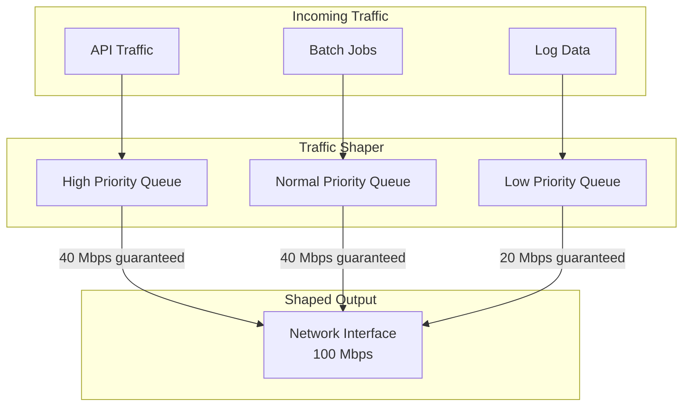

# How to Implement Traffic Shaping

Author: [nawazdhandala](https://www.github.com/nawazdhandala)

Tags: Networking, Traffic Shaping, QoS, Bandwidth Management, Linux tc, Rate Limiting, Performance

Description: Learn how to implement traffic shaping to control bandwidth allocation, prioritize critical traffic, and prevent network congestion. This guide covers Linux tc, application-level shaping, and practical configurations.

---

Traffic shaping controls the rate and priority of network traffic flowing through your systems. Without it, a bulk data transfer can starve your real-time API traffic, or a single misbehaving client can consume all available bandwidth. This guide shows you how to implement traffic shaping at different levels.

## Why Traffic Shaping Matters

Consider a shared network link carrying multiple types of traffic:

- Real-time API requests (latency-sensitive)
- Background batch processing (bandwidth-hungry)
- Log shipping (can be delayed)
- Health checks (small but critical)

Without shaping, TCP's default behavior lets aggressive flows dominate. Traffic shaping ensures each type gets appropriate resources.



## Linux Traffic Control Basics

The `tc` command is the primary tool for traffic shaping on Linux. It works with three concepts:

- **Qdiscs (Queuing Disciplines)** - Algorithms that decide how packets are queued and dequeued
- **Classes** - Subdivisions of a qdisc that can have their own settings
- **Filters** - Rules that direct packets to specific classes

### Simple Rate Limiting with tbf

Token Bucket Filter (tbf) is the simplest rate limiter:

```bash
#!/bin/bash
# simple-rate-limit.sh - Limit outbound traffic to 10 Mbps

INTERFACE="eth0"
RATE="10mbit"
BURST="32kbit"
LATENCY="50ms"

# Remove any existing qdisc
tc qdisc del dev $INTERFACE root 2>/dev/null

# Add token bucket filter
# rate: maximum sustained bandwidth
# burst: size of the token bucket (affects burstiness)
# latency: maximum time a packet can wait in queue
tc qdisc add dev $INTERFACE root tbf \
    rate $RATE \
    burst $BURST \
    latency $LATENCY

echo "Rate limit of $RATE applied to $INTERFACE"

# Verify the configuration
tc qdisc show dev $INTERFACE
```

### Hierarchical Token Bucket (HTB)

HTB provides more sophisticated traffic management with classes:

```bash
#!/bin/bash
# htb-traffic-shaping.sh - Multi-class traffic shaping with HTB

INTERFACE="eth0"
TOTAL_BW="100mbit"

# Remove existing configuration
tc qdisc del dev $INTERFACE root 2>/dev/null

# Create root HTB qdisc
# default 30 means unclassified traffic goes to class 1:30
tc qdisc add dev $INTERFACE root handle 1: htb default 30

# Create root class with total bandwidth
tc class add dev $INTERFACE parent 1: classid 1:1 htb \
    rate $TOTAL_BW \
    ceil $TOTAL_BW

# Class for high-priority traffic (API, interactive)
# Guaranteed 40 Mbps, can burst to 100 Mbps if available
tc class add dev $INTERFACE parent 1:1 classid 1:10 htb \
    rate 40mbit \
    ceil 100mbit \
    prio 1

# Class for normal traffic (web, standard apps)
# Guaranteed 40 Mbps, can burst to 80 Mbps
tc class add dev $INTERFACE parent 1:1 classid 1:20 htb \
    rate 40mbit \
    ceil 80mbit \
    prio 2

# Class for low-priority traffic (backups, logs)
# Guaranteed 20 Mbps, cannot exceed it
tc class add dev $INTERFACE parent 1:1 classid 1:30 htb \
    rate 20mbit \
    ceil 20mbit \
    prio 3

# Add stochastic fairness queueing to each class for fair sharing
tc qdisc add dev $INTERFACE parent 1:10 handle 10: sfq perturb 10
tc qdisc add dev $INTERFACE parent 1:20 handle 20: sfq perturb 10
tc qdisc add dev $INTERFACE parent 1:30 handle 30: sfq perturb 10

echo "HTB traffic shaping configured on $INTERFACE"
tc class show dev $INTERFACE
```

### Classifying Traffic with Filters

Direct packets to appropriate classes using filters:

```bash
#!/bin/bash
# tc-filters.sh - Classify traffic into HTB classes

INTERFACE="eth0"

# High priority: HTTPS traffic on port 443
tc filter add dev $INTERFACE protocol ip parent 1:0 prio 1 \
    u32 match ip dport 443 0xffff flowid 1:10

# High priority: API traffic on port 8080
tc filter add dev $INTERFACE protocol ip parent 1:0 prio 1 \
    u32 match ip dport 8080 0xffff flowid 1:10

# Normal priority: HTTP traffic
tc filter add dev $INTERFACE protocol ip parent 1:0 prio 2 \
    u32 match ip dport 80 0xffff flowid 1:20

# Normal priority: SSH traffic
tc filter add dev $INTERFACE protocol ip parent 1:0 prio 2 \
    u32 match ip dport 22 0xffff flowid 1:20

# Low priority: Syslog traffic (port 514)
tc filter add dev $INTERFACE protocol ip parent 1:0 prio 3 \
    u32 match ip dport 514 0xffff flowid 1:30

# Low priority: Any traffic to backup server (10.0.5.100)
tc filter add dev $INTERFACE protocol ip parent 1:0 prio 3 \
    u32 match ip dst 10.0.5.100 flowid 1:30

# Verify filters
tc filter show dev $INTERFACE
```

### Using DSCP for Classification

DSCP (Differentiated Services Code Point) marks provide a standardized way to classify traffic:

```bash
#!/bin/bash
# dscp-classification.sh - Classify based on DSCP markings

INTERFACE="eth0"

# DSCP values (shifted left by 2 for tc matching)
# EF (Expedited Forwarding) = 46 = 0xb8 (for real-time traffic)
# AF41 = 34 = 0x88 (for interactive traffic)
# BE (Best Effort) = 0 = 0x00 (default)

# Match EF traffic (DSCP 46) to high priority
tc filter add dev $INTERFACE protocol ip parent 1:0 prio 1 \
    u32 match ip tos 0xb8 0xfc flowid 1:10

# Match AF41 traffic (DSCP 34) to high priority
tc filter add dev $INTERFACE protocol ip parent 1:0 prio 1 \
    u32 match ip tos 0x88 0xfc flowid 1:10

# Match AF21 traffic (DSCP 18) to normal priority
tc filter add dev $INTERFACE protocol ip parent 1:0 prio 2 \
    u32 match ip tos 0x48 0xfc flowid 1:20
```

## Application-Level Traffic Shaping

Sometimes you need finer control at the application level:

```python
# rate_limiter.py - Token bucket rate limiter for applications
import time
import threading
from dataclasses import dataclass

@dataclass
class TokenBucket:
    """Token bucket rate limiter for controlling throughput"""

    rate: float  # Tokens per second (bytes per second for bandwidth)
    capacity: float  # Maximum burst size
    tokens: float = 0.0
    last_update: float = 0.0
    lock: threading.Lock = None

    def __post_init__(self):
        self.tokens = self.capacity
        self.last_update = time.monotonic()
        self.lock = threading.Lock()

    def consume(self, amount: float, blocking: bool = True) -> bool:
        """
        Try to consume tokens.
        If blocking=True, waits until tokens are available.
        Returns True if tokens were consumed, False otherwise.
        """
        with self.lock:
            # Refill tokens based on elapsed time
            now = time.monotonic()
            elapsed = now - self.last_update
            self.tokens = min(self.capacity, self.tokens + elapsed * self.rate)
            self.last_update = now

            if self.tokens >= amount:
                self.tokens -= amount
                return True

            if not blocking:
                return False

            # Calculate wait time for required tokens
            needed = amount - self.tokens
            wait_time = needed / self.rate

        # Wait outside the lock
        time.sleep(wait_time)

        # Retry after waiting
        return self.consume(amount, blocking=False)

# Example: Rate-limited data sender
class RateLimitedSender:
    def __init__(self, rate_mbps: float):
        # Convert Mbps to bytes per second
        rate_bps = rate_mbps * 1_000_000 / 8
        # Allow bursts up to 1 second worth of data
        self.bucket = TokenBucket(rate=rate_bps, capacity=rate_bps)

    def send(self, data: bytes, socket):
        """Send data respecting rate limit"""
        chunk_size = 8192  # 8KB chunks

        for i in range(0, len(data), chunk_size):
            chunk = data[i:i + chunk_size]
            # Wait for tokens before sending
            self.bucket.consume(len(chunk))
            socket.send(chunk)

# Usage example
sender = RateLimitedSender(rate_mbps=10)  # 10 Mbps limit
# sender.send(large_data, connection_socket)
```

## Traffic Shaping in Kubernetes

Use Kubernetes bandwidth annotations or CNI plugins:

```yaml
# bandwidth-limited-pod.yaml
apiVersion: v1
kind: Pod
metadata:
  name: bandwidth-limited-app
  annotations:
    # Kubernetes bandwidth plugin annotations
    kubernetes.io/ingress-bandwidth: "10M"
    kubernetes.io/egress-bandwidth: "5M"
spec:
  containers:
    - name: app
      image: myapp:latest
      resources:
        limits:
          cpu: "500m"
          memory: "256Mi"
```

For more control, use Cilium's bandwidth manager:

```yaml
# cilium-bandwidth-policy.yaml
apiVersion: cilium.io/v2
kind: CiliumNetworkPolicy
metadata:
  name: bandwidth-policy
spec:
  endpointSelector:
    matchLabels:
      app: bulk-processor
  egress:
    - toEndpoints:
        - matchLabels:
            app: storage
      toPorts:
        - ports:
            - port: "9000"
              protocol: TCP
          rules:
            http:
              - method: "PUT"
                headers:
                  - 'X-Rate-Limit: 50mbps'
```

## Traffic Shaping with NGINX

Shape traffic at the reverse proxy level:

```nginx
# nginx.conf - Rate limiting and bandwidth control

# Define rate limiting zones
limit_req_zone $binary_remote_addr zone=api_limit:10m rate=100r/s;
limit_req_zone $binary_remote_addr zone=download_limit:10m rate=10r/s;

# Define connection limits
limit_conn_zone $binary_remote_addr zone=conn_limit:10m;

server {
    listen 80;
    server_name api.example.com;

    # API endpoints - allow bursts but limit sustained rate
    location /api/ {
        limit_req zone=api_limit burst=50 nodelay;
        limit_conn conn_limit 20;

        proxy_pass http://backend;
    }

    # Download endpoints - strict bandwidth limiting
    location /downloads/ {
        limit_req zone=download_limit burst=5;
        limit_conn conn_limit 5;

        # Limit bandwidth to 1MB/s per connection
        limit_rate 1m;

        # Start limiting after first 10MB
        limit_rate_after 10m;

        root /var/www/files;
    }

    # Streaming endpoints - prioritize with larger buffers
    location /stream/ {
        proxy_buffering off;
        proxy_pass http://streaming_backend;
    }
}
```

## Monitoring Traffic Shaping

Track the effectiveness of your traffic shaping:

```bash
#!/bin/bash
# monitor-tc.sh - Monitor tc statistics

INTERFACE="eth0"

while true; do
    clear
    echo "=== Traffic Shaping Statistics for $INTERFACE ==="
    echo ""

    # Show qdisc statistics
    echo "Qdisc Statistics:"
    tc -s qdisc show dev $INTERFACE
    echo ""

    # Show class statistics
    echo "Class Statistics:"
    tc -s class show dev $INTERFACE
    echo ""

    # Show interface counters
    echo "Interface Counters:"
    cat /sys/class/net/$INTERFACE/statistics/tx_bytes
    cat /sys/class/net/$INTERFACE/statistics/tx_packets
    cat /sys/class/net/$INTERFACE/statistics/tx_dropped

    sleep 5
done
```

Export metrics to Prometheus:

```python
# tc_exporter.py - Export tc statistics to Prometheus
import subprocess
import re
from prometheus_client import start_http_server, Gauge

# Define metrics
class_bytes = Gauge(
    'tc_class_bytes_total',
    'Total bytes sent through tc class',
    ['interface', 'classid']
)

class_packets = Gauge(
    'tc_class_packets_total',
    'Total packets sent through tc class',
    ['interface', 'classid']
)

class_dropped = Gauge(
    'tc_class_dropped_total',
    'Total packets dropped by tc class',
    ['interface', 'classid']
)

def parse_tc_stats(interface: str):
    """Parse tc class statistics"""
    result = subprocess.run(
        ['tc', '-s', 'class', 'show', 'dev', interface],
        capture_output=True,
        text=True
    )

    current_class = None
    for line in result.stdout.split('\n'):
        # Match class ID line
        class_match = re.match(r'class htb (\d+:\d+)', line)
        if class_match:
            current_class = class_match.group(1)
            continue

        # Match statistics line
        stats_match = re.match(
            r'\s+Sent (\d+) bytes (\d+) pkt \(dropped (\d+)',
            line
        )
        if stats_match and current_class:
            bytes_sent = int(stats_match.group(1))
            packets_sent = int(stats_match.group(2))
            dropped = int(stats_match.group(3))

            class_bytes.labels(
                interface=interface,
                classid=current_class
            ).set(bytes_sent)

            class_packets.labels(
                interface=interface,
                classid=current_class
            ).set(packets_sent)

            class_dropped.labels(
                interface=interface,
                classid=current_class
            ).set(dropped)

if __name__ == '__main__':
    start_http_server(9103)
    import time
    while True:
        parse_tc_stats('eth0')
        time.sleep(15)
```

## Best Practices

1. **Start conservative** - Begin with loose limits and tighten based on observed behavior. Too strict initially will cause outages.

2. **Allow bursting** - Real traffic is bursty. Pure rate limiting hurts perceived performance. Use token bucket algorithms that allow short bursts.

3. **Prioritize by impact** - Classify traffic by business impact, not just technical characteristics. A small health check packet might be more important than a large file transfer.

4. **Test under load** - Traffic shaping behaviors emerge under congestion. Test with realistic load patterns.

5. **Monitor dropped packets** - High drop rates indicate classes are under-provisioned or traffic is misclassified.

6. **Document your policies** - Traffic shaping rules can be complex. Document the intent and business reasoning.

## Conclusion

Traffic shaping ensures your network resources serve your priorities rather than TCP's default "aggressive flows win" behavior. Start with simple rate limiting using tbf, graduate to HTB for multi-class prioritization, and combine with application-level controls for defense in depth. Monitor your shaping policies continuously to ensure they match evolving traffic patterns.
