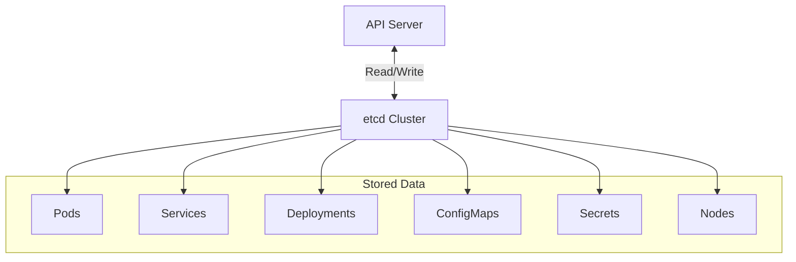

# How to Troubleshoot etcd Issues in Kubernetes

Author: [nawazdhandala](https://www.github.com/nawazdhandala)

Tags: Kubernetes, etcd, Troubleshooting, Cluster Management, Data Store

Description: Learn how to diagnose and resolve etcd issues in Kubernetes, including performance problems, cluster health checks, data corruption recovery, and best practices for maintaining etcd reliability.

---

etcd is the distributed key-value store that holds all Kubernetes cluster state. When etcd has problems, your entire cluster can become unstable or unresponsive. This guide covers diagnosing and resolving common etcd issues in Kubernetes environments.

## Understanding etcd in Kubernetes

etcd stores critical cluster data:



Common symptoms of etcd problems:
- API server responds slowly or times out
- kubectl commands hang or fail
- Objects take a long time to create or update
- Cluster becomes read-only
- Nodes appear NotReady intermittently

## Checking etcd Health

### Basic Health Check

```bash
# For kubeadm clusters, etcd runs as a static pod
kubectl get pods -n kube-system -l component=etcd

# Check etcd pod logs
kubectl logs -n kube-system etcd-master-node-name

# Use etcdctl inside the etcd pod
kubectl exec -it etcd-master-node-name -n kube-system -- /bin/sh

# Inside the pod, check endpoint health
etcdctl --endpoints=https://127.0.0.1:2379 \
  --cacert=/etc/kubernetes/pki/etcd/ca.crt \
  --cert=/etc/kubernetes/pki/etcd/server.crt \
  --key=/etc/kubernetes/pki/etcd/server.key \
  endpoint health
```

### Cluster Status

```bash
# Check member list
etcdctl --endpoints=https://127.0.0.1:2379 \
  --cacert=/etc/kubernetes/pki/etcd/ca.crt \
  --cert=/etc/kubernetes/pki/etcd/server.crt \
  --key=/etc/kubernetes/pki/etcd/server.key \
  member list -w table

# Check endpoint status (shows leader and database size)
etcdctl --endpoints=https://127.0.0.1:2379 \
  --cacert=/etc/kubernetes/pki/etcd/ca.crt \
  --cert=/etc/kubernetes/pki/etcd/server.crt \
  --key=/etc/kubernetes/pki/etcd/server.key \
  endpoint status -w table
```

Sample healthy output:
```
+------------------------+------------------+---------+---------+-----------+------------+
|        ENDPOINT        |        ID        | VERSION | DB SIZE | IS LEADER | IS LEARNER |
+------------------------+------------------+---------+---------+-----------+------------+
| https://10.0.0.1:2379  | 8e9e05c52164694d |   3.5.9 |  104 MB |      true |      false |
| https://10.0.0.2:2379  | 91bc3c398fb3c146 |   3.5.9 |  104 MB |     false |      false |
| https://10.0.0.3:2379  | fd422379fda50e48 |   3.5.9 |  104 MB |     false |      false |
+------------------------+------------------+---------+---------+-----------+------------+
```

## Diagnosing Performance Issues

### Check Latency Metrics

```bash
# Check etcd metrics endpoint
kubectl exec -it etcd-master-node-name -n kube-system -- \
  curl -k https://127.0.0.1:2379/metrics | grep etcd_disk

# Key metrics to watch:
# etcd_disk_wal_fsync_duration_seconds - WAL write latency
# etcd_disk_backend_commit_duration_seconds - Database commit latency
# etcd_server_slow_apply_total - Number of slow applies
# etcd_server_slow_read_indexes_total - Number of slow reads
```

### Check for Leader Elections

Frequent leader elections indicate cluster instability:

```bash
# Watch for leader changes in logs
kubectl logs -n kube-system etcd-master-node-name | grep -i "leader"

# Check leader election count
kubectl exec -it etcd-master-node-name -n kube-system -- \
  curl -k https://127.0.0.1:2379/metrics | grep etcd_server_leader_changes_seen_total
```

### Check Database Size

Large databases cause performance problems:

```bash
# Get database size
etcdctl --endpoints=https://127.0.0.1:2379 \
  --cacert=/etc/kubernetes/pki/etcd/ca.crt \
  --cert=/etc/kubernetes/pki/etcd/server.crt \
  --key=/etc/kubernetes/pki/etcd/server.key \
  endpoint status -w table | awk '{print $4}'

# Check which keys are using space
etcdctl --endpoints=https://127.0.0.1:2379 \
  --cacert=/etc/kubernetes/pki/etcd/ca.crt \
  --cert=/etc/kubernetes/pki/etcd/server.crt \
  --key=/etc/kubernetes/pki/etcd/server.key \
  get / --prefix --keys-only | sed '/^$/d' | cut -d/ -f3 | sort | uniq -c | sort -rn | head -20
```

## Compaction and Defragmentation

etcd needs regular maintenance to prevent database bloat:

```bash
# Get current revision
REVISION=$(etcdctl --endpoints=https://127.0.0.1:2379 \
  --cacert=/etc/kubernetes/pki/etcd/ca.crt \
  --cert=/etc/kubernetes/pki/etcd/server.crt \
  --key=/etc/kubernetes/pki/etcd/server.key \
  endpoint status -w json | jq '.[0].Status.header.revision')

# Compact old revisions
etcdctl --endpoints=https://127.0.0.1:2379 \
  --cacert=/etc/kubernetes/pki/etcd/ca.crt \
  --cert=/etc/kubernetes/pki/etcd/server.crt \
  --key=/etc/kubernetes/pki/etcd/server.key \
  compact $REVISION

# Defragment to reclaim space (run on each member, one at a time)
etcdctl --endpoints=https://127.0.0.1:2379 \
  --cacert=/etc/kubernetes/pki/etcd/ca.crt \
  --cert=/etc/kubernetes/pki/etcd/server.crt \
  --key=/etc/kubernetes/pki/etcd/server.key \
  defrag
```

Warning: Defragmentation blocks the etcd member. Run on one member at a time in a multi-member cluster.

## Recovering from Corruption

### Restore from Snapshot

```bash
# First, take a snapshot from a healthy member
etcdctl --endpoints=https://127.0.0.1:2379 \
  --cacert=/etc/kubernetes/pki/etcd/ca.crt \
  --cert=/etc/kubernetes/pki/etcd/server.crt \
  --key=/etc/kubernetes/pki/etcd/server.key \
  snapshot save /backup/etcd-snapshot.db

# Verify the snapshot
etcdctl snapshot status /backup/etcd-snapshot.db -w table

# Restore from snapshot (on each member)
# Stop etcd first, then restore
etcdctl snapshot restore /backup/etcd-snapshot.db \
  --name=etcd-member-1 \
  --initial-cluster=etcd-member-1=https://10.0.0.1:2380,etcd-member-2=https://10.0.0.2:2380,etcd-member-3=https://10.0.0.3:2380 \
  --initial-cluster-token=etcd-cluster-1 \
  --initial-advertise-peer-urls=https://10.0.0.1:2380 \
  --data-dir=/var/lib/etcd-restored
```

### Remove and Re-add a Failed Member

```bash
# List current members
etcdctl --endpoints=https://127.0.0.1:2379 \
  --cacert=/etc/kubernetes/pki/etcd/ca.crt \
  --cert=/etc/kubernetes/pki/etcd/server.crt \
  --key=/etc/kubernetes/pki/etcd/server.key \
  member list

# Remove the failed member
etcdctl --endpoints=https://127.0.0.1:2379 \
  --cacert=/etc/kubernetes/pki/etcd/ca.crt \
  --cert=/etc/kubernetes/pki/etcd/server.crt \
  --key=/etc/kubernetes/pki/etcd/server.key \
  member remove <member-id>

# Add the member back
etcdctl --endpoints=https://127.0.0.1:2379 \
  --cacert=/etc/kubernetes/pki/etcd/ca.crt \
  --cert=/etc/kubernetes/pki/etcd/server.crt \
  --key=/etc/kubernetes/pki/etcd/server.key \
  member add etcd-member-3 --peer-urls=https://10.0.0.3:2380
```

## Common Issues and Solutions

### Issue: "mvcc: database space exceeded"

The database has hit its space quota:

```bash
# Check current alarm status
etcdctl --endpoints=https://127.0.0.1:2379 \
  --cacert=/etc/kubernetes/pki/etcd/ca.crt \
  --cert=/etc/kubernetes/pki/etcd/server.crt \
  --key=/etc/kubernetes/pki/etcd/server.key \
  alarm list

# Compact and defrag to free space
# Then disarm the alarm
etcdctl --endpoints=https://127.0.0.1:2379 \
  --cacert=/etc/kubernetes/pki/etcd/ca.crt \
  --cert=/etc/kubernetes/pki/etcd/server.crt \
  --key=/etc/kubernetes/pki/etcd/server.key \
  alarm disarm
```

### Issue: "etcdserver: request timed out"

Usually indicates disk latency or network issues:

```bash
# Check disk latency on etcd nodes
sudo fio --name=test --filename=/var/lib/etcd/test \
  --rw=write --bs=4k --direct=1 --numjobs=1 \
  --time_based --runtime=10 --group_reporting

# Check network latency between etcd members
ping -c 10 <other-etcd-member-ip>

# Look for slow operations in logs
kubectl logs -n kube-system etcd-master-node-name | grep -i "slow"
```

### Issue: "rafthttp: failed to dial"

Network connectivity between members is broken:

```bash
# Check if peer port is accessible
nc -zv <other-etcd-member-ip> 2380

# Verify firewall rules allow traffic on ports 2379 and 2380
iptables -L -n | grep 2379
iptables -L -n | grep 2380

# Check TLS certificates have not expired
openssl x509 -in /etc/kubernetes/pki/etcd/server.crt -text -noout | grep "Not After"
```

## Performance Tuning

Optimize etcd for better performance:

```yaml
# etcd configuration for kubeadm
# /etc/kubernetes/manifests/etcd.yaml
spec:
  containers:
    - command:
        - etcd
        # Increase heartbeat interval for high-latency networks
        - --heartbeat-interval=250
        - --election-timeout=2500
        # Increase snapshot count to reduce snapshots
        - --snapshot-count=10000
        # Set quota to prevent runaway growth
        - --quota-backend-bytes=8589934592
        # Enable auto-compaction
        - --auto-compaction-mode=periodic
        - --auto-compaction-retention=1h
```

## Monitoring etcd

Set up Prometheus alerts for etcd:

```yaml
# etcd-alerts.yaml
groups:
  - name: etcd
    rules:
      - alert: EtcdHighNumberOfLeaderChanges
        expr: increase(etcd_server_leader_changes_seen_total[1h]) > 3
        for: 5m
        labels:
          severity: warning
        annotations:
          summary: "etcd cluster has had multiple leader changes"

      - alert: EtcdInsufficientMembers
        expr: count(etcd_server_has_leader) < 2
        for: 5m
        labels:
          severity: critical
        annotations:
          summary: "etcd cluster has insufficient members"

      - alert: EtcdHighDiskLatency
        expr: histogram_quantile(0.99, rate(etcd_disk_wal_fsync_duration_seconds_bucket[5m])) > 0.1
        for: 10m
        labels:
          severity: warning
        annotations:
          summary: "etcd disk latency is high"

      - alert: EtcdDatabaseSizeLarge
        expr: etcd_mvcc_db_total_size_in_bytes > 6442450944
        for: 5m
        labels:
          severity: warning
        annotations:
          summary: "etcd database size exceeds 6GB"
```

## Best Practices

1. **Use SSDs for etcd storage**: Disk latency directly impacts cluster performance.

2. **Run etcd on dedicated nodes**: Avoid resource contention with other workloads.

3. **Maintain odd number of members**: 3 or 5 members for fault tolerance.

4. **Regular backups**: Schedule automated snapshots.

5. **Monitor continuously**: Set up alerts before problems become critical.

```bash
# Example backup cron job
0 */4 * * * etcdctl snapshot save /backup/etcd-$(date +%Y%m%d-%H%M).db
```

---

etcd is the foundation of your Kubernetes cluster. Understanding how to diagnose and resolve etcd issues is essential for maintaining cluster reliability. Regular monitoring, automated backups, and proper capacity planning prevent most etcd problems. When issues do occur, the troubleshooting techniques in this guide will help you quickly identify and resolve them.
