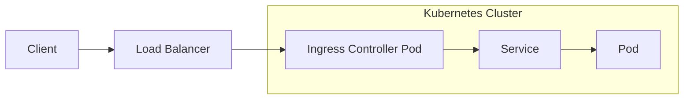

# How to Troubleshoot Ingress Controller Issues

Author: [nawazdhandala](https://www.github.com/nawazdhandala)

Tags: Kubernetes, Ingress, Networking, Troubleshooting, NGINX

Description: Learn systematic approaches to debug Kubernetes Ingress controller problems, including 502/503 errors, TLS issues, routing failures, and configuration validation techniques.

---

Ingress controllers route external HTTP/HTTPS traffic to your Kubernetes services. When they malfunction, your applications become unreachable. This guide provides a systematic approach to diagnosing and fixing common Ingress issues, with a focus on NGINX Ingress Controller, the most widely used implementation.

## Understanding Ingress Traffic Flow

Before troubleshooting, understand how traffic flows through the system:



Problems can occur at any step: the load balancer, the Ingress controller, the Service, or the backend Pods.

## Step 1: Verify Ingress Resource Status

Start by checking if the Ingress resource is configured correctly:

```bash
# List all Ingress resources
kubectl get ingress -A

# Check specific Ingress details
kubectl describe ingress my-app-ingress -n production

# Verify the ADDRESS field is populated (external IP/hostname)
kubectl get ingress my-app-ingress -n production -o wide
```

If the ADDRESS field is empty, the Ingress controller has not processed the resource. Check controller logs.

## Step 2: Check Ingress Controller Health

Verify the Ingress controller pods are running:

```bash
# For NGINX Ingress Controller
kubectl get pods -n ingress-nginx

# Check controller logs for errors
kubectl logs -n ingress-nginx -l app.kubernetes.io/name=ingress-nginx --tail=100

# Look for configuration reload errors
kubectl logs -n ingress-nginx -l app.kubernetes.io/name=ingress-nginx | grep -i error

# Check controller service
kubectl get svc -n ingress-nginx
```

Common issues in logs:
- "no endpoints available" - Backend service has no healthy pods
- "connection refused" - Backend pods are not listening on expected port
- "upstream timed out" - Backend is too slow or unresponsive

## Step 3: Validate Backend Service and Endpoints

The Ingress routes to a Service, which needs healthy endpoints:

```bash
# Check if the Service exists
kubectl get svc my-app-svc -n production

# Verify endpoints exist (pods are selected by the service)
kubectl get endpoints my-app-svc -n production

# If endpoints are empty, check pod labels match service selector
kubectl describe svc my-app-svc -n production | grep Selector
kubectl get pods -n production --show-labels
```

No endpoints means:
- No pods match the service selector
- Pods are not ready (failed readiness probes)
- Pods are in a different namespace

```yaml
# Verify labels match between Service and Pods
# service.yaml
apiVersion: v1
kind: Service
metadata:
  name: my-app-svc
spec:
  selector:
    app: my-app  # This must match pod labels
  ports:
    - port: 80
      targetPort: 8080
---
# deployment.yaml
apiVersion: apps/v1
kind: Deployment
spec:
  template:
    metadata:
      labels:
        app: my-app  # Must match service selector
```

## Step 4: Debug 502 Bad Gateway Errors

502 errors mean the Ingress controller cannot connect to the backend:

```bash
# Check if backend pods are healthy
kubectl get pods -n production -l app=my-app

# Test connectivity from inside the cluster
kubectl run debug --image=busybox -it --rm -- wget -qO- http://my-app-svc.production:80/health

# Check if the port configuration is correct
kubectl describe pod my-app-xyz -n production | grep -A5 Ports

# Verify the targetPort in Service matches the container port
kubectl get svc my-app-svc -n production -o yaml | grep -A5 ports
```

Common 502 causes:
- Wrong targetPort in Service
- Container listening on different port than specified
- Pod failing readiness probes
- Pod crashing (CrashLoopBackOff)

## Step 5: Debug 503 Service Unavailable Errors

503 errors usually indicate no healthy backends:

```bash
# Check endpoint health
kubectl get endpoints my-app-svc -n production

# If using NGINX, check upstream status
kubectl exec -n ingress-nginx <controller-pod> -- cat /etc/nginx/nginx.conf | grep -A10 upstream

# Check pod readiness
kubectl describe pods -n production -l app=my-app | grep -A5 Readiness
```

## Step 6: Debug 404 Not Found Errors

404 errors mean the Ingress path does not match any rule:

```bash
# View configured paths
kubectl describe ingress my-app-ingress -n production

# Check path matching type
kubectl get ingress my-app-ingress -n production -o yaml | grep -A5 path
```

Path types matter:

```yaml
# ingress.yaml
apiVersion: networking.k8s.io/v1
kind: Ingress
metadata:
  name: my-app-ingress
spec:
  ingressClassName: nginx
  rules:
    - host: app.example.com
      http:
        paths:
          # Exact: Only matches /api exactly
          - path: /api
            pathType: Exact
            backend:
              service:
                name: api-svc
                port:
                  number: 80

          # Prefix: Matches /app and /app/*
          - path: /app
            pathType: Prefix
            backend:
              service:
                name: app-svc
                port:
                  number: 80

          # ImplementationSpecific: Depends on IngressClass
          - path: /legacy
            pathType: ImplementationSpecific
            backend:
              service:
                name: legacy-svc
                port:
                  number: 80
```

## Step 7: Debug TLS/HTTPS Issues

TLS problems are common with Ingress:

```bash
# Check if the secret exists
kubectl get secret my-tls-secret -n production

# Verify the secret contains tls.crt and tls.key
kubectl describe secret my-tls-secret -n production

# Check certificate validity
kubectl get secret my-tls-secret -n production -o jsonpath='{.data.tls\.crt}' | base64 -d | openssl x509 -text -noout

# Test TLS handshake
openssl s_client -connect app.example.com:443 -servername app.example.com
```

Proper TLS configuration:

```yaml
# ingress-with-tls.yaml
apiVersion: networking.k8s.io/v1
kind: Ingress
metadata:
  name: my-app-ingress
  namespace: production
  annotations:
    # Force HTTPS redirect
    nginx.ingress.kubernetes.io/ssl-redirect: "true"
spec:
  ingressClassName: nginx
  tls:
    - hosts:
        - app.example.com
      secretName: my-tls-secret  # Must exist in same namespace
  rules:
    - host: app.example.com
      http:
        paths:
          - path: /
            pathType: Prefix
            backend:
              service:
                name: my-app-svc
                port:
                  number: 80
```

Create the TLS secret:

```bash
# Create TLS secret from certificate files
kubectl create secret tls my-tls-secret \
  --cert=path/to/tls.crt \
  --key=path/to/tls.key \
  -n production
```

## Step 8: Debug Cross-Namespace Routing

Ingress can only route to services in the same namespace by default:

```yaml
# Use ExternalName service for cross-namespace routing
apiVersion: v1
kind: Service
metadata:
  name: external-api
  namespace: production
spec:
  type: ExternalName
  # Reference service in another namespace
  externalName: api-svc.api-namespace.svc.cluster.local
```

## Step 9: Check NGINX Configuration

View the generated NGINX configuration:

```bash
# Get the full NGINX config
kubectl exec -n ingress-nginx <controller-pod> -- cat /etc/nginx/nginx.conf

# Check specific server block for your host
kubectl exec -n ingress-nginx <controller-pod> -- cat /etc/nginx/nginx.conf | grep -A50 "server_name app.example.com"

# Test configuration syntax
kubectl exec -n ingress-nginx <controller-pod> -- nginx -t
```

## Step 10: Common Annotations Issues

NGINX annotations can cause problems if misused:

```yaml
# ingress-with-annotations.yaml
apiVersion: networking.k8s.io/v1
kind: Ingress
metadata:
  name: my-app-ingress
  annotations:
    # Rewrite path before forwarding
    nginx.ingress.kubernetes.io/rewrite-target: /$2

    # Increase timeouts for slow backends
    nginx.ingress.kubernetes.io/proxy-connect-timeout: "60"
    nginx.ingress.kubernetes.io/proxy-read-timeout: "60"
    nginx.ingress.kubernetes.io/proxy-send-timeout: "60"

    # Increase body size limit (default is 1MB)
    nginx.ingress.kubernetes.io/proxy-body-size: "50m"

    # Enable WebSocket support
    nginx.ingress.kubernetes.io/proxy-http-version: "1.1"
    nginx.ingress.kubernetes.io/upstream-hash-by: "$request_uri"
spec:
  rules:
    - host: app.example.com
      http:
        paths:
          # With rewrite-target: /$2, /api/users becomes /users
          - path: /api(/|$)(.*)
            pathType: ImplementationSpecific
            backend:
              service:
                name: api-svc
                port:
                  number: 80
```

## Quick Debugging Checklist

```bash
# 1. Is the Ingress controller running?
kubectl get pods -n ingress-nginx

# 2. Is the Ingress resource valid?
kubectl describe ingress my-app-ingress -n production

# 3. Does the Service have endpoints?
kubectl get endpoints my-app-svc -n production

# 4. Are backend pods ready?
kubectl get pods -n production -l app=my-app

# 5. Can you reach the service from inside the cluster?
kubectl run debug --image=busybox -it --rm -- wget -qO- http://my-app-svc.production:80

# 6. Check Ingress controller logs
kubectl logs -n ingress-nginx -l app.kubernetes.io/name=ingress-nginx --tail=50

# 7. Test external connectivity
curl -v https://app.example.com
```

---

Ingress troubleshooting requires understanding the complete traffic path from client to pod. Start at the Ingress controller and work your way back to the pods. Most issues fall into a few categories: service selector mismatches, wrong ports, missing endpoints, or TLS configuration errors. With the systematic approach in this guide, you can quickly identify and resolve most Ingress problems.
