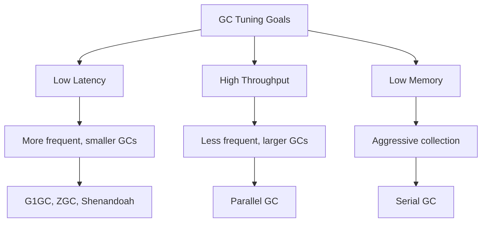

# How to Tune Garbage Collection

Author: [nawazdhandala](https://www.github.com/nawazdhandala)

Tags: Garbage Collection, Performance, JVM, Java, Go, Node.js, Memory Management, Backend

Description: Learn how to tune garbage collection for optimal application performance. This guide covers GC algorithms, tuning parameters, monitoring strategies, and best practices across JVM, Go, and Node.js.

---

> Garbage collection (GC) pauses are one of the most common causes of latency spikes in production applications. A poorly tuned GC can cause 100ms+ pauses that destroy your p99 latency. This guide shows you how to tune GC for your specific workload and latency requirements.

The goal is not to eliminate GC but to make it predictable and minimize its impact on your application.

---

## Understanding GC Trade-offs



You cannot optimize for all three. Choose based on your application:
- **Web services**: Prioritize low latency
- **Batch processing**: Prioritize throughput
- **Memory-constrained**: Prioritize footprint

---

## JVM Garbage Collection

### Choosing the Right GC Algorithm

```bash
# G1GC (default in Java 9+) - Balanced latency/throughput
java -XX:+UseG1GC -jar app.jar

# ZGC (Java 15+) - Ultra-low latency, sub-millisecond pauses
java -XX:+UseZGC -jar app.jar

# Shenandoah - Low latency alternative to ZGC
java -XX:+UseShenandoahGC -jar app.jar

# Parallel GC - Maximum throughput, longer pauses OK
java -XX:+UseParallelGC -jar app.jar
```

### G1GC Tuning

G1GC is the best choice for most applications. It balances latency and throughput.

```bash
# G1GC with tuned parameters
java \
  -XX:+UseG1GC \
  # Target max pause time (default 200ms)
  -XX:MaxGCPauseMillis=100 \
  # Heap region size (auto-calculated, but can override)
  -XX:G1HeapRegionSize=16m \
  # When to start concurrent marking (default 45%)
  -XX:InitiatingHeapOccupancyPercent=35 \
  # Reserve space to prevent promotion failure
  -XX:G1ReservePercent=15 \
  # Max GC threads
  -XX:ParallelGCThreads=8 \
  -XX:ConcGCThreads=2 \
  # Heap settings
  -Xms4g -Xmx4g \
  -jar app.jar
```

### ZGC Tuning (Ultra-Low Latency)

ZGC targets sub-millisecond pauses regardless of heap size.

```bash
# ZGC configuration
java \
  -XX:+UseZGC \
  # Enable generational ZGC (Java 21+, recommended)
  -XX:+ZGenerational \
  # Concurrent GC threads (default: 25% of CPUs)
  -XX:ConcGCThreads=4 \
  # Uncommit unused memory
  -XX:+ZUncommit \
  -XX:ZUncommitDelay=300 \
  # Heap settings - ZGC handles large heaps well
  -Xms8g -Xmx8g \
  -jar app.jar
```

### GC Logging for Analysis

```bash
# Enable detailed GC logging (Java 11+)
java \
  -Xlog:gc*=info:file=/var/log/gc.log:time,uptime,level,tags:filecount=5,filesize=50m \
  -Xlog:gc+heap=debug:file=/var/log/gc-heap.log:time,uptime \
  -jar app.jar

# For analyzing GC logs, use tools like:
# - GCViewer
# - GCEasy (online)
# - Eclipse MAT for heap analysis
```

### Java GC Tuning Example

```java
// GCTuningExample.java
import java.lang.management.GarbageCollectorMXBean;
import java.lang.management.ManagementFactory;
import java.lang.management.MemoryPoolMXBean;
import java.util.List;

public class GCMonitor {

    public static void printGCStats() {
        List<GarbageCollectorMXBean> gcBeans = ManagementFactory.getGarbageCollectorMXBeans();

        for (GarbageCollectorMXBean gc : gcBeans) {
            System.out.println("GC Name: " + gc.getName());
            System.out.println("  Collection count: " + gc.getCollectionCount());
            System.out.println("  Collection time: " + gc.getCollectionTime() + "ms");
        }
    }

    public static void printMemoryPools() {
        List<MemoryPoolMXBean> pools = ManagementFactory.getMemoryPoolMXBeans();

        for (MemoryPoolMXBean pool : pools) {
            System.out.println("Pool: " + pool.getName());
            System.out.println("  Type: " + pool.getType());
            System.out.println("  Used: " + pool.getUsage().getUsed() / (1024 * 1024) + "MB");
            System.out.println("  Max: " + pool.getUsage().getMax() / (1024 * 1024) + "MB");
        }
    }

    // Prometheus metrics for GC
    public static void exportGCMetrics() {
        for (GarbageCollectorMXBean gc : ManagementFactory.getGarbageCollectorMXBeans()) {
            String name = gc.getName().toLowerCase().replace(" ", "_");
            System.out.println("jvm_gc_collection_seconds_count{gc=\"" + name + "\"} " +
                             gc.getCollectionCount());
            System.out.println("jvm_gc_collection_seconds_sum{gc=\"" + name + "\"} " +
                             gc.getCollectionTime() / 1000.0);
        }
    }
}
```

---

## Go Garbage Collection

Go uses a concurrent, tri-color mark-and-sweep collector optimized for low latency.

### GOGC Tuning

```bash
# GOGC controls GC frequency (default: 100)
# Higher = less frequent GC, more memory
# Lower = more frequent GC, less memory

# Default: GC when heap doubles
GOGC=100 ./myapp

# Less frequent GC (use more memory)
GOGC=200 ./myapp

# More frequent GC (use less memory)
GOGC=50 ./myapp

# Disable GC (for short-lived programs)
GOGC=off ./myapp
```

### GOMEMLIMIT (Go 1.19+)

```bash
# Set memory limit - GC becomes more aggressive near limit
GOMEMLIMIT=4GiB ./myapp

# Can use with GOGC
GOGC=100 GOMEMLIMIT=4GiB ./myapp

# In container environments, set based on container limit
# Leave ~10-20% headroom for non-heap memory
GOMEMLIMIT=3600MiB ./myapp  # For 4GB container
```

### Go GC Monitoring

```go
// gc_monitor.go
package main

import (
    "runtime"
    "runtime/debug"
    "time"
    "log"
)

func monitorGC() {
    var stats debug.GCStats
    var memStats runtime.MemStats

    for {
        debug.ReadGCStats(&stats)
        runtime.ReadMemStats(&memStats)

        log.Printf("GC Stats:")
        log.Printf("  NumGC: %d", stats.NumGC)
        log.Printf("  LastGC: %v ago", time.Since(stats.LastGC))
        log.Printf("  PauseTotal: %v", stats.PauseTotal)

        if len(stats.Pause) > 0 {
            log.Printf("  Last Pause: %v", stats.Pause[0])
        }

        log.Printf("Memory Stats:")
        log.Printf("  Alloc: %d MB", memStats.Alloc/1024/1024)
        log.Printf("  HeapAlloc: %d MB", memStats.HeapAlloc/1024/1024)
        log.Printf("  HeapSys: %d MB", memStats.HeapSys/1024/1024)
        log.Printf("  HeapInuse: %d MB", memStats.HeapInuse/1024/1024)
        log.Printf("  NextGC: %d MB", memStats.NextGC/1024/1024)

        time.Sleep(10 * time.Second)
    }
}

// Prometheus metrics exporter
func exportGCMetrics() map[string]float64 {
    var stats runtime.MemStats
    runtime.ReadMemStats(&stats)

    return map[string]float64{
        "go_gc_duration_seconds_count": float64(stats.NumGC),
        "go_gc_heap_alloc_bytes":       float64(stats.HeapAlloc),
        "go_gc_heap_sys_bytes":         float64(stats.HeapSys),
        "go_gc_heap_idle_bytes":        float64(stats.HeapIdle),
        "go_gc_heap_inuse_bytes":       float64(stats.HeapInuse),
        "go_gc_next_gc_bytes":          float64(stats.NextGC),
        "go_gc_pause_total_seconds":    float64(stats.PauseTotalNs) / 1e9,
    }
}

// Trigger manual GC (use sparingly)
func forceGC() {
    runtime.GC()
}

// Set GC percentage programmatically
func setGCPercent(percent int) int {
    return debug.SetGCPercent(percent)
}
```

### Object Pooling to Reduce GC

```go
// object_pool.go
package main

import (
    "sync"
)

// Buffer pool to reduce allocations
var bufferPool = sync.Pool{
    New: func() interface{} {
        return make([]byte, 4096)
    },
}

func processRequest(data []byte) []byte {
    // Get buffer from pool instead of allocating
    buf := bufferPool.Get().([]byte)
    defer bufferPool.Put(buf)

    // Use buffer...
    copy(buf, data)

    // Return result (might need to allocate for return)
    result := make([]byte, len(data))
    copy(result, buf)
    return result
}

// Struct pool example
type Request struct {
    ID      string
    Payload []byte
}

var requestPool = sync.Pool{
    New: func() interface{} {
        return &Request{
            Payload: make([]byte, 0, 1024),
        }
    },
}

func getRequest() *Request {
    req := requestPool.Get().(*Request)
    req.ID = ""
    req.Payload = req.Payload[:0]  // Reset slice, keep capacity
    return req
}

func putRequest(req *Request) {
    requestPool.Put(req)
}
```

---

## Node.js Garbage Collection

V8 uses a generational garbage collector with incremental marking.

### V8 GC Flags

```bash
# Increase old space size (default ~1.5GB)
node --max-old-space-size=4096 app.js

# Increase new space size (for high allocation rate)
node --max-semi-space-size=128 app.js

# Expose GC function (for manual triggering in tests)
node --expose-gc app.js

# GC logging
node --trace-gc app.js
node --trace-gc-verbose app.js
```

### Monitoring V8 GC

```javascript
// gc-monitor.js
const v8 = require('v8');

// Get heap statistics
function getHeapStats() {
  const stats = v8.getHeapStatistics();
  return {
    heapTotal: Math.round(stats.total_heap_size / 1024 / 1024),
    heapUsed: Math.round(stats.used_heap_size / 1024 / 1024),
    heapLimit: Math.round(stats.heap_size_limit / 1024 / 1024),
    external: Math.round(stats.external_memory / 1024 / 1024),
    mallocedMemory: Math.round(stats.malloced_memory / 1024 / 1024),
  };
}

// Monitor GC events (requires perf_hooks)
const { PerformanceObserver, performance } = require('perf_hooks');

const gcObserver = new PerformanceObserver((list) => {
  for (const entry of list.getEntries()) {
    console.log(`GC: ${entry.name} - ${entry.duration.toFixed(2)}ms`);

    // Alert on long GC pauses
    if (entry.duration > 100) {
      console.warn(`Long GC pause detected: ${entry.duration.toFixed(2)}ms`);
    }
  }
});

gcObserver.observe({ entryTypes: ['gc'] });

// Periodic heap stats
setInterval(() => {
  const stats = getHeapStats();
  console.log(`Heap: ${stats.heapUsed}MB / ${stats.heapTotal}MB (limit: ${stats.heapLimit}MB)`);
}, 10000);

// Manual GC (if --expose-gc flag is set)
function forceGC() {
  if (global.gc) {
    global.gc();
  } else {
    console.warn('GC not exposed. Run with --expose-gc');
  }
}
```

### Reducing GC Pressure in Node.js

```javascript
// reduce-gc-pressure.js

// 1. Reuse objects instead of creating new ones
class ObjectPool {
  constructor(factory, initialSize = 100) {
    this.factory = factory;
    this.pool = [];

    // Pre-allocate objects
    for (let i = 0; i < initialSize; i++) {
      this.pool.push(factory());
    }
  }

  acquire() {
    return this.pool.length > 0 ? this.pool.pop() : this.factory();
  }

  release(obj) {
    this.pool.push(obj);
  }
}

// 2. Use Buffer.allocUnsafe for performance-critical code
// (Faster but doesn't zero-fill)
const unsafeBuffer = Buffer.allocUnsafe(4096);

// 3. Avoid creating functions in loops
// Bad
function processBad(items) {
  items.forEach(item => {
    // New function created each iteration
    setTimeout(() => processItem(item), 100);
  });
}

// Good
function processGood(items) {
  const handler = (item) => processItem(item);
  items.forEach(item => {
    setTimeout(handler.bind(null, item), 100);
  });
}

// 4. Use streams for large data
const { Transform } = require('stream');

const processStream = new Transform({
  objectMode: true,
  transform(chunk, encoding, callback) {
    // Process chunk without loading all data
    const result = processChunk(chunk);
    callback(null, result);
  }
});
```

---

## GC Monitoring with Prometheus

```yaml
# prometheus-alerts.yml for GC monitoring
groups:
  - name: gc-alerts
    rules:
      - alert: HighGCPauseTime
        expr: rate(jvm_gc_pause_seconds_sum[5m]) / rate(jvm_gc_pause_seconds_count[5m]) > 0.1
        for: 5m
        labels:
          severity: warning
        annotations:
          summary: "High GC pause time detected"

      - alert: FrequentGC
        expr: rate(jvm_gc_pause_seconds_count[1m]) > 10
        for: 5m
        labels:
          severity: warning
        annotations:
          summary: "Too frequent GC cycles"

      - alert: HighHeapUsage
        expr: jvm_memory_used_bytes{area="heap"} / jvm_memory_max_bytes{area="heap"} > 0.9
        for: 5m
        labels:
          severity: critical
        annotations:
          summary: "Heap usage above 90%"
```

---

## Best Practices Summary

| Platform | Latency Sensitive | Throughput Focused |
|----------|-------------------|-------------------|
| JVM | ZGC or G1GC with low pause target | Parallel GC |
| Go | GOGC=100, GOMEMLIMIT set | GOGC=200+ |
| Node.js | Default V8, monitor pauses | Increase heap size |

---

## Conclusion

GC tuning is about finding the right balance for your workload:

1. **Monitor first**: Understand your GC behavior before tuning
2. **Choose the right collector**: ZGC for latency, Parallel for throughput
3. **Size heap appropriately**: Too small = frequent GC, too large = long pauses
4. **Reduce allocation rate**: Object pooling, buffer reuse
5. **Alert on anomalies**: Track GC pause times and frequency

Remember: the best GC tuning is reducing the amount of garbage created in the first place.

---

*Need to monitor your application's GC performance? [OneUptime](https://oneuptime.com) provides JVM monitoring with GC metrics, pause time tracking, and memory usage alerts.*
