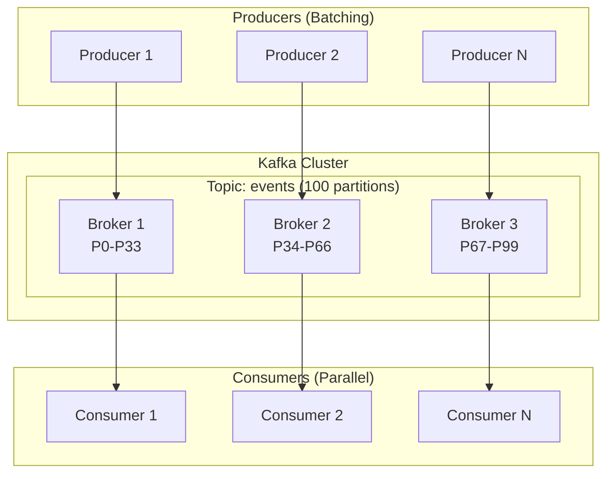

# How to Tune Kafka for Million Messages Per Second

Author: [nawazdhandala](https://www.github.com/nawazdhandala)

Tags: Kafka, Performance, Tuning, High Throughput, Scalability

Description: A comprehensive guide to tuning Apache Kafka for extreme throughput, covering producer batching, broker configuration, partition strategies, and hardware optimization to achieve millions of messages per second.

---

Kafka can handle millions of messages per second, but not with default settings. Achieving high throughput requires tuning producers, brokers, consumers, and infrastructure in concert. This guide walks through the optimizations needed to push Kafka to its limits.

## Throughput Architecture Overview

High throughput comes from parallelism at every layer:



Key principles:
- Producers batch messages to reduce network round trips
- Partitions distribute load across brokers
- Consumers parallelize processing across partitions

## Producer Tuning for Maximum Throughput

### Batching Configuration

Larger batches mean fewer network calls and better compression ratios.

```java
Properties props = new Properties();
props.put(ProducerConfig.BOOTSTRAP_SERVERS_CONFIG, "kafka1:9092,kafka2:9092,kafka3:9092");

// Batch size in bytes (default 16KB, increase for throughput)
props.put(ProducerConfig.BATCH_SIZE_CONFIG, 131072);  // 128KB per batch

// Time to wait for batch to fill before sending
// Higher values = better batching but more latency
props.put(ProducerConfig.LINGER_MS_CONFIG, 10);  // Wait up to 10ms

// Total memory for buffering unsent messages
props.put(ProducerConfig.BUFFER_MEMORY_CONFIG, 134217728);  // 128MB

// Compression reduces network and disk I/O
// LZ4 offers best throughput/compression tradeoff
props.put(ProducerConfig.COMPRESSION_TYPE_CONFIG, "lz4");

// Number of in-flight requests per connection
// Higher values improve throughput but may reorder on retries
props.put(ProducerConfig.MAX_IN_FLIGHT_REQUESTS_PER_CONNECTION, 5);

// Acknowledgment level
// acks=1 for speed, acks=all for durability
props.put(ProducerConfig.ACKS_CONFIG, "1");

// Request timeout
props.put(ProducerConfig.REQUEST_TIMEOUT_MS_CONFIG, 30000);

// Maximum request size
props.put(ProducerConfig.MAX_REQUEST_SIZE_CONFIG, 10485760);  // 10MB
```

### Async Sending Pattern

Never wait for each send to complete:

```java
// Bad: Synchronous sending (slow)
for (String message : messages) {
    producer.send(record).get();  // Blocks!
}

// Good: Asynchronous sending with callback
for (String message : messages) {
    ProducerRecord<String, String> record = new ProducerRecord<>("events", message);
    producer.send(record, (metadata, exception) -> {
        if (exception != null) {
            errorCounter.increment();
        }
    });
}
producer.flush();  // Wait for all sends to complete at the end
```

### Multiple Producer Instances

For extreme throughput, run multiple producers:

```java
public class ProducerPool {
    private final List<KafkaProducer<String, String>> producers;
    private final AtomicInteger roundRobin = new AtomicInteger(0);

    public ProducerPool(Properties baseProps, int poolSize) {
        this.producers = new ArrayList<>(poolSize);
        for (int i = 0; i < poolSize; i++) {
            Properties props = new Properties();
            props.putAll(baseProps);
            props.put(ProducerConfig.CLIENT_ID_CONFIG, "producer-" + i);
            producers.add(new KafkaProducer<>(props));
        }
    }

    public void send(ProducerRecord<String, String> record) {
        int index = roundRobin.getAndIncrement() % producers.size();
        producers.get(index).send(record);
    }

    public void close() {
        producers.forEach(KafkaProducer::close);
    }
}
```

## Broker Tuning

### Server Configuration

```properties
# server.properties

# Network threads handle requests (increase for high connection counts)
num.network.threads=8

# I/O threads handle disk operations (increase for high partition counts)
num.io.threads=16

# Socket buffer sizes for network performance
socket.send.buffer.bytes=1048576       # 1MB
socket.receive.buffer.bytes=1048576    # 1MB
socket.request.max.bytes=104857600     # 100MB

# Replica fetcher threads (for replication throughput)
num.replica.fetchers=4

# Message batch size
replica.fetch.max.bytes=10485760       # 10MB per fetch

# Log segment size (larger = fewer file handles)
log.segment.bytes=1073741824           # 1GB segments

# Flush settings (OS manages flushing for best performance)
log.flush.interval.messages=10000
log.flush.interval.ms=1000

# Replication settings
default.replication.factor=3
min.insync.replicas=2

# Disable auto topic creation in production
auto.create.topics.enable=false

# Maximum message size
message.max.bytes=10485760             # 10MB
```

### JVM Tuning

```bash
# kafka-server-start.sh or systemd unit

# Use G1GC for large heaps
export KAFKA_HEAP_OPTS="-Xms8g -Xmx8g"
export KAFKA_JVM_PERFORMANCE_OPTS="
    -XX:+UseG1GC
    -XX:MaxGCPauseMillis=20
    -XX:InitiatingHeapOccupancyPercent=35
    -XX:G1HeapRegionSize=16M
    -XX:MinMetaspaceFreeRatio=50
    -XX:MaxMetaspaceFreeRatio=80
    -XX:+ExplicitGCInvokesConcurrent
"
```

## Topic Configuration

### Partition Count

More partitions = more parallelism. A rule of thumb:

```bash
# Create high-throughput topic
kafka-topics.sh --bootstrap-server kafka:9092 \
    --create \
    --topic events \
    --partitions 100 \
    --replication-factor 3 \
    --config min.insync.replicas=2 \
    --config segment.bytes=1073741824 \
    --config retention.ms=86400000
```

Guidelines for partition count:
- At least 1 partition per consumer in your largest consumer group
- At least 1 partition per broker for distribution
- For 1M messages/sec, start with 50-100 partitions

### Segment and Retention Settings

```bash
# Optimize for throughput
kafka-configs.sh --bootstrap-server kafka:9092 \
    --entity-type topics \
    --entity-name events \
    --alter \
    --add-config segment.bytes=1073741824,\
                 segment.ms=3600000,\
                 retention.bytes=107374182400,\
                 cleanup.policy=delete
```

## Consumer Tuning

### Fetch Configuration

```java
Properties props = new Properties();

// Minimum data per fetch (wait until this much is available)
props.put(ConsumerConfig.FETCH_MIN_BYTES_CONFIG, 1048576);  // 1MB

// Maximum wait time for fetch.min.bytes
props.put(ConsumerConfig.FETCH_MAX_WAIT_MS_CONFIG, 500);

// Maximum data per fetch
props.put(ConsumerConfig.FETCH_MAX_BYTES_CONFIG, 52428800);  // 50MB

// Maximum data per partition per fetch
props.put(ConsumerConfig.MAX_PARTITION_FETCH_BYTES_CONFIG, 10485760);  // 10MB

// Maximum records per poll
props.put(ConsumerConfig.MAX_POLL_RECORDS_CONFIG, 1000);

// Session and heartbeat timeouts
props.put(ConsumerConfig.SESSION_TIMEOUT_MS_CONFIG, 30000);
props.put(ConsumerConfig.HEARTBEAT_INTERVAL_MS_CONFIG, 10000);
props.put(ConsumerConfig.MAX_POLL_INTERVAL_MS_CONFIG, 300000);
```

### Parallel Processing Within Consumer

Process records in parallel while maintaining offset ordering:

```java
public class ParallelConsumer {

    private final ExecutorService executor;
    private final KafkaConsumer<String, String> consumer;

    public ParallelConsumer(int threads) {
        this.executor = Executors.newFixedThreadPool(threads);
        this.consumer = createConsumer();
    }

    public void consume() {
        consumer.subscribe(Collections.singletonList("events"));

        while (true) {
            ConsumerRecords<String, String> records = consumer.poll(Duration.ofMillis(100));

            // Group records by partition
            Map<TopicPartition, List<ConsumerRecord<String, String>>> byPartition =
                new HashMap<>();

            for (ConsumerRecord<String, String> record : records) {
                TopicPartition tp = new TopicPartition(record.topic(), record.partition());
                byPartition.computeIfAbsent(tp, k -> new ArrayList<>()).add(record);
            }

            // Process each partition in parallel
            List<Future<?>> futures = new ArrayList<>();
            for (Map.Entry<TopicPartition, List<ConsumerRecord<String, String>>> entry :
                    byPartition.entrySet()) {

                futures.add(executor.submit(() -> {
                    for (ConsumerRecord<String, String> record : entry.getValue()) {
                        processRecord(record);
                    }
                }));
            }

            // Wait for all partitions to complete
            for (Future<?> future : futures) {
                try {
                    future.get();
                } catch (Exception e) {
                    // Handle error
                }
            }

            consumer.commitSync();
        }
    }
}
```

## Hardware and Infrastructure

### Disk Configuration

- Use SSDs or NVMe for maximum I/O throughput
- RAID-10 for redundancy with good write performance
- Separate disks for data and OS/logs
- Disable disk write caching only if you have battery-backed cache

```bash
# XFS recommended for Kafka
mkfs.xfs /dev/nvme0n1
mount -o noatime,nodiratime /dev/nvme0n1 /kafka-data
```

### Network Configuration

```bash
# Increase kernel network buffers
sysctl -w net.core.rmem_max=134217728
sysctl -w net.core.wmem_max=134217728
sysctl -w net.core.rmem_default=134217728
sysctl -w net.core.wmem_default=134217728
sysctl -w net.ipv4.tcp_rmem="4096 87380 134217728"
sysctl -w net.ipv4.tcp_wmem="4096 87380 134217728"

# Increase connection backlog
sysctl -w net.core.somaxconn=65535
sysctl -w net.core.netdev_max_backlog=65535
```

### File Descriptor Limits

```bash
# /etc/security/limits.conf
kafka soft nofile 128000
kafka hard nofile 128000

# Verify
ulimit -n
```

## Benchmarking Your Configuration

Use the built-in performance tools:

```bash
# Producer benchmark
kafka-producer-perf-test.sh \
    --topic benchmark-topic \
    --num-records 10000000 \
    --record-size 1000 \
    --throughput -1 \
    --producer-props \
        bootstrap.servers=kafka1:9092,kafka2:9092,kafka3:9092 \
        batch.size=131072 \
        linger.ms=10 \
        compression.type=lz4 \
        acks=1

# Consumer benchmark
kafka-consumer-perf-test.sh \
    --bootstrap-server kafka1:9092 \
    --topic benchmark-topic \
    --messages 10000000 \
    --fetch-size 1048576
```

Sample output for tuned cluster:

```
10000000 records sent, 1052631.5 records/sec (100.38 MB/sec),
  15.2 ms avg latency, 245.0 ms max latency,
  12 ms 50th, 28 ms 95th, 78 ms 99th, 198 ms 99.9th.
```

## Monitoring Throughput

Key metrics to track:

```promql
# Messages in per second (broker level)
sum(rate(kafka_server_brokertopicmetrics_messagesin_total[1m])) by (topic)

# Bytes in/out per second
sum(rate(kafka_server_brokertopicmetrics_bytesin_total[1m]))
sum(rate(kafka_server_brokertopicmetrics_bytesout_total[1m]))

# Request latency
histogram_quantile(0.99, rate(kafka_network_requestmetrics_totaltimems_bucket[5m]))

# Under-replicated partitions (should be 0)
kafka_server_replicamanager_underreplicatedpartitions
```

---

Achieving a million messages per second requires coordinated tuning across producers (batching, compression), brokers (threads, memory), topics (partitions), consumers (fetch size), and infrastructure (SSDs, network). Start with the producer settings since batching has the biggest impact, then scale partitions and consumers horizontally. Always benchmark your specific workload since optimal settings depend on message size, required durability, and hardware capabilities.
