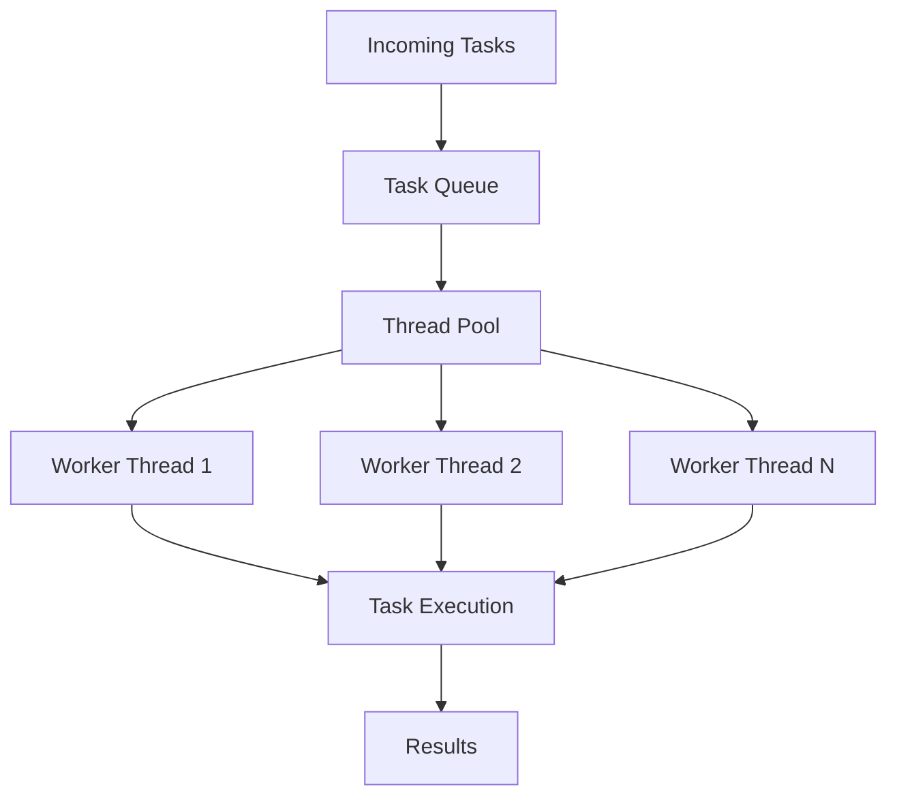

# How to Tune Thread Pools for Performance

Author: [nawazdhandala](https://www.github.com/nawazdhandala)

Tags: Thread Pools, Performance, Concurrency, Java, Python, Node.js, Backend, Optimization

Description: Learn how to tune thread pools for optimal performance in production applications. This guide covers pool sizing formulas, different pool types, monitoring strategies, and common pitfalls across multiple languages.

---

> Thread pools are fundamental to concurrent applications. A properly sized thread pool maximizes throughput and minimizes latency. Too few threads and you leave CPU idle. Too many threads and you waste memory and suffer from context switching overhead. This guide shows you how to find the sweet spot.

Thread pool tuning is not guesswork. There are formulas and patterns that work, and this guide covers them with practical examples.

---

## Understanding Thread Pool Basics



A thread pool consists of:
- **Core threads**: Always running, waiting for work
- **Task queue**: Buffer for pending tasks
- **Max threads**: Upper limit when queue is full
- **Keep-alive time**: How long idle threads wait before terminating

---

## Thread Pool Sizing Formula

The optimal pool size depends on your workload type:

### CPU-Bound Tasks

For tasks that primarily use CPU (computation, data processing):

```
Optimal threads = Number of CPU cores
```

```python
# cpu_bound_pool.py
import os
from concurrent.futures import ProcessPoolExecutor, ThreadPoolExecutor

# Get CPU count
cpu_count = os.cpu_count()

# For CPU-bound work, use ProcessPoolExecutor (bypasses GIL)
# Threads = CPU cores
with ProcessPoolExecutor(max_workers=cpu_count) as executor:
    results = executor.map(cpu_intensive_function, data)

# Or if you must use threads
cpu_pool = ThreadPoolExecutor(max_workers=cpu_count)
```

### I/O-Bound Tasks

For tasks that wait on I/O (network, disk, database):

```
Optimal threads = CPU cores * (1 + Wait time / Service time)
```

Where:
- Wait time = time spent waiting for I/O
- Service time = time spent processing

```python
# io_bound_pool.py
import os
from concurrent.futures import ThreadPoolExecutor

cpu_count = os.cpu_count()

# Example: API calls that take 100ms, processing takes 10ms
# Wait time = 100ms, Service time = 10ms
# Optimal = cpu_count * (1 + 100/10) = cpu_count * 11

wait_time_ms = 100
service_time_ms = 10
blocking_coefficient = wait_time_ms / service_time_ms

optimal_threads = int(cpu_count * (1 + blocking_coefficient))

io_pool = ThreadPoolExecutor(max_workers=optimal_threads)
```

### Practical Sizing Guidelines

```python
# pool_sizing.py
import os
from dataclasses import dataclass
from enum import Enum

class WorkloadType(Enum):
    CPU_BOUND = "cpu_bound"
    IO_BOUND = "io_bound"
    MIXED = "mixed"

@dataclass
class PoolSizingConfig:
    workload_type: WorkloadType
    wait_time_ms: float = 0  # Average I/O wait time
    service_time_ms: float = 1  # Average processing time

def calculate_optimal_pool_size(config: PoolSizingConfig) -> dict:
    """Calculate optimal thread pool size based on workload"""
    cpu_count = os.cpu_count() or 4

    if config.workload_type == WorkloadType.CPU_BOUND:
        # CPU-bound: threads = cores
        optimal = cpu_count
        min_threads = cpu_count
        max_threads = cpu_count

    elif config.workload_type == WorkloadType.IO_BOUND:
        # I/O-bound: threads = cores * (1 + W/S)
        blocking_coefficient = config.wait_time_ms / max(config.service_time_ms, 1)
        optimal = int(cpu_count * (1 + blocking_coefficient))
        min_threads = cpu_count
        max_threads = min(optimal * 2, 200)  # Cap at 200 threads

    else:  # MIXED
        # Mixed workload: start conservative, tune based on metrics
        optimal = cpu_count * 2
        min_threads = cpu_count
        max_threads = cpu_count * 4

    return {
        'cpu_count': cpu_count,
        'workload_type': config.workload_type.value,
        'optimal_threads': optimal,
        'min_threads': min_threads,
        'max_threads': max_threads,
        'queue_size': optimal * 100  # Reasonable queue depth
    }


# Examples
print(calculate_optimal_pool_size(PoolSizingConfig(
    workload_type=WorkloadType.CPU_BOUND
)))
# {'cpu_count': 8, 'optimal_threads': 8, ...}

print(calculate_optimal_pool_size(PoolSizingConfig(
    workload_type=WorkloadType.IO_BOUND,
    wait_time_ms=100,  # Database query
    service_time_ms=5   # Processing result
)))
# {'cpu_count': 8, 'optimal_threads': 168, ...}
```

---

## Java Thread Pool Configuration

### ThreadPoolExecutor Setup

```java
// ThreadPoolConfig.java
import java.util.concurrent.*;
import java.util.concurrent.atomic.AtomicInteger;

public class ThreadPoolConfig {

    // CPU-bound pool (for computation)
    public static ThreadPoolExecutor createCpuBoundPool() {
        int coreCount = Runtime.getRuntime().availableProcessors();

        return new ThreadPoolExecutor(
            coreCount,              // Core pool size
            coreCount,              // Max pool size (same for CPU-bound)
            0L, TimeUnit.MILLISECONDS,
            new LinkedBlockingQueue<>(1000),  // Bounded queue
            new NamedThreadFactory("cpu-worker"),
            new ThreadPoolExecutor.CallerRunsPolicy()  // Backpressure
        );
    }

    // I/O-bound pool (for network, database)
    public static ThreadPoolExecutor createIoBoundPool(
            int waitTimeMs, int serviceTimeMs) {

        int coreCount = Runtime.getRuntime().availableProcessors();
        int optimalThreads = coreCount * (1 + waitTimeMs / Math.max(serviceTimeMs, 1));
        int maxThreads = Math.min(optimalThreads * 2, 200);

        return new ThreadPoolExecutor(
            optimalThreads,         // Core pool size
            maxThreads,             // Max pool size
            60L, TimeUnit.SECONDS,  // Keep-alive for idle threads
            new SynchronousQueue<>(),  // No queue - creates new thread or rejects
            new NamedThreadFactory("io-worker"),
            new ThreadPoolExecutor.AbortPolicy()
        );
    }

    // Named thread factory for debugging
    static class NamedThreadFactory implements ThreadFactory {
        private final AtomicInteger counter = new AtomicInteger(1);
        private final String prefix;

        NamedThreadFactory(String prefix) {
            this.prefix = prefix;
        }

        @Override
        public Thread newThread(Runnable r) {
            Thread t = new Thread(r, prefix + "-" + counter.getAndIncrement());
            t.setDaemon(false);
            return t;
        }
    }
}
```

### Spring Boot Thread Pool Configuration

```java
// AsyncConfig.java
import org.springframework.context.annotation.Configuration;
import org.springframework.context.annotation.Bean;
import org.springframework.scheduling.concurrent.ThreadPoolTaskExecutor;
import org.springframework.scheduling.annotation.EnableAsync;

@Configuration
@EnableAsync
public class AsyncConfig {

    @Bean(name = "taskExecutor")
    public ThreadPoolTaskExecutor taskExecutor() {
        int coreCount = Runtime.getRuntime().availableProcessors();

        ThreadPoolTaskExecutor executor = new ThreadPoolTaskExecutor();
        executor.setCorePoolSize(coreCount * 2);
        executor.setMaxPoolSize(coreCount * 4);
        executor.setQueueCapacity(500);
        executor.setKeepAliveSeconds(60);
        executor.setThreadNamePrefix("async-");
        executor.setRejectedExecutionHandler(new ThreadPoolExecutor.CallerRunsPolicy());
        executor.setWaitForTasksToCompleteOnShutdown(true);
        executor.setAwaitTerminationSeconds(30);
        executor.initialize();
        return executor;
    }

    @Bean(name = "ioExecutor")
    public ThreadPoolTaskExecutor ioExecutor() {
        int coreCount = Runtime.getRuntime().availableProcessors();

        // Assuming 100ms wait, 5ms service time
        int optimalThreads = coreCount * (1 + 100 / 5);

        ThreadPoolTaskExecutor executor = new ThreadPoolTaskExecutor();
        executor.setCorePoolSize(optimalThreads);
        executor.setMaxPoolSize(optimalThreads * 2);
        executor.setQueueCapacity(1000);
        executor.setThreadNamePrefix("io-");
        executor.initialize();
        return executor;
    }
}
```

### application.yml Configuration

```yaml
# application.yml
spring:
  task:
    execution:
      pool:
        core-size: ${THREAD_POOL_CORE:8}
        max-size: ${THREAD_POOL_MAX:32}
        queue-capacity: ${THREAD_POOL_QUEUE:500}
        keep-alive: 60s
      thread-name-prefix: "app-exec-"
    scheduling:
      pool:
        size: 4

# Server thread pool (Tomcat)
server:
  tomcat:
    threads:
      max: 200
      min-spare: 20
    accept-count: 100
```

---

## Python Thread Pool Configuration

### ThreadPoolExecutor with Monitoring

```python
# monitored_pool.py
import threading
import time
from concurrent.futures import ThreadPoolExecutor, Future
from typing import Callable, Any, Dict
from dataclasses import dataclass, field
import logging

logger = logging.getLogger(__name__)

@dataclass
class PoolMetrics:
    """Metrics for thread pool monitoring"""
    tasks_submitted: int = 0
    tasks_completed: int = 0
    tasks_failed: int = 0
    total_execution_time: float = 0.0
    max_queue_size: int = 0
    lock: threading.Lock = field(default_factory=threading.Lock)

    def record_completion(self, execution_time: float, success: bool):
        with self.lock:
            if success:
                self.tasks_completed += 1
            else:
                self.tasks_failed += 1
            self.total_execution_time += execution_time

    @property
    def avg_execution_time(self) -> float:
        total = self.tasks_completed + self.tasks_failed
        return self.total_execution_time / total if total > 0 else 0


class MonitoredThreadPool:
    """Thread pool with built-in monitoring"""

    def __init__(self, max_workers: int = None, name: str = "pool"):
        self.max_workers = max_workers or (os.cpu_count() * 2)
        self.name = name
        self.executor = ThreadPoolExecutor(
            max_workers=self.max_workers,
            thread_name_prefix=f"{name}-worker"
        )
        self.metrics = PoolMetrics()
        self._pending_tasks = 0
        self._lock = threading.Lock()

    def submit(self, fn: Callable, *args, **kwargs) -> Future:
        """Submit a task and track metrics"""
        with self._lock:
            self.metrics.tasks_submitted += 1
            self._pending_tasks += 1
            self.metrics.max_queue_size = max(
                self.metrics.max_queue_size,
                self._pending_tasks
            )

        start_time = time.perf_counter()

        def wrapped_fn():
            try:
                result = fn(*args, **kwargs)
                execution_time = time.perf_counter() - start_time
                self.metrics.record_completion(execution_time, success=True)
                return result
            except Exception as e:
                execution_time = time.perf_counter() - start_time
                self.metrics.record_completion(execution_time, success=False)
                raise
            finally:
                with self._lock:
                    self._pending_tasks -= 1

        return self.executor.submit(wrapped_fn)

    def get_stats(self) -> Dict[str, Any]:
        """Get current pool statistics"""
        return {
            'name': self.name,
            'max_workers': self.max_workers,
            'tasks_submitted': self.metrics.tasks_submitted,
            'tasks_completed': self.metrics.tasks_completed,
            'tasks_failed': self.metrics.tasks_failed,
            'tasks_pending': self._pending_tasks,
            'avg_execution_time_ms': self.metrics.avg_execution_time * 1000,
            'max_queue_size': self.metrics.max_queue_size,
        }

    def shutdown(self, wait: bool = True):
        """Shutdown the pool"""
        self.executor.shutdown(wait=wait)


# Usage
pool = MonitoredThreadPool(max_workers=20, name="api")

# Submit tasks
futures = [pool.submit(process_request, req) for req in requests]

# Check stats
print(pool.get_stats())
# {'name': 'api', 'max_workers': 20, 'tasks_submitted': 100, ...}
```

### Async Pool for I/O Operations

```python
# async_pool.py
import asyncio
from typing import List, Callable, Any

class AsyncTaskPool:
    """Semaphore-based concurrency control for async operations"""

    def __init__(self, max_concurrency: int = 100):
        self.semaphore = asyncio.Semaphore(max_concurrency)
        self.max_concurrency = max_concurrency
        self._active = 0

    async def run(self, coro):
        """Run a coroutine with concurrency limiting"""
        async with self.semaphore:
            self._active += 1
            try:
                return await coro
            finally:
                self._active -= 1

    async def map(self, fn: Callable, items: List[Any]) -> List[Any]:
        """Apply function to items with concurrency limiting"""
        tasks = [self.run(fn(item)) for item in items]
        return await asyncio.gather(*tasks)

    @property
    def active_count(self) -> int:
        return self._active


# Usage
async def fetch_url(url: str) -> dict:
    async with aiohttp.ClientSession() as session:
        async with session.get(url) as response:
            return await response.json()

pool = AsyncTaskPool(max_concurrency=50)

# Fetch many URLs concurrently (max 50 at a time)
urls = ["https://api.example.com/item/" + str(i) for i in range(1000)]
results = await pool.map(fetch_url, urls)
```

---

## Node.js Worker Threads

Node.js is single-threaded for JavaScript execution, but you can use worker threads for CPU-intensive tasks.

```javascript
// worker-pool.js
const { Worker, isMainThread, parentPort, workerData } = require('worker_threads');
const os = require('os');

class WorkerPool {
  constructor(workerScript, poolSize = os.cpus().length) {
    this.workerScript = workerScript;
    this.poolSize = poolSize;
    this.workers = [];
    this.taskQueue = [];
    this.freeWorkers = [];

    // Initialize workers
    for (let i = 0; i < poolSize; i++) {
      this.addWorker();
    }
  }

  addWorker() {
    const worker = new Worker(this.workerScript);

    worker.on('message', (result) => {
      // Return worker to free pool
      this.freeWorkers.push(worker);

      // Process next task if any
      if (this.taskQueue.length > 0) {
        const { task, resolve, reject } = this.taskQueue.shift();
        this.runTask(task, resolve, reject);
      }
    });

    worker.on('error', (err) => {
      console.error('Worker error:', err);
      // Remove failed worker and create new one
      const index = this.workers.indexOf(worker);
      if (index !== -1) {
        this.workers.splice(index, 1);
      }
      this.addWorker();
    });

    this.workers.push(worker);
    this.freeWorkers.push(worker);
  }

  async runTask(task, resolve, reject) {
    if (this.freeWorkers.length === 0) {
      // Queue the task
      this.taskQueue.push({ task, resolve, reject });
      return;
    }

    const worker = this.freeWorkers.pop();

    worker.once('message', (result) => {
      if (result.error) {
        reject(new Error(result.error));
      } else {
        resolve(result.data);
      }
    });

    worker.postMessage(task);
  }

  run(task) {
    return new Promise((resolve, reject) => {
      this.runTask(task, resolve, reject);
    });
  }

  getStats() {
    return {
      totalWorkers: this.workers.length,
      freeWorkers: this.freeWorkers.length,
      busyWorkers: this.workers.length - this.freeWorkers.length,
      queuedTasks: this.taskQueue.length
    };
  }

  async shutdown() {
    for (const worker of this.workers) {
      await worker.terminate();
    }
  }
}

// worker.js - the worker script
if (!isMainThread) {
  parentPort.on('message', async (task) => {
    try {
      const result = await processTask(task);
      parentPort.postMessage({ data: result });
    } catch (error) {
      parentPort.postMessage({ error: error.message });
    }
  });
}

// Usage
const pool = new WorkerPool('./worker.js', 4);

// Run CPU-intensive tasks
const results = await Promise.all([
  pool.run({ type: 'compute', data: largeDataset1 }),
  pool.run({ type: 'compute', data: largeDataset2 }),
  pool.run({ type: 'compute', data: largeDataset3 }),
]);

console.log(pool.getStats());
// { totalWorkers: 4, freeWorkers: 4, busyWorkers: 0, queuedTasks: 0 }
```

---

## Monitoring Thread Pools

### Prometheus Metrics

```python
# pool_metrics.py
from prometheus_client import Gauge, Counter, Histogram
from concurrent.futures import ThreadPoolExecutor
import threading
import time

# Define metrics
pool_active_threads = Gauge(
    'thread_pool_active_threads',
    'Number of active threads',
    ['pool_name']
)
pool_queued_tasks = Gauge(
    'thread_pool_queued_tasks',
    'Number of tasks in queue',
    ['pool_name']
)
pool_completed_tasks = Counter(
    'thread_pool_completed_tasks_total',
    'Total completed tasks',
    ['pool_name', 'status']
)
pool_task_duration = Histogram(
    'thread_pool_task_duration_seconds',
    'Task execution duration',
    ['pool_name'],
    buckets=[0.001, 0.005, 0.01, 0.05, 0.1, 0.5, 1, 5, 10]
)

class InstrumentedThreadPool:
    """Thread pool with Prometheus instrumentation"""

    def __init__(self, max_workers: int, name: str):
        self.name = name
        self.executor = ThreadPoolExecutor(max_workers=max_workers)
        self._active = 0
        self._queued = 0
        self._lock = threading.Lock()

        # Start metrics updater
        self._update_metrics()

    def _update_metrics(self):
        pool_active_threads.labels(pool_name=self.name).set(self._active)
        pool_queued_tasks.labels(pool_name=self.name).set(self._queued)

    def submit(self, fn, *args, **kwargs):
        with self._lock:
            self._queued += 1
            self._update_metrics()

        start_time = time.perf_counter()

        def wrapped():
            with self._lock:
                self._queued -= 1
                self._active += 1
                self._update_metrics()

            try:
                result = fn(*args, **kwargs)
                pool_completed_tasks.labels(
                    pool_name=self.name, status='success'
                ).inc()
                return result
            except Exception as e:
                pool_completed_tasks.labels(
                    pool_name=self.name, status='error'
                ).inc()
                raise
            finally:
                duration = time.perf_counter() - start_time
                pool_task_duration.labels(pool_name=self.name).observe(duration)

                with self._lock:
                    self._active -= 1
                    self._update_metrics()

        return self.executor.submit(wrapped)
```

---

## Common Pitfalls and Solutions

| Pitfall | Symptom | Solution |
|---------|---------|----------|
| Too few threads | High latency, low CPU usage | Increase pool size for I/O-bound work |
| Too many threads | High memory, context switching | Reduce pool size, use bounded queues |
| Unbounded queue | OOM errors | Use bounded queue with rejection policy |
| No monitoring | Unknown bottlenecks | Add metrics for active threads, queue size |
| Thread leaks | Memory growth over time | Use try/finally, monitor thread counts |
| Blocking in async code | Thread starvation | Use separate pools for blocking operations |

---

## Best Practices Summary

1. **Size based on workload**: CPU-bound = cores, I/O-bound = cores * (1 + wait/service)
2. **Use bounded queues**: Prevent memory exhaustion with queue limits
3. **Name your threads**: Makes debugging and profiling much easier
4. **Monitor metrics**: Track active threads, queue depth, task duration
5. **Handle rejection**: Implement backpressure with CallerRunsPolicy or similar
6. **Separate pools**: Use different pools for different workload types
7. **Graceful shutdown**: Wait for tasks to complete before terminating

---

## Conclusion

Thread pool tuning is about matching your pool configuration to your workload characteristics:

- Measure your wait time and service time
- Apply the sizing formula
- Monitor actual usage in production
- Adjust based on metrics

Start with the formula, monitor metrics, and iterate. There is no universal "best" configuration, only the right configuration for your specific workload.

---

*Need to monitor your application's thread pools? [OneUptime](https://oneuptime.com) provides application performance monitoring with thread pool metrics, latency tracking, and automatic alerting.*
