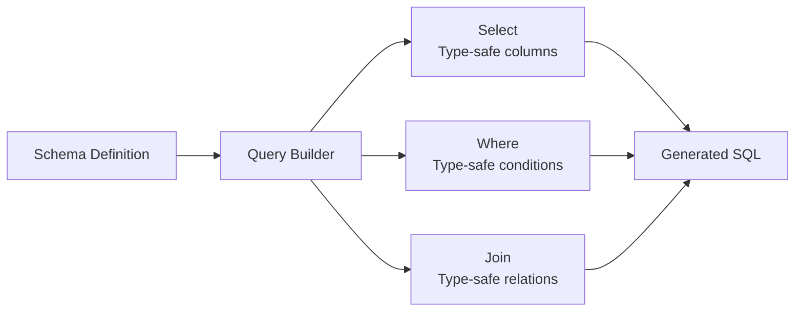

# How to Build a Type-Safe Query Builder in TypeScript

Author: [nawazdhandala](https://www.github.com/nawazdhandala)

Tags: TypeScript, Query Builder, Type Safety, Database, SQL, ORM, Design Patterns

Description: Learn how to build a type-safe query builder in TypeScript that catches SQL errors at compile time. This guide covers fluent interfaces, conditional types, and mapped types for building robust database queries.

---

> Writing raw SQL strings is error-prone. A type-safe query builder catches mistakes at compile time, not in production. Build queries that the compiler validates before they ever touch your database.

Database queries are everywhere in backend applications. Getting them wrong means runtime errors, data corruption, or security vulnerabilities. TypeScript can help prevent these issues before deployment.

---

## Overview



---

## Why Build a Type-Safe Query Builder?

Raw SQL strings have several problems:

- No autocomplete for table and column names
- Typos only discovered at runtime
- Refactoring becomes dangerous
- SQL injection risks with string concatenation

A type-safe query builder solves these issues by encoding your database schema in TypeScript types.

---

## Defining the Schema Types

First, define types that represent your database schema:

```typescript
// schema.ts

// Define the structure of each table
// These types mirror your actual database tables
interface User {
  id: number;
  email: string;
  name: string;
  created_at: Date;
  is_active: boolean;
}

interface Post {
  id: number;
  title: string;
  content: string;
  author_id: number;
  published_at: Date | null;
}

interface Comment {
  id: number;
  post_id: number;
  user_id: number;
  body: string;
  created_at: Date;
}

// Create a schema type that maps table names to their row types
// This enables type-safe table selection
interface DatabaseSchema {
  users: User;
  posts: Post;
  comments: Comment;
}

// Helper type to extract column names from a table
// keyof User returns 'id' | 'email' | 'name' | 'created_at' | 'is_active'
type ColumnNames<T> = keyof T & string;

// Helper type to get the value type of a specific column
type ColumnType<T, K extends keyof T> = T[K];
```

---

## Building the Query Builder Core

Create the base query builder class with a fluent interface:

```typescript
// query-builder.ts

// Represents a built query ready for execution
interface BuiltQuery {
  sql: string;
  params: unknown[];
}

// Comparison operators for WHERE clauses
type Operator = '=' | '!=' | '>' | '<' | '>=' | '<=' | 'LIKE' | 'IN' | 'IS NULL' | 'IS NOT NULL';

// A condition in a WHERE clause
interface WhereCondition {
  column: string;
  operator: Operator;
  value: unknown;
}

// The main query builder class
// T is the current table type, S is the full schema
class QueryBuilder<T, S extends Record<string, unknown> = DatabaseSchema> {
  private tableName: string;
  private selectedColumns: string[] = [];
  private whereConditions: WhereCondition[] = [];
  private orderByColumns: { column: string; direction: 'ASC' | 'DESC' }[] = [];
  private limitValue: number | null = null;
  private offsetValue: number | null = null;
  private joins: string[] = [];
  private params: unknown[] = [];

  constructor(table: string) {
    this.tableName = table;
  }

  // Select specific columns with full type safety
  // Only allows columns that exist on the table type T
  select<K extends ColumnNames<T>>(...columns: K[]): this {
    this.selectedColumns.push(...columns);
    return this;
  }

  // Select all columns
  selectAll(): this {
    this.selectedColumns = ['*'];
    return this;
  }

  // Add a WHERE condition with type-safe column and value
  where<K extends ColumnNames<T>>(
    column: K,
    operator: Operator,
    value: ColumnType<T, K>
  ): this {
    this.whereConditions.push({ column, operator, value });
    this.params.push(value);
    return this;
  }

  // Convenience method for equality comparison
  whereEquals<K extends ColumnNames<T>>(
    column: K,
    value: ColumnType<T, K>
  ): this {
    return this.where(column, '=', value);
  }

  // Add ordering with type-safe column names
  orderBy<K extends ColumnNames<T>>(
    column: K,
    direction: 'ASC' | 'DESC' = 'ASC'
  ): this {
    this.orderByColumns.push({ column, direction });
    return this;
  }

  // Limit results
  limit(count: number): this {
    this.limitValue = count;
    return this;
  }

  // Offset for pagination
  offset(count: number): this {
    this.offsetValue = count;
    return this;
  }

  // Build the final SQL query
  build(): BuiltQuery {
    const parts: string[] = [];

    // SELECT clause
    const columns = this.selectedColumns.length > 0
      ? this.selectedColumns.join(', ')
      : '*';
    parts.push(`SELECT ${columns}`);

    // FROM clause
    parts.push(`FROM ${this.tableName}`);

    // JOIN clauses
    if (this.joins.length > 0) {
      parts.push(this.joins.join(' '));
    }

    // WHERE clause
    if (this.whereConditions.length > 0) {
      const conditions = this.whereConditions.map((c, i) => {
        if (c.operator === 'IS NULL' || c.operator === 'IS NOT NULL') {
          return `${c.column} ${c.operator}`;
        }
        return `${c.column} ${c.operator} $${i + 1}`;
      });
      parts.push(`WHERE ${conditions.join(' AND ')}`);
    }

    // ORDER BY clause
    if (this.orderByColumns.length > 0) {
      const orderParts = this.orderByColumns.map(
        o => `${o.column} ${o.direction}`
      );
      parts.push(`ORDER BY ${orderParts.join(', ')}`);
    }

    // LIMIT clause
    if (this.limitValue !== null) {
      parts.push(`LIMIT ${this.limitValue}`);
    }

    // OFFSET clause
    if (this.offsetValue !== null) {
      parts.push(`OFFSET ${this.offsetValue}`);
    }

    return {
      sql: parts.join(' '),
      params: this.params.filter(p => p !== undefined)
    };
  }
}
```

---

## Creating the Query Factory

Create a factory function that provides type-safe table selection:

```typescript
// query-factory.ts

// Factory function that creates type-safe query builders
// The table name is constrained to keys of DatabaseSchema
function from<K extends keyof DatabaseSchema>(
  table: K
): QueryBuilder<DatabaseSchema[K]> {
  return new QueryBuilder<DatabaseSchema[K]>(table);
}

// Usage examples showing type safety in action

// This compiles - 'email' exists on User
const userQuery = from('users')
  .select('id', 'email', 'name')
  .whereEquals('is_active', true)
  .orderBy('created_at', 'DESC')
  .limit(10)
  .build();

// This would cause a compile error - 'title' does not exist on User
// const invalidQuery = from('users')
//   .select('title')  // Error: Argument of type 'title' is not assignable

// This compiles - 'title' exists on Post
const postQuery = from('posts')
  .select('id', 'title', 'content')
  .whereEquals('author_id', 42)
  .orderBy('published_at', 'DESC')
  .build();

console.log(userQuery.sql);
// SELECT id, email, name FROM users WHERE is_active = $1 ORDER BY created_at DESC LIMIT 10
```

---

## Adding Type-Safe Joins

Extend the query builder to support joins with type safety:

```typescript
// joins.ts

// Type to track which tables are joined
// This allows selecting columns from joined tables
type JoinedTables<T, U> = T & U;

// Extended query builder with join support
class JoinableQueryBuilder<T, S extends Record<string, unknown> = DatabaseSchema>
  extends QueryBuilder<T, S> {

  // Inner join with type safety
  // Returns a new builder that knows about both tables
  innerJoin<K extends keyof S>(
    table: K,
    leftColumn: ColumnNames<T>,
    rightColumn: ColumnNames<S[K]>
  ): JoinableQueryBuilder<JoinedTables<T, S[K]>, S> {
    const joinSql = `INNER JOIN ${String(table)} ON ${this.tableName}.${leftColumn} = ${String(table)}.${rightColumn}`;
    this.addJoin(joinSql);

    // Cast to the new type that includes both tables
    return this as unknown as JoinableQueryBuilder<JoinedTables<T, S[K]>, S>;
  }

  // Left join preserves all rows from left table
  leftJoin<K extends keyof S>(
    table: K,
    leftColumn: ColumnNames<T>,
    rightColumn: ColumnNames<S[K]>
  ): JoinableQueryBuilder<JoinedTables<T, Partial<S[K]>>, S> {
    const joinSql = `LEFT JOIN ${String(table)} ON ${this.tableName}.${leftColumn} = ${String(table)}.${rightColumn}`;
    this.addJoin(joinSql);

    // Partial because left join may have null values
    return this as unknown as JoinableQueryBuilder<JoinedTables<T, Partial<S[K]>>, S>;
  }

  private addJoin(sql: string): void {
    // Access private joins array from parent class
    (this as any).joins.push(sql);
  }
}

// Factory that returns joinable query builder
function query<K extends keyof DatabaseSchema>(
  table: K
): JoinableQueryBuilder<DatabaseSchema[K]> {
  return new JoinableQueryBuilder<DatabaseSchema[K]>(table);
}

// Example: Join posts with users
const postsWithAuthors = query('posts')
  .innerJoin('users', 'author_id', 'id')
  .select('title', 'content', 'name', 'email')  // Can select from both tables
  .whereEquals('is_active', true)  // Filter on joined table
  .build();
```

---

## Conditional Queries

Add support for building queries conditionally:

```typescript
// conditional.ts

// Extend query builder with conditional methods
class ConditionalQueryBuilder<T> extends JoinableQueryBuilder<T> {

  // Only add WHERE clause if condition is true
  whereIf<K extends ColumnNames<T>>(
    condition: boolean,
    column: K,
    operator: Operator,
    value: ColumnType<T, K>
  ): this {
    if (condition) {
      return this.where(column, operator, value);
    }
    return this;
  }

  // Only add ORDER BY if condition is true
  orderByIf<K extends ColumnNames<T>>(
    condition: boolean,
    column: K,
    direction: 'ASC' | 'DESC' = 'ASC'
  ): this {
    if (condition) {
      return this.orderBy(column, direction);
    }
    return this;
  }

  // Add pagination helpers
  paginate(page: number, pageSize: number): this {
    return this
      .limit(pageSize)
      .offset((page - 1) * pageSize);
  }
}

// Example: Building a search query with optional filters
interface SearchFilters {
  email?: string;
  isActive?: boolean;
  sortBy?: 'name' | 'created_at';
  sortOrder?: 'ASC' | 'DESC';
  page?: number;
}

function searchUsers(filters: SearchFilters): BuiltQuery {
  const builder = new ConditionalQueryBuilder<User>('users')
    .selectAll()
    .whereIf(!!filters.email, 'email', 'LIKE', `%${filters.email}%`)
    .whereIf(filters.isActive !== undefined, 'is_active', '=', filters.isActive!)
    .orderByIf(!!filters.sortBy, filters.sortBy as any, filters.sortOrder || 'ASC')
    .paginate(filters.page || 1, 20);

  return builder.build();
}

// Usage
const query = searchUsers({
  email: 'example.com',
  isActive: true,
  sortBy: 'created_at',
  sortOrder: 'DESC',
  page: 2
});
```

---

## Type-Safe Insert and Update Builders

Add insert and update operations:

```typescript
// mutations.ts

// Insert builder that ensures all required columns are provided
class InsertBuilder<T> {
  private tableName: string;
  private data: Partial<T> = {};

  constructor(table: string) {
    this.tableName = table;
  }

  // Set a column value with type safety
  set<K extends keyof T>(column: K, value: T[K]): this {
    this.data[column] = value;
    return this;
  }

  // Set multiple values at once
  values(data: Partial<T>): this {
    this.data = { ...this.data, ...data };
    return this;
  }

  build(): BuiltQuery {
    const columns = Object.keys(this.data);
    const values = Object.values(this.data);
    const placeholders = columns.map((_, i) => `$${i + 1}`);

    return {
      sql: `INSERT INTO ${this.tableName} (${columns.join(', ')}) VALUES (${placeholders.join(', ')}) RETURNING *`,
      params: values
    };
  }
}

// Update builder with type-safe SET and WHERE clauses
class UpdateBuilder<T> {
  private tableName: string;
  private updates: Partial<T> = {};
  private conditions: WhereCondition[] = [];
  private params: unknown[] = [];

  constructor(table: string) {
    this.tableName = table;
  }

  set<K extends keyof T>(column: K, value: T[K]): this {
    this.updates[column] = value;
    return this;
  }

  where<K extends keyof T & string>(
    column: K,
    operator: Operator,
    value: T[K]
  ): this {
    this.conditions.push({ column, operator, value });
    return this;
  }

  build(): BuiltQuery {
    const setClauses: string[] = [];
    const params: unknown[] = [];
    let paramIndex = 1;

    // Build SET clause
    for (const [column, value] of Object.entries(this.updates)) {
      setClauses.push(`${column} = $${paramIndex}`);
      params.push(value);
      paramIndex++;
    }

    // Build WHERE clause
    const whereClauses = this.conditions.map(c => {
      params.push(c.value);
      return `${c.column} ${c.operator} $${paramIndex++}`;
    });

    let sql = `UPDATE ${this.tableName} SET ${setClauses.join(', ')}`;
    if (whereClauses.length > 0) {
      sql += ` WHERE ${whereClauses.join(' AND ')}`;
    }
    sql += ' RETURNING *';

    return { sql, params };
  }
}

// Factory functions
function insertInto<K extends keyof DatabaseSchema>(
  table: K
): InsertBuilder<DatabaseSchema[K]> {
  return new InsertBuilder<DatabaseSchema[K]>(table);
}

function update<K extends keyof DatabaseSchema>(
  table: K
): UpdateBuilder<DatabaseSchema[K]> {
  return new UpdateBuilder<DatabaseSchema[K]>(table);
}

// Usage examples
const insertQuery = insertInto('users')
  .values({
    email: 'new@example.com',
    name: 'New User',
    is_active: true,
    created_at: new Date()
  })
  .build();

const updateQuery = update('users')
  .set('name', 'Updated Name')
  .set('is_active', false)
  .where('id', '=', 42)
  .build();
```

---

## Executing Queries with Type-Safe Results

Connect the query builder to a database driver:

```typescript
// executor.ts
import { Pool, QueryResult } from 'pg';

class Database {
  private pool: Pool;

  constructor(connectionString: string) {
    this.pool = new Pool({ connectionString });
  }

  // Execute a query and return typed results
  async execute<T>(query: BuiltQuery): Promise<T[]> {
    const result: QueryResult<T> = await this.pool.query(
      query.sql,
      query.params
    );
    return result.rows;
  }

  // Execute and return single result
  async executeOne<T>(query: BuiltQuery): Promise<T | null> {
    const results = await this.execute<T>(query);
    return results[0] || null;
  }
}

// Usage with full type safety
const db = new Database(process.env.DATABASE_URL!);

async function getActiveUsers(): Promise<User[]> {
  const query = from('users')
    .select('id', 'email', 'name')
    .whereEquals('is_active', true)
    .orderBy('created_at', 'DESC')
    .build();

  // Results are typed as User[]
  return db.execute<User>(query);
}

async function getUserById(id: number): Promise<User | null> {
  const query = from('users')
    .selectAll()
    .whereEquals('id', id)
    .limit(1)
    .build();

  return db.executeOne<User>(query);
}
```

---

## Best Practices

1. **Keep schema types in sync** with your actual database
2. **Use migrations** to update both database and types together
3. **Test query output** with unit tests on the generated SQL
4. **Add query logging** in development for debugging
5. **Use connection pooling** for production performance
6. **Parameterize all values** to prevent SQL injection

---

## Conclusion

A type-safe query builder provides compile-time safety for database operations. Key benefits:

- **Autocomplete** for table and column names
- **Compile errors** catch typos before runtime
- **Refactoring safety** when changing schema
- **SQL injection prevention** through parameterization

The patterns shown here can be extended with subqueries, aggregations, and transactions. The investment in building type-safe database access pays off quickly in reduced bugs and faster development.

---

*Building database-driven applications? [OneUptime](https://oneuptime.com) provides monitoring for your databases and applications, helping you catch performance issues before they affect users.*
