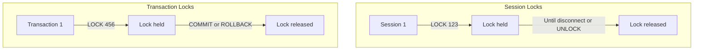

# How to Use Advisory Locks in PostgreSQL

Author: [nawazdhandala](https://www.github.com/nawazdhandala)

Tags: PostgreSQL, Database, Locking, Concurrency, Advisory Locks, Distributed Systems

Description: Learn how to use advisory locks in PostgreSQL for application-level locking. This guide covers session locks, transaction locks, and practical patterns for preventing race conditions.

---

Advisory locks in PostgreSQL provide application-level locking that allows you to coordinate access to resources across multiple database connections. Unlike row-level or table-level locks that PostgreSQL manages automatically, advisory locks are entirely under your control. They are perfect for preventing race conditions, implementing distributed locks, and coordinating background jobs.

---

## Understanding Advisory Locks

Advisory locks are "advisory" because PostgreSQL does not enforce them automatically. Your application must explicitly acquire and release them. They do not lock any actual database objects; they are simply named locks that your application uses for coordination.



---

## Types of Advisory Locks

### Session-Level Locks

```sql
-- Acquire session-level lock (blocks until available)
SELECT pg_advisory_lock(12345);

-- Try to acquire without blocking (returns true/false)
SELECT pg_try_advisory_lock(12345);

-- Release the lock
SELECT pg_advisory_unlock(12345);

-- Locks persist until:
-- 1. Explicitly released with pg_advisory_unlock
-- 2. Session disconnects
```

### Transaction-Level Locks

```sql
-- Acquire transaction-level lock
SELECT pg_advisory_xact_lock(12345);

-- Try to acquire without blocking
SELECT pg_try_advisory_xact_lock(12345);

-- Lock is automatically released when transaction ends
-- No need to call unlock
BEGIN;
SELECT pg_advisory_xact_lock(12345);
-- Do work...
COMMIT;  -- Lock automatically released
```

---

## Lock Key Types

Advisory locks can use either a single bigint key or two integers:

```sql
-- Single bigint key
SELECT pg_advisory_lock(123456789012345);

-- Two integer keys (useful for (table_id, row_id) patterns)
SELECT pg_advisory_lock(1, 100);  -- Lock for table 1, row 100

-- Using hash for string keys
SELECT pg_advisory_lock(hashtext('my-resource-name'));

-- Using combined keys
SELECT pg_advisory_lock(
    'users'::regclass::int,  -- Table OID
    42                        -- Row ID
);
```

---

## Practical Examples

### Preventing Duplicate Processing

```python
import psycopg2
import hashlib

def process_order(conn, order_id):
    """Process order with advisory lock to prevent duplicates"""
    cursor = conn.cursor()

    # Generate unique lock key from order_id
    lock_key = int(hashlib.md5(f"order-{order_id}".encode()).hexdigest()[:15], 16)

    # Try to acquire lock (non-blocking)
    cursor.execute("SELECT pg_try_advisory_lock(%s)", (lock_key,))
    acquired = cursor.fetchone()[0]

    if not acquired:
        print(f"Order {order_id} is already being processed")
        return False

    try:
        # Process the order
        cursor.execute("""
            UPDATE orders
            SET status = 'processing'
            WHERE id = %s AND status = 'pending'
        """, (order_id,))

        if cursor.rowcount == 0:
            print(f"Order {order_id} already processed")
            return False

        # Perform actual processing...
        do_order_processing(order_id)

        cursor.execute("""
            UPDATE orders SET status = 'completed' WHERE id = %s
        """, (order_id,))

        conn.commit()
        return True

    finally:
        # Always release the lock
        cursor.execute("SELECT pg_advisory_unlock(%s)", (lock_key,))

def do_order_processing(order_id):
    """Actual order processing logic"""
    pass
```

### Job Queue with Single Worker

```sql
-- Create job table
CREATE TABLE background_jobs (
    id SERIAL PRIMARY KEY,
    job_type TEXT NOT NULL,
    payload JSONB,
    status TEXT DEFAULT 'pending',
    locked_at TIMESTAMP,
    completed_at TIMESTAMP
);

-- Worker function to claim and process a job
CREATE OR REPLACE FUNCTION claim_next_job(p_job_type TEXT)
RETURNS TABLE(job_id INT, payload JSONB) AS $$
DECLARE
    v_job_id INT;
    v_payload JSONB;
BEGIN
    -- Find pending job
    SELECT j.id, j.payload INTO v_job_id, v_payload
    FROM background_jobs j
    WHERE j.job_type = p_job_type
    AND j.status = 'pending'
    ORDER BY j.id
    LIMIT 1
    FOR UPDATE SKIP LOCKED;  -- Skip jobs locked by others

    IF v_job_id IS NULL THEN
        RETURN;
    END IF;

    -- Try to get advisory lock on this job
    IF NOT pg_try_advisory_xact_lock(v_job_id) THEN
        RETURN;  -- Another worker got it
    END IF;

    -- Mark as locked
    UPDATE background_jobs
    SET status = 'processing', locked_at = NOW()
    WHERE id = v_job_id;

    job_id := v_job_id;
    payload := v_payload;
    RETURN NEXT;
END;
$$ LANGUAGE plpgsql;

-- Usage
BEGIN;
SELECT * FROM claim_next_job('send_email');
-- Process job...
UPDATE background_jobs SET status = 'completed', completed_at = NOW()
WHERE id = <job_id>;
COMMIT;  -- Advisory lock released
```

### Distributed Cron with Leader Election

```python
import psycopg2
import time
import os

def run_scheduled_task(conn, task_name, interval_seconds):
    """Run a scheduled task with distributed locking"""
    cursor = conn.cursor()

    # Use task name hash as lock key
    lock_key = hash(task_name) % (2**31)  # Ensure it fits in int4

    while True:
        try:
            # Try to become the leader for this task
            cursor.execute("SELECT pg_try_advisory_lock(%s)", (lock_key,))
            is_leader = cursor.fetchone()[0]

            if is_leader:
                print(f"[{os.getpid()}] Acquired lock, running {task_name}")
                try:
                    execute_task(task_name)
                except Exception as e:
                    print(f"Task failed: {e}")
                finally:
                    # Release lock so others can run next iteration
                    cursor.execute("SELECT pg_advisory_unlock(%s)", (lock_key,))
            else:
                print(f"[{os.getpid()}] Another instance has the lock")

        except psycopg2.Error as e:
            print(f"Database error: {e}")
            conn.rollback()

        time.sleep(interval_seconds)

def execute_task(task_name):
    """Execute the actual scheduled task"""
    print(f"Executing {task_name}...")
    time.sleep(2)  # Simulate work
    print(f"Completed {task_name}")
```

### Resource Pool Limiting

```sql
-- Limit concurrent access to external API
CREATE OR REPLACE FUNCTION call_external_api(p_payload JSONB)
RETURNS JSONB AS $$
DECLARE
    slot INT;
    result JSONB;
BEGIN
    -- Try to acquire one of 5 API slots
    FOR slot IN 1..5 LOOP
        IF pg_try_advisory_xact_lock(1000, slot) THEN
            -- Got a slot, make API call
            -- (In real code, use http extension or dblink)
            result := jsonb_build_object(
                'status', 'success',
                'slot', slot,
                'timestamp', NOW()
            );
            RETURN result;
        END IF;
    END LOOP;

    -- All slots busy
    RAISE EXCEPTION 'API rate limit exceeded, try again later';
END;
$$ LANGUAGE plpgsql;
```

---

## Monitoring Advisory Locks

```sql
-- View all advisory locks currently held
SELECT
    l.locktype,
    l.classid,
    l.objid,
    l.virtualtransaction,
    l.pid,
    l.mode,
    l.granted,
    a.usename,
    a.application_name,
    a.client_addr,
    a.query_start
FROM pg_locks l
JOIN pg_stat_activity a ON l.pid = a.pid
WHERE l.locktype = 'advisory'
ORDER BY l.pid, l.classid, l.objid;

-- Count advisory locks by session
SELECT
    pid,
    usename,
    application_name,
    COUNT(*) AS lock_count
FROM pg_locks l
JOIN pg_stat_activity a ON l.pid = a.pid
WHERE l.locktype = 'advisory'
GROUP BY pid, usename, application_name
ORDER BY lock_count DESC;

-- Find sessions holding specific lock
SELECT
    a.pid,
    a.usename,
    a.application_name,
    a.query_start,
    a.state,
    a.query
FROM pg_locks l
JOIN pg_stat_activity a ON l.pid = a.pid
WHERE l.locktype = 'advisory'
AND l.classid = 0  -- First key
AND l.objid = 12345  -- Second key (or only key for bigint)
AND l.granted = true;
```

---

## Lock Helper Functions

```sql
-- Create a named lock function
CREATE OR REPLACE FUNCTION acquire_named_lock(
    p_name TEXT,
    p_wait BOOLEAN DEFAULT true
)
RETURNS BOOLEAN AS $$
DECLARE
    lock_id BIGINT;
BEGIN
    -- Convert name to lock ID
    lock_id := hashtext(p_name);

    IF p_wait THEN
        PERFORM pg_advisory_lock(lock_id);
        RETURN true;
    ELSE
        RETURN pg_try_advisory_lock(lock_id);
    END IF;
END;
$$ LANGUAGE plpgsql;

CREATE OR REPLACE FUNCTION release_named_lock(p_name TEXT)
RETURNS BOOLEAN AS $$
BEGIN
    RETURN pg_advisory_unlock(hashtext(p_name));
END;
$$ LANGUAGE plpgsql;

-- Usage
SELECT acquire_named_lock('process-payments', false);
-- Do work
SELECT release_named_lock('process-payments');
```

---

## Common Patterns

### Mutex (Mutual Exclusion)

```python
from contextlib import contextmanager
import psycopg2

@contextmanager
def mutex(conn, resource_name):
    """Database-backed mutex using advisory locks"""
    cursor = conn.cursor()
    lock_id = hash(resource_name) % (2**63)  # bigint

    try:
        cursor.execute("SELECT pg_advisory_lock(%s)", (lock_id,))
        yield
    finally:
        cursor.execute("SELECT pg_advisory_unlock(%s)", (lock_id,))

# Usage
with mutex(conn, 'critical-section'):
    # Only one process can be here at a time
    perform_critical_operation()
```

### Read-Write Lock Pattern

```sql
-- Shared lock for readers (multiple readers allowed)
SELECT pg_advisory_lock_shared(12345);

-- Exclusive lock for writers (blocks readers and other writers)
SELECT pg_advisory_lock(12345);

-- Example: Multiple readers, single writer
-- Reader 1: SELECT pg_advisory_lock_shared(1);
-- Reader 2: SELECT pg_advisory_lock_shared(1);  -- OK, can acquire
-- Writer:   SELECT pg_advisory_lock(1);         -- Blocks until readers release

-- Release shared lock
SELECT pg_advisory_unlock_shared(12345);
```

### Lock with Timeout

```sql
-- Set lock timeout
SET lock_timeout = '5s';

-- Try to acquire lock (will fail after 5 seconds)
BEGIN;
SELECT pg_advisory_xact_lock(12345);
-- If another session holds the lock, this will wait up to 5s then error
COMMIT;

-- Or handle in application code with retry
DO $$
DECLARE
    attempts INT := 0;
    max_attempts INT := 3;
BEGIN
    LOOP
        IF pg_try_advisory_lock(12345) THEN
            -- Got the lock
            EXIT;
        END IF;

        attempts := attempts + 1;
        IF attempts >= max_attempts THEN
            RAISE EXCEPTION 'Could not acquire lock after % attempts', max_attempts;
        END IF;

        -- Wait and retry
        PERFORM pg_sleep(1);
    END LOOP;

    -- Do work with lock held
    PERFORM pg_advisory_unlock(12345);
END $$;
```

---

## Best Practices

1. **Use transaction locks when possible** - They auto-release on commit/rollback
2. **Always release session locks** - Use try/finally to ensure cleanup
3. **Use meaningful lock keys** - Hash resource names for readability
4. **Monitor lock usage** - Track held locks to detect leaks
5. **Set lock timeouts** - Prevent indefinite waits
6. **Document lock keys** - Keep a registry of what each key means
7. **Prefer pg_try_advisory_lock** - Non-blocking allows graceful handling

---

## Conclusion

Advisory locks in PostgreSQL provide a powerful, built-in mechanism for application-level coordination:

- **Session locks** persist until explicitly released or disconnect
- **Transaction locks** auto-release on commit/rollback
- **Shared locks** allow multiple readers
- **Exclusive locks** ensure single access

They are perfect for distributed job processing, rate limiting, and preventing race conditions without requiring external tools like Redis or ZooKeeper.

---

*Need to monitor your PostgreSQL advisory locks? [OneUptime](https://oneuptime.com) provides comprehensive database monitoring including lock tracking, contention alerts, and deadlock detection.*
