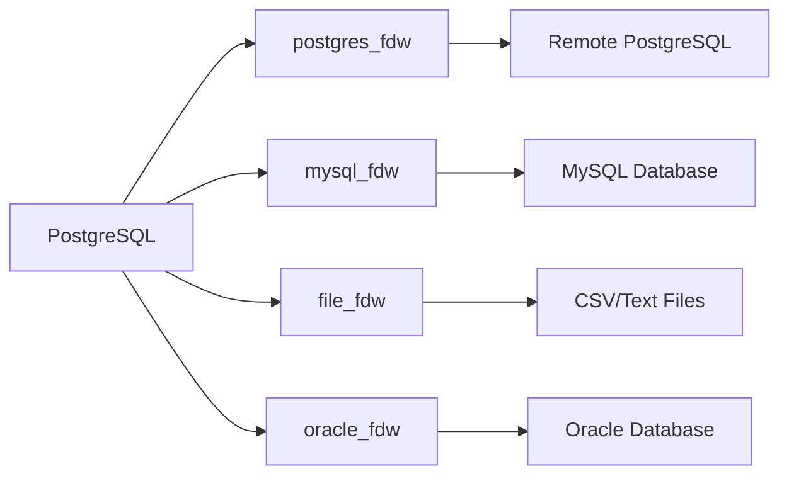

# How to Use Foreign Data Wrappers in PostgreSQL

Author: [nawazdhandala](https://www.github.com/nawazdhandala)

Tags: PostgreSQL, Database, Foreign Data Wrappers, FDW, Data Federation, Integration, SQL

Description: Learn how to use Foreign Data Wrappers (FDW) in PostgreSQL to query external data sources. This guide covers setup, configuration, and practical examples for connecting to remote databases and files.

---

Foreign Data Wrappers (FDW) allow PostgreSQL to access data stored in external systems as if they were local tables. You can query remote PostgreSQL databases, MySQL servers, CSV files, and many other data sources using standard SQL. This guide covers everything you need to know to start using FDWs effectively.

---

## What Are Foreign Data Wrappers?

FDWs implement the SQL/MED (Management of External Data) standard, allowing PostgreSQL to:

- Query remote PostgreSQL databases
- Access MySQL, Oracle, SQL Server, and other databases
- Read CSV, JSON, and other file formats
- Connect to web APIs and NoSQL databases
- Join local and remote data in single queries



---

## Setting Up postgres_fdw

The `postgres_fdw` extension is included with PostgreSQL and allows connecting to remote PostgreSQL servers.

### Step 1: Create the Extension

```sql
-- Enable the postgres_fdw extension
CREATE EXTENSION IF NOT EXISTS postgres_fdw;
```

### Step 2: Create a Foreign Server

```sql
-- Define the remote server connection
CREATE SERVER remote_server
FOREIGN DATA WRAPPER postgres_fdw
OPTIONS (
    host 'remote-db.example.com',
    port '5432',
    dbname 'remote_database'
);
```

### Step 3: Create User Mapping

```sql
-- Map local user to remote user credentials
CREATE USER MAPPING FOR local_user
SERVER remote_server
OPTIONS (
    user 'remote_user',
    password 'remote_password'
);

-- For all users (use with caution)
CREATE USER MAPPING FOR PUBLIC
SERVER remote_server
OPTIONS (
    user 'remote_user',
    password 'remote_password'
);
```

### Step 4: Create Foreign Tables

```sql
-- Method 1: Define foreign table manually
CREATE FOREIGN TABLE remote_customers (
    id INTEGER,
    name VARCHAR(100),
    email VARCHAR(255),
    created_at TIMESTAMP
)
SERVER remote_server
OPTIONS (
    schema_name 'public',
    table_name 'customers'
);

-- Method 2: Import schema automatically
IMPORT FOREIGN SCHEMA public
FROM SERVER remote_server
INTO local_schema;

-- Import specific tables only
IMPORT FOREIGN SCHEMA public
LIMIT TO (customers, orders, products)
FROM SERVER remote_server
INTO local_schema;
```

### Step 5: Query Foreign Tables

```sql
-- Query remote data like local tables
SELECT * FROM remote_customers WHERE created_at > '2026-01-01';

-- Join local and remote data
SELECT
    l.order_id,
    l.total,
    r.name AS customer_name,
    r.email
FROM local_orders l
JOIN remote_customers r ON l.customer_id = r.id
WHERE l.status = 'completed';
```

---

## Optimizing Foreign Data Wrapper Performance

### Use fetch_size for Large Result Sets

```sql
-- Set fetch size to retrieve rows in batches
ALTER FOREIGN TABLE remote_customers
OPTIONS (ADD fetch_size '1000');

-- Or specify during table creation
CREATE FOREIGN TABLE remote_large_table (
    id INTEGER,
    data TEXT
)
SERVER remote_server
OPTIONS (
    schema_name 'public',
    table_name 'large_table',
    fetch_size '10000'
);
```

### Enable Pushdown for Better Performance

```sql
-- Check if WHERE clause is pushed down
EXPLAIN VERBOSE
SELECT * FROM remote_customers WHERE id = 123;

-- Output should show:
-- Remote SQL: SELECT id, name, email FROM public.customers WHERE id = 123

-- Create server with explicit pushdown options
CREATE SERVER optimized_server
FOREIGN DATA WRAPPER postgres_fdw
OPTIONS (
    host 'remote-db.example.com',
    dbname 'remote_database',
    fetch_size '10000',
    use_remote_estimate 'true'  -- Use remote statistics
);
```

### Analyze Foreign Tables

```sql
-- Gather statistics for query planning
ANALYZE remote_customers;

-- Or use remote estimates
ALTER SERVER remote_server
OPTIONS (ADD use_remote_estimate 'true');
```

---

## Using file_fdw for CSV Files

The `file_fdw` extension allows querying CSV and text files directly.

### Setup file_fdw

```sql
-- Enable the extension
CREATE EXTENSION IF NOT EXISTS file_fdw;

-- Create server for file access
CREATE SERVER file_server
FOREIGN DATA WRAPPER file_fdw;

-- Create foreign table for CSV
CREATE FOREIGN TABLE csv_data (
    id INTEGER,
    name VARCHAR(100),
    value NUMERIC,
    date DATE
)
SERVER file_server
OPTIONS (
    filename '/var/lib/postgresql/data/imports/data.csv',
    format 'csv',
    header 'true',
    delimiter ','
);

-- Query the CSV file
SELECT * FROM csv_data WHERE value > 100;

-- Join with regular tables
SELECT
    c.name,
    c.value,
    t.category
FROM csv_data c
JOIN categories t ON c.id = t.data_id;
```

### Log File Analysis Example

```sql
-- Create foreign table for access logs
CREATE FOREIGN TABLE access_logs (
    ip_address INET,
    request_time TIMESTAMP,
    method VARCHAR(10),
    path TEXT,
    status_code INTEGER,
    response_size INTEGER
)
SERVER file_server
OPTIONS (
    filename '/var/log/nginx/access.log',
    format 'csv',
    delimiter ' '
);

-- Analyze traffic patterns
SELECT
    date_trunc('hour', request_time) AS hour,
    COUNT(*) AS requests,
    COUNT(*) FILTER (WHERE status_code >= 500) AS errors
FROM access_logs
WHERE request_time > NOW() - INTERVAL '24 hours'
GROUP BY 1
ORDER BY 1;
```

---

## Connecting to MySQL with mysql_fdw

### Install mysql_fdw

```bash
# Ubuntu/Debian
sudo apt-get install postgresql-14-mysql-fdw

# From source
git clone https://github.com/EnterpriseDB/mysql_fdw.git
cd mysql_fdw
make USE_PGXS=1
make USE_PGXS=1 install
```

### Configure mysql_fdw

```sql
-- Create extension
CREATE EXTENSION mysql_fdw;

-- Create server
CREATE SERVER mysql_server
FOREIGN DATA WRAPPER mysql_fdw
OPTIONS (
    host 'mysql-server.example.com',
    port '3306'
);

-- Create user mapping
CREATE USER MAPPING FOR postgres
SERVER mysql_server
OPTIONS (
    username 'mysql_user',
    password 'mysql_password'
);

-- Create foreign table
CREATE FOREIGN TABLE mysql_products (
    id INTEGER,
    name VARCHAR(255),
    price NUMERIC(10,2),
    stock INTEGER
)
SERVER mysql_server
OPTIONS (
    dbname 'shop',
    table_name 'products'
);

-- Query MySQL data
SELECT * FROM mysql_products WHERE stock < 10;
```

---

## Data Migration with FDW

Foreign Data Wrappers are excellent for data migration.

### One-Time Migration

```sql
-- Create target table
CREATE TABLE local_customers (
    id SERIAL PRIMARY KEY,
    name VARCHAR(100),
    email VARCHAR(255),
    created_at TIMESTAMP DEFAULT NOW()
);

-- Copy all data from remote
INSERT INTO local_customers (id, name, email, created_at)
SELECT id, name, email, created_at
FROM remote_customers;

-- Update sequence
SELECT setval('local_customers_id_seq', (SELECT MAX(id) FROM local_customers));
```

### Incremental Sync

```sql
-- Sync only new records
INSERT INTO local_customers (id, name, email, created_at)
SELECT id, name, email, created_at
FROM remote_customers r
WHERE r.created_at > (SELECT MAX(created_at) FROM local_customers)
ON CONFLICT (id) DO UPDATE SET
    name = EXCLUDED.name,
    email = EXCLUDED.email;

-- Create a procedure for regular sync
CREATE OR REPLACE PROCEDURE sync_customers()
LANGUAGE plpgsql
AS $$
DECLARE
    last_sync TIMESTAMP;
    synced_count INTEGER;
BEGIN
    -- Get last sync time
    SELECT MAX(created_at) INTO last_sync FROM local_customers;

    -- Sync new records
    INSERT INTO local_customers (id, name, email, created_at)
    SELECT id, name, email, created_at
    FROM remote_customers
    WHERE created_at > COALESCE(last_sync, '1970-01-01'::TIMESTAMP)
    ON CONFLICT (id) DO UPDATE SET
        name = EXCLUDED.name,
        email = EXCLUDED.email;

    GET DIAGNOSTICS synced_count = ROW_COUNT;

    RAISE NOTICE 'Synced % customers', synced_count;
END;
$$;

-- Run sync
CALL sync_customers();
```

---

## Writing to Foreign Tables

With postgres_fdw, you can also write to remote tables.

```sql
-- Insert into remote table
INSERT INTO remote_customers (name, email)
VALUES ('New Customer', 'new@example.com');

-- Update remote data
UPDATE remote_customers
SET email = 'updated@example.com'
WHERE id = 123;

-- Delete from remote table
DELETE FROM remote_customers
WHERE created_at < '2020-01-01';

-- Note: Check that the user mapping has write permissions
```

---

## Practical Examples

### Cross-Database Reporting

```sql
-- Combine data from multiple databases
CREATE VIEW unified_sales_report AS
SELECT
    'Region A' AS region,
    date,
    total_sales
FROM region_a_server.sales
UNION ALL
SELECT
    'Region B' AS region,
    date,
    total_sales
FROM region_b_server.sales;

-- Query the unified view
SELECT
    region,
    date_trunc('month', date) AS month,
    SUM(total_sales) AS monthly_sales
FROM unified_sales_report
GROUP BY 1, 2
ORDER BY 2, 1;
```

### Sharded Data Access

```sql
-- Access sharded customer data
CREATE VIEW all_customers AS
SELECT * FROM shard1_customers
UNION ALL
SELECT * FROM shard2_customers
UNION ALL
SELECT * FROM shard3_customers;

-- Query across all shards
SELECT COUNT(*) FROM all_customers;
```

### Real-Time Data Federation

```sql
-- Join live remote data with local analytics
SELECT
    a.customer_id,
    a.lifetime_value,
    r.last_order_date,
    r.total_orders
FROM local_analytics a
JOIN remote_customers r ON a.customer_id = r.id
WHERE a.segment = 'high_value'
ORDER BY a.lifetime_value DESC;
```

---

## Security Considerations

```sql
-- Store passwords in a password file instead of user mapping
-- Create .pgpass file on server: hostname:port:database:username:password

-- Use encrypted connections
CREATE SERVER secure_remote
FOREIGN DATA WRAPPER postgres_fdw
OPTIONS (
    host 'remote-db.example.com',
    port '5432',
    dbname 'secure_db',
    sslmode 'verify-full',
    sslcert '/path/to/client.crt',
    sslkey '/path/to/client.key',
    sslrootcert '/path/to/ca.crt'
);

-- Limit user access to specific foreign tables
REVOKE ALL ON FOREIGN TABLE remote_customers FROM PUBLIC;
GRANT SELECT ON FOREIGN TABLE remote_customers TO reporting_role;
```

---

## Monitoring FDW Performance

```sql
-- Check FDW statistics
SELECT
    foreign_table_name,
    total_calls,
    total_rows,
    total_time
FROM pg_stat_user_tables
WHERE foreign_table_name IS NOT NULL;

-- Use EXPLAIN to analyze query pushdown
EXPLAIN (VERBOSE, ANALYZE)
SELECT * FROM remote_customers
WHERE created_at > '2026-01-01';
```

---

## Conclusion

Foreign Data Wrappers extend PostgreSQL's capabilities far beyond local data:

- **postgres_fdw**: Connect to remote PostgreSQL databases
- **file_fdw**: Query CSV and text files as tables
- **mysql_fdw**: Access MySQL databases
- Many more FDWs available for MongoDB, Redis, S3, and others

FDWs are powerful tools for data federation, migration, and integration. Start with postgres_fdw for remote PostgreSQL access, and explore other wrappers as your needs grow.

---

*Need to monitor your federated PostgreSQL setup? [OneUptime](https://oneuptime.com) provides comprehensive monitoring for distributed databases including connection health, query performance, and cross-database metrics.*
