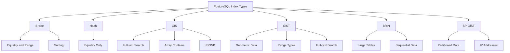

# How to Use Index Types Effectively in PostgreSQL

Author: [nawazdhandala](https://www.github.com/nawazdhandala)

Tags: PostgreSQL, Database, Indexing, Performance, Query Optimization, B-tree, GIN, GiST

Description: Learn how to choose and use the right index types in PostgreSQL. This guide covers B-tree, Hash, GIN, GiST, BRIN, and partial indexes with practical examples for optimal query performance.

---

PostgreSQL offers several index types, each optimized for different data patterns and query types. Choosing the right index can mean the difference between a query that runs in milliseconds versus one that takes minutes. This guide will help you understand when to use each index type and how to implement them effectively.

---

## Index Types Overview



---

## B-tree Index (Default)

B-tree is the default and most commonly used index type. It works well for equality and range queries on sortable data.

### When to Use B-tree

- Equality comparisons (`=`)
- Range queries (`<`, `>`, `<=`, `>=`, `BETWEEN`)
- Pattern matching with prefix (`LIKE 'abc%'`)
- Sorting (`ORDER BY`)
- `IS NULL` and `IS NOT NULL`

### B-tree Examples

```sql
-- Basic B-tree index (default)
CREATE INDEX idx_users_email ON users (email);

-- Multi-column B-tree index
-- Useful when queries filter on multiple columns
CREATE INDEX idx_orders_customer_date ON orders (customer_id, order_date);

-- B-tree index with specific sort order
-- Useful for queries that ORDER BY in specific direction
CREATE INDEX idx_orders_date_desc ON orders (order_date DESC);

-- B-tree index with NULLS ordering
CREATE INDEX idx_products_price ON products (price DESC NULLS LAST);
```

### Query Examples for B-tree

```sql
-- These queries will use the B-tree index on email
SELECT * FROM users WHERE email = 'user@example.com';  -- Equality
SELECT * FROM users WHERE email LIKE 'user%';           -- Prefix pattern
SELECT * FROM users WHERE email > 'a' AND email < 'b';  -- Range

-- Multi-column index usage
-- Full index used
SELECT * FROM orders WHERE customer_id = 100 AND order_date > '2026-01-01';
-- Partial index used (left-most column)
SELECT * FROM orders WHERE customer_id = 100;
-- Index NOT used (skips left column)
SELECT * FROM orders WHERE order_date > '2026-01-01';

-- Check if index is being used
EXPLAIN ANALYZE SELECT * FROM users WHERE email = 'user@example.com';
```

---

## Hash Index

Hash indexes are optimized for equality comparisons only. They are smaller and faster than B-tree for simple equality lookups.

### When to Use Hash

- Only equality comparisons (`=`)
- When you never need range queries on the column
- When index size matters (hash indexes are smaller)

### Hash Examples

```sql
-- Create hash index
CREATE INDEX idx_sessions_token ON sessions USING HASH (session_token);

-- Hash index on UUID columns is often efficient
CREATE INDEX idx_orders_uuid ON orders USING HASH (order_uuid);
```

### Hash Index Considerations

```sql
-- Hash index WILL be used for:
SELECT * FROM sessions WHERE session_token = 'abc123';

-- Hash index will NOT be used for:
SELECT * FROM sessions WHERE session_token LIKE 'abc%';  -- Pattern
SELECT * FROM sessions WHERE session_token > 'abc';       -- Range
SELECT * FROM sessions ORDER BY session_token;            -- Sorting
```

---

## GIN Index (Generalized Inverted Index)

GIN indexes are ideal for values that contain multiple elements, such as arrays, JSONB, and full-text search vectors.

### When to Use GIN

- Full-text search (`@@` operator)
- Array containment (`@>`, `<@`, `&&`)
- JSONB containment and existence
- Multiple values per row

### GIN for Full-Text Search

```sql
-- Create a tsvector column and GIN index for full-text search
ALTER TABLE articles ADD COLUMN search_vector tsvector;

UPDATE articles SET search_vector =
    to_tsvector('english', title || ' ' || content);

CREATE INDEX idx_articles_search ON articles USING GIN (search_vector);

-- Query using full-text search
SELECT title, ts_rank(search_vector, query) as rank
FROM articles, to_tsquery('english', 'postgresql & performance') query
WHERE search_vector @@ query
ORDER BY rank DESC;
```

### GIN for Arrays

```sql
-- Create table with array column
CREATE TABLE products (
    id SERIAL PRIMARY KEY,
    name TEXT,
    tags TEXT[]
);

-- Create GIN index on array column
CREATE INDEX idx_products_tags ON products USING GIN (tags);

-- Query using array operators
-- Find products with specific tag
SELECT * FROM products WHERE tags @> ARRAY['electronics'];

-- Find products with any of these tags
SELECT * FROM products WHERE tags && ARRAY['sale', 'new'];

-- Find products where all tags are in list
SELECT * FROM products WHERE tags <@ ARRAY['electronics', 'sale', 'new'];
```

### GIN for JSONB

```sql
-- Create table with JSONB column
CREATE TABLE events (
    id SERIAL PRIMARY KEY,
    data JSONB
);

-- Default GIN index supports @>, ?, ?|, ?& operators
CREATE INDEX idx_events_data ON events USING GIN (data);

-- For path-based queries, use jsonb_path_ops
CREATE INDEX idx_events_data_path ON events USING GIN (data jsonb_path_ops);

-- Query examples
-- Contains key-value
SELECT * FROM events WHERE data @> '{"type": "click"}';

-- Key exists
SELECT * FROM events WHERE data ? 'user_id';

-- Any key exists
SELECT * FROM events WHERE data ?| ARRAY['click', 'view'];
```

---

## GiST Index (Generalized Search Tree)

GiST indexes support complex data types and operators, particularly useful for geometric and range data.

### When to Use GiST

- Geometric data (points, boxes, polygons)
- Range types (tsrange, int4range)
- Network addresses (inet, cidr)
- Full-text search (alternative to GIN)
- Nearest-neighbor searches

### GiST for Geometric Data

```sql
-- Create table with geometric data
CREATE TABLE locations (
    id SERIAL PRIMARY KEY,
    name TEXT,
    coordinates POINT
);

-- Create GiST index for geometric queries
CREATE INDEX idx_locations_coords ON locations USING GiST (coordinates);

-- Find locations within a box
SELECT * FROM locations
WHERE coordinates <@ box '((0,0),(10,10))';

-- Find nearest locations (requires pg_trgm extension for KNN)
SELECT name, coordinates <-> point '(5,5)' as distance
FROM locations
ORDER BY coordinates <-> point '(5,5)'
LIMIT 10;
```

### GiST for Range Types

```sql
-- Create table with time ranges
CREATE TABLE reservations (
    id SERIAL PRIMARY KEY,
    room_id INTEGER,
    during TSRANGE,
    EXCLUDE USING GiST (room_id WITH =, during WITH &&)  -- Prevent overlaps
);

-- Create GiST index on range column
CREATE INDEX idx_reservations_during ON reservations USING GiST (during);

-- Find overlapping reservations
SELECT * FROM reservations
WHERE during && tsrange('2026-01-25 10:00', '2026-01-25 12:00');

-- Find reservations containing a timestamp
SELECT * FROM reservations
WHERE during @> '2026-01-25 11:00'::timestamp;
```

---

## BRIN Index (Block Range Index)

BRIN indexes are compact indexes designed for very large tables where data is physically ordered.

### When to Use BRIN

- Very large tables (millions of rows)
- Data that is naturally ordered (timestamps, sequential IDs)
- When disk space is a concern
- When you can tolerate slightly less precise index scans

### BRIN Examples

```sql
-- Create BRIN index on timestamp column
-- Ideal for append-only log tables
CREATE INDEX idx_logs_created ON logs USING BRIN (created_at);

-- Create BRIN with custom pages per range
-- Smaller = more precise but larger index
CREATE INDEX idx_events_time ON events USING BRIN (event_time)
WITH (pages_per_range = 64);

-- Check BRIN index effectiveness
SELECT * FROM brin_page_items(
    get_raw_page('idx_logs_created', 0),
    'idx_logs_created'
);
```

### BRIN Size Comparison

```sql
-- Compare index sizes
SELECT
    indexrelname,
    pg_size_pretty(pg_relation_size(indexrelid)) as size
FROM pg_stat_user_indexes
WHERE schemaname = 'public'
AND relname = 'large_table'
ORDER BY pg_relation_size(indexrelid) DESC;

-- Typical comparison for 100M row table:
-- B-tree: ~2GB
-- BRIN:   ~128KB
```

---

## Partial Indexes

Partial indexes cover only a subset of rows, making them smaller and more efficient for specific query patterns.

```sql
-- Index only active users
CREATE INDEX idx_users_active_email ON users (email)
WHERE is_active = true;

-- Index only recent orders
CREATE INDEX idx_orders_recent ON orders (customer_id, created_at)
WHERE created_at > '2025-01-01';

-- Index only non-null values
CREATE INDEX idx_products_discount ON products (discount_percent)
WHERE discount_percent IS NOT NULL;

-- Partial unique constraint
CREATE UNIQUE INDEX idx_users_email_active ON users (email)
WHERE deleted_at IS NULL;
```

### Partial Index Usage

```sql
-- This query will use the partial index
SELECT * FROM users WHERE email = 'test@example.com' AND is_active = true;

-- This query will NOT use the partial index
SELECT * FROM users WHERE email = 'test@example.com' AND is_active = false;
```

---

## Expression Indexes

Index the result of an expression rather than a column directly.

```sql
-- Index on lowercase email for case-insensitive lookups
CREATE INDEX idx_users_email_lower ON users (LOWER(email));

-- Query that uses the expression index
SELECT * FROM users WHERE LOWER(email) = 'user@example.com';

-- Index on date part of timestamp
CREATE INDEX idx_orders_date ON orders (DATE(created_at));

-- Query using the date expression
SELECT * FROM orders WHERE DATE(created_at) = '2026-01-25';

-- Index on JSONB expression
CREATE INDEX idx_events_user ON events ((data->>'user_id'));

-- Query using JSONB expression
SELECT * FROM events WHERE data->>'user_id' = '12345';
```

---

## Index Selection Cheat Sheet

| Data Type / Query Pattern | Recommended Index |
|--------------------------|-------------------|
| Equality and range on scalar | B-tree |
| Only equality lookups | Hash |
| Full-text search | GIN or GiST |
| Array containment | GIN |
| JSONB queries | GIN |
| Geometric/spatial | GiST |
| Range overlap | GiST |
| Nearest neighbor | GiST |
| Large table, ordered data | BRIN |
| Case-insensitive search | Expression (B-tree) |
| Filtered subset of rows | Partial |

---

## Monitoring Index Usage

```sql
-- Find unused indexes
SELECT
    schemaname,
    relname as table_name,
    indexrelname as index_name,
    idx_scan as times_used,
    pg_size_pretty(pg_relation_size(indexrelid)) as size
FROM pg_stat_user_indexes
WHERE idx_scan = 0
AND indexrelname NOT LIKE '%_pkey'
ORDER BY pg_relation_size(indexrelid) DESC;

-- Find indexes with low usage
SELECT
    relname as table_name,
    indexrelname as index_name,
    idx_scan as scans,
    idx_tup_read as tuples_read,
    idx_tup_fetch as tuples_fetched
FROM pg_stat_user_indexes
ORDER BY idx_scan ASC
LIMIT 20;
```

---

## Conclusion

Choosing the right index type is crucial for PostgreSQL performance. Here are the key takeaways:

- **B-tree**: Default choice for most scenarios. Works for equality, range, and sorting.
- **Hash**: Use for equality-only lookups on large values.
- **GIN**: Use for arrays, JSONB, and full-text search.
- **GiST**: Use for geometric data, ranges, and nearest-neighbor queries.
- **BRIN**: Use for very large, naturally ordered tables.
- **Partial**: Use to reduce index size when queries always filter on specific conditions.

Always verify index usage with `EXPLAIN ANALYZE` and monitor index statistics to ensure your indexes are actually being used.

---

*Need to monitor your PostgreSQL index performance? [OneUptime](https://oneuptime.com) provides comprehensive database monitoring including index usage tracking, query analysis, and performance alerts.*
