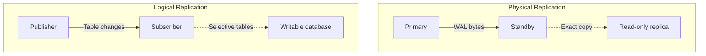

# How to Use Logical Replication in PostgreSQL

Author: [nawazdhandala](https://www.github.com/nawazdhandala)

Tags: PostgreSQL, Database, Replication, Logical Replication, High Availability, Data Sync

Description: Learn how to set up and use logical replication in PostgreSQL. This guide covers publishers, subscribers, selective replication, and practical use cases for data synchronization.

---

Logical replication in PostgreSQL allows you to replicate data changes between databases at the logical level, meaning you can selectively replicate specific tables, transform data during replication, and even replicate between different PostgreSQL versions. Unlike physical replication which copies entire database clusters, logical replication gives you fine-grained control over what data flows between databases.

---

## Physical vs Logical Replication



| Feature | Physical | Logical |
|---------|----------|---------|
| Granularity | Entire cluster | Per-table |
| Target writable | No | Yes |
| Cross-version | No | Yes |
| Schema changes | Automatic | Manual |
| Use case | HA failover | Data distribution |

---

## Setting Up Logical Replication

### Step 1: Configure the Publisher

On the source database server, update `postgresql.conf`:

```ini
# postgresql.conf on publisher

# Required for logical replication
wal_level = logical

# Allow replication connections
max_replication_slots = 10
max_wal_senders = 10
```

Update `pg_hba.conf` to allow replication connections:

```
# pg_hba.conf
# Allow replication from subscriber IP
host    replication     replication_user    192.168.1.0/24    scram-sha-256
host    all             replication_user    192.168.1.0/24    scram-sha-256
```

Restart PostgreSQL:

```bash
sudo systemctl restart postgresql
```

### Step 2: Create Publication

```sql
-- Connect to publisher database
-- Create a user for replication
CREATE USER replication_user WITH REPLICATION PASSWORD 'secure_password';
GRANT SELECT ON ALL TABLES IN SCHEMA public TO replication_user;

-- Create publication for all tables
CREATE PUBLICATION my_publication FOR ALL TABLES;

-- Or create publication for specific tables
CREATE PUBLICATION orders_publication FOR TABLE orders, order_items, customers;

-- Check publication
SELECT * FROM pg_publication;
```

### Step 3: Configure the Subscriber

On the target database server:

```sql
-- Create the same table structure (schema must match)
-- You can use pg_dump --schema-only to copy schema

-- Create subscription
CREATE SUBSCRIPTION my_subscription
CONNECTION 'host=192.168.1.10 port=5432 dbname=source_db user=replication_user password=secure_password'
PUBLICATION my_publication;

-- Check subscription status
SELECT * FROM pg_subscription;
SELECT * FROM pg_stat_subscription;
```

---

## Managing Publications

### Create Publications

```sql
-- Publication for all tables
CREATE PUBLICATION all_tables FOR ALL TABLES;

-- Publication for specific tables
CREATE PUBLICATION selected_tables FOR TABLE users, orders, products;

-- Publication with row filtering (PostgreSQL 15+)
CREATE PUBLICATION active_users FOR TABLE users WHERE (status = 'active');

-- Publication with column filtering (PostgreSQL 15+)
CREATE PUBLICATION public_data FOR TABLE users (id, name, created_at);
-- Excludes sensitive columns like email, password_hash
```

### Modify Publications

```sql
-- Add table to publication
ALTER PUBLICATION my_publication ADD TABLE new_table;

-- Remove table from publication
ALTER PUBLICATION my_publication DROP TABLE old_table;

-- Change publication to replicate all tables
ALTER PUBLICATION my_publication SET ALL TABLES;

-- View tables in publication
SELECT * FROM pg_publication_tables WHERE pubname = 'my_publication';
```

---

## Managing Subscriptions

### Create and Configure Subscriptions

```sql
-- Basic subscription
CREATE SUBSCRIPTION my_sub
CONNECTION 'host=publisher.example.com dbname=mydb user=rep_user password=pass'
PUBLICATION my_publication;

-- Subscription without initial data copy
CREATE SUBSCRIPTION my_sub
CONNECTION 'host=publisher.example.com dbname=mydb user=rep_user password=pass'
PUBLICATION my_publication
WITH (copy_data = false);

-- Subscription with custom slot name
CREATE SUBSCRIPTION my_sub
CONNECTION 'host=publisher.example.com dbname=mydb user=rep_user password=pass'
PUBLICATION my_publication
WITH (slot_name = 'my_custom_slot');
```

### Manage Subscriptions

```sql
-- Pause replication
ALTER SUBSCRIPTION my_sub DISABLE;

-- Resume replication
ALTER SUBSCRIPTION my_sub ENABLE;

-- Refresh subscription (pick up new tables)
ALTER SUBSCRIPTION my_sub REFRESH PUBLICATION;

-- Change connection string
ALTER SUBSCRIPTION my_sub CONNECTION 'host=new_publisher.example.com ...';

-- Drop subscription
DROP SUBSCRIPTION my_sub;
```

### Monitor Replication

```sql
-- Check subscription status
SELECT
    subname,
    subenabled,
    subconninfo,
    subslotname
FROM pg_subscription;

-- Check replication lag
SELECT
    slot_name,
    confirmed_flush_lsn,
    pg_current_wal_lsn(),
    pg_size_pretty(pg_wal_lsn_diff(pg_current_wal_lsn(), confirmed_flush_lsn)) AS replication_lag
FROM pg_replication_slots
WHERE slot_type = 'logical';

-- Check worker status
SELECT
    pid,
    subname,
    received_lsn,
    latest_end_lsn,
    last_msg_receipt_time
FROM pg_stat_subscription;
```

---

## Practical Use Cases

### Use Case 1: Data Distribution to Reporting Database

```sql
-- Publisher (OLTP database)
CREATE PUBLICATION reporting_pub
FOR TABLE orders, customers, products
WITH (publish = 'insert, update');  -- No deletes

-- Subscriber (Reporting database)
CREATE SUBSCRIPTION reporting_sub
CONNECTION 'host=oltp.example.com dbname=production user=rep_user password=pass'
PUBLICATION reporting_pub;

-- On subscriber, create aggregation tables
CREATE MATERIALIZED VIEW daily_sales AS
SELECT
    date_trunc('day', order_date) AS day,
    sum(total) AS total_sales,
    count(*) AS order_count
FROM orders
GROUP BY 1;
```

### Use Case 2: Zero-Downtime PostgreSQL Upgrade

```sql
-- Step 1: Set up new PostgreSQL version as subscriber
-- On old server (v12):
CREATE PUBLICATION upgrade_pub FOR ALL TABLES;

-- On new server (v15):
CREATE SUBSCRIPTION upgrade_sub
CONNECTION 'host=old-server.example.com dbname=mydb user=rep_user password=pass'
PUBLICATION upgrade_pub;

-- Step 2: Wait for initial sync to complete
SELECT * FROM pg_stat_subscription;

-- Step 3: When caught up, switch applications to new server
-- Step 4: Drop subscription
DROP SUBSCRIPTION upgrade_sub;
```

### Use Case 3: Multi-Region Data Sync

```sql
-- Region A (US)
CREATE PUBLICATION region_a_pub FOR TABLE users WHERE (region = 'us');

-- Region B (EU)
CREATE SUBSCRIPTION region_a_sub
CONNECTION 'host=us-db.example.com dbname=mydb user=rep_user password=pass'
PUBLICATION region_a_pub;

-- Region B also publishes its data
CREATE PUBLICATION region_b_pub FOR TABLE users WHERE (region = 'eu');

-- Region A subscribes to Region B
-- (Bidirectional replication - be careful with conflicts!)
```

### Use Case 4: Selective Table Sync for Microservices

```sql
-- Central database publishes specific tables to each service

-- For User Service
CREATE PUBLICATION user_service_pub FOR TABLE users, user_profiles;

-- For Order Service
CREATE PUBLICATION order_service_pub FOR TABLE orders, order_items;

-- For Inventory Service
CREATE PUBLICATION inventory_pub FOR TABLE products, inventory;

-- Each service subscribes only to what it needs
-- User Service database:
CREATE SUBSCRIPTION user_data
CONNECTION 'host=central.example.com ...'
PUBLICATION user_service_pub;
```

---

## Handling Schema Changes

Logical replication does not automatically replicate schema changes.

### Adding Columns

```sql
-- 1. Add column on subscriber first
ALTER TABLE orders ADD COLUMN tracking_number VARCHAR(50);

-- 2. Add column on publisher
ALTER TABLE orders ADD COLUMN tracking_number VARCHAR(50);

-- New column is now replicated
```

### Removing Columns

```sql
-- 1. Remove column on publisher first
ALTER TABLE orders DROP COLUMN old_column;

-- 2. Remove column on subscriber
ALTER TABLE orders DROP COLUMN old_column;
```

### Adding Tables

```sql
-- 1. Create table on subscriber
CREATE TABLE new_table (...);

-- 2. Create table on publisher
CREATE TABLE new_table (...);

-- 3. Add to publication
ALTER PUBLICATION my_publication ADD TABLE new_table;

-- 4. Refresh subscription
ALTER SUBSCRIPTION my_subscription REFRESH PUBLICATION;
```

---

## Conflict Resolution

Logical replication can have conflicts when the subscriber has local changes.

### Detecting Conflicts

```sql
-- Check for errors in PostgreSQL logs
-- Or monitor pg_stat_subscription

SELECT * FROM pg_stat_subscription
WHERE latest_end_lsn IS NULL;  -- Indicates possible problem
```

### Handling Conflicts

```sql
-- Option 1: Skip the conflicting transaction
-- Find the LSN of the conflict in logs, then:
ALTER SUBSCRIPTION my_sub DISABLE;
SELECT pg_replication_origin_advance('pg_<sub_oid>', 'X/XXXXXXXX');
ALTER SUBSCRIPTION my_sub ENABLE;

-- Option 2: Fix the conflict manually
-- Delete the conflicting row on subscriber
DELETE FROM orders WHERE id = 12345;
-- Then re-enable subscription
```

---

## Monitoring and Troubleshooting

### Health Check Queries

```sql
-- Publisher: Check replication slots
SELECT
    slot_name,
    plugin,
    slot_type,
    active,
    pg_size_pretty(pg_wal_lsn_diff(pg_current_wal_lsn(), restart_lsn)) AS retained_wal
FROM pg_replication_slots;

-- Subscriber: Check replication status
SELECT
    s.subname,
    s.subenabled,
    w.pid IS NOT NULL AS worker_running,
    w.received_lsn,
    w.latest_end_lsn
FROM pg_subscription s
LEFT JOIN pg_stat_subscription w ON s.oid = w.subid;

-- Check for replication lag
SELECT
    client_addr,
    state,
    sent_lsn,
    write_lsn,
    flush_lsn,
    replay_lsn,
    pg_size_pretty(pg_wal_lsn_diff(sent_lsn, replay_lsn)) AS lag
FROM pg_stat_replication;
```

### Common Issues

```sql
-- Issue: Subscription worker not starting
-- Check PostgreSQL logs for error messages
-- Common causes: connection issues, permission denied

-- Issue: Replication lag growing
-- Check for long-running transactions on subscriber
SELECT * FROM pg_stat_activity
WHERE state = 'active' AND xact_start < NOW() - INTERVAL '5 minutes';

-- Issue: WAL accumulating on publisher
-- Inactive replication slot holding WAL
SELECT pg_drop_replication_slot('inactive_slot_name');
```

---

## Best Practices

1. **Test thoroughly** before production deployment
2. **Monitor replication lag** continuously
3. **Plan for schema changes** - coordinate between publisher and subscriber
4. **Use row filtering** to reduce replication volume when possible
5. **Handle conflicts** - decide on strategy before they occur
6. **Clean up unused slots** - they retain WAL indefinitely
7. **Document your setup** - track what replicates where

---

## Conclusion

Logical replication in PostgreSQL provides flexible, selective data replication that enables:

- **Data distribution** to reporting and analytics databases
- **Zero-downtime upgrades** between PostgreSQL versions
- **Multi-region sync** for geographically distributed applications
- **Microservice data isolation** with selective table access

With proper setup and monitoring, logical replication is a powerful tool for building scalable, distributed database architectures.

---

*Need to monitor your PostgreSQL replication? [OneUptime](https://oneuptime.com) provides comprehensive replication monitoring including lag tracking, slot health, and automatic alerting for replication issues.*
