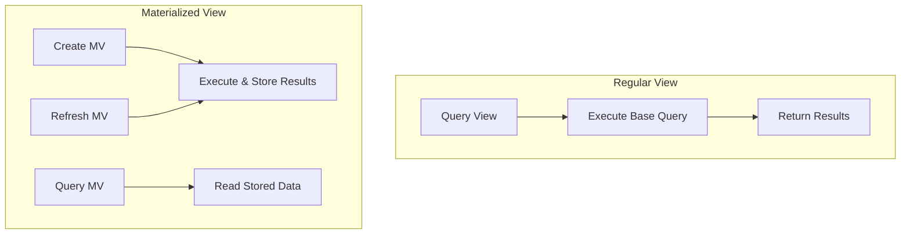

# How to Use Materialized Views in PostgreSQL

Author: [nawazdhandala](https://www.github.com/nawazdhandala)

Tags: PostgreSQL, Database, Materialized Views, Performance, Query Optimization, Caching, SQL

Description: Learn how to use materialized views in PostgreSQL to improve query performance. This guide covers creation, refresh strategies, indexing, and best practices for caching expensive queries.

---

Materialized views store the result of a query physically on disk, allowing you to pre-compute expensive operations and query the results instantly. Unlike regular views which execute their query every time, materialized views cache the data until you explicitly refresh them. This makes them ideal for reporting, dashboards, and any scenario where query speed matters more than real-time accuracy.

---

## Materialized Views vs Regular Views



| Feature | Regular View | Materialized View |
|---------|--------------|-------------------|
| Data storage | None (virtual) | Physical on disk |
| Query speed | Depends on base query | Fast (reads stored data) |
| Data freshness | Always current | Stale until refreshed |
| Indexable | No | Yes |
| Use case | Simple aliases, security | Expensive aggregations, reports |

---

## Creating Materialized Views

### Basic Syntax

```sql
-- Create materialized view with data
CREATE MATERIALIZED VIEW sales_summary AS
SELECT
    date_trunc('month', sale_date) AS month,
    product_category,
    SUM(amount) AS total_sales,
    COUNT(*) AS transaction_count,
    AVG(amount) AS avg_sale
FROM sales
GROUP BY 1, 2
WITH DATA;  -- Populate immediately

-- Create without populating (faster creation)
CREATE MATERIALIZED VIEW large_summary AS
SELECT * FROM expensive_query
WITH NO DATA;  -- Populate later with REFRESH

-- Query like a regular table
SELECT * FROM sales_summary
WHERE month >= '2026-01-01'
ORDER BY total_sales DESC;
```

### Practical Example: Dashboard Metrics

```sql
-- Create materialized view for dashboard
CREATE MATERIALIZED VIEW dashboard_metrics AS
SELECT
    -- Time dimensions
    date_trunc('day', created_at) AS day,
    date_trunc('week', created_at) AS week,
    date_trunc('month', created_at) AS month,

    -- User metrics
    COUNT(DISTINCT user_id) AS unique_users,
    COUNT(*) AS total_events,

    -- Revenue metrics
    SUM(CASE WHEN event_type = 'purchase' THEN amount ELSE 0 END) AS revenue,
    COUNT(CASE WHEN event_type = 'purchase' THEN 1 END) AS purchases,

    -- Engagement metrics
    COUNT(CASE WHEN event_type = 'pageview' THEN 1 END) AS pageviews,
    COUNT(CASE WHEN event_type = 'signup' THEN 1 END) AS signups

FROM events
WHERE created_at >= NOW() - INTERVAL '1 year'
GROUP BY 1, 2, 3;

-- Add indexes for common queries
CREATE INDEX idx_dashboard_day ON dashboard_metrics (day);
CREATE INDEX idx_dashboard_month ON dashboard_metrics (month);

-- Fast dashboard queries
SELECT
    day,
    unique_users,
    revenue,
    purchases
FROM dashboard_metrics
WHERE day >= NOW() - INTERVAL '30 days'
ORDER BY day;
```

---

## Refreshing Materialized Views

### Manual Refresh

```sql
-- Standard refresh (locks the view during refresh)
REFRESH MATERIALIZED VIEW sales_summary;

-- Concurrent refresh (allows reads during refresh)
-- Requires a unique index
CREATE UNIQUE INDEX idx_sales_summary_unique
ON sales_summary (month, product_category);

REFRESH MATERIALIZED VIEW CONCURRENTLY sales_summary;
```

### Refresh Trade-offs

| Refresh Type | Pros | Cons |
|--------------|------|------|
| Standard | Faster, no index needed | Blocks reads during refresh |
| Concurrent | No blocking | Requires unique index, slower |

### Scheduled Refresh with pg_cron

```sql
-- Install pg_cron extension
CREATE EXTENSION pg_cron;

-- Schedule hourly refresh
SELECT cron.schedule(
    'refresh_sales_summary',
    '0 * * * *',  -- Every hour
    'REFRESH MATERIALIZED VIEW CONCURRENTLY sales_summary'
);

-- Schedule daily refresh at 3 AM
SELECT cron.schedule(
    'refresh_dashboard',
    '0 3 * * *',
    'REFRESH MATERIALIZED VIEW dashboard_metrics'
);

-- View scheduled jobs
SELECT * FROM cron.job;

-- Remove a scheduled job
SELECT cron.unschedule('refresh_sales_summary');
```

### Refresh with Shell Script

```bash
#!/bin/bash
# refresh_views.sh

DB_HOST="localhost"
DB_NAME="mydb"
DB_USER="postgres"

# Refresh materialized views
psql -h "$DB_HOST" -U "$DB_USER" -d "$DB_NAME" <<EOF
-- Refresh with timing
\timing on

-- Refresh views in order of dependency
REFRESH MATERIALIZED VIEW CONCURRENTLY base_metrics;
REFRESH MATERIALIZED VIEW CONCURRENTLY daily_summary;
REFRESH MATERIALIZED VIEW CONCURRENTLY dashboard_metrics;

-- Update statistics
ANALYZE base_metrics;
ANALYZE daily_summary;
ANALYZE dashboard_metrics;
EOF

# Add to crontab:
# 0 * * * * /path/to/refresh_views.sh >> /var/log/mv_refresh.log 2>&1
```

---

## Indexing Materialized Views

One major advantage of materialized views is that you can add indexes:

```sql
-- Create materialized view
CREATE MATERIALIZED VIEW order_analytics AS
SELECT
    customer_id,
    DATE(order_date) AS order_day,
    COUNT(*) AS order_count,
    SUM(total) AS daily_total
FROM orders
GROUP BY 1, 2;

-- Add indexes for common access patterns
-- Index for customer lookups
CREATE INDEX idx_order_analytics_customer
ON order_analytics (customer_id);

-- Index for date range queries
CREATE INDEX idx_order_analytics_day
ON order_analytics (order_day DESC);

-- Composite index for customer + date queries
CREATE INDEX idx_order_analytics_customer_day
ON order_analytics (customer_id, order_day DESC);

-- Unique index for concurrent refresh
CREATE UNIQUE INDEX idx_order_analytics_unique
ON order_analytics (customer_id, order_day);

-- Check index usage
SELECT
    indexrelname,
    idx_scan,
    idx_tup_read,
    idx_tup_fetch
FROM pg_stat_user_indexes
WHERE relname = 'order_analytics';
```

---

## Advanced Patterns

### Incremental Refresh Pattern

PostgreSQL does not support incremental refresh natively, but you can simulate it:

```sql
-- Create a tracking table
CREATE TABLE mv_refresh_log (
    view_name TEXT PRIMARY KEY,
    last_refresh TIMESTAMP,
    last_source_update TIMESTAMP
);

-- Create materialized view
CREATE MATERIALIZED VIEW incremental_summary AS
SELECT
    date_trunc('day', event_time) AS day,
    COUNT(*) AS event_count
FROM events
GROUP BY 1;

-- Function to check if refresh is needed
CREATE OR REPLACE FUNCTION needs_refresh(view_name TEXT)
RETURNS BOOLEAN AS $$
DECLARE
    last_refresh TIMESTAMP;
    latest_data TIMESTAMP;
BEGIN
    -- Get last refresh time
    SELECT mr.last_refresh INTO last_refresh
    FROM mv_refresh_log mr
    WHERE mr.view_name = needs_refresh.view_name;

    -- Get latest data timestamp (adjust for your table)
    SELECT MAX(event_time) INTO latest_data FROM events;

    -- Refresh if new data exists
    RETURN latest_data > COALESCE(last_refresh, '1970-01-01'::TIMESTAMP);
END;
$$ LANGUAGE plpgsql;

-- Function to refresh only if needed
CREATE OR REPLACE PROCEDURE smart_refresh(view_name TEXT)
LANGUAGE plpgsql
AS $$
BEGIN
    IF needs_refresh(view_name) THEN
        EXECUTE format('REFRESH MATERIALIZED VIEW CONCURRENTLY %I', view_name);

        INSERT INTO mv_refresh_log (view_name, last_refresh, last_source_update)
        VALUES (view_name, NOW(), (SELECT MAX(event_time) FROM events))
        ON CONFLICT (view_name) DO UPDATE SET
            last_refresh = EXCLUDED.last_refresh,
            last_source_update = EXCLUDED.last_source_update;

        RAISE NOTICE 'Refreshed %', view_name;
    ELSE
        RAISE NOTICE 'No refresh needed for %', view_name;
    END IF;
END;
$$;

-- Use smart refresh
CALL smart_refresh('incremental_summary');
```

### Stacking Materialized Views

```sql
-- Base materialized view (refreshed frequently)
CREATE MATERIALIZED VIEW hourly_events AS
SELECT
    date_trunc('hour', event_time) AS hour,
    event_type,
    COUNT(*) AS count
FROM events
WHERE event_time >= NOW() - INTERVAL '7 days'
GROUP BY 1, 2;

CREATE UNIQUE INDEX ON hourly_events (hour, event_type);

-- Higher-level view built on first (refreshed less frequently)
CREATE MATERIALIZED VIEW daily_events AS
SELECT
    date_trunc('day', hour) AS day,
    event_type,
    SUM(count) AS count
FROM hourly_events
GROUP BY 1, 2;

CREATE UNIQUE INDEX ON daily_events (day, event_type);

-- Refresh in order
REFRESH MATERIALIZED VIEW CONCURRENTLY hourly_events;
REFRESH MATERIALIZED VIEW CONCURRENTLY daily_events;
```

### Partitioned Data with Materialized Views

```sql
-- Create partitioned table
CREATE TABLE events (
    id SERIAL,
    event_time TIMESTAMP,
    event_type TEXT,
    user_id INTEGER
) PARTITION BY RANGE (event_time);

-- Create partitions
CREATE TABLE events_2026_01 PARTITION OF events
FOR VALUES FROM ('2026-01-01') TO ('2026-02-01');

-- Materialized view for current partition only
CREATE MATERIALIZED VIEW current_month_summary AS
SELECT
    date_trunc('day', event_time) AS day,
    event_type,
    COUNT(DISTINCT user_id) AS unique_users,
    COUNT(*) AS event_count
FROM events
WHERE event_time >= date_trunc('month', NOW())
GROUP BY 1, 2;

-- This is faster to refresh since it only reads current partition
```

---

## Monitoring Materialized Views

```sql
-- Check materialized view sizes
SELECT
    schemaname,
    matviewname,
    pg_size_pretty(pg_relation_size(schemaname || '.' || matviewname)) AS size
FROM pg_matviews
ORDER BY pg_relation_size(schemaname || '.' || matviewname) DESC;

-- Check if materialized view has data
SELECT
    matviewname,
    ispopulated
FROM pg_matviews;

-- Monitor refresh duration (requires logging)
CREATE TABLE mv_refresh_metrics (
    view_name TEXT,
    refresh_start TIMESTAMP,
    refresh_end TIMESTAMP,
    duration INTERVAL,
    row_count BIGINT
);

-- Wrapper function to log refresh metrics
CREATE OR REPLACE PROCEDURE logged_refresh(view_name TEXT)
LANGUAGE plpgsql
AS $$
DECLARE
    start_time TIMESTAMP;
    end_time TIMESTAMP;
    rows BIGINT;
BEGIN
    start_time := clock_timestamp();

    EXECUTE format('REFRESH MATERIALIZED VIEW CONCURRENTLY %I', view_name);

    end_time := clock_timestamp();

    EXECUTE format('SELECT COUNT(*) FROM %I', view_name) INTO rows;

    INSERT INTO mv_refresh_metrics
    VALUES (view_name, start_time, end_time, end_time - start_time, rows);
END;
$$;
```

---

## Best Practices

1. **Add unique indexes** for concurrent refresh capability
2. **Schedule refreshes** during low-traffic periods
3. **Monitor refresh duration** to catch performance degradation
4. **Use WITH NO DATA** for large views to separate creation from population
5. **Index based on query patterns**, not just for concurrent refresh
6. **Consider data freshness requirements** when setting refresh frequency
7. **Stack views** for complex aggregations to enable partial refreshes

---

## When to Use Materialized Views

**Good use cases:**
- Dashboard and reporting queries
- Expensive aggregations that are queried frequently
- Pre-computed joins for read-heavy workloads
- Data that does not need to be real-time

**Avoid when:**
- Data must be real-time
- Source data changes very frequently
- Storage space is limited
- Query patterns are unpredictable

---

## Conclusion

Materialized views are a powerful tool for improving query performance in PostgreSQL. By pre-computing expensive queries and storing the results, you can achieve dramatic speedups for reporting and analytics workloads. The key is finding the right balance between data freshness and query performance through appropriate refresh strategies.

---

*Need to monitor your PostgreSQL materialized views? [OneUptime](https://oneuptime.com) provides comprehensive database monitoring including refresh tracking, size alerts, and query performance metrics.*
