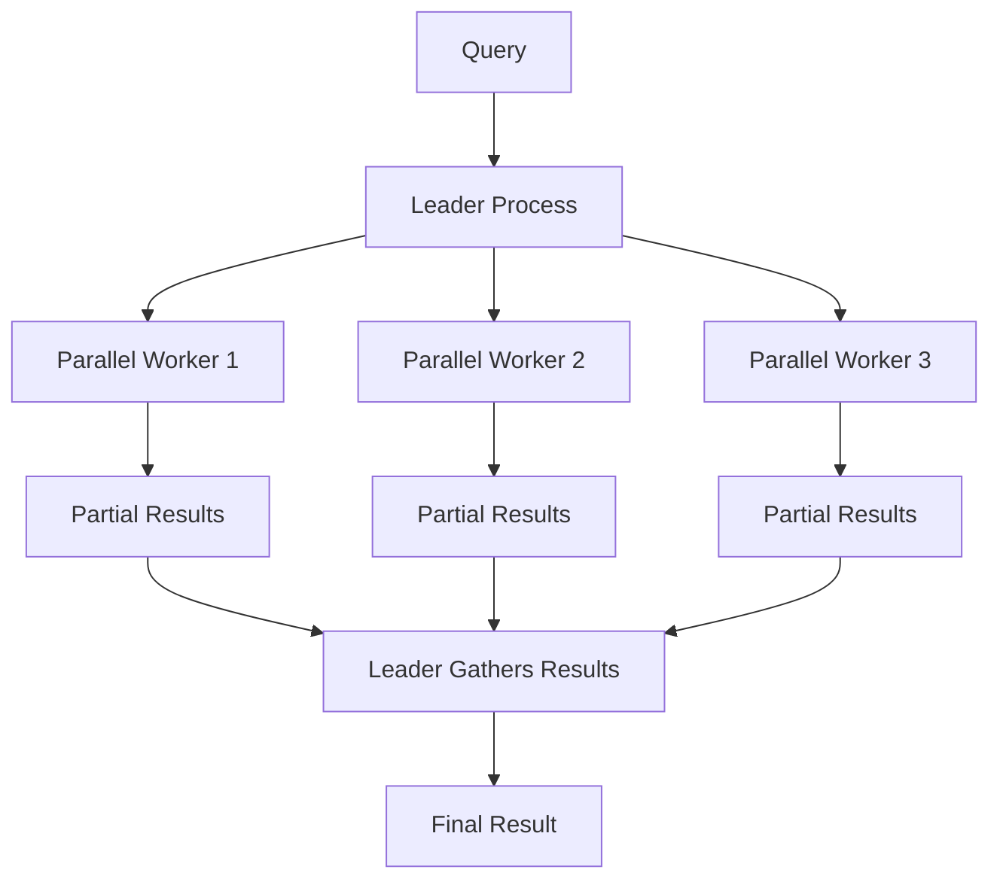

# How to Use Parallel Query Execution in PostgreSQL

Author: [nawazdhandala](https://www.github.com/nawazdhandala)

Tags: PostgreSQL, Database, Performance, Parallel Query, Query Optimization, Scaling

Description: Learn how to use parallel query execution in PostgreSQL to speed up large analytical queries. This guide covers configuration, query patterns, and optimization techniques.

---

Parallel query execution allows PostgreSQL to use multiple CPU cores to process a single query faster. Instead of a single process scanning a large table, PostgreSQL can split the work among several parallel workers, dramatically reducing query time for analytical workloads. This guide covers how to enable, configure, and optimize parallel queries in PostgreSQL.

---

## How Parallel Query Works



The leader process coordinates the work:
1. Plans the query and decides on parallelism
2. Launches parallel workers
3. Workers each process a portion of the data
4. Leader gathers and combines results

---

## Checking Parallel Query Support

```sql
-- Check if parallel query is enabled
SHOW max_parallel_workers_per_gather;

-- View all parallel-related settings
SELECT name, setting, unit, context
FROM pg_settings
WHERE name LIKE '%parallel%'
ORDER BY name;
```

---

## Configuration Settings

### Essential Settings

```ini
# postgresql.conf

# Maximum workers per query (default: 2)
max_parallel_workers_per_gather = 4

# Total parallel workers across all queries
max_parallel_workers = 8

# Total background workers (includes parallel workers)
max_worker_processes = 16

# Minimum table size to consider parallel scan
min_parallel_table_scan_size = 8MB

# Minimum index size to consider parallel scan
min_parallel_index_scan_size = 512kB
```

### Cost Settings

```ini
# Cost of starting up a parallel worker
parallel_setup_cost = 1000

# Cost of communication per tuple
parallel_tuple_cost = 0.1

# Leader participation in parallel queries
parallel_leader_participation = on
```

### Apply Settings

```sql
-- Set for current session
SET max_parallel_workers_per_gather = 4;

-- Set for specific database
ALTER DATABASE mydb SET max_parallel_workers_per_gather = 4;

-- Set system-wide (requires restart for some settings)
ALTER SYSTEM SET max_parallel_workers_per_gather = 4;
SELECT pg_reload_conf();
```

---

## Identifying Parallel Queries

### Check Query Plan

```sql
-- Use EXPLAIN to see parallel execution
EXPLAIN (ANALYZE, VERBOSE)
SELECT count(*) FROM large_table;

-- Look for:
-- Gather (workers planned: 4, workers launched: 4)
--   -> Parallel Seq Scan on large_table
```

### Example Parallel Plans

```sql
-- Parallel sequential scan
EXPLAIN ANALYZE SELECT * FROM orders WHERE total > 100;
-- Gather
--   Workers Planned: 2
--   Workers Launched: 2
--   ->  Parallel Seq Scan on orders

-- Parallel index scan
EXPLAIN ANALYZE SELECT * FROM orders WHERE customer_id = 123;
-- Gather
--   ->  Parallel Index Scan using idx_orders_customer on orders

-- Parallel aggregate
EXPLAIN ANALYZE SELECT customer_id, sum(total) FROM orders GROUP BY customer_id;
-- Finalize GroupAggregate
--   ->  Gather Merge
--         Workers Planned: 2
--         ->  Partial GroupAggregate
--               ->  Parallel Index Scan
```

---

## Operations That Support Parallelism

### Parallel Scans

```sql
-- Parallel sequential scan
SELECT * FROM large_table WHERE condition;

-- Parallel index scan
SELECT * FROM large_table WHERE indexed_column = 'value';

-- Parallel bitmap heap scan
SELECT * FROM large_table WHERE condition1 OR condition2;
```

### Parallel Joins

```sql
-- Parallel hash join
SELECT *
FROM orders o
JOIN customers c ON o.customer_id = c.id;

-- Parallel merge join
SELECT *
FROM orders o
JOIN products p ON o.product_id = p.id
ORDER BY o.id;

-- Parallel nested loop (limited support)
SELECT *
FROM small_table s
JOIN large_table l ON s.id = l.foreign_id;
```

### Parallel Aggregates

```sql
-- COUNT, SUM, AVG support parallelism
SELECT count(*) FROM large_table;
SELECT sum(amount) FROM transactions;
SELECT avg(price) FROM products;

-- GROUP BY with parallel partial aggregation
SELECT category, count(*), sum(price)
FROM products
GROUP BY category;
```

---

## Optimizing for Parallel Execution

### Ensure Tables Are Large Enough

```sql
-- Check table size
SELECT pg_size_pretty(pg_relation_size('mytable'));

-- Parallelism typically kicks in at 8MB+ (configurable)
-- For smaller tables, reduce the threshold:
SET min_parallel_table_scan_size = '1MB';
```

### Force Parallel Execution for Testing

```sql
-- Reduce thresholds to force parallelism
SET parallel_setup_cost = 0;
SET parallel_tuple_cost = 0;
SET min_parallel_table_scan_size = 0;
SET min_parallel_index_scan_size = 0;

-- Now even small tables use parallel workers
EXPLAIN ANALYZE SELECT count(*) FROM small_table;
```

### Increase Workers for Large Queries

```sql
-- For a specific heavy query
SET max_parallel_workers_per_gather = 8;

SELECT
    customer_id,
    count(*) as order_count,
    sum(total) as total_spent
FROM orders
WHERE created_at > '2025-01-01'
GROUP BY customer_id;

RESET max_parallel_workers_per_gather;
```

---

## When Parallelism Is NOT Used

### Operations That Do Not Parallelize

```sql
-- Writing queries (INSERT, UPDATE, DELETE)
-- Cannot be parallelized

-- Queries with cursors
DECLARE c CURSOR FOR SELECT * FROM large_table;

-- Queries in functions marked as not parallel-safe
-- Queries with certain extensions

-- Serializable isolation level
BEGIN ISOLATION LEVEL SERIALIZABLE;
SELECT * FROM table;  -- No parallelism
COMMIT;
```

### Why a Query Might Not Use Parallel

```sql
-- Check if function is parallel-safe
SELECT proname, proparallel
FROM pg_proc
WHERE proname = 'my_function';
-- proparallel: 's' = safe, 'r' = restricted, 'u' = unsafe

-- Reasons parallel is not used:
-- 1. Table too small
-- 2. Already in a parallel query
-- 3. Function marked as parallel unsafe
-- 4. Transaction is serializable
-- 5. Query is writing data
```

---

## Practical Examples

### Analytics Query Optimization

```sql
-- Before: Sequential scan, 45 seconds
EXPLAIN ANALYZE
SELECT
    date_trunc('month', created_at) as month,
    count(*) as orders,
    sum(total) as revenue
FROM orders
WHERE created_at > '2020-01-01'
GROUP BY 1
ORDER BY 1;

-- Enable parallelism
SET max_parallel_workers_per_gather = 4;

-- After: Parallel scan, 12 seconds
-- Gather
--   Workers Planned: 4
--   Workers Launched: 4
--   ->  Partial HashAggregate
--         ->  Parallel Seq Scan on orders
-- Finalize HashAggregate
```

### Large Join Optimization

```sql
-- Parallel hash join for large tables
SET max_parallel_workers_per_gather = 4;

EXPLAIN ANALYZE
SELECT
    c.name,
    count(o.id) as order_count,
    sum(o.total) as total_spent
FROM customers c
JOIN orders o ON c.id = o.customer_id
GROUP BY c.id, c.name
ORDER BY total_spent DESC
LIMIT 100;

-- Gather
--   Workers Planned: 4
--   ->  Parallel Hash Join
--         ->  Parallel Seq Scan on orders
--         ->  Hash
--               ->  Seq Scan on customers
```

### Bulk Data Processing

```sql
-- Parallel CTAS (Create Table As Select)
SET max_parallel_workers_per_gather = 8;

CREATE TABLE orders_summary AS
SELECT
    customer_id,
    date_trunc('month', created_at) as month,
    count(*) as order_count,
    sum(total) as total_amount
FROM orders
GROUP BY 1, 2;

-- Parallel CREATE INDEX
-- PostgreSQL 11+ supports parallel index creation
SET max_parallel_maintenance_workers = 4;

CREATE INDEX CONCURRENTLY idx_orders_customer_date
ON orders (customer_id, created_at);
```

---

## Monitoring Parallel Query Performance

### Check Worker Activity

```sql
-- See parallel workers in action
SELECT
    pid,
    leader_pid,
    query,
    state,
    wait_event_type,
    wait_event
FROM pg_stat_activity
WHERE backend_type = 'parallel worker';

-- Or check by query
SELECT
    pid,
    CASE WHEN leader_pid IS NULL THEN 'leader' ELSE 'worker' END as role,
    state,
    LEFT(query, 50) as query_preview
FROM pg_stat_activity
WHERE query LIKE '%large_table%';
```

### Measure Improvement

```sql
-- Benchmark with and without parallel
\timing on

-- Without parallel
SET max_parallel_workers_per_gather = 0;
SELECT count(*) FROM large_table WHERE condition;
-- Time: 5000 ms

-- With parallel
SET max_parallel_workers_per_gather = 4;
SELECT count(*) FROM large_table WHERE condition;
-- Time: 1500 ms (3.3x faster)
```

---

## Troubleshooting

### Workers Not Starting

```sql
-- Check if max_worker_processes is reached
SELECT count(*) FROM pg_stat_activity WHERE backend_type = 'parallel worker';

-- Compare to limit
SHOW max_worker_processes;
SHOW max_parallel_workers;

-- Increase if needed
ALTER SYSTEM SET max_worker_processes = 16;
ALTER SYSTEM SET max_parallel_workers = 8;
-- Restart required for max_worker_processes
```

### Query Still Slow with Parallelism

```sql
-- Check for I/O bottleneck
-- If disk is the bottleneck, more workers wont help

-- Check for lock contention
SELECT * FROM pg_locks WHERE NOT granted;

-- Consider if the query is memory-bound
-- Parallel workers share the system memory
```

---

## Best Practices

1. **Start conservative** - Begin with 2-4 workers per gather
2. **Match CPU cores** - Total workers should not exceed cores
3. **Monitor I/O** - More workers help CPU-bound, not I/O-bound queries
4. **Use for analytics** - Best for read-heavy analytical queries
5. **Test thoroughly** - Parallel queries use more memory
6. **Set per-query when needed** - Different queries may need different settings

---

## Configuration Recommendations

### OLTP Workload

```ini
# Keep parallel limited for transactional workloads
max_parallel_workers_per_gather = 2
max_parallel_workers = 4
```

### Analytics Workload

```ini
# More aggressive for analytical queries
max_parallel_workers_per_gather = 4
max_parallel_workers = 8
min_parallel_table_scan_size = 1MB
```

### Mixed Workload

```ini
# Balanced settings
max_parallel_workers_per_gather = 2
max_parallel_workers = 8
# Use SET for specific analytical queries
```

---

## Conclusion

Parallel query execution in PostgreSQL can dramatically speed up analytical queries:

- **Enable** with `max_parallel_workers_per_gather`
- **Monitor** with EXPLAIN ANALYZE to verify parallelism
- **Optimize** by increasing workers for heavy queries
- **Understand limitations** - Not all operations parallelize

For large analytical workloads, proper parallel configuration can reduce query times from minutes to seconds.

---

*Need to monitor your PostgreSQL query performance? [OneUptime](https://oneuptime.com) provides comprehensive database monitoring including parallel query tracking, worker utilization, and performance optimization recommendations.*
