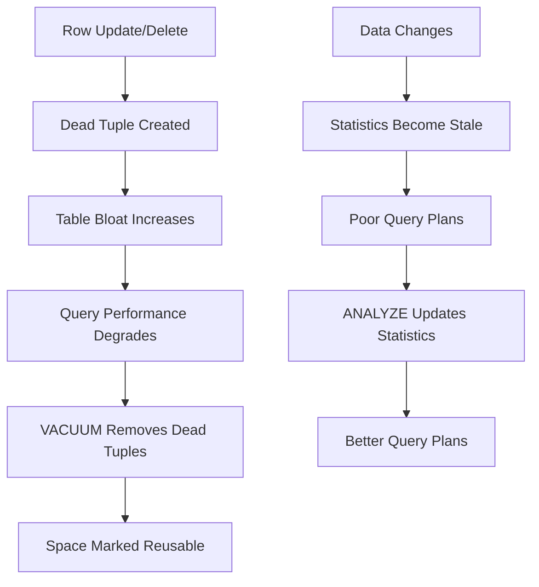

# How to Use Vacuum and Analyze in PostgreSQL

Author: [nawazdhandala](https://www.github.com/nawazdhandala)

Tags: PostgreSQL, Database, VACUUM, ANALYZE, Maintenance, Performance, Bloat

Description: Learn how to use VACUUM and ANALYZE in PostgreSQL for database maintenance. This guide covers autovacuum configuration, manual vacuuming, and strategies for handling bloat.

---

VACUUM and ANALYZE are essential maintenance operations in PostgreSQL. VACUUM reclaims storage occupied by dead tuples (deleted or updated rows), while ANALYZE collects statistics used by the query planner. Understanding these operations is crucial for maintaining database performance.

---

## Why VACUUM and ANALYZE Matter

PostgreSQL uses Multi-Version Concurrency Control (MVCC), which means:
- Updates create new row versions instead of modifying in place
- Deletes mark rows as dead but do not remove them immediately
- Dead rows accumulate and consume disk space (bloat)
- Without current statistics, the query planner makes poor decisions



---

## VACUUM Operations

### Basic VACUUM

```sql
-- VACUUM a specific table (marks space as reusable, does not return to OS)
VACUUM mytable;

-- VACUUM entire database
VACUUM;

-- VACUUM with verbose output
VACUUM VERBOSE mytable;

-- Example output:
-- INFO: vacuuming "public.mytable"
-- INFO: "mytable": removed 10000 row versions in 500 pages
-- INFO: "mytable": found 10000 removable, 50000 nonremovable row versions
```

### VACUUM FULL

```sql
-- VACUUM FULL rewrites the table and returns space to OS
-- WARNING: Locks the table exclusively!
VACUUM FULL mytable;

-- With verbose output
VACUUM FULL VERBOSE mytable;

-- Check table size before and after
SELECT pg_size_pretty(pg_relation_size('mytable'));
VACUUM FULL mytable;
SELECT pg_size_pretty(pg_relation_size('mytable'));
```

### VACUUM FREEZE

```sql
-- Freeze old row versions to prevent transaction ID wraparound
VACUUM FREEZE mytable;

-- Check transaction age
SELECT
    relname,
    age(relfrozenxid) AS xid_age,
    pg_size_pretty(pg_relation_size(oid)) AS size
FROM pg_class
WHERE relkind = 'r'
ORDER BY age(relfrozenxid) DESC
LIMIT 10;
```

---

## ANALYZE Operations

### Basic ANALYZE

```sql
-- Analyze a specific table
ANALYZE mytable;

-- Analyze specific columns
ANALYZE mytable (column1, column2);

-- Analyze entire database
ANALYZE;

-- Verbose output
ANALYZE VERBOSE mytable;

-- Example output:
-- INFO: analyzing "public.mytable"
-- INFO: "mytable": scanned 1000 of 1000 pages, containing 50000 live rows
```

### Combined VACUUM ANALYZE

```sql
-- VACUUM and ANALYZE together (common pattern)
VACUUM ANALYZE mytable;

-- For entire database
VACUUM ANALYZE;
```

---

## Autovacuum Configuration

PostgreSQL runs autovacuum automatically, but you may need to tune it.

### Check Autovacuum Status

```sql
-- Check if autovacuum is enabled
SHOW autovacuum;

-- View autovacuum settings
SELECT name, setting, short_desc
FROM pg_settings
WHERE name LIKE '%autovacuum%';

-- Check tables waiting for vacuum
SELECT
    schemaname,
    relname,
    n_dead_tup,
    n_live_tup,
    round(100.0 * n_dead_tup / nullif(n_live_tup + n_dead_tup, 0), 2) AS dead_pct,
    last_vacuum,
    last_autovacuum
FROM pg_stat_user_tables
WHERE n_dead_tup > 1000
ORDER BY n_dead_tup DESC;
```

### Configure Autovacuum

```ini
# postgresql.conf

# Enable autovacuum
autovacuum = on

# When to vacuum (threshold + scale_factor * n_live_tup)
autovacuum_vacuum_threshold = 50       # Minimum dead tuples
autovacuum_vacuum_scale_factor = 0.1   # 10% of table

# When to analyze
autovacuum_analyze_threshold = 50
autovacuum_analyze_scale_factor = 0.05  # 5% of table

# Worker settings
autovacuum_max_workers = 3
autovacuum_naptime = 60s               # Check interval

# Cost-based vacuum delay
autovacuum_vacuum_cost_delay = 2ms     # Pause between operations
autovacuum_vacuum_cost_limit = 200     # Cost limit per round
```

### Per-Table Autovacuum Settings

```sql
-- Configure autovacuum for high-churn table
ALTER TABLE events SET (
    autovacuum_vacuum_threshold = 100,
    autovacuum_vacuum_scale_factor = 0.01,
    autovacuum_analyze_scale_factor = 0.005
);

-- Disable autovacuum for specific table (not recommended generally)
ALTER TABLE archive_data SET (autovacuum_enabled = false);

-- View per-table settings
SELECT
    relname,
    reloptions
FROM pg_class
WHERE reloptions IS NOT NULL
AND relkind = 'r';
```

---

## Monitoring Bloat

### Check Table Bloat

```sql
-- Estimate table bloat
SELECT
    schemaname,
    relname,
    n_live_tup,
    n_dead_tup,
    pg_size_pretty(pg_relation_size(relid)) AS table_size,
    round(100.0 * n_dead_tup / nullif(n_live_tup + n_dead_tup, 0), 2) AS dead_ratio_pct
FROM pg_stat_user_tables
ORDER BY n_dead_tup DESC
LIMIT 20;
```

### More Accurate Bloat Estimation

```sql
-- Detailed bloat estimation (from pgstattuple extension)
CREATE EXTENSION IF NOT EXISTS pgstattuple;

SELECT
    table_len,
    tuple_count,
    dead_tuple_count,
    dead_tuple_len,
    round(100.0 * dead_tuple_len / table_len, 2) AS dead_pct,
    free_space,
    round(100.0 * free_space / table_len, 2) AS free_pct
FROM pgstattuple('mytable');
```

### Monitor Vacuum Progress

```sql
-- Check running vacuum operations (PostgreSQL 9.6+)
SELECT
    p.pid,
    p.datname,
    p.relid::regclass AS table_name,
    p.phase,
    p.heap_blks_total,
    p.heap_blks_scanned,
    round(100.0 * p.heap_blks_scanned / nullif(p.heap_blks_total, 0), 2) AS pct_complete,
    p.heap_blks_vacuumed,
    p.index_vacuum_count,
    a.query_start,
    NOW() - a.query_start AS duration
FROM pg_stat_progress_vacuum p
JOIN pg_stat_activity a ON p.pid = a.pid;
```

---

## Vacuum Strategies

### Regular Maintenance Script

```bash
#!/bin/bash
# vacuum_maintenance.sh

DB_HOST="localhost"
DB_NAME="mydb"
DB_USER="postgres"

echo "Starting vacuum maintenance at $(date)"

# Vacuum analyze all tables
psql -h "$DB_HOST" -U "$DB_USER" -d "$DB_NAME" <<EOF
-- Vacuum and analyze tables with high dead tuple ratio
DO \$\$
DECLARE
    r RECORD;
BEGIN
    FOR r IN
        SELECT schemaname, relname
        FROM pg_stat_user_tables
        WHERE n_dead_tup > 10000
        OR (n_dead_tup > 1000 AND
            n_dead_tup > 0.1 * (n_live_tup + n_dead_tup))
    LOOP
        RAISE NOTICE 'Vacuuming %.%', r.schemaname, r.relname;
        EXECUTE format('VACUUM ANALYZE %I.%I', r.schemaname, r.relname);
    END LOOP;
END \$\$;

-- Update statistics for all tables
ANALYZE;
EOF

echo "Maintenance completed at $(date)"
```

### Aggressive Vacuum for Bloated Tables

```sql
-- Identify tables that need VACUUM FULL
SELECT
    schemaname,
    relname,
    pg_size_pretty(pg_relation_size(relid)) AS size,
    n_dead_tup,
    n_live_tup,
    last_vacuum,
    last_autovacuum
FROM pg_stat_user_tables
WHERE n_dead_tup > n_live_tup  -- More dead than live tuples!
ORDER BY pg_relation_size(relid) DESC;

-- For severely bloated tables, use VACUUM FULL
-- Schedule during maintenance window due to table lock
VACUUM FULL VERBOSE bloated_table;
```

### Online Alternative to VACUUM FULL

```sql
-- pg_repack extension allows online table rewrite
CREATE EXTENSION pg_repack;

-- Repack a table without locking
-- Run from command line:
-- pg_repack -d mydb -t bloated_table

-- Repack indexes only
-- pg_repack -d mydb -t bloated_table --only-indexes
```

---

## Transaction ID Wraparound Prevention

### Monitor Transaction Age

```sql
-- Check transaction age (critical when approaching 2 billion)
SELECT
    datname,
    age(datfrozenxid) AS database_age,
    current_setting('autovacuum_freeze_max_age')::bigint AS freeze_max_age,
    round(100.0 * age(datfrozenxid) /
        current_setting('autovacuum_freeze_max_age')::bigint, 2) AS pct_toward_wraparound
FROM pg_database
ORDER BY age(datfrozenxid) DESC;

-- Check table-level transaction age
SELECT
    c.oid::regclass AS table_name,
    age(c.relfrozenxid) AS xid_age,
    pg_size_pretty(pg_relation_size(c.oid)) AS size
FROM pg_class c
JOIN pg_namespace n ON c.relnamespace = n.oid
WHERE c.relkind = 'r'
AND n.nspname NOT IN ('pg_catalog', 'information_schema')
ORDER BY age(c.relfrozenxid) DESC
LIMIT 20;
```

### Emergency Anti-Wraparound Vacuum

```sql
-- If database is approaching wraparound, run manual freeze
VACUUM FREEZE;

-- For specific table
VACUUM (FREEZE, VERBOSE) large_table;
```

---

## Best Practices

### 1. Let Autovacuum Do Its Job

```sql
-- Check autovacuum is working
SELECT
    relname,
    last_vacuum,
    last_autovacuum,
    vacuum_count,
    autovacuum_count
FROM pg_stat_user_tables
ORDER BY last_autovacuum DESC NULLS LAST;
```

### 2. Tune for High-Churn Tables

```sql
-- For tables with frequent updates/deletes
ALTER TABLE high_churn_table SET (
    autovacuum_vacuum_scale_factor = 0.01,  -- Vacuum at 1% dead
    autovacuum_vacuum_cost_delay = 0        -- No delay for this table
);
```

### 3. Schedule Full Vacuum During Maintenance Windows

```sql
-- Create maintenance function
CREATE OR REPLACE FUNCTION maintenance_vacuum()
RETURNS void AS $$
DECLARE
    r RECORD;
BEGIN
    FOR r IN
        SELECT schemaname, relname
        FROM pg_stat_user_tables
        WHERE n_dead_tup > n_live_tup * 0.5  -- > 50% dead
    LOOP
        RAISE NOTICE 'VACUUM FULL on %.%', r.schemaname, r.relname;
        EXECUTE format('VACUUM FULL %I.%I', r.schemaname, r.relname);
    END LOOP;
END;
$$ LANGUAGE plpgsql;
```

### 4. Monitor and Alert

```sql
-- Alert query for tables needing attention
SELECT
    schemaname,
    relname,
    n_dead_tup,
    last_autovacuum,
    NOW() - last_autovacuum AS time_since_vacuum
FROM pg_stat_user_tables
WHERE (n_dead_tup > 100000
    OR last_autovacuum < NOW() - INTERVAL '1 day')
AND n_live_tup > 0
ORDER BY n_dead_tup DESC;
```

---

## Conclusion

VACUUM and ANALYZE are critical for PostgreSQL performance:

- **VACUUM** reclaims space from dead tuples
- **VACUUM FULL** compacts tables but locks them
- **ANALYZE** updates statistics for the query planner
- **Autovacuum** handles most maintenance automatically
- **Monitor bloat** and tune autovacuum for high-churn tables

Regular monitoring and proper autovacuum configuration will keep your database running efficiently.

---

*Need to monitor your PostgreSQL vacuum operations? [OneUptime](https://oneuptime.com) provides comprehensive database monitoring including bloat tracking, vacuum progress, and autovacuum health alerts.*
