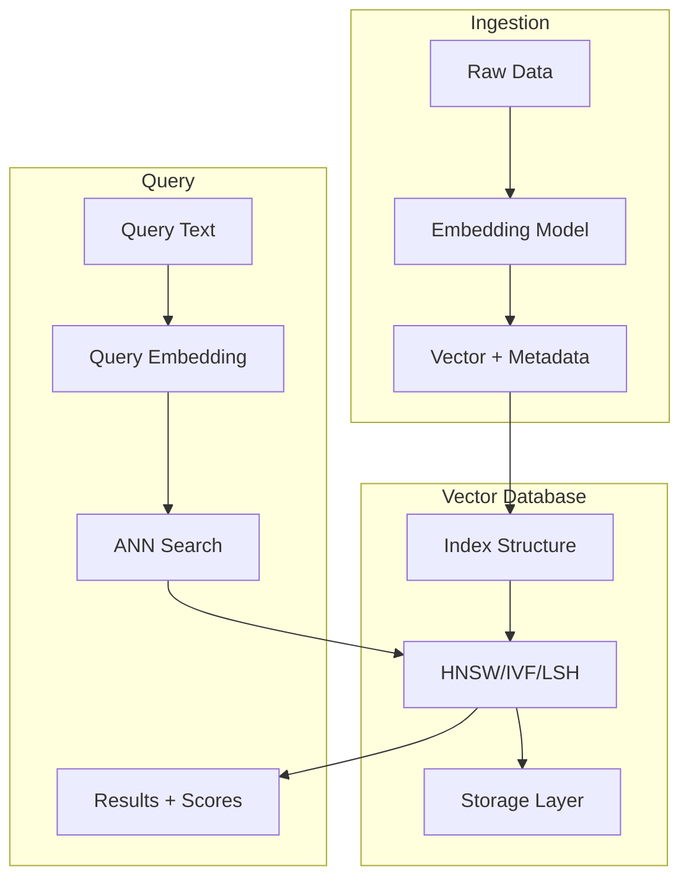

# How to Implement Vector Databases

Author: [nawazdhandala](https://www.github.com/nawazdhandala)

Tags: MLOps, Vector Database, Embeddings, Similarity Search, Pinecone, Milvus, AI, LLM

Description: Learn how to implement vector databases for similarity search, covering indexing strategies, query optimization, and integration with ML applications like RAG systems.

---

Vector databases store and query high-dimensional vectors efficiently, enabling similarity search at scale. They are essential for applications like semantic search, recommendation systems, and retrieval-augmented generation (RAG) for LLMs. This guide covers implementing vector databases in production.

## Vector Database Architecture



## Pinecone Implementation

```python
# vectordb/pinecone_client.py
from pinecone import Pinecone, ServerlessSpec
from typing import List, Dict, Any, Optional
from dataclasses import dataclass
import numpy as np
import hashlib

@dataclass
class VectorRecord:
    id: str
    vector: List[float]
    metadata: Dict[str, Any]

@dataclass
class SearchResult:
    id: str
    score: float
    metadata: Dict[str, Any]

class PineconeVectorDB:
    """
    Pinecone vector database client.

    Provides high-level interface for vector storage and search.
    """

    def __init__(
        self,
        api_key: str,
        index_name: str,
        dimension: int,
        metric: str = "cosine"
    ):
        self.pc = Pinecone(api_key=api_key)
        self.index_name = index_name
        self.dimension = dimension
        self.metric = metric

        # Create index if not exists
        if index_name not in self.pc.list_indexes().names():
            self.pc.create_index(
                name=index_name,
                dimension=dimension,
                metric=metric,
                spec=ServerlessSpec(
                    cloud='aws',
                    region='us-west-2'
                )
            )

        self.index = self.pc.Index(index_name)

    def upsert(
        self,
        records: List[VectorRecord],
        namespace: str = ""
    ) -> int:
        """
        Upsert vectors into the index.

        Returns number of vectors upserted.
        """
        vectors = [
            {
                "id": r.id,
                "values": r.vector,
                "metadata": r.metadata
            }
            for r in records
        ]

        # Batch upsert (max 100 vectors per batch)
        batch_size = 100
        total_upserted = 0

        for i in range(0, len(vectors), batch_size):
            batch = vectors[i:i + batch_size]
            response = self.index.upsert(vectors=batch, namespace=namespace)
            total_upserted += response.upserted_count

        return total_upserted

    def search(
        self,
        query_vector: List[float],
        top_k: int = 10,
        namespace: str = "",
        filter: Optional[Dict] = None,
        include_metadata: bool = True
    ) -> List[SearchResult]:
        """
        Search for similar vectors.
        """
        response = self.index.query(
            vector=query_vector,
            top_k=top_k,
            namespace=namespace,
            filter=filter,
            include_metadata=include_metadata
        )

        return [
            SearchResult(
                id=match.id,
                score=match.score,
                metadata=match.metadata if include_metadata else {}
            )
            for match in response.matches
        ]

    def delete(
        self,
        ids: List[str],
        namespace: str = ""
    ):
        """Delete vectors by ID."""
        self.index.delete(ids=ids, namespace=namespace)

    def delete_by_filter(
        self,
        filter: Dict,
        namespace: str = ""
    ):
        """Delete vectors matching filter."""
        self.index.delete(filter=filter, namespace=namespace)

    def get_stats(self) -> Dict:
        """Get index statistics."""
        return self.index.describe_index_stats()

# Usage example
def create_document_index():
    db = PineconeVectorDB(
        api_key="your-api-key",
        index_name="documents",
        dimension=1536,  # OpenAI ada-002 dimension
        metric="cosine"
    )

    # Upsert documents
    records = [
        VectorRecord(
            id="doc1",
            vector=[0.1] * 1536,  # Your actual embedding
            metadata={"title": "Document 1", "category": "tech"}
        )
    ]

    db.upsert(records)

    # Search
    results = db.search(
        query_vector=[0.1] * 1536,
        top_k=5,
        filter={"category": {"$eq": "tech"}}
    )

    return results
```

## Milvus Implementation

```python
# vectordb/milvus_client.py
from pymilvus import (
    connections, Collection, FieldSchema, CollectionSchema,
    DataType, utility
)
from typing import List, Dict, Any, Optional
import numpy as np

class MilvusVectorDB:
    """
    Milvus vector database client.

    Open-source alternative with powerful indexing options.
    """

    def __init__(
        self,
        host: str = "localhost",
        port: int = 19530,
        collection_name: str = "vectors",
        dimension: int = 1536
    ):
        # Connect to Milvus
        connections.connect(host=host, port=port)

        self.collection_name = collection_name
        self.dimension = dimension
        self.collection = self._get_or_create_collection()

    def _get_or_create_collection(self) -> Collection:
        """Get existing collection or create new one."""
        if utility.has_collection(self.collection_name):
            return Collection(self.collection_name)

        # Define schema
        fields = [
            FieldSchema(name="id", dtype=DataType.VARCHAR, is_primary=True, max_length=100),
            FieldSchema(name="vector", dtype=DataType.FLOAT_VECTOR, dim=self.dimension),
            FieldSchema(name="text", dtype=DataType.VARCHAR, max_length=65535),
            FieldSchema(name="metadata", dtype=DataType.JSON)
        ]

        schema = CollectionSchema(fields=fields, description="Vector collection")
        collection = Collection(name=self.collection_name, schema=schema)

        # Create HNSW index for fast search
        index_params = {
            "metric_type": "COSINE",
            "index_type": "HNSW",
            "params": {"M": 16, "efConstruction": 200}
        }
        collection.create_index(field_name="vector", index_params=index_params)

        return collection

    def insert(
        self,
        ids: List[str],
        vectors: List[List[float]],
        texts: List[str],
        metadata: List[Dict]
    ) -> int:
        """
        Insert vectors with metadata.
        """
        data = [ids, vectors, texts, metadata]
        result = self.collection.insert(data)
        self.collection.flush()

        return result.insert_count

    def search(
        self,
        query_vectors: List[List[float]],
        top_k: int = 10,
        filter_expr: Optional[str] = None
    ) -> List[List[Dict]]:
        """
        Search for similar vectors.

        Args:
            query_vectors: List of query vectors
            top_k: Number of results per query
            filter_expr: Filter expression (e.g., "metadata['category'] == 'tech'")

        Returns:
            List of results for each query
        """
        # Load collection into memory
        self.collection.load()

        search_params = {
            "metric_type": "COSINE",
            "params": {"ef": 100}  # HNSW search parameter
        }

        results = self.collection.search(
            data=query_vectors,
            anns_field="vector",
            param=search_params,
            limit=top_k,
            expr=filter_expr,
            output_fields=["id", "text", "metadata"]
        )

        # Format results
        formatted_results = []
        for hits in results:
            query_results = []
            for hit in hits:
                query_results.append({
                    "id": hit.entity.get("id"),
                    "score": hit.distance,
                    "text": hit.entity.get("text"),
                    "metadata": hit.entity.get("metadata")
                })
            formatted_results.append(query_results)

        return formatted_results

    def delete(self, ids: List[str]):
        """Delete vectors by ID."""
        expr = f"id in {ids}"
        self.collection.delete(expr)

    def drop_collection(self):
        """Drop the entire collection."""
        utility.drop_collection(self.collection_name)
```

## ChromaDB for Local Development

```python
# vectordb/chroma_client.py
import chromadb
from chromadb.config import Settings
from typing import List, Dict, Any, Optional

class ChromaVectorDB:
    """
    ChromaDB client for local development.

    Lightweight and easy to set up, good for prototyping.
    """

    def __init__(
        self,
        collection_name: str = "documents",
        persist_directory: str = "./chroma_data"
    ):
        # Initialize client with persistence
        self.client = chromadb.PersistentClient(path=persist_directory)

        # Get or create collection
        self.collection = self.client.get_or_create_collection(
            name=collection_name,
            metadata={"hnsw:space": "cosine"}
        )

    def add(
        self,
        ids: List[str],
        embeddings: List[List[float]],
        documents: List[str],
        metadatas: Optional[List[Dict]] = None
    ):
        """Add documents with embeddings."""
        self.collection.add(
            ids=ids,
            embeddings=embeddings,
            documents=documents,
            metadatas=metadatas
        )

    def query(
        self,
        query_embeddings: List[List[float]],
        n_results: int = 10,
        where: Optional[Dict] = None,
        include: List[str] = ["documents", "metadatas", "distances"]
    ) -> Dict:
        """
        Query for similar documents.

        Args:
            query_embeddings: Query vectors
            n_results: Number of results
            where: Metadata filter (e.g., {"category": "tech"})
            include: Fields to include in results

        Returns:
            Dict with ids, distances, documents, metadatas
        """
        return self.collection.query(
            query_embeddings=query_embeddings,
            n_results=n_results,
            where=where,
            include=include
        )

    def update(
        self,
        ids: List[str],
        embeddings: Optional[List[List[float]]] = None,
        documents: Optional[List[str]] = None,
        metadatas: Optional[List[Dict]] = None
    ):
        """Update existing documents."""
        self.collection.update(
            ids=ids,
            embeddings=embeddings,
            documents=documents,
            metadatas=metadatas
        )

    def delete(self, ids: List[str]):
        """Delete documents by ID."""
        self.collection.delete(ids=ids)

    def count(self) -> int:
        """Get document count."""
        return self.collection.count()
```

## RAG Integration

```python
# vectordb/rag_pipeline.py
from typing import List, Dict, Any
from dataclasses import dataclass
import anthropic

@dataclass
class RetrievedContext:
    text: str
    score: float
    source: str
    metadata: Dict[str, Any]

class RAGPipeline:
    """
    Retrieval-Augmented Generation pipeline.

    Combines vector search with LLM generation for grounded responses.
    """

    def __init__(
        self,
        vector_db: Any,  # Any of our vector DB clients
        embedding_model: Any,  # Embedding function
        llm_client: anthropic.Anthropic,
        top_k: int = 5
    ):
        self.vector_db = vector_db
        self.embedding_model = embedding_model
        self.llm_client = llm_client
        self.top_k = top_k

    def retrieve(self, query: str) -> List[RetrievedContext]:
        """
        Retrieve relevant documents for a query.
        """
        # Generate query embedding
        query_embedding = self.embedding_model.embed(query)

        # Search vector database
        results = self.vector_db.search(
            query_vector=query_embedding,
            top_k=self.top_k
        )

        # Format retrieved contexts
        contexts = []
        for result in results:
            contexts.append(RetrievedContext(
                text=result.metadata.get("text", ""),
                score=result.score,
                source=result.metadata.get("source", "unknown"),
                metadata=result.metadata
            ))

        return contexts

    def generate(
        self,
        query: str,
        contexts: List[RetrievedContext],
        system_prompt: str = None
    ) -> str:
        """
        Generate response using retrieved context.
        """
        # Build context string
        context_text = "\n\n".join([
            f"[Source: {c.source}]\n{c.text}"
            for c in contexts
        ])

        # Default system prompt
        if system_prompt is None:
            system_prompt = """You are a helpful assistant that answers questions based on the provided context.
If the context doesn't contain relevant information, say so.
Always cite your sources when providing information from the context."""

        # Generate response
        response = self.llm_client.messages.create(
            model="claude-sonnet-4-20250514",
            max_tokens=1024,
            system=system_prompt,
            messages=[
                {
                    "role": "user",
                    "content": f"""Context:
{context_text}

Question: {query}

Please answer the question based on the provided context."""
                }
            ]
        )

        return response.content[0].text

    def query(self, question: str) -> Dict[str, Any]:
        """
        Complete RAG query: retrieve then generate.
        """
        # Retrieve relevant documents
        contexts = self.retrieve(question)

        # Generate response
        answer = self.generate(question, contexts)

        return {
            "question": question,
            "answer": answer,
            "sources": [
                {"source": c.source, "score": c.score}
                for c in contexts
            ]
        }

# Usage
def create_rag_system():
    from openai import OpenAI

    # Initialize components
    openai_client = OpenAI()
    anthropic_client = anthropic.Anthropic()

    # Simple embedding function
    class EmbeddingModel:
        def __init__(self, client):
            self.client = client

        def embed(self, text: str) -> List[float]:
            response = self.client.embeddings.create(
                model="text-embedding-ada-002",
                input=text
            )
            return response.data[0].embedding

    # Create pipeline
    vector_db = ChromaVectorDB(collection_name="knowledge_base")
    embedding_model = EmbeddingModel(openai_client)

    rag = RAGPipeline(
        vector_db=vector_db,
        embedding_model=embedding_model,
        llm_client=anthropic_client,
        top_k=5
    )

    return rag
```

## Index Optimization

```python
# vectordb/index_optimization.py
from dataclasses import dataclass
from typing import Dict, Any

@dataclass
class IndexConfig:
    """Configuration for vector index optimization."""
    index_type: str  # HNSW, IVF, FLAT
    metric: str  # cosine, l2, ip
    params: Dict[str, Any]

class IndexOptimizer:
    """
    Optimize vector index parameters based on requirements.
    """

    @staticmethod
    def recommend_config(
        vector_count: int,
        dimension: int,
        query_latency_ms: int = 100,
        recall_target: float = 0.95
    ) -> IndexConfig:
        """
        Recommend index configuration based on requirements.

        Args:
            vector_count: Expected number of vectors
            dimension: Vector dimension
            query_latency_ms: Target query latency
            recall_target: Target recall (0-1)

        Returns:
            Recommended IndexConfig
        """
        # Small dataset: use flat index
        if vector_count < 10000:
            return IndexConfig(
                index_type="FLAT",
                metric="cosine",
                params={}
            )

        # Medium dataset with high recall: HNSW
        if vector_count < 1000000 and recall_target > 0.9:
            # Higher M = better recall, more memory
            m = 32 if recall_target > 0.95 else 16

            # Higher ef_construction = better recall, slower build
            ef_construction = 200 if recall_target > 0.95 else 100

            return IndexConfig(
                index_type="HNSW",
                metric="cosine",
                params={
                    "M": m,
                    "efConstruction": ef_construction,
                    "efSearch": 100
                }
            )

        # Large dataset: IVF with product quantization
        n_clusters = int(4 * (vector_count ** 0.5))
        n_clusters = min(n_clusters, 65536)  # Max clusters

        return IndexConfig(
            index_type="IVF_PQ",
            metric="cosine",
            params={
                "nlist": n_clusters,
                "nprobe": max(1, n_clusters // 10),
                "m": dimension // 4,  # PQ subquantizers
                "nbits": 8
            }
        )

    @staticmethod
    def benchmark_config(
        config: IndexConfig,
        sample_vectors: List[List[float]],
        sample_queries: List[List[float]]
    ) -> Dict[str, float]:
        """
        Benchmark an index configuration.

        Returns metrics: build_time, query_latency_p50, query_latency_p99, recall
        """
        # Implementation depends on specific vector DB
        # This is a template for the benchmarking interface
        return {
            "build_time_seconds": 0.0,
            "query_latency_p50_ms": 0.0,
            "query_latency_p99_ms": 0.0,
            "recall": 0.0
        }
```

## Summary

| Database | Best For | Deployment | Indexing |
|----------|----------|------------|----------|
| **Pinecone** | Production, managed | Cloud | HNSW |
| **Milvus** | Self-hosted, scale | On-prem/Cloud | HNSW, IVF |
| **ChromaDB** | Development, prototyping | Local | HNSW |
| **Weaviate** | Multi-modal, GraphQL | Cloud/On-prem | HNSW |
| **Qdrant** | Rust performance | Cloud/On-prem | HNSW |

Vector databases are foundational for modern AI applications. Choose based on your scale requirements and operational preferences. For development, ChromaDB offers simplicity. For production, Pinecone provides managed infrastructure while Milvus offers self-hosted flexibility.
