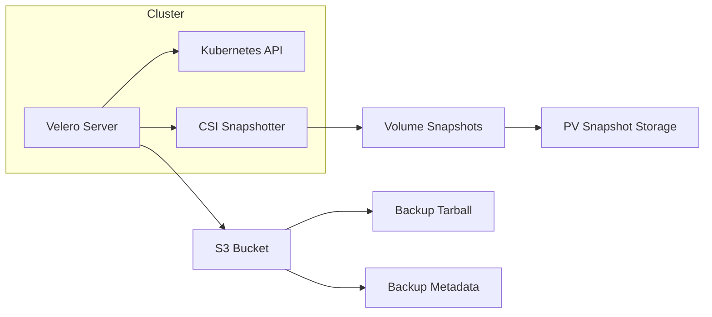

# How to Set Up Velero for Kubernetes Backup

Author: [nawazdhandala](https://www.github.com/nawazdhandala)

Tags: Kubernetes, Velero, Backup, Disaster Recovery, DevOps

Description: A practical guide to setting up Velero for Kubernetes cluster backups, covering installation, storage backend configuration, scheduling backups, and restoring workloads with real-world examples.

---

Losing a Kubernetes cluster without backups is the kind of experience that turns senior engineers into backup evangelists. Velero (formerly Heptio Ark) is the de facto standard for backing up Kubernetes resources and persistent volumes. It integrates with major cloud providers and on-prem storage backends, making it viable whether you run EKS, GKE, AKS, or bare metal clusters.

This guide walks through installing Velero, configuring storage backends, scheduling backups, and performing restores.

## Why Velero?

Velero solves three problems that kubectl and etcd snapshots alone cannot:

1. **Namespace-level granularity:** Back up specific namespaces without touching others.
2. **Persistent volume snapshots:** Coordinates with CSI drivers to snapshot PVCs alongside resources.
3. **Scheduled automation:** Run daily or hourly backups without external cron jobs.

Other tools exist (Kasten K10, Trilio), but Velero remains the most widely adopted open-source option with CNCF backing.

## Prerequisites

Before installing Velero, ensure you have:

- A running Kubernetes cluster (v1.16+)
- kubectl configured with cluster-admin privileges
- An S3-compatible storage bucket (AWS S3, MinIO, GCS, Azure Blob)
- The Velero CLI installed locally

```bash
# Install Velero CLI on macOS
brew install velero

# Or download the binary directly
wget https://github.com/vmware-tanzu/velero/releases/download/v1.13.0/velero-v1.13.0-linux-amd64.tar.gz
tar -xvf velero-v1.13.0-linux-amd64.tar.gz
sudo mv velero-v1.13.0-linux-amd64/velero /usr/local/bin/
```

## Setting Up Storage Backend

Velero needs somewhere to store backups. The most common choice is an S3-compatible bucket. Here is how to configure credentials for AWS S3.

Create a credentials file:

```bash
# Create credentials file for AWS
cat > credentials-velero <<EOF
[default]
aws_access_key_id=YOUR_ACCESS_KEY
aws_secret_access_key=YOUR_SECRET_KEY
EOF
```

For MinIO or other S3-compatible storage, the format is identical. You will specify the endpoint URL during installation.

## Installing Velero

With credentials ready, install Velero into your cluster:

```bash
# Install Velero with AWS plugin
velero install \
  --provider aws \
  --plugins velero/velero-plugin-for-aws:v1.9.0 \
  --bucket my-velero-backups \
  --backup-location-config region=us-east-1 \
  --snapshot-location-config region=us-east-1 \
  --secret-file ./credentials-velero

# For MinIO or S3-compatible storage, add these flags:
velero install \
  --provider aws \
  --plugins velero/velero-plugin-for-aws:v1.9.0 \
  --bucket velero-backups \
  --backup-location-config region=minio,s3ForcePathStyle=true,s3Url=http://minio.storage:9000 \
  --snapshot-location-config region=minio \
  --secret-file ./credentials-velero
```

Verify the installation:

```bash
# Check Velero pods are running
kubectl get pods -n velero

# Expected output:
# NAME                      READY   STATUS    RESTARTS   AGE
# velero-7d9c8f5b4f-xk2pl   1/1     Running   0          2m

# Verify backup location is available
velero backup-location get
```

## Creating Your First Backup

Velero can back up entire clusters, specific namespaces, or resources matching label selectors.

```bash
# Back up everything in a namespace
velero backup create production-backup --include-namespaces production

# Back up multiple namespaces
velero backup create multi-ns-backup --include-namespaces production,staging

# Back up resources with specific labels
velero backup create labeled-backup --selector app=critical

# Back up everything except certain namespaces
velero backup create cluster-backup --exclude-namespaces kube-system,velero

# Check backup status
velero backup describe production-backup --details
```

The backup process captures:
- All Kubernetes API objects in the selected scope
- Persistent volume snapshots (if CSI plugin is configured)
- Custom resource definitions and their instances

## Scheduling Automated Backups

Running manual backups is useful for testing, but production environments need automation:

```bash
# Create a daily backup schedule
velero schedule create daily-production \
  --schedule="0 2 * * *" \
  --include-namespaces production \
  --ttl 168h

# Create an hourly backup for critical workloads
velero schedule create hourly-critical \
  --schedule="0 * * * *" \
  --selector tier=critical \
  --ttl 24h

# List all schedules
velero schedule get

# Check backups created by a schedule
velero backup get --selector velero.io/schedule-name=daily-production
```

The `--ttl` flag controls how long backups are retained before automatic deletion. This prevents storage costs from spiraling.

## Backup Architecture



## Restoring from Backup

Restoring is where backups prove their value. Velero can restore to the same cluster or a different one entirely.

```bash
# Restore everything from a backup
velero restore create --from-backup production-backup

# Restore to a different namespace (useful for testing)
velero restore create --from-backup production-backup \
  --namespace-mappings production:production-restored

# Restore only specific resources
velero restore create --from-backup production-backup \
  --include-resources deployments,services,configmaps

# Restore excluding certain resources
velero restore create --from-backup production-backup \
  --exclude-resources secrets

# Check restore status
velero restore describe production-backup-20260125120000 --details
```

## Backing Up Persistent Volumes

For stateful workloads, you need more than resource manifests. Velero integrates with CSI drivers to snapshot volumes:

```bash
# Install CSI plugin alongside Velero
velero install \
  --provider aws \
  --plugins velero/velero-plugin-for-aws:v1.9.0,velero/velero-plugin-for-csi:v0.7.0 \
  --features=EnableCSI \
  --bucket my-velero-backups \
  --backup-location-config region=us-east-1 \
  --snapshot-location-config region=us-east-1 \
  --secret-file ./credentials-velero
```

Annotate PVCs to include them in backups:

```yaml
# pvc-with-backup.yaml
apiVersion: v1
kind: PersistentVolumeClaim
metadata:
  name: postgres-data
  namespace: production
  labels:
    app: postgres
  annotations:
    # Velero will snapshot this PVC during backups
    backup.velero.io/backup-volumes: postgres-data
spec:
  accessModes:
    - ReadWriteOnce
  resources:
    requests:
      storage: 100Gi
  storageClassName: csi-standard
```

## Pre and Post Backup Hooks

Some applications need preparation before backups (like flushing buffers) or cleanup afterward. Velero supports hooks via pod annotations:

```yaml
# deployment-with-hooks.yaml
apiVersion: apps/v1
kind: Deployment
metadata:
  name: postgres
  namespace: production
spec:
  template:
    metadata:
      annotations:
        # Freeze database before snapshot
        pre.hook.backup.velero.io/container: postgres
        pre.hook.backup.velero.io/command: '["/bin/bash", "-c", "pg_ctl stop -m fast"]'
        pre.hook.backup.velero.io/timeout: 30s
        # Restart after snapshot
        post.hook.backup.velero.io/container: postgres
        post.hook.backup.velero.io/command: '["/bin/bash", "-c", "pg_ctl start"]'
    spec:
      containers:
        - name: postgres
          image: postgres:15
```

## Troubleshooting Common Issues

**Backup stuck in "InProgress" state:**

```bash
# Check Velero logs for errors
kubectl logs -n velero deployment/velero

# Common causes:
# - Storage backend unreachable
# - Insufficient permissions on S3 bucket
# - Large PVCs timing out during snapshot
```

**Restore fails with "already exists" errors:**

```bash
# Use update policy to overwrite existing resources
velero restore create --from-backup production-backup \
  --existing-resource-policy update
```

**Volumes not being backed up:**

```bash
# Verify CSI plugin is installed
velero plugin get

# Check VolumeSnapshotClass exists
kubectl get volumesnapshotclass
```

## Best Practices

1. **Test restores regularly.** A backup you have never restored is just hope stored in S3. Schedule monthly restore drills to a test namespace.

2. **Use multiple backup locations.** Configure a secondary backup location in a different region or provider for disaster recovery.

3. **Monitor backup jobs.** Export Velero metrics to Prometheus and alert on failed backups. A silent failure is worse than no backup.

4. **Encrypt backups at rest.** Enable server-side encryption on your S3 bucket. Velero does not encrypt by default.

5. **Version your Velero installation.** Pin plugin versions and test upgrades in staging before production.

## Monitoring Velero

Velero exposes Prometheus metrics on port 8085:

```yaml
# servicemonitor.yaml
apiVersion: monitoring.coreos.com/v1
kind: ServiceMonitor
metadata:
  name: velero
  namespace: velero
spec:
  selector:
    matchLabels:
      app.kubernetes.io/name: velero
  endpoints:
    - port: metrics
      interval: 30s
```

Key metrics to track:
- `velero_backup_total`: Total backup attempts
- `velero_backup_success_total`: Successful backups
- `velero_backup_failure_total`: Failed backups
- `velero_restore_total`: Restore operations

## Wrapping Up

Velero transforms Kubernetes backup from a manual chore into an automated safety net. Start with namespace-level backups, add volume snapshots for stateful workloads, and schedule everything to run without human intervention. The real test is not whether backups complete but whether restores work when you need them most. Run those drills before disaster strikes.
