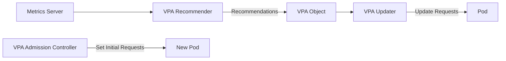

# How to Set Up Vertical Pod Autoscaler (VPA)

Author: [nawazdhandala](https://www.github.com/nawazdhandala)

Tags: Kubernetes, VPA, Autoscaling, Resource Management, DevOps, Cost Optimization

Description: Learn how to set up and configure the Vertical Pod Autoscaler (VPA) in Kubernetes. This guide covers installation, configuration modes, resource recommendations, and best practices for automatic resource adjustment.

---

Setting correct CPU and memory requests is hard. Set them too low and your pods get throttled or OOMKilled. Set them too high and you waste resources. The Vertical Pod Autoscaler (VPA) solves this by automatically adjusting resource requests based on actual usage.

## How VPA Works



VPA has three components:
- **Recommender**: Analyzes resource usage and generates recommendations
- **Updater**: Evicts pods that need resource updates
- **Admission Controller**: Sets correct resources on new pods

## Installing VPA

### Clone the VPA Repository

```bash
git clone https://github.com/kubernetes/autoscaler.git
cd autoscaler/vertical-pod-autoscaler
```

### Install VPA Components

```bash
# Install VPA with default settings
./hack/vpa-up.sh

# Verify installation
kubectl get pods -n kube-system | grep vpa

# Expected output:
# vpa-admission-controller-xxx   1/1   Running
# vpa-recommender-xxx            1/1   Running
# vpa-updater-xxx                1/1   Running
```

### Install with Helm

```bash
helm repo add fairwinds-stable https://charts.fairwinds.com/stable
helm install vpa fairwinds-stable/vpa --namespace vpa --create-namespace
```

## VPA Configuration Modes

### UpdateMode: Off (Recommendation Only)

VPA calculates recommendations but does not apply them. Useful for understanding resource needs before enabling auto-updates.

```yaml
apiVersion: autoscaling.k8s.io/v1
kind: VerticalPodAutoscaler
metadata:
  name: myapp-vpa
  namespace: production
spec:
  targetRef:
    apiVersion: "apps/v1"
    kind: Deployment
    name: myapp
  updatePolicy:
    updateMode: "Off"  # Only recommend, do not update
```

Check recommendations:

```bash
kubectl describe vpa myapp-vpa -n production

# Output includes:
# Recommendation:
#   Container Recommendations:
#     Container Name: myapp
#     Lower Bound:
#       Cpu:     25m
#       Memory:  128Mi
#     Target:
#       Cpu:     100m
#       Memory:  256Mi
#     Upper Bound:
#       Cpu:     500m
#       Memory:  512Mi
```

### UpdateMode: Initial

Sets resources only when pods are created. Does not evict running pods.

```yaml
apiVersion: autoscaling.k8s.io/v1
kind: VerticalPodAutoscaler
metadata:
  name: myapp-vpa
spec:
  targetRef:
    apiVersion: "apps/v1"
    kind: Deployment
    name: myapp
  updatePolicy:
    updateMode: "Initial"
```

### UpdateMode: Auto

Automatically updates pods by evicting and recreating them with new resource requests.

```yaml
apiVersion: autoscaling.k8s.io/v1
kind: VerticalPodAutoscaler
metadata:
  name: myapp-vpa
spec:
  targetRef:
    apiVersion: "apps/v1"
    kind: Deployment
    name: myapp
  updatePolicy:
    updateMode: "Auto"
```

## Resource Policies

Control VPA behavior with resource policies.

### Set Min and Max Bounds

```yaml
apiVersion: autoscaling.k8s.io/v1
kind: VerticalPodAutoscaler
metadata:
  name: myapp-vpa
spec:
  targetRef:
    apiVersion: "apps/v1"
    kind: Deployment
    name: myapp
  updatePolicy:
    updateMode: "Auto"
  resourcePolicy:
    containerPolicies:
      - containerName: myapp
        minAllowed:
          cpu: 50m
          memory: 128Mi
        maxAllowed:
          cpu: 2
          memory: 4Gi
        controlledResources:
          - cpu
          - memory
```

### Scale Only CPU

```yaml
resourcePolicy:
  containerPolicies:
    - containerName: myapp
      controlledResources:
        - cpu  # Only adjust CPU
      controlledValues: RequestsOnly
```

### Exclude Specific Containers

```yaml
resourcePolicy:
  containerPolicies:
    - containerName: sidecar
      mode: "Off"  # Do not adjust this container
    - containerName: myapp
      mode: "Auto"
```

## Complete Example

### Deployment

```yaml
apiVersion: apps/v1
kind: Deployment
metadata:
  name: api-server
  namespace: production
spec:
  replicas: 3
  selector:
    matchLabels:
      app: api-server
  template:
    metadata:
      labels:
        app: api-server
    spec:
      containers:
        - name: api
          image: api-server:1.0.0
          resources:
            requests:
              cpu: 100m
              memory: 128Mi
            limits:
              cpu: 500m
              memory: 512Mi
          ports:
            - containerPort: 8080
```

### VPA Configuration

```yaml
apiVersion: autoscaling.k8s.io/v1
kind: VerticalPodAutoscaler
metadata:
  name: api-server-vpa
  namespace: production
spec:
  targetRef:
    apiVersion: "apps/v1"
    kind: Deployment
    name: api-server
  updatePolicy:
    updateMode: "Auto"
    minReplicas: 2  # Keep at least 2 replicas during updates
  resourcePolicy:
    containerPolicies:
      - containerName: api
        minAllowed:
          cpu: 50m
          memory: 64Mi
        maxAllowed:
          cpu: 4
          memory: 8Gi
        controlledResources:
          - cpu
          - memory
        controlledValues: RequestsAndLimits
```

## Viewing Recommendations

### Describe VPA

```bash
kubectl describe vpa api-server-vpa -n production
```

Output:

```
Status:
  Conditions:
    Last Transition Time:  2026-01-25T10:00:00Z
    Status:                True
    Type:                  RecommendationProvided
  Recommendation:
    Container Recommendations:
      Container Name:  api
      Lower Bound:
        Cpu:     100m
        Memory:  200Mi
      Target:
        Cpu:     250m
        Memory:  384Mi
      Uncapped Target:
        Cpu:     250m
        Memory:  384Mi
      Upper Bound:
        Cpu:     1
        Memory:  1Gi
```

### JSON Output

```bash
kubectl get vpa api-server-vpa -n production -o json | jq '.status.recommendation'
```

### All VPAs in Cluster

```bash
kubectl get vpa -A -o custom-columns=\
NAMESPACE:.metadata.namespace,\
NAME:.metadata.name,\
MODE:.spec.updatePolicy.updateMode,\
CPU:.status.recommendation.containerRecommendations[0].target.cpu,\
MEMORY:.status.recommendation.containerRecommendations[0].target.memory
```

## VPA with HPA

VPA and HPA can conflict if both try to scale based on CPU. Here is how to use them together:

### Separate Concerns

```yaml
# VPA manages memory
apiVersion: autoscaling.k8s.io/v1
kind: VerticalPodAutoscaler
metadata:
  name: myapp-vpa
spec:
  targetRef:
    apiVersion: "apps/v1"
    kind: Deployment
    name: myapp
  updatePolicy:
    updateMode: "Auto"
  resourcePolicy:
    containerPolicies:
      - containerName: myapp
        controlledResources:
          - memory  # VPA controls memory only
---
# HPA manages replicas based on CPU
apiVersion: autoscaling/v2
kind: HorizontalPodAutoscaler
metadata:
  name: myapp-hpa
spec:
  scaleTargetRef:
    apiVersion: apps/v1
    kind: Deployment
    name: myapp
  minReplicas: 2
  maxReplicas: 10
  metrics:
    - type: Resource
      resource:
        name: cpu
        target:
          type: Utilization
          averageUtilization: 70
```

### Use Custom Metrics with HPA

```yaml
# VPA manages CPU and memory
# HPA scales on custom metric (requests per second)
apiVersion: autoscaling/v2
kind: HorizontalPodAutoscaler
metadata:
  name: myapp-hpa
spec:
  scaleTargetRef:
    apiVersion: apps/v1
    kind: Deployment
    name: myapp
  minReplicas: 2
  maxReplicas: 20
  metrics:
    - type: Pods
      pods:
        metric:
          name: http_requests_per_second
        target:
          type: AverageValue
          averageValue: 1000
```

## Monitoring VPA

### Prometheus Metrics

VPA exposes metrics that can be scraped:

```promql
# VPA recommendations
vpa_recommender_recommendation_cpu_cores
vpa_recommender_recommendation_memory_bytes

# Pods updated by VPA
vpa_updater_evicted_pods_total
```

### Grafana Dashboard

```json
{
  "title": "VPA Recommendations vs Actual",
  "panels": [
    {
      "title": "CPU: Recommendation vs Request",
      "targets": [
        {
          "expr": "kube_verticalpodautoscaler_status_recommendation_containerrecommendations_target{resource=\"cpu\"}",
          "legendFormat": "Recommended"
        },
        {
          "expr": "kube_pod_container_resource_requests{resource=\"cpu\"}",
          "legendFormat": "Current Request"
        }
      ]
    }
  ]
}
```

## Troubleshooting

### VPA Not Providing Recommendations

```bash
# Check VPA status
kubectl describe vpa <name> -n <namespace>

# Check recommender logs
kubectl logs -n kube-system -l app=vpa-recommender

# Common issues:
# - Metrics server not running
# - Pod has no resource requests
# - Not enough historical data (wait 24h)
```

### Pods Being Evicted Too Often

```yaml
# Increase minReplicas to reduce disruption
updatePolicy:
  updateMode: "Auto"
  minReplicas: 3
```

### Recommendations Too Low

```yaml
# Set minimum bounds
resourcePolicy:
  containerPolicies:
    - containerName: myapp
      minAllowed:
        cpu: 200m
        memory: 256Mi
```

## Best Practices

1. **Start with UpdateMode: Off** to understand recommendations
2. **Set reasonable min/max bounds** to prevent extreme scaling
3. **Use with PodDisruptionBudgets** to control eviction
4. **Monitor VPA evictions** for unexpected restarts
5. **Separate VPA and HPA concerns** to avoid conflicts
6. **Wait for stable data** before enabling Auto mode

```yaml
# PDB to limit VPA disruption
apiVersion: policy/v1
kind: PodDisruptionBudget
metadata:
  name: myapp-pdb
spec:
  minAvailable: 2
  selector:
    matchLabels:
      app: myapp
```

### Recommended Workflow

1. Deploy application with initial resource guesses
2. Create VPA with UpdateMode: Off
3. Wait 1-7 days for data collection
4. Review recommendations and adjust bounds
5. Enable UpdateMode: Initial for new pods
6. Enable UpdateMode: Auto once confident

---

VPA takes the guesswork out of resource requests. Let it observe your workloads, review its recommendations, then enable automatic updates. Your pods will be right-sized, saving money and preventing OOMKills and throttling.
