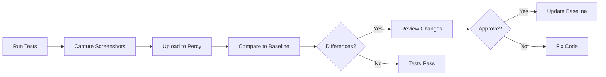

# How to Implement Visual Regression Testing with Percy

Author: [nawazdhandala](https://www.github.com/nawazdhandala)

Tags: Percy, Visual Testing, Regression Testing, UI Testing, Screenshot Testing, CI/CD

Description: Learn how to implement visual regression testing with Percy to catch unintended UI changes automatically by comparing screenshots across builds.

---

CSS changes are dangerous. A small tweak to fix padding on one page can break layouts across your entire application. Unit tests do not catch visual bugs. Manual testing misses subtle changes. Visual regression testing compares screenshots of your UI before and after changes to catch unexpected differences.

Percy is a visual testing platform that integrates with your existing test framework. It captures screenshots, compares them to a baseline, and highlights differences for review.

## How Visual Testing Works



## Setting Up Percy

Create a Percy account and get your token:

```bash
# Set the Percy token
export PERCY_TOKEN=your_percy_token_here
```

Install Percy SDK for your test framework:

```bash
# For Playwright
npm install --save-dev @percy/cli @percy/playwright

# For Cypress
npm install --save-dev @percy/cli @percy/cypress

# For Puppeteer
npm install --save-dev @percy/cli @percy/puppeteer

# For Storybook
npm install --save-dev @percy/cli @percy/storybook
```

## Percy with Playwright

Configure Playwright tests to capture Percy snapshots:

```typescript
// tests/visual.spec.ts
import { test, expect } from '@playwright/test';
import percySnapshot from '@percy/playwright';

test.describe('Visual Regression Tests', () => {
  test('home page', async ({ page }) => {
    await page.goto('/');

    // Wait for page to be fully loaded
    await page.waitForLoadState('networkidle');

    // Capture Percy snapshot
    await percySnapshot(page, 'Home Page');
  });

  test('login page', async ({ page }) => {
    await page.goto('/login');
    await page.waitForLoadState('networkidle');

    await percySnapshot(page, 'Login Page');
  });

  test('login form with error', async ({ page }) => {
    await page.goto('/login');

    // Trigger validation error
    await page.getByRole('button', { name: 'Sign In' }).click();

    // Wait for error to appear
    await page.waitForSelector('[data-testid="error-message"]');

    await percySnapshot(page, 'Login Page - Validation Error');
  });

  test('dashboard with data', async ({ page }) => {
    // Mock API response for consistent screenshots
    await page.route('**/api/dashboard', async (route) => {
      await route.fulfill({
        status: 200,
        body: JSON.stringify({
          stats: { users: 1234, revenue: 56789 },
        }),
      });
    });

    await page.goto('/dashboard');
    await page.waitForLoadState('networkidle');

    await percySnapshot(page, 'Dashboard');
  });
});
```

Run tests with Percy:

```bash
# Run Playwright tests with Percy
npx percy exec -- npx playwright test tests/visual.spec.ts
```

## Percy with Cypress

Set up Percy in Cypress:

```javascript
// cypress/support/e2e.js
import '@percy/cypress';
```

Write visual tests:

```javascript
// cypress/e2e/visual.cy.js
describe('Visual Regression Tests', () => {
  it('captures the home page', () => {
    cy.visit('/');
    cy.wait(1000); // Wait for animations

    cy.percySnapshot('Home Page');
  });

  it('captures the product list', () => {
    cy.visit('/products');

    // Wait for products to load
    cy.get('[data-testid="product-card"]').should('have.length.at.least', 1);

    cy.percySnapshot('Product List');
  });

  it('captures product detail page', () => {
    cy.visit('/products/1');

    // Wait for product details
    cy.get('[data-testid="product-name"]').should('be.visible');
    cy.get('[data-testid="product-image"]').should('be.visible');

    cy.percySnapshot('Product Detail');
  });

  it('captures mobile viewport', () => {
    cy.viewport('iphone-x');
    cy.visit('/');

    cy.percySnapshot('Home Page - Mobile', {
      widths: [375],
    });
  });
});
```

Run with Percy:

```bash
npx percy exec -- npx cypress run --spec "cypress/e2e/visual.cy.js"
```

## Percy with Storybook

For component-level visual testing:

```javascript
// .storybook/preview.js
export const parameters = {
  // Percy will capture all stories
  percy: {
    // Skip stories with this parameter
    skip: false,
  },
};
```

Create stories:

```typescript
// src/components/Button/Button.stories.tsx
import type { Meta, StoryObj } from '@storybook/react';
import { Button } from './Button';

const meta: Meta<typeof Button> = {
  title: 'Components/Button',
  component: Button,
};

export default meta;
type Story = StoryObj<typeof Button>;

export const Primary: Story = {
  args: {
    variant: 'primary',
    children: 'Primary Button',
  },
};

export const Secondary: Story = {
  args: {
    variant: 'secondary',
    children: 'Secondary Button',
  },
};

export const Disabled: Story = {
  args: {
    variant: 'primary',
    children: 'Disabled Button',
    disabled: true,
  },
};

export const Loading: Story = {
  args: {
    variant: 'primary',
    children: 'Loading...',
    isLoading: true,
  },
};
```

Run Percy on Storybook:

```bash
# Build Storybook
npm run build-storybook

# Run Percy
npx percy storybook ./storybook-static
```

## Configuration Options

Create `percy.yml` in your project root:

```yaml
# percy.yml
version: 2
snapshot:
  # Viewport widths to capture
  widths:
    - 375   # Mobile
    - 768   # Tablet
    - 1280  # Desktop

  # Minimum height
  min-height: 1024

  # Wait for fonts to load
  enable-javascript: true

  # Percy CSS to apply
  percy-css: |
    /* Hide dynamic content */
    [data-testid="timestamp"] { visibility: hidden; }
    [data-testid="random-ad"] { display: none; }

    /* Disable animations */
    *, *::before, *::after {
      animation-duration: 0s !important;
      transition-duration: 0s !important;
    }

# Storybook-specific
storybook:
  # Only capture specific stories
  include:
    - Components/**
    - Pages/**

  # Exclude stories
  exclude:
    - "**/*-docs"
    - "**/Playground"

# Discovery settings
discovery:
  # Network idle timeout
  network-idle-timeout: 500
```

## Handling Dynamic Content

Dynamic content causes false positives. Hide or stabilize it:

```typescript
// tests/visual.spec.ts
test('page with dynamic content', async ({ page }) => {
  await page.goto('/dashboard');

  // Hide elements that change between runs
  await page.evaluate(() => {
    // Hide timestamps
    document.querySelectorAll('[data-testid="timestamp"]').forEach((el) => {
      (el as HTMLElement).style.visibility = 'hidden';
    });

    // Replace random avatars with placeholder
    document.querySelectorAll('[data-testid="user-avatar"]').forEach((el) => {
      (el as HTMLImageElement).src = '/placeholder-avatar.png';
    });
  });

  await percySnapshot(page, 'Dashboard - Stabilized');
});
```

Using Percy CSS:

```typescript
await percySnapshot(page, 'Dashboard', {
  percyCSS: `
    [data-testid="timestamp"] { visibility: hidden; }
    [data-testid="chart"] { opacity: 0; }
    .animated { animation: none !important; }
  `,
});
```

## Responsive Testing

Capture multiple viewport sizes:

```typescript
test('responsive design', async ({ page }) => {
  await page.goto('/');

  // Percy captures at configured widths
  await percySnapshot(page, 'Home Page - Responsive', {
    widths: [375, 768, 1024, 1440],
  });
});
```

Test specific breakpoints:

```typescript
const breakpoints = [
  { name: 'mobile', width: 375, height: 667 },
  { name: 'tablet', width: 768, height: 1024 },
  { name: 'desktop', width: 1440, height: 900 },
];

for (const bp of breakpoints) {
  test(`navigation at ${bp.name}`, async ({ page }) => {
    await page.setViewportSize({ width: bp.width, height: bp.height });
    await page.goto('/');

    await percySnapshot(page, `Navigation - ${bp.name}`);
  });
}
```

## CI/CD Integration

GitHub Actions workflow:

```yaml
# .github/workflows/visual-tests.yml
name: Visual Tests

on:
  push:
    branches: [main]
  pull_request:
    branches: [main]

env:
  PERCY_TOKEN: ${{ secrets.PERCY_TOKEN }}

jobs:
  visual-tests:
    runs-on: ubuntu-latest

    steps:
      - uses: actions/checkout@v4

      - name: Setup Node.js
        uses: actions/setup-node@v4
        with:
          node-version: '20'
          cache: 'npm'

      - name: Install dependencies
        run: npm ci

      - name: Install Playwright browsers
        run: npx playwright install --with-deps chromium

      - name: Start application
        run: npm start &

      - name: Wait for application
        run: npx wait-on http://localhost:3000

      - name: Run visual tests
        run: npx percy exec -- npx playwright test tests/visual/

      - name: Percy finalize
        if: always()
        run: npx percy build:finalize
```

## Review Workflow

When Percy finds differences:

1. Open the Percy dashboard
2. Review each changed snapshot
3. Compare baseline to new screenshot
4. Approve intentional changes or reject bugs
5. Approved changes become the new baseline

In pull requests, Percy adds a status check that blocks merging until visual changes are reviewed.

## Best Practices

1. Capture key pages and states, not every possible screen
2. Hide dynamic content like timestamps and ads
3. Use consistent test data
4. Disable animations and transitions
5. Review visual changes as part of code review
6. Set up Percy branch workflows (feature vs main)
7. Keep snapshot counts reasonable for cost
8. Name snapshots descriptively

---

Visual regression testing with Percy catches CSS bugs that slip through unit tests and code review. The screenshot comparison reveals exactly what changed, making it easy to spot unintended side effects. Combined with your existing test suite, it provides confidence that UI changes are intentional.
