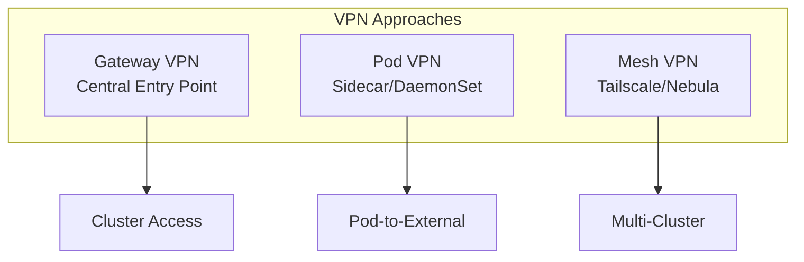

# How to Configure VPN for Kubernetes

Author: [nawazdhandala](https://www.github.com/nawazdhandala)

Tags: VPN, Kubernetes, Networking, Security, WireGuard, DevOps

Description: A practical guide to configuring VPN solutions for Kubernetes clusters, covering WireGuard, Tailscale, and traditional VPN setups for secure cluster access and multi-cluster connectivity.

---

Securing access to Kubernetes clusters often requires VPN connectivity. Whether you need to access private clusters, connect multiple clusters, or provide secure developer access, this guide covers practical VPN implementations for Kubernetes.

## VPN Architecture Options



## WireGuard VPN Gateway

### Deploy WireGuard as DaemonSet

```yaml
# wireguard-daemonset.yaml
apiVersion: apps/v1
kind: DaemonSet
metadata:
  name: wireguard
  namespace: vpn
spec:
  selector:
    matchLabels:
      app: wireguard
  template:
    metadata:
      labels:
        app: wireguard
    spec:
      hostNetwork: true
      containers:
        - name: wireguard
          image: linuxserver/wireguard:latest
          securityContext:
            capabilities:
              add:
                - NET_ADMIN
                - SYS_MODULE
            privileged: true
          env:
            - name: PUID
              value: "1000"
            - name: PGID
              value: "1000"
            - name: TZ
              value: "UTC"
            - name: SERVERPORT
              value: "51820"
            - name: PEERS
              value: "developer1,developer2,developer3"
            - name: PEERDNS
              value: "10.96.0.10"  # Kubernetes DNS
            - name: INTERNAL_SUBNET
              value: "10.13.13.0"
            - name: ALLOWEDIPS
              value: "10.0.0.0/8,172.16.0.0/12"
          volumeMounts:
            - name: config
              mountPath: /config
            - name: modules
              mountPath: /lib/modules
              readOnly: true
          ports:
            - containerPort: 51820
              protocol: UDP
              hostPort: 51820
      volumes:
        - name: config
          persistentVolumeClaim:
            claimName: wireguard-config
        - name: modules
          hostPath:
            path: /lib/modules
            type: Directory
      nodeSelector:
        vpn-gateway: "true"
---
apiVersion: v1
kind: Service
metadata:
  name: wireguard
  namespace: vpn
spec:
  type: LoadBalancer
  ports:
    - port: 51820
      protocol: UDP
      targetPort: 51820
  selector:
    app: wireguard
```

### WireGuard ConfigMap

```yaml
# wireguard-config.yaml
apiVersion: v1
kind: ConfigMap
metadata:
  name: wireguard-config
  namespace: vpn
data:
  wg0.conf: |
    [Interface]
    Address = 10.13.13.1/24
    ListenPort = 51820
    PrivateKey = ${SERVER_PRIVATE_KEY}
    PostUp = iptables -A FORWARD -i %i -j ACCEPT; iptables -A FORWARD -o %i -j ACCEPT; iptables -t nat -A POSTROUTING -o eth0 -j MASQUERADE
    PostDown = iptables -D FORWARD -i %i -j ACCEPT; iptables -D FORWARD -o %i -j ACCEPT; iptables -t nat -D POSTROUTING -o eth0 -j MASQUERADE

    # Developer 1
    [Peer]
    PublicKey = ${PEER1_PUBLIC_KEY}
    AllowedIPs = 10.13.13.2/32

    # Developer 2
    [Peer]
    PublicKey = ${PEER2_PUBLIC_KEY}
    AllowedIPs = 10.13.13.3/32
```

### Client Configuration Generator

```bash
#!/bin/bash
# generate-client-config.sh

CLIENT_NAME=$1
SERVER_PUBLIC_KEY="your-server-public-key"
SERVER_ENDPOINT="vpn.example.com:51820"
CLIENT_IP="10.13.13.$((RANDOM % 250 + 2))"

# Generate client keys
CLIENT_PRIVATE_KEY=$(wg genkey)
CLIENT_PUBLIC_KEY=$(echo "$CLIENT_PRIVATE_KEY" | wg pubkey)

cat << EOF > "${CLIENT_NAME}.conf"
[Interface]
PrivateKey = ${CLIENT_PRIVATE_KEY}
Address = ${CLIENT_IP}/32
DNS = 10.96.0.10

[Peer]
PublicKey = ${SERVER_PUBLIC_KEY}
AllowedIPs = 10.0.0.0/8, 172.16.0.0/12, 10.96.0.0/12
Endpoint = ${SERVER_ENDPOINT}
PersistentKeepalive = 25
EOF

echo "Client config saved to ${CLIENT_NAME}.conf"
echo "Add this peer to server:"
echo "[Peer]"
echo "PublicKey = ${CLIENT_PUBLIC_KEY}"
echo "AllowedIPs = ${CLIENT_IP}/32"
```

## Tailscale for Kubernetes

Tailscale provides a mesh VPN that works well with Kubernetes.

### Tailscale Operator

```yaml
# tailscale-operator.yaml
apiVersion: v1
kind: Namespace
metadata:
  name: tailscale
---
apiVersion: v1
kind: Secret
metadata:
  name: tailscale-auth
  namespace: tailscale
stringData:
  TS_AUTHKEY: "tskey-auth-xxxxx"
---
apiVersion: apps/v1
kind: Deployment
metadata:
  name: tailscale-operator
  namespace: tailscale
spec:
  replicas: 1
  selector:
    matchLabels:
      app: tailscale-operator
  template:
    metadata:
      labels:
        app: tailscale-operator
    spec:
      serviceAccountName: tailscale-operator
      containers:
        - name: operator
          image: tailscale/k8s-operator:latest
          env:
            - name: TS_AUTHKEY
              valueFrom:
                secretKeyRef:
                  name: tailscale-auth
                  key: TS_AUTHKEY
            - name: OPERATOR_NAMESPACE
              valueFrom:
                fieldRef:
                  fieldPath: metadata.namespace
```

### Expose Service via Tailscale

```yaml
# tailscale-service.yaml
apiVersion: v1
kind: Service
metadata:
  name: my-app-tailscale
  annotations:
    tailscale.com/expose: "true"
    tailscale.com/hostname: "my-app"
spec:
  selector:
    app: my-app
  ports:
    - port: 80
      targetPort: 8080
  type: ClusterIP
```

### Tailscale Subnet Router

```yaml
# tailscale-subnet-router.yaml
apiVersion: apps/v1
kind: Deployment
metadata:
  name: tailscale-subnet-router
  namespace: tailscale
spec:
  replicas: 1
  selector:
    matchLabels:
      app: tailscale-router
  template:
    metadata:
      labels:
        app: tailscale-router
    spec:
      containers:
        - name: tailscale
          image: tailscale/tailscale:latest
          securityContext:
            capabilities:
              add:
                - NET_ADMIN
          env:
            - name: TS_AUTHKEY
              valueFrom:
                secretKeyRef:
                  name: tailscale-auth
                  key: TS_AUTHKEY
            - name: TS_ROUTES
              value: "10.96.0.0/12,10.244.0.0/16"  # Service and Pod CIDRs
            - name: TS_USERSPACE
              value: "false"
            - name: TS_ACCEPT_DNS
              value: "true"
          volumeMounts:
            - name: dev-tun
              mountPath: /dev/net/tun
            - name: state
              mountPath: /var/lib/tailscale
      volumes:
        - name: dev-tun
          hostPath:
            path: /dev/net/tun
        - name: state
          emptyDir: {}
```

## OpenVPN Access Server

### Deploy OpenVPN

```yaml
# openvpn-deployment.yaml
apiVersion: apps/v1
kind: Deployment
metadata:
  name: openvpn
  namespace: vpn
spec:
  replicas: 1
  selector:
    matchLabels:
      app: openvpn
  template:
    metadata:
      labels:
        app: openvpn
    spec:
      containers:
        - name: openvpn
          image: kylemanna/openvpn:latest
          securityContext:
            capabilities:
              add:
                - NET_ADMIN
          ports:
            - containerPort: 1194
              protocol: UDP
          volumeMounts:
            - name: openvpn-data
              mountPath: /etc/openvpn
          env:
            - name: OVPN_SERVER_URL
              value: "udp://vpn.example.com"
            - name: OVPN_NETWORK
              value: "10.8.0.0 255.255.255.0"
            - name: OVPN_ROUTES
              value: "10.96.0.0 255.240.0.0"
            - name: OVPN_DNS_SERVERS
              value: "10.96.0.10"
      volumes:
        - name: openvpn-data
          persistentVolumeClaim:
            claimName: openvpn-data
---
apiVersion: v1
kind: Service
metadata:
  name: openvpn
  namespace: vpn
spec:
  type: LoadBalancer
  ports:
    - port: 1194
      protocol: UDP
  selector:
    app: openvpn
```

### Initialize OpenVPN PKI

```bash
#!/bin/bash
# init-openvpn.sh

NAMESPACE="vpn"
POD=$(kubectl get pods -n $NAMESPACE -l app=openvpn -o jsonpath='{.items[0].metadata.name}')
SERVER_URL="udp://vpn.example.com"

# Initialize PKI
kubectl exec -n $NAMESPACE $POD -- ovpn_genconfig -u $SERVER_URL \
    -e 'push "route 10.96.0.0 255.240.0.0"' \
    -e 'push "route 10.244.0.0 255.255.0.0"' \
    -e 'push "dhcp-option DNS 10.96.0.10"'

# Generate CA
kubectl exec -n $NAMESPACE -it $POD -- ovpn_initpki

# Generate client certificate
kubectl exec -n $NAMESPACE -it $POD -- easyrsa build-client-full developer1 nopass

# Get client config
kubectl exec -n $NAMESPACE $POD -- ovpn_getclient developer1 > developer1.ovpn
```

## Multi-Cluster VPN Connectivity

### Connect Clusters with WireGuard

```yaml
# cluster-a-wireguard.yaml
apiVersion: apps/v1
kind: DaemonSet
metadata:
  name: wg-mesh
  namespace: kube-system
spec:
  selector:
    matchLabels:
      app: wg-mesh
  template:
    metadata:
      labels:
        app: wg-mesh
    spec:
      hostNetwork: true
      containers:
        - name: wireguard
          image: linuxserver/wireguard:latest
          securityContext:
            privileged: true
          volumeMounts:
            - name: config
              mountPath: /config
          env:
            - name: TZ
              value: "UTC"
      volumes:
        - name: config
          configMap:
            name: wg-mesh-config
---
apiVersion: v1
kind: ConfigMap
metadata:
  name: wg-mesh-config
  namespace: kube-system
data:
  wg0.conf: |
    [Interface]
    Address = 10.200.0.1/24
    ListenPort = 51821
    PrivateKey = ${CLUSTER_A_PRIVATE_KEY}
    PostUp = ip route add 10.244.128.0/17 via 10.200.0.2

    # Cluster B
    [Peer]
    PublicKey = ${CLUSTER_B_PUBLIC_KEY}
    AllowedIPs = 10.200.0.2/32, 10.244.128.0/17
    Endpoint = cluster-b.example.com:51821
    PersistentKeepalive = 25
```

## VPN Sidecar for Pods

For pods that need to connect to external resources through VPN.

```yaml
# vpn-sidecar-pod.yaml
apiVersion: v1
kind: Pod
metadata:
  name: app-with-vpn
spec:
  containers:
    - name: app
      image: my-app:latest
      # App traffic goes through VPN

    - name: vpn-sidecar
      image: linuxserver/wireguard:latest
      securityContext:
        capabilities:
          add:
            - NET_ADMIN
        privileged: true
      volumeMounts:
        - name: wg-config
          mountPath: /config/wg_confs
      env:
        - name: TZ
          value: "UTC"

  initContainers:
    - name: init-routes
      image: busybox
      securityContext:
        privileged: true
      command:
        - sh
        - -c
        - |
          # Wait for VPN interface
          while ! ip link show wg0; do sleep 1; done
          # Route specific traffic through VPN
          ip route add 192.168.0.0/16 dev wg0

  volumes:
    - name: wg-config
      secret:
        secretName: vpn-client-config
```

## Network Policies for VPN

```yaml
# vpn-network-policy.yaml
apiVersion: networking.k8s.io/v1
kind: NetworkPolicy
metadata:
  name: vpn-gateway-policy
  namespace: vpn
spec:
  podSelector:
    matchLabels:
      app: wireguard
  policyTypes:
    - Ingress
    - Egress
  ingress:
    # Allow VPN connections
    - ports:
        - protocol: UDP
          port: 51820
    # Allow traffic from VPN clients
    - from:
        - ipBlock:
            cidr: 10.13.13.0/24
  egress:
    # Allow to cluster services
    - to:
        - ipBlock:
            cidr: 10.96.0.0/12
        - ipBlock:
            cidr: 10.244.0.0/16
    # Allow DNS
    - to:
        - namespaceSelector: {}
          podSelector:
            matchLabels:
              k8s-app: kube-dns
      ports:
        - protocol: UDP
          port: 53
```

## Monitoring VPN Connections

```bash
#!/bin/bash
# vpn-monitor.sh

NAMESPACE="vpn"

echo "=== WireGuard Status ==="
kubectl exec -n $NAMESPACE deploy/wireguard -- wg show

echo -e "\n=== Connected Peers ==="
kubectl exec -n $NAMESPACE deploy/wireguard -- wg show wg0 peers

echo -e "\n=== Transfer Statistics ==="
kubectl exec -n $NAMESPACE deploy/wireguard -- wg show wg0 transfer

echo -e "\n=== Latest Handshakes ==="
kubectl exec -n $NAMESPACE deploy/wireguard -- wg show wg0 latest-handshakes
```

### Prometheus Metrics

```yaml
# wireguard-exporter.yaml
apiVersion: apps/v1
kind: Deployment
metadata:
  name: wireguard-exporter
  namespace: vpn
spec:
  replicas: 1
  selector:
    matchLabels:
      app: wg-exporter
  template:
    metadata:
      labels:
        app: wg-exporter
      annotations:
        prometheus.io/scrape: "true"
        prometheus.io/port: "9586"
    spec:
      containers:
        - name: exporter
          image: mindflavor/prometheus-wireguard-exporter:latest
          ports:
            - containerPort: 9586
          volumeMounts:
            - name: wg-config
              mountPath: /etc/wireguard
              readOnly: true
      volumes:
        - name: wg-config
          hostPath:
            path: /etc/wireguard
```

---

VPN configuration for Kubernetes depends heavily on your use case. For developer access, Tailscale offers the easiest setup. For production multi-cluster connectivity, WireGuard provides the best performance. Whatever solution you choose, ensure proper network policies are in place to limit what VPN clients can access within your cluster.
