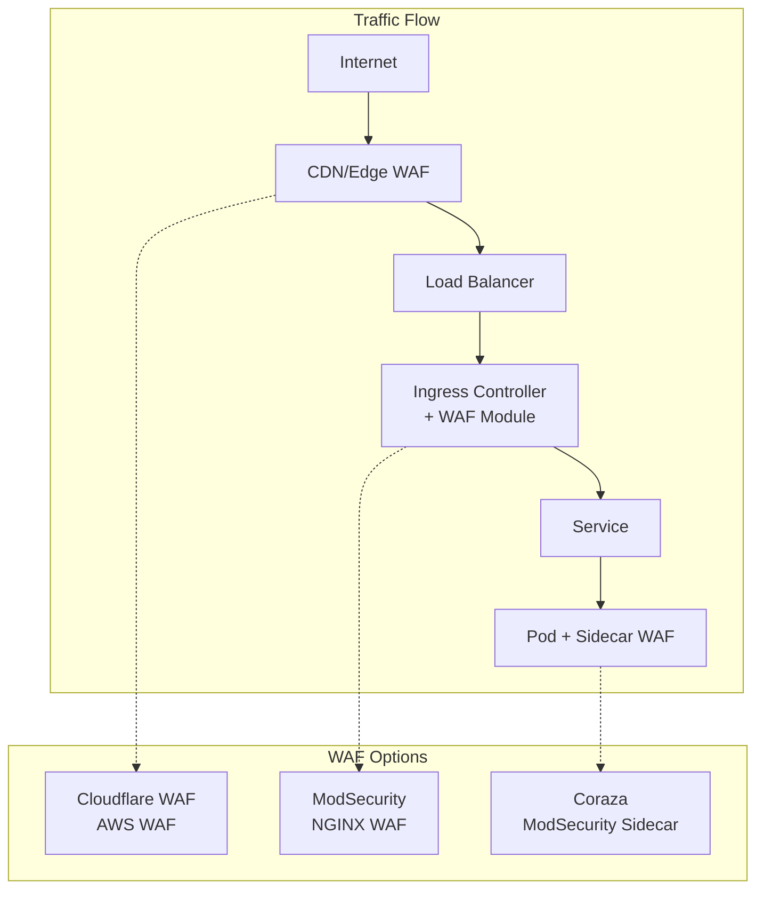

# How to Implement Web Application Firewalls

Author: [nawazdhandala](https://www.github.com/nawazdhandala)

Tags: WAF, Security, Kubernetes, ModSecurity, AWS WAF, NGINX, Application Security

Description: Learn how to implement Web Application Firewalls in Kubernetes environments. This guide covers ModSecurity, cloud WAF integration, and custom rule development for protecting web applications.

---

> Web Application Firewalls (WAFs) protect applications by filtering and monitoring HTTP traffic. Unlike network firewalls, WAFs understand application layer protocols and can detect sophisticated attacks like SQL injection, XSS, and API abuse.

In Kubernetes environments, WAFs can be deployed at multiple layers: as sidecar containers, ingress controller modules, or cloud-native services. Each approach offers different trade-offs between performance, flexibility, and management overhead.

---

## WAF Deployment Architectures

Several patterns exist for WAF deployment in Kubernetes:



---

## Prerequisites

Before implementing WAF:

- Kubernetes cluster (v1.21+)
- Ingress controller (NGINX or similar)
- Understanding of your application's traffic patterns
- Test environment for rule validation

---

## ModSecurity with NGINX Ingress

Enable ModSecurity in the NGINX Ingress Controller:

```yaml
# nginx-ingress-values.yaml
# Helm values for NGINX Ingress with ModSecurity

controller:
  # Enable ModSecurity
  config:
    enable-modsecurity: "true"
    enable-owasp-modsecurity-crs: "true"
    modsecurity-snippet: |
      # ModSecurity configuration
      SecRuleEngine On
      SecRequestBodyAccess On
      SecRequestBodyLimit 13107200
      SecRequestBodyNoFilesLimit 131072
      SecRequestBodyInMemoryLimit 131072
      SecRequestBodyLimitAction Reject

      # Audit logging
      SecAuditEngine RelevantOnly
      SecAuditLogRelevantStatus "^(?:5|4(?!04))"
      SecAuditLogParts ABIJDEFHZ
      SecAuditLogType Serial
      SecAuditLog /var/log/modsec_audit.log

      # Rule settings
      SecRule REQUEST_HEADERS:Content-Type "text/xml" \
        "id:200000,phase:1,t:none,t:lowercase,pass,nolog,ctl:requestBodyProcessor=XML"

      # Paranoia level (1-4, higher = more rules)
      SecAction "id:900000,phase:1,nolog,pass,t:none,setvar:tx.paranoia_level=1"

  # Resource limits
  resources:
    requests:
      cpu: 200m
      memory: 256Mi
    limits:
      cpu: 1000m
      memory: 512Mi

  # Metrics for monitoring
  metrics:
    enabled: true
    serviceMonitor:
      enabled: true
```

Deploy with Helm:

```bash
# Add NGINX Ingress repository
helm repo add ingress-nginx https://kubernetes.github.io/ingress-nginx
helm repo update

# Install with ModSecurity enabled
helm install ingress-nginx ingress-nginx/ingress-nginx \
  --namespace ingress-nginx \
  --create-namespace \
  --values nginx-ingress-values.yaml
```

---

## Custom ModSecurity Rules

Create custom rules for your application:

```yaml
# modsecurity-rules.yaml
apiVersion: v1
kind: ConfigMap
metadata:
  name: modsecurity-rules
  namespace: ingress-nginx
data:
  custom-rules.conf: |
    # Block requests with common attack patterns in query strings
    SecRule ARGS "@rx (?i)(union\s+select|insert\s+into|delete\s+from|drop\s+table)" \
      "id:100001,phase:2,deny,status:403,log,msg:'SQL Injection Attempt'"

    # Block XSS attempts
    SecRule ARGS "@rx (?i)<script[^>]*>.*?</script>" \
      "id:100002,phase:2,deny,status:403,log,msg:'XSS Attempt'"

    # Rate limit API endpoints
    SecRule REQUEST_URI "@beginsWith /api/" \
      "id:100003,phase:1,pass,nolog,setvar:ip.api_requests=+1,expirevar:ip.api_requests=60"
    SecRule IP:API_REQUESTS "@gt 100" \
      "id:100004,phase:1,deny,status:429,log,msg:'API Rate Limit Exceeded'"

    # Block common web shells
    SecRule REQUEST_FILENAME "@rx (?i)\.(php|asp|aspx|jsp|cgi)$" \
      "id:100005,phase:1,chain,deny,status:403,log,msg:'Web Shell Upload Attempt'"
      SecRule REQUEST_METHOD "@streq POST" ""

    # Require specific content type for API
    SecRule REQUEST_URI "@beginsWith /api/v1/" \
      "id:100006,phase:1,chain,deny,status:415,log,msg:'Invalid Content-Type for API'"
      SecRule REQUEST_HEADERS:Content-Type "!@rx ^application/json"

    # Block directory traversal
    SecRule REQUEST_URI "@contains ../" \
      "id:100007,phase:1,deny,status:403,log,msg:'Directory Traversal Attempt'"

    # Custom business logic rules
    SecRule REQUEST_URI "@streq /api/admin" \
      "id:100008,phase:1,chain,deny,status:403,log,msg:'Admin API Access Denied'"
      SecRule REQUEST_HEADERS:X-Admin-Token "!@streq secret-admin-token"

  # Whitelisting rules for specific paths
  whitelist-rules.conf: |
    # Disable body inspection for file upload endpoint
    SecRule REQUEST_URI "@beginsWith /api/upload" \
      "id:100100,phase:1,pass,nolog,ctl:requestBodyAccess=Off"

    # Whitelist health check endpoints
    SecRule REQUEST_URI "@rx ^/(health|ready|live)$" \
      "id:100101,phase:1,pass,nolog,ctl:ruleEngine=Off"

    # Whitelist specific IP ranges
    SecRule REMOTE_ADDR "@ipMatch 10.0.0.0/8,172.16.0.0/12,192.168.0.0/16" \
      "id:100102,phase:1,pass,nolog,ctl:ruleEngine=DetectionOnly"
```

Apply per-ingress rules:

```yaml
# ingress-with-waf.yaml
apiVersion: networking.k8s.io/v1
kind: Ingress
metadata:
  name: api-ingress
  namespace: production
  annotations:
    # Enable ModSecurity for this ingress
    nginx.ingress.kubernetes.io/enable-modsecurity: "true"
    nginx.ingress.kubernetes.io/enable-owasp-core-rules: "true"
    # Custom snippet for this ingress
    nginx.ingress.kubernetes.io/modsecurity-snippet: |
      SecRuleEngine On
      SecAuditEngine On
      # Higher paranoia for sensitive endpoints
      SecAction "id:900000,phase:1,nolog,pass,t:none,setvar:tx.paranoia_level=2"
spec:
  ingressClassName: nginx
  rules:
  - host: api.example.com
    http:
      paths:
      - path: /
        pathType: Prefix
        backend:
          service:
            name: api-service
            port:
              number: 80
```

---

## Coraza WAF Sidecar

Deploy Coraza as a sidecar for application-level protection:

```yaml
# deployment-with-coraza.yaml
apiVersion: apps/v1
kind: Deployment
metadata:
  name: protected-app
  namespace: production
spec:
  replicas: 3
  selector:
    matchLabels:
      app: protected-app
  template:
    metadata:
      labels:
        app: protected-app
    spec:
      containers:
      # Main application
      - name: app
        image: myapp:1.0
        ports:
        - containerPort: 8080

      # Coraza WAF sidecar
      - name: coraza-waf
        image: corazawaf/coraza-proxy-wasm:latest
        ports:
        - containerPort: 8081
        env:
        - name: BACKEND_URL
          value: "http://localhost:8080"
        - name: LISTEN_PORT
          value: "8081"
        volumeMounts:
        - name: coraza-config
          mountPath: /etc/coraza
          readOnly: true
        resources:
          requests:
            cpu: 50m
            memory: 64Mi
          limits:
            cpu: 200m
            memory: 128Mi

      volumes:
      - name: coraza-config
        configMap:
          name: coraza-config

---
apiVersion: v1
kind: ConfigMap
metadata:
  name: coraza-config
  namespace: production
data:
  coraza.conf: |
    # Coraza configuration
    SecRuleEngine On
    SecRequestBodyAccess On
    SecResponseBodyAccess Off

    # Include OWASP CRS
    Include /etc/coraza/crs-setup.conf
    Include /etc/coraza/rules/*.conf

    # Custom rules
    SecRule REQUEST_URI "@contains /admin" \
      "id:1000001,phase:1,deny,status:403,msg:'Admin access blocked'"

  crs-setup.conf: |
    SecAction "id:900000,phase:1,pass,t:none,nolog,setvar:tx.paranoia_level=1"
    SecAction "id:900001,phase:1,pass,t:none,nolog,setvar:tx.crs_validate_utf8_encoding=1"
    SecAction "id:900002,phase:1,pass,t:none,nolog,setvar:tx.arg_name_length=100"
    SecAction "id:900003,phase:1,pass,t:none,nolog,setvar:tx.arg_length=400"
    SecAction "id:900004,phase:1,pass,t:none,nolog,setvar:tx.total_arg_length=64000"

---
# Service pointing to WAF port
apiVersion: v1
kind: Service
metadata:
  name: protected-app
  namespace: production
spec:
  selector:
    app: protected-app
  ports:
  - port: 80
    targetPort: 8081  # Route through WAF
```

---

## AWS WAF Integration

Configure AWS WAF for EKS with ALB Ingress:

```hcl
# aws-waf.tf
# AWS WAF configuration for Kubernetes

# WAF Web ACL
resource "aws_wafv2_web_acl" "main" {
  name        = "eks-waf-acl"
  description = "WAF for EKS applications"
  scope       = "REGIONAL"

  default_action {
    allow {}
  }

  # AWS Managed Rules - Common Rule Set
  rule {
    name     = "AWSManagedRulesCommonRuleSet"
    priority = 1

    override_action {
      none {}
    }

    statement {
      managed_rule_group_statement {
        name        = "AWSManagedRulesCommonRuleSet"
        vendor_name = "AWS"

        # Exclude specific rules that cause false positives
        excluded_rule {
          name = "SizeRestrictions_BODY"
        }
      }
    }

    visibility_config {
      cloudwatch_metrics_enabled = true
      metric_name               = "AWSManagedRulesCommonRuleSet"
      sampled_requests_enabled  = true
    }
  }

  # SQL Injection protection
  rule {
    name     = "AWSManagedRulesSQLiRuleSet"
    priority = 2

    override_action {
      none {}
    }

    statement {
      managed_rule_group_statement {
        name        = "AWSManagedRulesSQLiRuleSet"
        vendor_name = "AWS"
      }
    }

    visibility_config {
      cloudwatch_metrics_enabled = true
      metric_name               = "AWSManagedRulesSQLi"
      sampled_requests_enabled  = true
    }
  }

  # Rate limiting
  rule {
    name     = "RateLimitRule"
    priority = 3

    action {
      block {}
    }

    statement {
      rate_based_statement {
        limit              = 2000
        aggregate_key_type = "IP"
      }
    }

    visibility_config {
      cloudwatch_metrics_enabled = true
      metric_name               = "RateLimitRule"
      sampled_requests_enabled  = true
    }
  }

  # Custom rule for API protection
  rule {
    name     = "APIProtection"
    priority = 4

    action {
      block {}
    }

    statement {
      and_statement {
        statement {
          byte_match_statement {
            search_string         = "/api/"
            positional_constraint = "STARTS_WITH"
            field_to_match {
              uri_path {}
            }
            text_transformation {
              priority = 0
              type     = "LOWERCASE"
            }
          }
        }
        statement {
          not_statement {
            statement {
              byte_match_statement {
                search_string         = "application/json"
                positional_constraint = "CONTAINS"
                field_to_match {
                  single_header {
                    name = "content-type"
                  }
                }
                text_transformation {
                  priority = 0
                  type     = "LOWERCASE"
                }
              }
            }
          }
        }
      }
    }

    visibility_config {
      cloudwatch_metrics_enabled = true
      metric_name               = "APIProtection"
      sampled_requests_enabled  = true
    }
  }

  visibility_config {
    cloudwatch_metrics_enabled = true
    metric_name               = "EKSWebACL"
    sampled_requests_enabled  = true
  }

  tags = {
    Environment = "production"
  }
}

# Associate with ALB
resource "aws_wafv2_web_acl_association" "main" {
  resource_arn = aws_lb.eks_alb.arn
  web_acl_arn  = aws_wafv2_web_acl.main.arn
}
```

Kubernetes Ingress for ALB with WAF:

```yaml
# alb-ingress-waf.yaml
apiVersion: networking.k8s.io/v1
kind: Ingress
metadata:
  name: api-ingress
  namespace: production
  annotations:
    kubernetes.io/ingress.class: alb
    alb.ingress.kubernetes.io/scheme: internet-facing
    alb.ingress.kubernetes.io/target-type: ip
    # Associate WAF Web ACL
    alb.ingress.kubernetes.io/wafv2-acl-arn: arn:aws:wafv2:us-east-1:123456789012:regional/webacl/eks-waf-acl/xxx
    # Enable access logs
    alb.ingress.kubernetes.io/load-balancer-attributes: access_logs.s3.enabled=true,access_logs.s3.bucket=my-alb-logs
spec:
  rules:
  - host: api.example.com
    http:
      paths:
      - path: /
        pathType: Prefix
        backend:
          service:
            name: api-service
            port:
              number: 80
```

---

## WAF Logging and Monitoring

Configure comprehensive logging:

```yaml
# waf-logging.yaml
apiVersion: v1
kind: ConfigMap
metadata:
  name: fluent-bit-waf
  namespace: logging
data:
  fluent-bit.conf: |
    [SERVICE]
        Flush         5
        Log_Level     info

    [INPUT]
        Name              tail
        Path              /var/log/modsec_audit.log
        Parser            modsecurity
        Tag               waf.modsecurity
        Refresh_Interval  10

    [FILTER]
        Name          parser
        Match         waf.modsecurity
        Key_Name      log
        Parser        modsecurity_json
        Reserve_Data  On

    [OUTPUT]
        Name          es
        Match         waf.*
        Host          elasticsearch.logging
        Port          9200
        Index         waf-logs
        Type          _doc

  parsers.conf: |
    [PARSER]
        Name        modsecurity
        Format      regex
        Regex       ^(?<timestamp>[^ ]+) (?<client_ip>[^ ]+) (?<message>.*)$

    [PARSER]
        Name        modsecurity_json
        Format      json
        Time_Key    timestamp
        Time_Format %Y-%m-%d %H:%M:%S
```

Prometheus alerts for WAF:

```yaml
# waf-alerts.yaml
apiVersion: monitoring.coreos.com/v1
kind: PrometheusRule
metadata:
  name: waf-alerts
  namespace: monitoring
spec:
  groups:
  - name: waf
    rules:
    - alert: HighWAFBlockRate
      expr: |
        sum(rate(nginx_ingress_controller_requests{status=~"403|429"}[5m]))
        / sum(rate(nginx_ingress_controller_requests[5m])) > 0.1
      for: 5m
      labels:
        severity: warning
      annotations:
        summary: "High WAF block rate detected"
        description: "More than 10% of requests are being blocked"

    - alert: WAFRuleTriggered
      expr: |
        increase(modsecurity_rule_triggered_total{severity="critical"}[5m]) > 0
      for: 1m
      labels:
        severity: critical
      annotations:
        summary: "Critical WAF rule triggered"
        description: "ModSecurity critical rule {{ $labels.rule_id }} triggered"

    - alert: PotentialAttack
      expr: |
        sum(rate(modsecurity_attacks_total[1m])) > 10
      for: 2m
      labels:
        severity: warning
      annotations:
        summary: "Potential attack detected"
        description: "High rate of WAF-detected attacks"
```

---

## Testing WAF Rules

Validate WAF rules before production:

```bash
#!/bin/bash
# test-waf.sh
# WAF rule testing script

WAF_URL="${1:-http://localhost:8080}"

echo "=== WAF Rule Testing ==="

# Test SQL Injection
echo -n "SQL Injection Test: "
RESPONSE=$(curl -s -o /dev/null -w "%{http_code}" \
  "${WAF_URL}/api/search?q=1'+OR+'1'='1")
if [ "$RESPONSE" == "403" ]; then
    echo "PASS (blocked)"
else
    echo "FAIL (status: $RESPONSE)"
fi

# Test XSS
echo -n "XSS Test: "
RESPONSE=$(curl -s -o /dev/null -w "%{http_code}" \
  "${WAF_URL}/api/comment" \
  -H "Content-Type: application/json" \
  -d '{"comment":"<script>alert(1)</script>"}')
if [ "$RESPONSE" == "403" ]; then
    echo "PASS (blocked)"
else
    echo "FAIL (status: $RESPONSE)"
fi

# Test Path Traversal
echo -n "Path Traversal Test: "
RESPONSE=$(curl -s -o /dev/null -w "%{http_code}" \
  "${WAF_URL}/../../../etc/passwd")
if [ "$RESPONSE" == "403" ]; then
    echo "PASS (blocked)"
else
    echo "FAIL (status: $RESPONSE)"
fi

# Test Rate Limiting
echo -n "Rate Limit Test: "
for i in {1..150}; do
    curl -s -o /dev/null "${WAF_URL}/api/health"
done
RESPONSE=$(curl -s -o /dev/null -w "%{http_code}" "${WAF_URL}/api/health")
if [ "$RESPONSE" == "429" ]; then
    echo "PASS (rate limited)"
else
    echo "FAIL (status: $RESPONSE)"
fi

# Test legitimate request
echo -n "Legitimate Request Test: "
RESPONSE=$(curl -s -o /dev/null -w "%{http_code}" \
  "${WAF_URL}/api/users" \
  -H "Content-Type: application/json")
if [ "$RESPONSE" == "200" ]; then
    echo "PASS (allowed)"
else
    echo "FAIL (status: $RESPONSE)"
fi

echo "=== Testing Complete ==="
```

---

## Conclusion

Web Application Firewalls provide critical protection for Kubernetes applications by filtering malicious traffic at the application layer. Whether using ModSecurity with NGINX Ingress, cloud WAF services, or sidecar implementations, WAFs complement other security measures to create defense in depth.

Start with managed rule sets like OWASP CRS, then add custom rules for your specific application needs. Monitor WAF logs closely to tune rules and reduce false positives while maintaining security coverage.

---

*Need comprehensive monitoring for your WAF deployment? [OneUptime](https://oneuptime.com) provides unified observability for security and application performance, helping you correlate WAF events with application behavior.*
