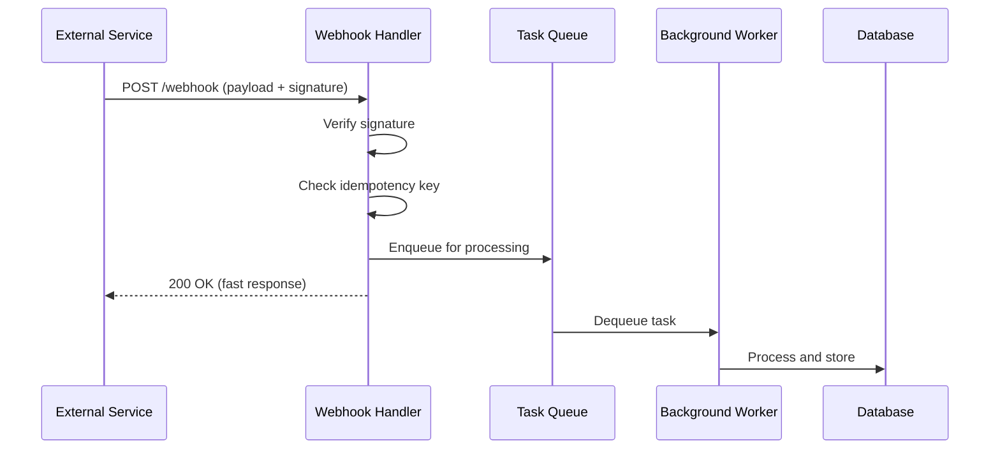

# How to Build Webhook Handlers in Python

Author: [nawazdhandala](https://www.github.com/nawazdhandala)

Tags: Python, Webhooks, FastAPI, Flask, API Development, Event-Driven

Description: Learn how to build production-ready webhook handlers in Python using FastAPI and Flask. This guide covers signature verification, idempotency, async processing, and error handling patterns.

---

> Webhooks let external services push data to your application in real time. Building reliable webhook handlers means dealing with verification, retries, and processing at scale. This guide shows you how to build handlers that work in production.

Webhooks are the backbone of modern integrations. Whether you're receiving payment notifications from Stripe, code pushes from GitHub, or alerts from monitoring systems, you need handlers that validate, process, and respond correctly. A poorly built webhook handler can lose data, create security holes, or bring down your system under load.

---

## Webhook Handler Architecture

Before diving into code, let's understand what a webhook handler needs to do:



The key insight is that webhook handlers should acknowledge quickly and process asynchronously. External services have timeout limits, and slow responses trigger retries that can overwhelm your system.

---

## Basic Webhook Handler with FastAPI

Let's start with a simple but functional webhook handler. This example receives webhooks, verifies the signature, and stores events for processing.

```python
# webhook_handler.py
# Basic webhook handler with signature verification
from fastapi import FastAPI, Request, HTTPException, Header
from datetime import datetime
import hashlib
import hmac
import json

app = FastAPI()

# Secret key for verifying webhook signatures (store in environment variable)
WEBHOOK_SECRET = "your-webhook-secret-key"

def verify_signature(payload: bytes, signature: str, secret: str) -> bool:
    """
    Verify webhook signature using HMAC-SHA256.
    Most services use this pattern: signature = HMAC(secret, payload)
    """
    # Compute the expected signature
    expected = hmac.new(
        secret.encode(),
        payload,
        hashlib.sha256
    ).hexdigest()

    # Use constant-time comparison to prevent timing attacks
    return hmac.compare_digest(expected, signature)

@app.post("/webhooks/events")
async def handle_webhook(
    request: Request,
    x_webhook_signature: str = Header(None, alias="X-Webhook-Signature")
):
    """
    Handle incoming webhook events.
    This endpoint receives events, verifies them, and queues for processing.
    """
    # Read the raw body for signature verification
    # Important: Read body before parsing JSON
    body = await request.body()

    # Verify the signature if present
    if x_webhook_signature:
        if not verify_signature(body, x_webhook_signature, WEBHOOK_SECRET):
            # Log failed verification attempts for security monitoring
            raise HTTPException(status_code=401, detail="Invalid signature")

    # Parse the JSON payload
    try:
        payload = json.loads(body)
    except json.JSONDecodeError:
        raise HTTPException(status_code=400, detail="Invalid JSON payload")

    # Extract event metadata
    event_type = payload.get("type", "unknown")
    event_id = payload.get("id")

    # Store for async processing (we'll expand on this later)
    await store_event(event_id, event_type, payload)

    # Return quickly - processing happens asynchronously
    return {
        "status": "received",
        "event_id": event_id
    }

async def store_event(event_id: str, event_type: str, payload: dict):
    """Store event for later processing (placeholder)"""
    # In production, this would write to a queue or database
    print(f"Received event {event_id}: {event_type}")
```

---

## Handling Idempotency

Webhook senders often retry failed deliveries. Without idempotency handling, you might process the same event multiple times, leading to duplicate charges, notifications, or data corruption.

```python
# idempotent_handler.py
# Webhook handler with idempotency support using Redis
from fastapi import FastAPI, Request, HTTPException, Header
from datetime import datetime, timedelta
import redis
import json

app = FastAPI()

# Redis client for tracking processed events
redis_client = redis.Redis(host="localhost", port=6379, db=0)

# How long to remember processed events (handles late retries)
IDEMPOTENCY_TTL = timedelta(hours=24)

class IdempotencyStore:
    """
    Track processed webhook events to prevent duplicate processing.
    Uses Redis for fast lookups and automatic expiration.
    """

    def __init__(self, redis_client: redis.Redis):
        self.redis = redis_client
        self.key_prefix = "webhook:processed:"

    def is_processed(self, event_id: str) -> bool:
        """Check if we've already processed this event"""
        key = f"{self.key_prefix}{event_id}"
        return self.redis.exists(key) > 0

    def mark_processed(self, event_id: str, result: dict):
        """
        Mark an event as processed and store the result.
        The result is stored so we can return the same response on retries.
        """
        key = f"{self.key_prefix}{event_id}"
        self.redis.setex(
            key,
            IDEMPOTENCY_TTL,
            json.dumps(result)
        )

    def get_previous_result(self, event_id: str) -> dict:
        """Get the result from a previous processing attempt"""
        key = f"{self.key_prefix}{event_id}"
        data = self.redis.get(key)
        return json.loads(data) if data else None

idempotency_store = IdempotencyStore(redis_client)

@app.post("/webhooks/payments")
async def handle_payment_webhook(
    request: Request,
    x_idempotency_key: str = Header(None, alias="X-Idempotency-Key")
):
    """
    Handle payment webhooks with idempotency.
    If we've seen this event before, return the cached result.
    """
    body = await request.body()
    payload = json.loads(body)

    # Use the provided idempotency key or fall back to event ID
    event_id = x_idempotency_key or payload.get("id")

    if not event_id:
        raise HTTPException(
            status_code=400,
            detail="Missing event ID or idempotency key"
        )

    # Check if we've already processed this event
    if idempotency_store.is_processed(event_id):
        # Return the same result we returned before
        previous_result = idempotency_store.get_previous_result(event_id)
        return previous_result

    # Process the new event
    result = await process_payment_event(payload)

    # Store the result for future retries
    idempotency_store.mark_processed(event_id, result)

    return result

async def process_payment_event(payload: dict) -> dict:
    """Process a payment webhook event"""
    event_type = payload.get("type")

    # Handle different payment event types
    if event_type == "payment.completed":
        # Update order status, send confirmation email, etc.
        return {"status": "processed", "action": "order_confirmed"}
    elif event_type == "payment.failed":
        # Notify user, update order status
        return {"status": "processed", "action": "payment_failed_handled"}
    else:
        return {"status": "ignored", "reason": "unknown_event_type"}
```

---

## Async Processing with Background Workers

For heavy processing, don't make the webhook sender wait. Accept the webhook immediately and process it in the background.

```python
# async_webhook_handler.py
# Webhook handler with background task processing
from fastapi import FastAPI, Request, BackgroundTasks
from pydantic import BaseModel
from typing import Optional
from datetime import datetime
import asyncio

app = FastAPI()

class WebhookEvent(BaseModel):
    """Data model for webhook events"""
    id: str
    type: str
    timestamp: datetime
    data: dict
    retry_count: Optional[int] = 0

# In-memory queue for demonstration (use Redis/RabbitMQ in production)
event_queue = asyncio.Queue()

async def enqueue_event(event: WebhookEvent):
    """Add event to processing queue"""
    await event_queue.put(event)

async def process_event_worker():
    """
    Background worker that processes events from the queue.
    In production, run multiple workers for parallel processing.
    """
    while True:
        # Wait for an event to process
        event = await event_queue.get()

        try:
            await process_event(event)
        except Exception as e:
            # Log error and potentially retry
            print(f"Error processing event {event.id}: {e}")

            # Retry with backoff if under retry limit
            if event.retry_count < 3:
                event.retry_count += 1
                await asyncio.sleep(2 ** event.retry_count)  # Exponential backoff
                await enqueue_event(event)
        finally:
            event_queue.task_done()

async def process_event(event: WebhookEvent):
    """Process a single webhook event"""
    print(f"Processing {event.type}: {event.id}")

    # Simulate processing time
    await asyncio.sleep(0.5)

    # Route to appropriate handler based on event type
    handlers = {
        "user.created": handle_user_created,
        "order.placed": handle_order_placed,
        "payment.received": handle_payment_received,
    }

    handler = handlers.get(event.type)
    if handler:
        await handler(event.data)

async def handle_user_created(data: dict):
    """Handle user creation events"""
    print(f"New user: {data.get('email')}")

async def handle_order_placed(data: dict):
    """Handle order placement events"""
    print(f"New order: {data.get('order_id')}")

async def handle_payment_received(data: dict):
    """Handle payment events"""
    print(f"Payment received: {data.get('amount')}")

@app.on_event("startup")
async def start_workers():
    """Start background workers when the app starts"""
    # Start 3 worker tasks for parallel processing
    for _ in range(3):
        asyncio.create_task(process_event_worker())

@app.post("/webhooks/async")
async def handle_async_webhook(request: Request):
    """
    Accept webhooks and queue for async processing.
    Returns immediately so the sender doesn't timeout.
    """
    payload = await request.json()

    # Create event object
    event = WebhookEvent(
        id=payload.get("id", str(datetime.utcnow().timestamp())),
        type=payload.get("type", "unknown"),
        timestamp=datetime.utcnow(),
        data=payload.get("data", {})
    )

    # Queue for background processing
    await enqueue_event(event)

    # Return immediately with 202 Accepted
    return {
        "status": "accepted",
        "event_id": event.id,
        "message": "Event queued for processing"
    }
```

---

## Production-Ready Handler with Flask

Here's a complete Flask implementation that brings together all the concepts.

```python
# flask_webhook_handler.py
# Production-ready webhook handler using Flask
from flask import Flask, request, jsonify
from functools import wraps
import hashlib
import hmac
import json
import logging
from datetime import datetime

app = Flask(__name__)
logging.basicConfig(level=logging.INFO)
logger = logging.getLogger(__name__)

# Configuration
WEBHOOK_SECRET = "your-secret-key"
ALLOWED_IPS = ["192.168.1.0/24", "10.0.0.0/8"]  # Optional IP whitelist

def require_signature(f):
    """
    Decorator to require and verify webhook signatures.
    Use this on routes that need signature verification.
    """
    @wraps(f)
    def decorated(*args, **kwargs):
        signature = request.headers.get("X-Webhook-Signature")

        if not signature:
            logger.warning("Missing webhook signature")
            return jsonify({"error": "Missing signature"}), 401

        # Get raw body for signature computation
        body = request.get_data()

        # Compute expected signature
        expected = hmac.new(
            WEBHOOK_SECRET.encode(),
            body,
            hashlib.sha256
        ).hexdigest()

        # Constant-time comparison
        if not hmac.compare_digest(signature, expected):
            logger.warning(f"Invalid signature from {request.remote_addr}")
            return jsonify({"error": "Invalid signature"}), 401

        return f(*args, **kwargs)
    return decorated

def log_webhook(f):
    """Decorator to log webhook requests for debugging"""
    @wraps(f)
    def decorated(*args, **kwargs):
        logger.info(f"Webhook received: {request.path} from {request.remote_addr}")
        start_time = datetime.utcnow()

        result = f(*args, **kwargs)

        duration = (datetime.utcnow() - start_time).total_seconds() * 1000
        logger.info(f"Webhook processed in {duration:.2f}ms")

        return result
    return decorated

@app.route("/webhooks/github", methods=["POST"])
@log_webhook
@require_signature
def handle_github_webhook():
    """
    Handle GitHub webhooks for CI/CD integration.
    GitHub sends events for pushes, PRs, issues, etc.
    """
    event_type = request.headers.get("X-GitHub-Event", "unknown")
    delivery_id = request.headers.get("X-GitHub-Delivery")

    payload = request.get_json()

    # Route to appropriate handler
    if event_type == "push":
        return handle_push_event(payload, delivery_id)
    elif event_type == "pull_request":
        return handle_pr_event(payload, delivery_id)
    elif event_type == "ping":
        # GitHub sends a ping when you set up the webhook
        return jsonify({"status": "pong"})
    else:
        logger.info(f"Ignoring event type: {event_type}")
        return jsonify({"status": "ignored", "event_type": event_type})

def handle_push_event(payload: dict, delivery_id: str):
    """Handle git push events"""
    ref = payload.get("ref", "")
    commits = payload.get("commits", [])
    repo = payload.get("repository", {}).get("full_name")

    logger.info(f"Push to {repo} on {ref}: {len(commits)} commits")

    # Trigger CI/CD pipeline, notify team, etc.

    return jsonify({
        "status": "processed",
        "delivery_id": delivery_id,
        "action": "ci_triggered"
    })

def handle_pr_event(payload: dict, delivery_id: str):
    """Handle pull request events"""
    action = payload.get("action")
    pr_number = payload.get("number")
    pr_title = payload.get("pull_request", {}).get("title")

    logger.info(f"PR #{pr_number} {action}: {pr_title}")

    return jsonify({
        "status": "processed",
        "delivery_id": delivery_id,
        "pr_action": action
    })

@app.errorhandler(Exception)
def handle_error(error):
    """
    Global error handler for webhook routes.
    Always return a valid response so senders don't retry unnecessarily.
    """
    logger.exception(f"Webhook error: {error}")

    # Return 500 but with a body so it's clear what happened
    return jsonify({
        "status": "error",
        "message": "Internal processing error"
    }), 500

if __name__ == "__main__":
    app.run(debug=False, port=5000)
```

---

## Testing Webhook Handlers

Testing webhooks locally can be tricky since external services need to reach your machine. Here's a testing approach.

```python
# test_webhook_handler.py
# Unit tests for webhook handlers
import pytest
from fastapi.testclient import TestClient
import hmac
import hashlib
import json

from webhook_handler import app, WEBHOOK_SECRET

client = TestClient(app)

def generate_signature(payload: dict, secret: str) -> str:
    """Generate a valid signature for testing"""
    body = json.dumps(payload).encode()
    return hmac.new(secret.encode(), body, hashlib.sha256).hexdigest()

def test_valid_webhook():
    """Test that valid webhooks are accepted"""
    payload = {"id": "evt_123", "type": "test.event", "data": {}}
    signature = generate_signature(payload, WEBHOOK_SECRET)

    response = client.post(
        "/webhooks/events",
        json=payload,
        headers={"X-Webhook-Signature": signature}
    )

    assert response.status_code == 200
    assert response.json()["status"] == "received"

def test_invalid_signature():
    """Test that invalid signatures are rejected"""
    payload = {"id": "evt_123", "type": "test.event"}

    response = client.post(
        "/webhooks/events",
        json=payload,
        headers={"X-Webhook-Signature": "invalid-signature"}
    )

    assert response.status_code == 401

def test_missing_signature():
    """Test behavior when signature is missing"""
    payload = {"id": "evt_123", "type": "test.event"}

    response = client.post(
        "/webhooks/events",
        json=payload
    )

    # Depending on your policy, you might accept or reject
    assert response.status_code in [200, 401]
```

---

## Best Practices

1. **Verify signatures** - Always validate that webhooks come from the expected source.

2. **Return quickly** - Acknowledge receipt and process asynchronously. Most services timeout after 5-30 seconds.

3. **Handle retries** - Implement idempotency to safely handle duplicate deliveries.

4. **Log everything** - Record event IDs, timestamps, and processing results for debugging.

5. **Monitor failures** - Track failed verifications and processing errors for security and reliability.

6. **Use HTTPS** - Webhook payloads often contain sensitive data.

---

## Conclusion

Building reliable webhook handlers requires thinking about verification, idempotency, and async processing from the start. The patterns shown here will help you build handlers that work reliably in production, whether you're processing a few webhooks per day or thousands per minute.

---

*Need to monitor your webhook handlers? [OneUptime](https://oneuptime.com) provides comprehensive monitoring and alerting for your webhook endpoints, tracking delivery rates, processing times, and failures in real time.*

**Related Reading:**
- [How to Secure APIs with HMAC Signing in Python](https://oneuptime.com/blog/post/2026-01-22-hmac-signing-python-api/view)
- [How to Build Exception Handlers in FastAPI](https://oneuptime.com/blog/post/2026-01-24-exception-handlers-fastapi/view)
