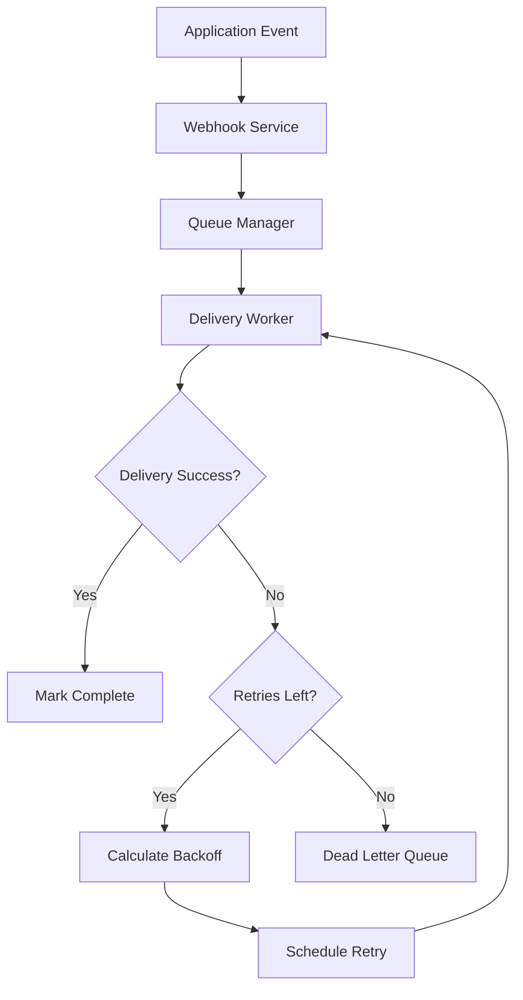

# How to Build a Webhook Service with Retry Logic in Node.js

Author: [nawazdhandala](https://www.github.com/nawazdhandala)

Tags: NodeJS, TypeScript, Webhooks, Reliability, Distributed Systems, API

Description: Learn how to build a production-ready webhook delivery service in Node.js with exponential backoff, persistent queuing, signature verification, and comprehensive retry logic.

---

Webhooks are the backbone of event-driven integrations. When your application needs to notify external systems about events, webhooks provide a simple HTTP-based mechanism. But reliable webhook delivery is harder than it looks. Network failures, temporary outages, and rate limits mean your webhook service needs robust retry logic to guarantee delivery.

This guide walks through building a complete webhook service in Node.js with TypeScript, covering queue management, retry strategies, and delivery guarantees.

## The Challenge of Reliable Webhooks

Before diving into code, let's understand what makes webhook delivery tricky:

| Challenge | Impact |
|-----------|--------|
| Network failures | Temporary connection issues cause delivery failures |
| Service outages | Target servers may be down for minutes or hours |
| Rate limiting | Too many requests trigger 429 responses |
| Timeout issues | Slow endpoints may take longer than your timeout |
| Ordering | Events may arrive out of order during retries |

A naive approach of fire-and-forget HTTP calls will lose events. A production system needs persistent storage, exponential backoff, and dead letter queues.

## Architecture Overview



## Core Types and Interfaces

Let's start with TypeScript interfaces that define our webhook system.

```typescript
// Types for the webhook delivery system
// These define the structure of webhooks, delivery attempts, and configuration

interface WebhookEvent {
  id: string;
  type: string;
  payload: Record<string, unknown>;
  createdAt: Date;
  metadata?: Record<string, string>;
}

interface WebhookSubscription {
  id: string;
  url: string;
  secret: string;
  events: string[];  // Event types this subscription listens to
  active: boolean;
  createdAt: Date;
}

interface WebhookDelivery {
  id: string;
  subscriptionId: string;
  eventId: string;
  url: string;
  payload: string;
  signature: string;
  attempts: number;
  maxAttempts: number;
  lastAttemptAt: Date | null;
  nextAttemptAt: Date;
  status: 'pending' | 'delivered' | 'failed' | 'dead';
  lastError: string | null;
  responseStatus: number | null;
  createdAt: Date;
}

interface DeliveryResult {
  success: boolean;
  statusCode?: number;
  error?: string;
  duration: number;
}

interface RetryConfig {
  maxAttempts: number;
  initialDelay: number;  // milliseconds
  maxDelay: number;
  factor: number;
  jitter: boolean;
}
```

## Signature Generation

Webhook signatures let receivers verify that payloads came from your service. We use HMAC-SHA256, the industry standard for webhook authentication.

```typescript
import crypto from 'crypto';

// Generate HMAC-SHA256 signature for webhook payload
// The receiver can verify this using the shared secret
function generateSignature(payload: string, secret: string, timestamp: number): string {
  // Include timestamp to prevent replay attacks
  const signedPayload = `${timestamp}.${payload}`;

  const hmac = crypto.createHmac('sha256', secret);
  hmac.update(signedPayload);

  return hmac.digest('hex');
}

// Build the signature header value
// Format: t=timestamp,v1=signature
function buildSignatureHeader(payload: string, secret: string): string {
  const timestamp = Math.floor(Date.now() / 1000);
  const signature = generateSignature(payload, secret, timestamp);

  return `t=${timestamp},v1=${signature}`;
}

// Verify incoming webhook signature (for the receiver side)
function verifySignature(
  payload: string,
  header: string,
  secret: string,
  tolerance: number = 300  // 5 minutes
): boolean {
  const parts = header.split(',');
  const timestamp = parseInt(parts[0].replace('t=', ''), 10);
  const signature = parts[1].replace('v1=', '');

  // Check timestamp is within tolerance
  const now = Math.floor(Date.now() / 1000);
  if (Math.abs(now - timestamp) > tolerance) {
    return false;  // Potential replay attack
  }

  const expectedSignature = generateSignature(payload, secret, timestamp);

  // Use timing-safe comparison to prevent timing attacks
  return crypto.timingSafeEqual(
    Buffer.from(signature),
    Buffer.from(expectedSignature)
  );
}
```

## Queue Manager with SQLite

For persistent storage, we use SQLite. It provides durability without the operational overhead of Redis or PostgreSQL for smaller deployments. For high-volume systems, swap this for a proper message queue.

```typescript
import Database from 'better-sqlite3';

// Queue manager handles persistence and retrieval of webhook deliveries
// Uses SQLite for durability, ensuring no webhooks are lost on restart
class WebhookQueueManager {
  private db: Database.Database;

  constructor(dbPath: string = './webhooks.db') {
    this.db = new Database(dbPath);
    this.initializeSchema();
  }

  private initializeSchema(): void {
    // Create tables for subscriptions and deliveries
    this.db.exec(`
      CREATE TABLE IF NOT EXISTS subscriptions (
        id TEXT PRIMARY KEY,
        url TEXT NOT NULL,
        secret TEXT NOT NULL,
        events TEXT NOT NULL,
        active INTEGER DEFAULT 1,
        created_at TEXT DEFAULT CURRENT_TIMESTAMP
      );

      CREATE TABLE IF NOT EXISTS deliveries (
        id TEXT PRIMARY KEY,
        subscription_id TEXT NOT NULL,
        event_id TEXT NOT NULL,
        url TEXT NOT NULL,
        payload TEXT NOT NULL,
        signature TEXT NOT NULL,
        attempts INTEGER DEFAULT 0,
        max_attempts INTEGER DEFAULT 5,
        last_attempt_at TEXT,
        next_attempt_at TEXT NOT NULL,
        status TEXT DEFAULT 'pending',
        last_error TEXT,
        response_status INTEGER,
        created_at TEXT DEFAULT CURRENT_TIMESTAMP,
        FOREIGN KEY (subscription_id) REFERENCES subscriptions(id)
      );

      CREATE INDEX IF NOT EXISTS idx_deliveries_status_next
        ON deliveries(status, next_attempt_at);

      CREATE INDEX IF NOT EXISTS idx_deliveries_subscription
        ON deliveries(subscription_id);
    `);
  }

  // Enqueue a webhook for delivery
  enqueue(delivery: Omit<WebhookDelivery, 'id' | 'createdAt'>): string {
    const id = crypto.randomUUID();

    const stmt = this.db.prepare(`
      INSERT INTO deliveries (
        id, subscription_id, event_id, url, payload, signature,
        attempts, max_attempts, next_attempt_at, status
      ) VALUES (?, ?, ?, ?, ?, ?, ?, ?, ?, ?)
    `);

    stmt.run(
      id,
      delivery.subscriptionId,
      delivery.eventId,
      delivery.url,
      delivery.payload,
      delivery.signature,
      delivery.attempts,
      delivery.maxAttempts,
      delivery.nextAttemptAt.toISOString(),
      delivery.status
    );

    return id;
  }

  // Get deliveries ready for processing
  getPendingDeliveries(limit: number = 100): WebhookDelivery[] {
    const stmt = this.db.prepare(`
      SELECT * FROM deliveries
      WHERE status = 'pending'
        AND next_attempt_at <= datetime('now')
      ORDER BY next_attempt_at ASC
      LIMIT ?
    `);

    const rows = stmt.all(limit) as any[];

    return rows.map(row => ({
      id: row.id,
      subscriptionId: row.subscription_id,
      eventId: row.event_id,
      url: row.url,
      payload: row.payload,
      signature: row.signature,
      attempts: row.attempts,
      maxAttempts: row.max_attempts,
      lastAttemptAt: row.last_attempt_at ? new Date(row.last_attempt_at) : null,
      nextAttemptAt: new Date(row.next_attempt_at),
      status: row.status,
      lastError: row.last_error,
      responseStatus: row.response_status,
      createdAt: new Date(row.created_at),
    }));
  }

  // Update delivery after an attempt
  updateDelivery(
    id: string,
    updates: Partial<WebhookDelivery>
  ): void {
    const fields: string[] = [];
    const values: any[] = [];

    if (updates.attempts !== undefined) {
      fields.push('attempts = ?');
      values.push(updates.attempts);
    }
    if (updates.lastAttemptAt !== undefined) {
      fields.push('last_attempt_at = ?');
      values.push(updates.lastAttemptAt?.toISOString());
    }
    if (updates.nextAttemptAt !== undefined) {
      fields.push('next_attempt_at = ?');
      values.push(updates.nextAttemptAt.toISOString());
    }
    if (updates.status !== undefined) {
      fields.push('status = ?');
      values.push(updates.status);
    }
    if (updates.lastError !== undefined) {
      fields.push('last_error = ?');
      values.push(updates.lastError);
    }
    if (updates.responseStatus !== undefined) {
      fields.push('response_status = ?');
      values.push(updates.responseStatus);
    }

    values.push(id);

    const stmt = this.db.prepare(`
      UPDATE deliveries SET ${fields.join(', ')} WHERE id = ?
    `);

    stmt.run(...values);
  }

  // Move failed deliveries to dead letter status
  markAsDead(id: string, error: string): void {
    this.updateDelivery(id, {
      status: 'dead',
      lastError: error,
      lastAttemptAt: new Date(),
    });
  }
}
```

## Retry Logic with Exponential Backoff

The retry calculator determines when to schedule the next attempt. We use exponential backoff with jitter to spread out retries and avoid overwhelming recovering services.

```typescript
// Calculate the next retry time using exponential backoff with jitter
// Backoff formula: min(maxDelay, initialDelay * factor^attempt)
// Jitter adds randomness to prevent thundering herd
class RetryCalculator {
  private config: RetryConfig;

  constructor(config: Partial<RetryConfig> = {}) {
    this.config = {
      maxAttempts: config.maxAttempts ?? 5,
      initialDelay: config.initialDelay ?? 1000,
      maxDelay: config.maxDelay ?? 3600000,  // 1 hour max
      factor: config.factor ?? 2,
      jitter: config.jitter ?? true,
    };
  }

  // Check if we should retry based on attempt count
  shouldRetry(attempts: number): boolean {
    return attempts < this.config.maxAttempts;
  }

  // Calculate delay for the next retry attempt
  getNextDelay(attempts: number): number {
    // Exponential backoff: delay doubles with each attempt
    let delay = this.config.initialDelay * Math.pow(this.config.factor, attempts);

    // Cap at maximum delay
    delay = Math.min(delay, this.config.maxDelay);

    // Add jitter: random value between 0% and 25% of delay
    if (this.config.jitter) {
      const jitterAmount = delay * 0.25 * Math.random();
      delay = delay + jitterAmount;
    }

    return Math.floor(delay);
  }

  // Get the Date for the next retry
  getNextAttemptTime(attempts: number): Date {
    const delay = this.getNextDelay(attempts);
    return new Date(Date.now() + delay);
  }

  // Check if error is retryable based on HTTP status
  isRetryableStatus(status: number): boolean {
    // Retry on server errors and rate limits
    const retryableStatuses = [
      408,  // Request Timeout
      429,  // Too Many Requests
      500,  // Internal Server Error
      502,  // Bad Gateway
      503,  // Service Unavailable
      504,  // Gateway Timeout
    ];

    return retryableStatuses.includes(status);
  }

  // Check if network error is retryable
  isRetryableError(error: Error): boolean {
    const retryableErrors = [
      'ETIMEDOUT',
      'ECONNRESET',
      'ECONNREFUSED',
      'ENOTFOUND',
      'ENETUNREACH',
    ];

    const errorCode = (error as any).code;
    return retryableErrors.includes(errorCode);
  }
}
```

## Delivery Worker

The delivery worker processes pending webhooks, makes HTTP requests, and handles success or failure.

```typescript
import { EventEmitter } from 'events';

// Worker that processes webhook deliveries from the queue
// Runs on an interval, fetches pending items, and attempts delivery
class WebhookDeliveryWorker extends EventEmitter {
  private queue: WebhookQueueManager;
  private retry: RetryCalculator;
  private running: boolean = false;
  private intervalId: NodeJS.Timeout | null = null;
  private concurrency: number;
  private timeout: number;

  constructor(options: {
    queue: WebhookQueueManager;
    retry?: RetryCalculator;
    concurrency?: number;
    timeout?: number;
    pollInterval?: number;
  }) {
    super();
    this.queue = options.queue;
    this.retry = options.retry ?? new RetryCalculator();
    this.concurrency = options.concurrency ?? 10;
    this.timeout = options.timeout ?? 30000;
  }

  // Start the worker loop
  start(pollInterval: number = 1000): void {
    if (this.running) return;

    this.running = true;
    this.emit('started');

    this.intervalId = setInterval(() => {
      this.processQueue();
    }, pollInterval);

    // Process immediately on start
    this.processQueue();
  }

  // Stop the worker gracefully
  stop(): void {
    this.running = false;

    if (this.intervalId) {
      clearInterval(this.intervalId);
      this.intervalId = null;
    }

    this.emit('stopped');
  }

  // Process pending deliveries from the queue
  private async processQueue(): Promise<void> {
    if (!this.running) return;

    const deliveries = this.queue.getPendingDeliveries(this.concurrency);

    // Process deliveries concurrently
    await Promise.all(
      deliveries.map(delivery => this.processDelivery(delivery))
    );
  }

  // Process a single delivery
  private async processDelivery(delivery: WebhookDelivery): Promise<void> {
    const result = await this.attemptDelivery(delivery);

    if (result.success) {
      this.handleSuccess(delivery, result);
    } else {
      this.handleFailure(delivery, result);
    }
  }

  // Attempt HTTP delivery with timeout
  private async attemptDelivery(delivery: WebhookDelivery): Promise<DeliveryResult> {
    const startTime = Date.now();
    const controller = new AbortController();
    const timeoutId = setTimeout(() => controller.abort(), this.timeout);

    try {
      const response = await fetch(delivery.url, {
        method: 'POST',
        headers: {
          'Content-Type': 'application/json',
          'X-Webhook-Signature': delivery.signature,
          'X-Webhook-Event-Id': delivery.eventId,
          'X-Webhook-Delivery-Id': delivery.id,
          'User-Agent': 'WebhookService/1.0',
        },
        body: delivery.payload,
        signal: controller.signal,
      });

      clearTimeout(timeoutId);

      const duration = Date.now() - startTime;

      // Consider 2xx responses as success
      if (response.ok) {
        return { success: true, statusCode: response.status, duration };
      }

      return {
        success: false,
        statusCode: response.status,
        error: `HTTP ${response.status}: ${response.statusText}`,
        duration,
      };
    } catch (error) {
      clearTimeout(timeoutId);

      const err = error as Error;
      const duration = Date.now() - startTime;

      return {
        success: false,
        error: err.name === 'AbortError'
          ? `Timeout after ${this.timeout}ms`
          : err.message,
        duration,
      };
    }
  }

  // Handle successful delivery
  private handleSuccess(delivery: WebhookDelivery, result: DeliveryResult): void {
    this.queue.updateDelivery(delivery.id, {
      status: 'delivered',
      attempts: delivery.attempts + 1,
      lastAttemptAt: new Date(),
      responseStatus: result.statusCode,
    });

    this.emit('delivered', {
      deliveryId: delivery.id,
      eventId: delivery.eventId,
      attempts: delivery.attempts + 1,
      duration: result.duration,
    });
  }

  // Handle failed delivery
  private handleFailure(delivery: WebhookDelivery, result: DeliveryResult): void {
    const newAttempts = delivery.attempts + 1;
    const shouldRetry = this.retry.shouldRetry(newAttempts) &&
      (result.statusCode ? this.retry.isRetryableStatus(result.statusCode) : true);

    if (shouldRetry) {
      // Schedule retry
      const nextAttempt = this.retry.getNextAttemptTime(newAttempts);

      this.queue.updateDelivery(delivery.id, {
        attempts: newAttempts,
        lastAttemptAt: new Date(),
        nextAttemptAt: nextAttempt,
        lastError: result.error,
        responseStatus: result.statusCode,
      });

      this.emit('retry-scheduled', {
        deliveryId: delivery.id,
        eventId: delivery.eventId,
        attempts: newAttempts,
        nextAttempt,
        error: result.error,
      });
    } else {
      // Move to dead letter queue
      this.queue.markAsDead(delivery.id, result.error ?? 'Unknown error');

      this.emit('dead-letter', {
        deliveryId: delivery.id,
        eventId: delivery.eventId,
        attempts: newAttempts,
        error: result.error,
      });
    }
  }
}
```

## Webhook Service Facade

The main service ties everything together and provides a clean API for enqueueing webhooks.

```typescript
// Main webhook service that coordinates subscriptions, events, and delivery
// Use this as the entry point for your application
class WebhookService {
  private queue: WebhookQueueManager;
  private worker: WebhookDeliveryWorker;
  private subscriptions: Map<string, WebhookSubscription> = new Map();

  constructor(options: {
    dbPath?: string;
    retryConfig?: Partial<RetryConfig>;
    workerConcurrency?: number;
    deliveryTimeout?: number;
  } = {}) {
    this.queue = new WebhookQueueManager(options.dbPath);

    const retryCalculator = new RetryCalculator(options.retryConfig);

    this.worker = new WebhookDeliveryWorker({
      queue: this.queue,
      retry: retryCalculator,
      concurrency: options.workerConcurrency ?? 10,
      timeout: options.deliveryTimeout ?? 30000,
    });

    this.setupWorkerLogging();
  }

  private setupWorkerLogging(): void {
    this.worker.on('delivered', (info) => {
      console.log(`Webhook delivered: ${info.deliveryId} (${info.attempts} attempts)`);
    });

    this.worker.on('retry-scheduled', (info) => {
      console.log(`Retry scheduled: ${info.deliveryId} at ${info.nextAttempt}`);
    });

    this.worker.on('dead-letter', (info) => {
      console.error(`Webhook failed permanently: ${info.deliveryId} - ${info.error}`);
    });
  }

  // Register a webhook subscription
  registerSubscription(subscription: WebhookSubscription): void {
    this.subscriptions.set(subscription.id, subscription);
  }

  // Dispatch an event to all matching subscriptions
  async dispatch(event: WebhookEvent): Promise<string[]> {
    const deliveryIds: string[] = [];

    for (const subscription of this.subscriptions.values()) {
      if (!subscription.active) continue;
      if (!subscription.events.includes(event.type)) continue;

      const payload = JSON.stringify({
        id: event.id,
        type: event.type,
        data: event.payload,
        createdAt: event.createdAt.toISOString(),
        metadata: event.metadata,
      });

      const signature = buildSignatureHeader(payload, subscription.secret);

      const deliveryId = this.queue.enqueue({
        subscriptionId: subscription.id,
        eventId: event.id,
        url: subscription.url,
        payload,
        signature,
        attempts: 0,
        maxAttempts: 5,
        lastAttemptAt: null,
        nextAttemptAt: new Date(),
        status: 'pending',
        lastError: null,
        responseStatus: null,
      });

      deliveryIds.push(deliveryId);
    }

    return deliveryIds;
  }

  // Start processing webhooks
  start(): void {
    this.worker.start();
  }

  // Stop processing gracefully
  stop(): void {
    this.worker.stop();
  }
}
```

## Usage Example

Here is how to use the webhook service in your application.

```typescript
// Initialize the webhook service
const webhookService = new WebhookService({
  dbPath: './data/webhooks.db',
  retryConfig: {
    maxAttempts: 5,
    initialDelay: 1000,      // 1 second
    maxDelay: 3600000,       // 1 hour max
    factor: 2,
    jitter: true,
  },
  workerConcurrency: 20,
  deliveryTimeout: 30000,
});

// Register webhook subscriptions
webhookService.registerSubscription({
  id: 'sub_123',
  url: 'https://partner.example.com/webhooks',
  secret: 'whsec_abc123xyz',
  events: ['order.created', 'order.updated', 'order.cancelled'],
  active: true,
  createdAt: new Date(),
});

// Start the worker
webhookService.start();

// Dispatch events from your application
async function onOrderCreated(order: Order): Promise<void> {
  await webhookService.dispatch({
    id: `evt_${crypto.randomUUID()}`,
    type: 'order.created',
    payload: {
      orderId: order.id,
      customerId: order.customerId,
      total: order.total,
      items: order.items,
    },
    createdAt: new Date(),
    metadata: {
      version: '2024-01-01',
    },
  });
}

// Graceful shutdown
process.on('SIGTERM', () => {
  webhookService.stop();
});
```

## Testing Your Webhook Service

Create a simple test endpoint to verify delivery.

```typescript
import express from 'express';

const app = express();
app.use(express.json());

// Test endpoint that logs received webhooks
app.post('/webhooks', (req, res) => {
  const signature = req.headers['x-webhook-signature'] as string;
  const payload = JSON.stringify(req.body);

  // Verify signature
  const isValid = verifySignature(payload, signature, 'your-secret');

  if (!isValid) {
    console.log('Invalid signature!');
    return res.status(401).json({ error: 'Invalid signature' });
  }

  console.log('Received webhook:', req.body);
  res.status(200).json({ received: true });
});

// Endpoint that simulates failures for testing retry logic
app.post('/webhooks/flaky', (req, res) => {
  if (Math.random() < 0.7) {
    return res.status(503).json({ error: 'Service temporarily unavailable' });
  }

  res.status(200).json({ received: true });
});

app.listen(3001);
```

## Production Considerations

When deploying to production, consider these additional factors:

1. **Use a proper message queue**: For high volume, replace SQLite with Redis, RabbitMQ, or a managed service like AWS SQS.

2. **Add metrics**: Track delivery success rates, retry counts, and latency using Prometheus or similar.

3. **Implement circuit breakers**: Pause deliveries to endpoints that consistently fail.

4. **Set up alerting**: Alert on high dead letter queue counts or repeated failures to the same endpoint.

5. **Consider ordering**: If event order matters, process events for each subscription sequentially.

Building a reliable webhook service requires careful attention to failure modes. The patterns shown here provide a solid foundation for delivering events reliably, even when target services experience intermittent failures.
