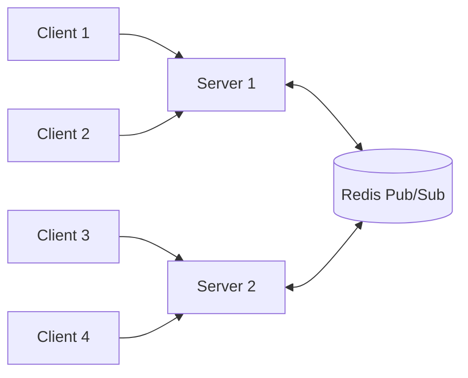

# How to Build WebSocket Servers with FastAPI and Redis

Author: [nawazdhandala](https://www.github.com/nawazdhandala)

Tags: Python, FastAPI, WebSocket, Redis, Real-time, Pub/Sub, Async

Description: Learn how to build scalable WebSocket servers with FastAPI and Redis pub/sub. This guide covers connection management, broadcasting across multiple server instances, authentication, and production patterns for real-time applications.

---

> WebSocket connections enable bidirectional communication between clients and servers. When you scale beyond a single server instance, Redis pub/sub becomes essential for broadcasting messages to all connected clients regardless of which server they're connected to.

Real-time features like live dashboards, collaborative editing, chat systems, and push notifications all benefit from this architecture.

---

## Why Redis for WebSocket Scaling?

When running multiple FastAPI instances behind a load balancer, each server only knows about its own WebSocket connections. If User A connects to Server 1 and User B connects to Server 2, a message from User A won't reach User B without external coordination.

Redis pub/sub solves this by acting as a central message broker. Every server subscribes to Redis channels, and when any server needs to broadcast a message, it publishes to Redis. All subscribed servers receive the message and forward it to their local connections.



---

## Project Setup

Start by installing the required packages. We need FastAPI for the web framework, uvicorn to run the server, redis for async Redis operations, and websockets for WebSocket support.

```bash
pip install fastapi uvicorn redis websockets pydantic
```

Create a basic project structure:

```
websocket_server/
    __init__.py
    main.py
    connection_manager.py
    redis_manager.py
    models.py
```

---

## Connection Manager

The connection manager tracks all WebSocket connections on the local server. It stores connections by client ID and provides methods for sending messages to individual clients or broadcasting to all local connections.

```python
# connection_manager.py
# Manages local WebSocket connections on this server instance
from fastapi import WebSocket
from typing import Dict, Set, Optional
import logging

logger = logging.getLogger(__name__)

class ConnectionManager:
    """Tracks WebSocket connections for a single server instance"""

    def __init__(self):
        # Map client_id to their WebSocket connection
        self.active_connections: Dict[str, WebSocket] = {}
        # Map room name to set of client IDs in that room
        self.rooms: Dict[str, Set[str]] = {}

    async def connect(self, websocket: WebSocket, client_id: str) -> bool:
        """Accept and register a new WebSocket connection"""
        try:
            await websocket.accept()  # Complete the WebSocket handshake
            self.active_connections[client_id] = websocket
            logger.info(f"Client {client_id} connected. Total: {len(self.active_connections)}")
            return True
        except Exception as e:
            logger.error(f"Failed to accept connection for {client_id}: {e}")
            return False

    def disconnect(self, client_id: str):
        """Remove a client and clean up room memberships"""
        if client_id in self.active_connections:
            del self.active_connections[client_id]
            logger.info(f"Client {client_id} disconnected")

        # Remove from all rooms
        for room_clients in self.rooms.values():
            room_clients.discard(client_id)

    async def send_to_client(self, client_id: str, message: dict) -> bool:
        """Send a message to a specific client"""
        if client_id not in self.active_connections:
            return False

        try:
            await self.active_connections[client_id].send_json(message)
            return True
        except Exception as e:
            logger.warning(f"Failed to send to {client_id}: {e}")
            self.disconnect(client_id)  # Clean up dead connection
            return False

    async def broadcast_local(self, message: dict, exclude: Optional[str] = None):
        """Broadcast to all local connections on this server"""
        dead_clients = []
        for client_id, websocket in self.active_connections.items():
            if client_id == exclude:
                continue
            try:
                await websocket.send_json(message)
            except Exception:
                dead_clients.append(client_id)

        # Clean up any failed connections
        for client_id in dead_clients:
            self.disconnect(client_id)

    def join_room(self, client_id: str, room: str):
        """Add a client to a room"""
        if room not in self.rooms:
            self.rooms[room] = set()
        self.rooms[room].add(client_id)

    def leave_room(self, client_id: str, room: str):
        """Remove a client from a room"""
        if room in self.rooms:
            self.rooms[room].discard(client_id)

    def get_room_clients(self, room: str) -> Set[str]:
        """Get all client IDs in a room"""
        return self.rooms.get(room, set()).copy()

    def get_connection_count(self) -> int:
        """Return total number of local connections"""
        return len(self.active_connections)
```

---

## Redis Pub/Sub Manager

The Redis manager handles publishing messages to Redis channels and subscribing to receive messages from other server instances. It runs a background task that listens for incoming messages and forwards them to local connections.

```python
# redis_manager.py
# Handles Redis pub/sub for cross-server communication
import redis.asyncio as redis
import asyncio
import json
import logging
from typing import Callable, Optional

logger = logging.getLogger(__name__)

class RedisPubSubManager:
    """Manages Redis pub/sub for WebSocket message distribution"""

    def __init__(self, redis_url: str = "redis://localhost:6379"):
        self.redis_url = redis_url
        self.redis: Optional[redis.Redis] = None
        self.pubsub: Optional[redis.client.PubSub] = None
        self.listener_task: Optional[asyncio.Task] = None
        self.message_handler: Optional[Callable] = None

    async def connect(self, message_handler: Callable):
        """Connect to Redis and start listening for messages"""
        self.message_handler = message_handler
        self.redis = redis.from_url(self.redis_url, decode_responses=True)
        self.pubsub = self.redis.pubsub()

        # Subscribe to the broadcast channel
        await self.pubsub.subscribe("websocket:broadcast")
        logger.info("Connected to Redis and subscribed to channels")

        # Start background listener task
        self.listener_task = asyncio.create_task(self._listen())

    async def disconnect(self):
        """Clean up Redis connections"""
        if self.listener_task:
            self.listener_task.cancel()
            try:
                await self.listener_task
            except asyncio.CancelledError:
                pass

        if self.pubsub:
            await self.pubsub.unsubscribe()
            await self.pubsub.close()

        if self.redis:
            await self.redis.close()

        logger.info("Disconnected from Redis")

    async def _listen(self):
        """Background task: listen for messages from Redis"""
        try:
            async for message in self.pubsub.listen():
                if message["type"] == "message":
                    try:
                        data = json.loads(message["data"])
                        await self.message_handler(data)
                    except json.JSONDecodeError as e:
                        logger.error(f"Invalid JSON from Redis: {e}")
        except asyncio.CancelledError:
            logger.info("Redis listener task cancelled")
        except Exception as e:
            logger.error(f"Redis listener error: {e}")

    async def publish_broadcast(self, message: dict):
        """Publish a message to all server instances"""
        if not self.redis:
            logger.warning("Redis not connected, cannot publish")
            return

        await self.redis.publish(
            "websocket:broadcast",
            json.dumps(message)
        )

    async def publish_to_room(self, room: str, message: dict):
        """Publish a message to a specific room channel"""
        if not self.redis:
            return

        await self.redis.publish(
            f"websocket:room:{room}",
            json.dumps(message)
        )

    async def subscribe_to_room(self, room: str):
        """Subscribe to a room-specific channel"""
        if self.pubsub:
            await self.pubsub.subscribe(f"websocket:room:{room}")

    async def unsubscribe_from_room(self, room: str):
        """Unsubscribe from a room-specific channel"""
        if self.pubsub:
            await self.pubsub.unsubscribe(f"websocket:room:{room}")
```

---

## Message Models

Define Pydantic models for validating incoming WebSocket messages. This ensures type safety and provides clear documentation of the message structure.

```python
# models.py
# Pydantic models for WebSocket message validation
from pydantic import BaseModel
from typing import Optional, Literal

class WebSocketMessage(BaseModel):
    """Base model for all WebSocket messages"""
    type: str
    room: Optional[str] = None
    content: Optional[str] = None
    target_user: Optional[str] = None

class ChatMessage(BaseModel):
    """Chat message structure"""
    type: Literal["chat"]
    content: str
    room: Optional[str] = None

class JoinRoomMessage(BaseModel):
    """Room join request"""
    type: Literal["join_room"]
    room: str

class LeaveRoomMessage(BaseModel):
    """Room leave request"""
    type: Literal["leave_room"]
    room: str
```

---

## Main Application

The main application ties everything together. It initializes both the connection manager and Redis manager, handles WebSocket connections, and routes messages appropriately.

```python
# main.py
# FastAPI WebSocket server with Redis pub/sub
from fastapi import FastAPI, WebSocket, WebSocketDisconnect, Query
from contextlib import asynccontextmanager
import json
import logging
import uuid

from connection_manager import ConnectionManager
from redis_manager import RedisPubSubManager

logging.basicConfig(level=logging.INFO)
logger = logging.getLogger(__name__)

# Initialize managers
connection_manager = ConnectionManager()
redis_manager = RedisPubSubManager("redis://localhost:6379")

async def handle_redis_message(data: dict):
    """Process messages received from Redis and forward to local clients"""
    message_type = data.get("type")

    if message_type == "broadcast":
        # Send to all local connections
        await connection_manager.broadcast_local(
            data.get("payload"),
            exclude=data.get("sender_id")  # Don't echo back to sender
        )

    elif message_type == "room_message":
        # Send to local clients in the specified room
        room = data.get("room")
        payload = data.get("payload")
        for client_id in connection_manager.get_room_clients(room):
            await connection_manager.send_to_client(client_id, payload)

    elif message_type == "direct_message":
        # Send to specific client if they're on this server
        target = data.get("target")
        await connection_manager.send_to_client(target, data.get("payload"))

@asynccontextmanager
async def lifespan(app: FastAPI):
    """Application startup and shutdown events"""
    # Startup: connect to Redis
    await redis_manager.connect(handle_redis_message)
    logger.info("WebSocket server started")
    yield
    # Shutdown: clean up Redis connection
    await redis_manager.disconnect()
    logger.info("WebSocket server stopped")

app = FastAPI(lifespan=lifespan)

@app.websocket("/ws")
async def websocket_endpoint(
    websocket: WebSocket,
    client_id: str = Query(default=None)
):
    """Main WebSocket endpoint"""
    # Generate client ID if not provided
    if not client_id:
        client_id = str(uuid.uuid4())[:8]

    # Accept and register the connection
    if not await connection_manager.connect(websocket, client_id):
        return

    # Notify all servers about new connection
    await redis_manager.publish_broadcast({
        "type": "broadcast",
        "sender_id": client_id,
        "payload": {
            "event": "user_connected",
            "user_id": client_id
        }
    })

    try:
        while True:
            # Wait for message from client
            raw_data = await websocket.receive_text()
            data = json.loads(raw_data)
            message_type = data.get("type")

            if message_type == "chat":
                # Broadcast chat message to all servers
                await redis_manager.publish_broadcast({
                    "type": "broadcast",
                    "sender_id": client_id,
                    "payload": {
                        "event": "chat",
                        "from": client_id,
                        "content": data.get("content")
                    }
                })

            elif message_type == "join_room":
                # Add to local room tracking
                room = data.get("room")
                connection_manager.join_room(client_id, room)
                # Subscribe to room channel if needed
                await redis_manager.subscribe_to_room(room)
                # Notify room members
                await redis_manager.publish_to_room(room, {
                    "type": "room_message",
                    "room": room,
                    "payload": {
                        "event": "user_joined",
                        "user_id": client_id,
                        "room": room
                    }
                })

            elif message_type == "room_message":
                # Send message to room across all servers
                room = data.get("room")
                await redis_manager.publish_to_room(room, {
                    "type": "room_message",
                    "room": room,
                    "payload": {
                        "event": "chat",
                        "from": client_id,
                        "room": room,
                        "content": data.get("content")
                    }
                })

            elif message_type == "pong":
                # Heartbeat response, just acknowledge
                continue

    except WebSocketDisconnect:
        # Clean up on disconnect
        connection_manager.disconnect(client_id)
        await redis_manager.publish_broadcast({
            "type": "broadcast",
            "sender_id": client_id,
            "payload": {
                "event": "user_disconnected",
                "user_id": client_id
            }
        })

@app.get("/stats")
async def get_stats():
    """Endpoint for monitoring connection statistics"""
    return {
        "local_connections": connection_manager.get_connection_count(),
        "rooms": len(connection_manager.rooms)
    }
```

---

## Authentication

For production systems, validate tokens before accepting WebSocket connections. Check authentication before calling `websocket.accept()` to reject unauthorized connections early.

```python
# auth.py
# WebSocket authentication utilities
from fastapi import WebSocket, Query
from jose import jwt, JWTError
from typing import Optional

SECRET_KEY = "your-secret-key"  # Load from environment in production
ALGORITHM = "HS256"

async def authenticate_websocket(
    websocket: WebSocket,
    token: str = Query(...)
) -> Optional[dict]:
    """Validate JWT token and return user info"""
    try:
        payload = jwt.decode(token, SECRET_KEY, algorithms=[ALGORITHM])
        user_id = payload.get("sub")
        if not user_id:
            await websocket.close(code=4001)
            return None
        return {"user_id": user_id, "name": payload.get("name")}
    except JWTError:
        await websocket.close(code=4001)
        return None

# Usage in WebSocket endpoint
@app.websocket("/ws/secure")
async def secure_websocket_endpoint(
    websocket: WebSocket,
    token: str = Query(...)
):
    # Authenticate before accepting
    user = await authenticate_websocket(websocket, token)
    if not user:
        return  # Connection already closed by authenticate function

    # Now accept the connection
    await websocket.accept()
    # Continue with authenticated user context...
```

---

## Running Multiple Instances

To test the scaling behavior, run multiple server instances on different ports. All instances connect to the same Redis server.

```bash
# Terminal 1: Start first server
uvicorn main:app --port 8000

# Terminal 2: Start second server
uvicorn main:app --port 8001

# Terminal 3: Start Redis if not running
redis-server
```

Use a reverse proxy like nginx to distribute WebSocket connections across instances.

---

## Best Practices

1. **Always validate before accepting** - Check authentication and authorization before calling `websocket.accept()`
2. **Handle disconnects gracefully** - Clean up resources and notify other users
3. **Use heartbeats** - Send periodic pings to detect stale connections
4. **Limit message size** - Prevent abuse by restricting maximum message length
5. **Use connection pools** - Redis async client handles pooling automatically
6. **Monitor connection counts** - Track metrics for capacity planning

---

## Conclusion

Building scalable WebSocket servers with FastAPI and Redis enables real-time features that work across multiple server instances. The key components are:

- **Connection Manager** - Tracks local WebSocket connections per server
- **Redis Pub/Sub** - Distributes messages across all server instances
- **Authentication** - Validates users before accepting connections
- **Graceful handling** - Proper cleanup on disconnect and error conditions

This architecture supports horizontal scaling while maintaining real-time message delivery to all connected clients.

---

*Need to monitor your WebSocket connections? [OneUptime](https://oneuptime.com) provides real-time monitoring and alerting for WebSocket applications.*
