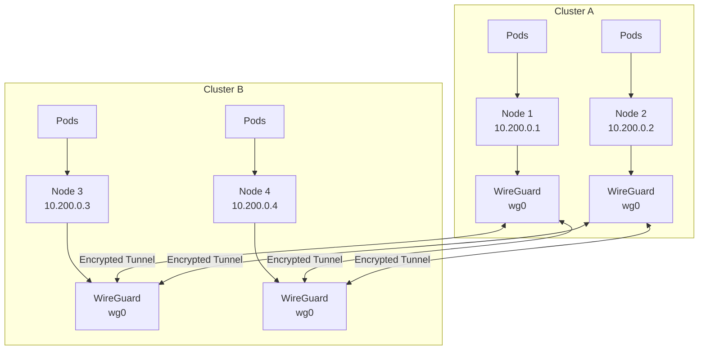

# How to Configure WireGuard VPN for Kubernetes

Author: [nawazdhandala](https://www.github.com/nawazdhandala)

Tags: Kubernetes, WireGuard, VPN, Security, Networking, Zero Trust

Description: A practical guide to configuring WireGuard VPN for Kubernetes clusters, enabling secure communication between nodes, pods, and external resources with minimal overhead.

---

> WireGuard has emerged as a modern VPN solution that offers simplicity, speed, and strong cryptography. When combined with Kubernetes, it provides a robust foundation for securing cluster communication and connecting distributed infrastructure.

Securing network traffic in Kubernetes environments presents unique challenges. Traditional VPN solutions often struggle with the dynamic nature of container orchestration. WireGuard, with its lightweight design and kernel-level implementation, addresses these challenges effectively.

---

## Understanding WireGuard in Kubernetes Context

WireGuard operates at Layer 3, creating encrypted tunnels between peers. In Kubernetes, this translates to secure communication between:

- Cluster nodes across different networks or clouds
- Pods that need encrypted communication
- External services connecting to the cluster
- Development machines accessing internal cluster resources

The key advantage of WireGuard is its simplicity. With minimal configuration and a small attack surface, it reduces the complexity typically associated with VPN deployments.

---

## Prerequisites

Before starting, ensure you have:

- A running Kubernetes cluster (v1.19+)
- kubectl configured with cluster access
- Helm 3.x installed
- Root or sudo access on nodes (for kernel module installation)
- Understanding of Kubernetes networking concepts

---

## Installing WireGuard on Cluster Nodes

First, install WireGuard on each node. The following script handles installation across common distributions:

```bash
#!/bin/bash
# install-wireguard.sh
# Installs WireGuard kernel module and tools

# Detect the operating system
detect_os() {
    if [ -f /etc/os-release ]; then
        . /etc/os-release
        OS=$ID
        VERSION=$VERSION_ID
    fi
}

install_wireguard() {
    detect_os

    case $OS in
        ubuntu|debian)
            # Update package list and install WireGuard
            apt-get update
            apt-get install -y wireguard wireguard-tools
            ;;
        centos|rhel|rocky)
            # Enable EPEL repository for WireGuard packages
            dnf install -y epel-release
            dnf install -y wireguard-tools
            ;;
        *)
            echo "Unsupported OS: $OS"
            exit 1
            ;;
    esac

    # Verify installation
    if command -v wg &> /dev/null; then
        echo "WireGuard installed successfully"
        wg --version
    else
        echo "WireGuard installation failed"
        exit 1
    fi
}

install_wireguard
```

Verify the kernel module loads correctly:

```bash
# Load the WireGuard kernel module
sudo modprobe wireguard

# Verify the module is loaded
lsmod | grep wireguard
# Expected output: wireguard  <size>  0
```

---

## Generating WireGuard Keys

Each peer in the VPN mesh needs a unique key pair. Create a key generation script for Kubernetes secrets:

```bash
#!/bin/bash
# generate-wg-keys.sh
# Generates WireGuard key pairs and creates Kubernetes secrets

NAMESPACE="${1:-wireguard}"
NODE_NAME="${2:-node-1}"

# Create namespace if it does not exist
kubectl create namespace $NAMESPACE --dry-run=client -o yaml | kubectl apply -f -

# Generate private and public keys
PRIVATE_KEY=$(wg genkey)
PUBLIC_KEY=$(echo $PRIVATE_KEY | wg pubkey)

# Create Kubernetes secret with the keys
cat <<EOF | kubectl apply -f -
apiVersion: v1
kind: Secret
metadata:
  name: wireguard-keys-${NODE_NAME}
  namespace: ${NAMESPACE}
type: Opaque
stringData:
  privateKey: "${PRIVATE_KEY}"
  publicKey: "${PUBLIC_KEY}"
EOF

echo "Keys generated for ${NODE_NAME}"
echo "Public Key: ${PUBLIC_KEY}"
```

---

## Deploying WireGuard as a DaemonSet

Deploy WireGuard across all nodes using a DaemonSet. This ensures consistent VPN configuration:

```yaml
# wireguard-daemonset.yaml
apiVersion: apps/v1
kind: DaemonSet
metadata:
  name: wireguard
  namespace: wireguard
  labels:
    app: wireguard
spec:
  selector:
    matchLabels:
      app: wireguard
  template:
    metadata:
      labels:
        app: wireguard
    spec:
      # Run on host network to configure node interfaces
      hostNetwork: true

      # Tolerate control plane nodes if needed
      tolerations:
      - key: node-role.kubernetes.io/control-plane
        operator: Exists
        effect: NoSchedule

      initContainers:
      # Initialize WireGuard interface before main container starts
      - name: init-wireguard
        image: linuxserver/wireguard:latest
        securityContext:
          privileged: true
          capabilities:
            add:
            - NET_ADMIN
            - SYS_MODULE
        command:
        - /bin/bash
        - -c
        - |
          # Load WireGuard kernel module
          modprobe wireguard

          # Create WireGuard interface if not exists
          ip link show wg0 || ip link add wg0 type wireguard

          echo "WireGuard interface initialized"
        volumeMounts:
        - name: lib-modules
          mountPath: /lib/modules
          readOnly: true

      containers:
      - name: wireguard
        image: linuxserver/wireguard:latest
        securityContext:
          privileged: true
          capabilities:
            add:
            - NET_ADMIN
        env:
        # Read configuration from environment
        - name: NODE_NAME
          valueFrom:
            fieldRef:
              fieldPath: spec.nodeName
        - name: WG_PRIVATE_KEY
          valueFrom:
            secretKeyRef:
              name: wireguard-keys
              key: privateKey
        volumeMounts:
        - name: wireguard-config
          mountPath: /config
        - name: lib-modules
          mountPath: /lib/modules
          readOnly: true
        resources:
          requests:
            memory: "64Mi"
            cpu: "50m"
          limits:
            memory: "128Mi"
            cpu: "100m"

      volumes:
      - name: wireguard-config
        configMap:
          name: wireguard-config
      - name: lib-modules
        hostPath:
          path: /lib/modules
          type: Directory
```

---

## ConfigMap for WireGuard Configuration

Create a ConfigMap with the WireGuard configuration template:

```yaml
# wireguard-configmap.yaml
apiVersion: v1
kind: ConfigMap
metadata:
  name: wireguard-config
  namespace: wireguard
data:
  wg0.conf: |
    [Interface]
    # Each node gets a unique address in the VPN subnet
    Address = 10.200.0.1/24
    ListenPort = 51820
    # Private key injected from secret
    PrivateKey = ${WG_PRIVATE_KEY}

    # Post-up rules for routing
    PostUp = iptables -A FORWARD -i wg0 -j ACCEPT
    PostUp = iptables -t nat -A POSTROUTING -o eth0 -j MASQUERADE

    # Cleanup rules on interface down
    PostDown = iptables -D FORWARD -i wg0 -j ACCEPT
    PostDown = iptables -t nat -D POSTROUTING -o eth0 -j MASQUERADE

    [Peer]
    # Node 2 configuration
    PublicKey = <node2-public-key>
    AllowedIPs = 10.200.0.2/32, 10.244.1.0/24
    Endpoint = node2.example.com:51820
    PersistentKeepalive = 25

    [Peer]
    # Node 3 configuration
    PublicKey = <node3-public-key>
    AllowedIPs = 10.200.0.3/32, 10.244.2.0/24
    Endpoint = node3.example.com:51820
    PersistentKeepalive = 25

  # Script to generate node-specific config
  configure.sh: |
    #!/bin/bash
    # Substitute environment variables in config template
    envsubst < /config/wg0.conf.template > /etc/wireguard/wg0.conf

    # Bring up the interface
    wg-quick up wg0

    # Keep container running
    exec tail -f /dev/null
```

---

## Using the WireGuard Operator

For production environments, consider using the WireGuard Operator for automated peer management:

```yaml
# wireguard-operator-values.yaml
# Helm values for WireGuard operator deployment

replicaCount: 1

image:
  repository: place1/wg-access-server
  tag: latest

config:
  wireguard:
    # External IP or hostname for VPN connections
    externalHost: vpn.example.com
    port: 51820

  # VPN network configuration
  vpn:
    cidr: 10.200.0.0/16
    gatewayInterface: eth0

  # DNS configuration for VPN clients
  dns:
    enabled: true
    upstream:
    - 8.8.8.8
    - 8.8.4.4

# Storage for peer configurations
storage:
  type: kubernetes

# Ingress for admin interface
ingress:
  enabled: true
  className: nginx
  hosts:
  - host: vpn.example.com
    paths:
    - path: /
      pathType: Prefix
```

Install the operator:

```bash
# Add the Helm repository
helm repo add wireguard https://place1.github.io/wg-access-server

# Install the operator
helm install wireguard-operator wireguard/wg-access-server \
  --namespace wireguard \
  --create-namespace \
  --values wireguard-operator-values.yaml
```

---

## Network Policy Integration

Combine WireGuard with Kubernetes Network Policies for defense in depth:

```yaml
# wireguard-network-policy.yaml
apiVersion: networking.k8s.io/v1
kind: NetworkPolicy
metadata:
  name: wireguard-policy
  namespace: wireguard
spec:
  podSelector:
    matchLabels:
      app: wireguard
  policyTypes:
  - Ingress
  - Egress
  ingress:
  # Allow WireGuard UDP traffic
  - ports:
    - protocol: UDP
      port: 51820
  # Allow traffic from VPN subnet
  - from:
    - ipBlock:
        cidr: 10.200.0.0/16
  egress:
  # Allow all egress for VPN routing
  - {}
```

---

## Architecture Overview

The following diagram shows how WireGuard integrates with Kubernetes networking:



---

## Monitoring WireGuard Connections

Create a monitoring script to track VPN health:

```bash
#!/bin/bash
# monitor-wireguard.sh
# Exports WireGuard metrics for Prometheus

# Get interface statistics
wg show wg0 dump | while read line; do
    if [ -n "$line" ]; then
        # Parse peer information
        PUBLIC_KEY=$(echo $line | awk '{print $1}')
        ENDPOINT=$(echo $line | awk '{print $3}')
        RX_BYTES=$(echo $line | awk '{print $6}')
        TX_BYTES=$(echo $line | awk '{print $7}')
        LAST_HANDSHAKE=$(echo $line | awk '{print $5}')

        # Output Prometheus metrics format
        echo "wireguard_peer_rx_bytes{public_key=\"${PUBLIC_KEY}\",endpoint=\"${ENDPOINT}\"} ${RX_BYTES}"
        echo "wireguard_peer_tx_bytes{public_key=\"${PUBLIC_KEY}\",endpoint=\"${ENDPOINT}\"} ${TX_BYTES}"
        echo "wireguard_peer_last_handshake{public_key=\"${PUBLIC_KEY}\",endpoint=\"${ENDPOINT}\"} ${LAST_HANDSHAKE}"
    fi
done
```

---

## Troubleshooting Common Issues

Check WireGuard interface status:

```bash
# Verify interface is up and configured
wg show wg0

# Check for handshake issues (should be recent)
wg show wg0 latest-handshakes

# Test connectivity to peer
ping -c 3 10.200.0.2

# Check routing table
ip route | grep wg0

# View kernel logs for WireGuard issues
dmesg | grep wireguard
```

---

## Conclusion

WireGuard provides an excellent foundation for securing Kubernetes networking. Its simplicity, performance, and strong cryptography make it well-suited for modern cloud-native environments. Whether you are connecting multi-cloud clusters or providing secure access to developers, WireGuard delivers with minimal operational overhead.

The combination of WireGuard with Kubernetes-native tools like DaemonSets and ConfigMaps creates a maintainable and scalable VPN solution. Start with a basic mesh topology and expand as your security requirements grow.

---

*Need to monitor your WireGuard VPN alongside your Kubernetes infrastructure? [OneUptime](https://oneuptime.com) provides unified observability for networks, applications, and infrastructure with built-in alerting and incident management.*
