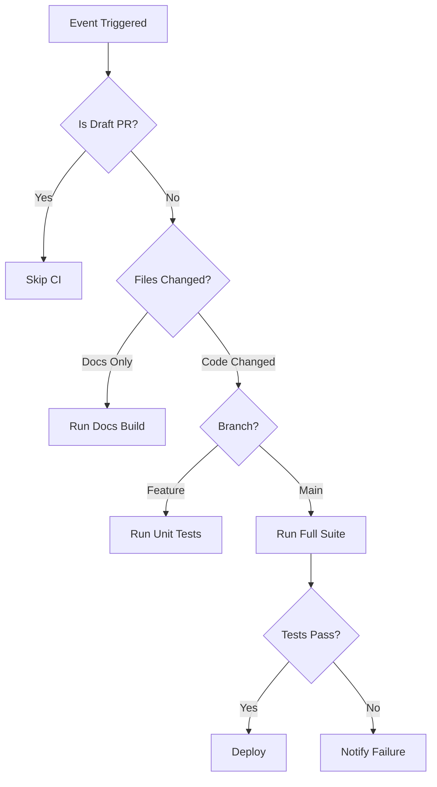

# How to Use Workflow Conditions in GitHub Actions

Author: [nawazdhandala](https://www.github.com/nawazdhandala)

Tags: GitHub Actions, CI/CD, Conditional Logic, Workflow Optimization, DevOps

Description: Master conditional logic in GitHub Actions to control when jobs and steps run, skip unnecessary work, and build smarter workflows that respond to your specific needs.

---

Not every commit needs the same CI treatment. A documentation change does not need integration tests. A draft PR does not need deployment previews. GitHub Actions provides powerful conditional logic to run exactly what you need, when you need it.

## Understanding the `if` Keyword

The `if` keyword controls whether a job or step runs. It accepts expressions that evaluate to true or false.

```yaml
jobs:
  deploy:
    runs-on: ubuntu-latest
    # Only deploy on pushes to main branch
    if: github.ref == 'refs/heads/main'
    steps:
      - name: Deploy to production
        run: ./deploy.sh
```

You can also use conditions on individual steps:

```yaml
steps:
  - name: Run expensive tests
    if: github.event_name == 'push'
    run: npm run test:e2e

  - name: Run quick tests only
    if: github.event_name == 'pull_request'
    run: npm run test:unit
```

## Common Context Variables

GitHub provides several context objects for building conditions:

```yaml
# Event type
if: github.event_name == 'push'
if: github.event_name == 'pull_request'
if: github.event_name == 'workflow_dispatch'
if: github.event_name == 'schedule'

# Branch and tag references
if: github.ref == 'refs/heads/main'
if: github.ref_name == 'develop'
if: startsWith(github.ref, 'refs/tags/v')

# Repository information
if: github.repository == 'owner/repo'
if: github.repository_owner == 'myorg'

# Actor (who triggered the workflow)
if: github.actor == 'dependabot[bot]'
if: github.actor != 'github-actions[bot]'
```

## Pull Request Conditions

Pull requests have rich metadata for conditional logic:

```yaml
jobs:
  test:
    # Skip draft PRs
    if: github.event.pull_request.draft == false
    runs-on: ubuntu-latest
    steps:
      - uses: actions/checkout@v4

  review:
    # Only run on PRs targeting main
    if: github.event.pull_request.base.ref == 'main'
    runs-on: ubuntu-latest
    steps:
      - name: Security review
        run: ./security-check.sh

  external-contribution:
    # Different workflow for external contributors
    if: github.event.pull_request.head.repo.full_name != github.repository
    runs-on: ubuntu-latest
    steps:
      - name: Run safe subset of tests
        run: npm run test:safe
```

## Combining Conditions

Use logical operators to build complex conditions:

```yaml
jobs:
  deploy-staging:
    # Deploy on push to main OR manual trigger
    if: |
      github.ref == 'refs/heads/main' &&
      (github.event_name == 'push' || github.event_name == 'workflow_dispatch')
    runs-on: ubuntu-latest
    steps:
      - run: ./deploy-staging.sh

  deploy-production:
    # Deploy only on version tags pushed by authorized users
    if: |
      startsWith(github.ref, 'refs/tags/v') &&
      contains(fromJSON('["admin1", "admin2", "releasebot"]'), github.actor)
    runs-on: ubuntu-latest
    steps:
      - run: ./deploy-prod.sh
```

## Path-Based Conditions

Run jobs only when specific files change. This is crucial for monorepos and skipping unnecessary work.

```yaml
on:
  push:
    paths:
      - 'src/**'
      - 'package.json'
      - '.github/workflows/ci.yml'
    paths-ignore:
      - '**.md'
      - 'docs/**'

# Or use path filters at the job level with dorny/paths-filter
jobs:
  changes:
    runs-on: ubuntu-latest
    outputs:
      backend: ${{ steps.filter.outputs.backend }}
      frontend: ${{ steps.filter.outputs.frontend }}
    steps:
      - uses: actions/checkout@v4
      - uses: dorny/paths-filter@v2
        id: filter
        with:
          filters: |
            backend:
              - 'api/**'
              - 'server/**'
            frontend:
              - 'web/**'
              - 'ui/**'

  test-backend:
    needs: changes
    if: needs.changes.outputs.backend == 'true'
    runs-on: ubuntu-latest
    steps:
      - run: npm run test:backend

  test-frontend:
    needs: changes
    if: needs.changes.outputs.frontend == 'true'
    runs-on: ubuntu-latest
    steps:
      - run: npm run test:frontend
```

## Success and Failure Conditions

Control steps based on the outcome of previous steps or jobs:

```yaml
steps:
  - name: Run tests
    id: tests
    run: npm test
    continue-on-error: true  # Allow workflow to continue even if this fails

  - name: Upload test results
    if: always()  # Run regardless of previous step outcome
    uses: actions/upload-artifact@v4
    with:
      name: test-results
      path: coverage/

  - name: Notify on failure
    if: failure()  # Only run if a previous step failed
    run: curl -X POST ${{ secrets.SLACK_WEBHOOK }} -d '{"text":"Tests failed!"}'

  - name: Notify on success
    if: success()  # Only run if all previous steps succeeded
    run: curl -X POST ${{ secrets.SLACK_WEBHOOK }} -d '{"text":"Tests passed!"}'

  - name: Conditional on specific step
    if: steps.tests.outcome == 'failure'
    run: echo "Tests failed but we continued anyway"
```

## Job Output Conditions

Pass information between jobs for complex conditional logic:

```yaml
jobs:
  analyze:
    runs-on: ubuntu-latest
    outputs:
      should-deploy: ${{ steps.check.outputs.deploy }}
      environment: ${{ steps.check.outputs.env }}
    steps:
      - id: check
        run: |
          if [[ "${{ github.ref }}" == "refs/heads/main" ]]; then
            echo "deploy=true" >> $GITHUB_OUTPUT
            echo "env=production" >> $GITHUB_OUTPUT
          elif [[ "${{ github.ref }}" == "refs/heads/develop" ]]; then
            echo "deploy=true" >> $GITHUB_OUTPUT
            echo "env=staging" >> $GITHUB_OUTPUT
          else
            echo "deploy=false" >> $GITHUB_OUTPUT
          fi

  deploy:
    needs: analyze
    if: needs.analyze.outputs.should-deploy == 'true'
    runs-on: ubuntu-latest
    environment: ${{ needs.analyze.outputs.environment }}
    steps:
      - run: echo "Deploying to ${{ needs.analyze.outputs.environment }}"
```

## Label-Based Conditions

Use PR labels to control workflow behavior:

```yaml
jobs:
  skip-ci:
    if: |
      !contains(github.event.pull_request.labels.*.name, 'skip-ci')
    runs-on: ubuntu-latest
    steps:
      - run: npm test

  heavy-tests:
    if: contains(github.event.pull_request.labels.*.name, 'run-e2e')
    runs-on: ubuntu-latest
    steps:
      - run: npm run test:e2e

  security-scan:
    if: |
      contains(github.event.pull_request.labels.*.name, 'security') ||
      github.event.pull_request.base.ref == 'main'
    runs-on: ubuntu-latest
    steps:
      - run: npm audit
```

## Environment-Based Conditions

Use different conditions based on the target environment:

```yaml
jobs:
  deploy:
    runs-on: ubuntu-latest
    strategy:
      matrix:
        environment: [staging, production]
    steps:
      - name: Deploy to staging
        if: matrix.environment == 'staging'
        run: ./deploy.sh --env staging

      - name: Require approval for production
        if: matrix.environment == 'production'
        uses: trstringer/manual-approval@v1
        with:
          secret: ${{ secrets.GITHUB_TOKEN }}
          approvers: release-team

      - name: Deploy to production
        if: matrix.environment == 'production'
        run: ./deploy.sh --env production
```

## Skip Conditions with Commit Messages

Respect conventional skip markers in commit messages:

```yaml
jobs:
  ci:
    # Skip if commit message contains [skip ci] or [ci skip]
    if: |
      !contains(github.event.head_commit.message, '[skip ci]') &&
      !contains(github.event.head_commit.message, '[ci skip]')
    runs-on: ubuntu-latest
    steps:
      - run: npm test
```

## Workflow Decision Flow

Here is how conditions flow through a typical CI/CD pipeline:



## Best Practices

1. **Start restrictive** - Default to not running jobs and explicitly enable them. This saves compute minutes.

2. **Use path filters** - Do not run backend tests when only frontend code changes.

3. **Combine with caching** - Conditional jobs work great with cached dependencies to minimize redundant work.

4. **Document your conditions** - Complex `if` expressions benefit from comments explaining the business logic.

5. **Test your conditions** - Use act or workflow_dispatch with test inputs to verify conditions behave as expected.

Conditions transform GitHub Actions from a simple CI runner into an intelligent automation system that understands your development workflow.
