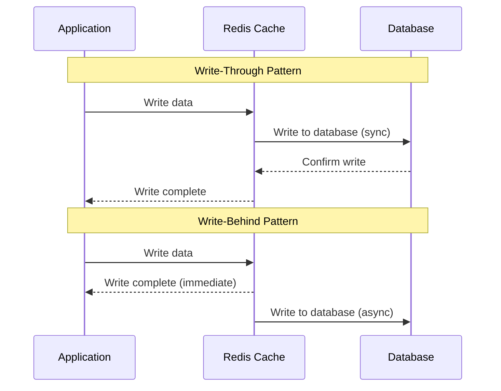

# How to Implement Write-Through and Write-Behind Caching with Redis

Author: [nawazdhandala](https://www.github.com/nawazdhandala)

Tags: Redis, Caching, Write-Through, Write-Behind, Performance, Database

Description: Learn how to implement write-through and write-behind caching patterns with Redis to improve application performance while maintaining data consistency between cache and database.

---

Caching is essential for building high-performance applications, but keeping your cache in sync with your database is where things get tricky. Write-through and write-behind are two caching strategies that solve this problem in different ways. This guide walks you through implementing both patterns with Redis and Node.js.

## Understanding the Two Patterns

Before diving into code, let's understand what each pattern does.

**Write-Through Caching**: Every write goes to both the cache and the database synchronously. The write operation completes only after both have been updated. This ensures strong consistency but adds latency to writes.

**Write-Behind Caching** (also called Write-Back): Writes go to the cache immediately, and the database is updated asynchronously in the background. This gives you faster writes but introduces a window where the cache and database can be out of sync.



## Setting Up Redis Connection

First, let's set up a Redis connection with proper error handling. We'll use the ioredis library for its reliability and built-in connection pooling.

```javascript
// redis-client.js
// Redis connection setup with reconnection logic
const Redis = require('ioredis');

const redis = new Redis({
  host: process.env.REDIS_HOST || 'localhost',
  port: process.env.REDIS_PORT || 6379,
  password: process.env.REDIS_PASSWORD,
  retryDelayOnFailover: 100,
  maxRetriesPerRequest: 3,
  // Enable offline queue to buffer commands during reconnection
  enableOfflineQueue: true,
});

redis.on('connect', () => console.log('Redis connected'));
redis.on('error', (err) => console.error('Redis error:', err));

module.exports = redis;
```

## Implementing Write-Through Caching

Write-through caching guarantees that your cache and database always have the same data. Here's a complete implementation.

```javascript
// write-through-cache.js
// Write-through cache: writes go to both cache and database synchronously
const redis = require('./redis-client');
const { Pool } = require('pg');

const db = new Pool({
  connectionString: process.env.DATABASE_URL,
});

class WriteThroughCache {
  constructor(options = {}) {
    this.keyPrefix = options.keyPrefix || 'cache:';
    this.defaultTTL = options.defaultTTL || 3600; // 1 hour default
  }

  // Generate a consistent cache key
  getCacheKey(entity, id) {
    return `${this.keyPrefix}${entity}:${id}`;
  }

  // Read with cache-aside pattern (check cache first, then database)
  async get(entity, id) {
    const cacheKey = this.getCacheKey(entity, id);

    // Try cache first
    const cached = await redis.get(cacheKey);
    if (cached) {
      console.log(`Cache hit for ${cacheKey}`);
      return JSON.parse(cached);
    }

    // Cache miss - fetch from database
    console.log(`Cache miss for ${cacheKey}`);
    const result = await db.query(
      `SELECT * FROM ${entity} WHERE id = $1`,
      [id]
    );

    if (result.rows.length === 0) {
      return null;
    }

    const data = result.rows[0];

    // Populate cache for next time
    await redis.setex(cacheKey, this.defaultTTL, JSON.stringify(data));

    return data;
  }

  // Write-through: update both cache and database in a transaction-like manner
  async set(entity, id, data) {
    const cacheKey = this.getCacheKey(entity, id);

    // Start database transaction
    const client = await db.connect();

    try {
      await client.query('BEGIN');

      // Build update query dynamically
      const columns = Object.keys(data);
      const values = Object.values(data);
      const setClause = columns
        .map((col, i) => `${col} = $${i + 2}`)
        .join(', ');

      // Update database first
      await client.query(
        `UPDATE ${entity} SET ${setClause}, updated_at = NOW() WHERE id = $1`,
        [id, ...values]
      );

      // Update cache
      const updatedData = { id, ...data, updated_at: new Date().toISOString() };
      await redis.setex(cacheKey, this.defaultTTL, JSON.stringify(updatedData));

      await client.query('COMMIT');

      return updatedData;
    } catch (error) {
      await client.query('ROLLBACK');
      // Invalidate cache on failure to prevent stale data
      await redis.del(cacheKey);
      throw error;
    } finally {
      client.release();
    }
  }

  // Create new record with write-through
  async create(entity, data) {
    const client = await db.connect();

    try {
      await client.query('BEGIN');

      const columns = Object.keys(data);
      const values = Object.values(data);
      const placeholders = columns.map((_, i) => `$${i + 1}`).join(', ');

      // Insert into database
      const result = await client.query(
        `INSERT INTO ${entity} (${columns.join(', ')})
         VALUES (${placeholders})
         RETURNING *`,
        values
      );

      const newRecord = result.rows[0];
      const cacheKey = this.getCacheKey(entity, newRecord.id);

      // Add to cache
      await redis.setex(cacheKey, this.defaultTTL, JSON.stringify(newRecord));

      await client.query('COMMIT');

      return newRecord;
    } catch (error) {
      await client.query('ROLLBACK');
      throw error;
    } finally {
      client.release();
    }
  }

  // Delete with cache invalidation
  async delete(entity, id) {
    const cacheKey = this.getCacheKey(entity, id);
    const client = await db.connect();

    try {
      await client.query('BEGIN');

      await client.query(`DELETE FROM ${entity} WHERE id = $1`, [id]);
      await redis.del(cacheKey);

      await client.query('COMMIT');
    } catch (error) {
      await client.query('ROLLBACK');
      throw error;
    } finally {
      client.release();
    }
  }
}

module.exports = WriteThroughCache;
```

## Implementing Write-Behind Caching

Write-behind caching prioritizes write speed by deferring database updates. This pattern is useful when you can tolerate eventual consistency.

```javascript
// write-behind-cache.js
// Write-behind cache: writes go to cache immediately, database updated async
const redis = require('./redis-client');
const { Pool } = require('pg');

const db = new Pool({
  connectionString: process.env.DATABASE_URL,
});

class WriteBehindCache {
  constructor(options = {}) {
    this.keyPrefix = options.keyPrefix || 'cache:';
    this.writeQueueKey = options.writeQueueKey || 'write_queue';
    this.defaultTTL = options.defaultTTL || 3600;
    this.flushInterval = options.flushInterval || 1000; // Flush every second
    this.batchSize = options.batchSize || 100;
    this.isProcessing = false;

    // Start the background flush process
    this.startFlushProcess();
  }

  getCacheKey(entity, id) {
    return `${this.keyPrefix}${entity}:${id}`;
  }

  // Read from cache (same as write-through)
  async get(entity, id) {
    const cacheKey = this.getCacheKey(entity, id);

    const cached = await redis.get(cacheKey);
    if (cached) {
      return JSON.parse(cached);
    }

    // Cache miss - fetch from database
    const result = await db.query(
      `SELECT * FROM ${entity} WHERE id = $1`,
      [id]
    );

    if (result.rows.length === 0) {
      return null;
    }

    const data = result.rows[0];
    await redis.setex(cacheKey, this.defaultTTL, JSON.stringify(data));

    return data;
  }

  // Write-behind: update cache immediately, queue database write
  async set(entity, id, data) {
    const cacheKey = this.getCacheKey(entity, id);
    const timestamp = Date.now();

    // Update cache immediately
    const updatedData = { id, ...data, updated_at: new Date().toISOString() };
    await redis.setex(cacheKey, this.defaultTTL, JSON.stringify(updatedData));

    // Queue the database write operation
    // Using a sorted set with timestamp as score for ordering
    const writeOperation = JSON.stringify({
      operation: 'UPDATE',
      entity,
      id,
      data,
      timestamp,
    });

    await redis.zadd(this.writeQueueKey, timestamp, writeOperation);

    return updatedData;
  }

  // Create with write-behind
  async create(entity, data) {
    // Generate a temporary ID (will be replaced by database)
    const tempId = `temp_${Date.now()}_${Math.random().toString(36).substr(2, 9)}`;
    const timestamp = Date.now();

    const newRecord = {
      id: tempId,
      ...data,
      created_at: new Date().toISOString()
    };

    // Store in cache with temp ID
    const cacheKey = this.getCacheKey(entity, tempId);
    await redis.setex(cacheKey, this.defaultTTL, JSON.stringify(newRecord));

    // Queue insert operation
    const writeOperation = JSON.stringify({
      operation: 'INSERT',
      entity,
      tempId,
      data,
      timestamp,
    });

    await redis.zadd(this.writeQueueKey, timestamp, writeOperation);

    return newRecord;
  }

  // Background process that flushes queued writes to database
  startFlushProcess() {
    setInterval(async () => {
      if (this.isProcessing) return;

      this.isProcessing = true;

      try {
        await this.flushWriteQueue();
      } catch (error) {
        console.error('Flush process error:', error);
      } finally {
        this.isProcessing = false;
      }
    }, this.flushInterval);
  }

  // Process queued writes in batches
  async flushWriteQueue() {
    // Get oldest operations up to batch size
    const operations = await redis.zrange(
      this.writeQueueKey,
      0,
      this.batchSize - 1
    );

    if (operations.length === 0) return;

    const client = await db.connect();

    try {
      await client.query('BEGIN');

      for (const opString of operations) {
        const op = JSON.parse(opString);

        if (op.operation === 'UPDATE') {
          await this.executeUpdate(client, op);
        } else if (op.operation === 'INSERT') {
          await this.executeInsert(client, op);
        } else if (op.operation === 'DELETE') {
          await this.executeDelete(client, op);
        }
      }

      await client.query('COMMIT');

      // Remove processed operations from queue
      await redis.zrem(this.writeQueueKey, ...operations);

      console.log(`Flushed ${operations.length} operations to database`);
    } catch (error) {
      await client.query('ROLLBACK');
      console.error('Write queue flush failed:', error);
      // Operations remain in queue for retry
    } finally {
      client.release();
    }
  }

  async executeUpdate(client, op) {
    const columns = Object.keys(op.data);
    const values = Object.values(op.data);
    const setClause = columns
      .map((col, i) => `${col} = $${i + 2}`)
      .join(', ');

    await client.query(
      `UPDATE ${op.entity} SET ${setClause}, updated_at = NOW() WHERE id = $1`,
      [op.id, ...values]
    );
  }

  async executeInsert(client, op) {
    const columns = Object.keys(op.data);
    const values = Object.values(op.data);
    const placeholders = columns.map((_, i) => `$${i + 1}`).join(', ');

    const result = await client.query(
      `INSERT INTO ${op.entity} (${columns.join(', ')})
       VALUES (${placeholders})
       RETURNING id`,
      values
    );

    // Update cache with real ID
    const realId = result.rows[0].id;
    const tempCacheKey = this.getCacheKey(op.entity, op.tempId);
    const cached = await redis.get(tempCacheKey);

    if (cached) {
      const data = JSON.parse(cached);
      data.id = realId;
      const newCacheKey = this.getCacheKey(op.entity, realId);
      await redis.setex(newCacheKey, this.defaultTTL, JSON.stringify(data));
      await redis.del(tempCacheKey);
    }
  }

  async executeDelete(client, op) {
    await client.query(`DELETE FROM ${op.entity} WHERE id = $1`, [op.id]);
  }

  // Get queue statistics for monitoring
  async getQueueStats() {
    const queueLength = await redis.zcard(this.writeQueueKey);
    const oldestTimestamp = await redis.zrange(this.writeQueueKey, 0, 0, 'WITHSCORES');

    return {
      pendingWrites: queueLength,
      oldestWriteAge: oldestTimestamp.length > 0
        ? Date.now() - parseInt(oldestTimestamp[1])
        : 0,
    };
  }
}

module.exports = WriteBehindCache;
```

## Usage Examples

Here's how to use both caching strategies in an Express application.

```javascript
// app.js
// Express app using write-through and write-behind caching
const express = require('express');
const WriteThroughCache = require('./write-through-cache');
const WriteBehindCache = require('./write-behind-cache');

const app = express();
app.use(express.json());

// Use write-through for critical data like user accounts
const userCache = new WriteThroughCache({ keyPrefix: 'user:' });

// Use write-behind for less critical, high-frequency updates like analytics
const analyticsCache = new WriteBehindCache({
  keyPrefix: 'analytics:',
  flushInterval: 5000, // Flush every 5 seconds
  batchSize: 500,
});

// User endpoints - write-through for consistency
app.get('/users/:id', async (req, res) => {
  try {
    const user = await userCache.get('users', req.params.id);
    if (!user) {
      return res.status(404).json({ error: 'User not found' });
    }
    res.json(user);
  } catch (error) {
    res.status(500).json({ error: error.message });
  }
});

app.put('/users/:id', async (req, res) => {
  try {
    const user = await userCache.set('users', req.params.id, req.body);
    res.json(user);
  } catch (error) {
    res.status(500).json({ error: error.message });
  }
});

// Analytics endpoints - write-behind for performance
app.post('/analytics/pageview', async (req, res) => {
  try {
    // Fast response, database updated in background
    await analyticsCache.create('pageviews', {
      page: req.body.page,
      user_id: req.body.userId,
      timestamp: new Date(),
    });
    res.status(202).json({ status: 'accepted' });
  } catch (error) {
    res.status(500).json({ error: error.message });
  }
});

// Health check including cache queue stats
app.get('/health', async (req, res) => {
  const stats = await analyticsCache.getQueueStats();
  res.json({
    status: 'healthy',
    writeQueue: stats,
  });
});

app.listen(3000, () => console.log('Server running on port 3000'));
```

## When to Use Each Pattern

| Pattern | Best For | Trade-offs |
|---------|----------|------------|
| **Write-Through** | Financial transactions, user accounts, inventory | Higher write latency, strong consistency |
| **Write-Behind** | Analytics, logs, metrics, session updates | Lower write latency, eventual consistency |

Write-through is your choice when data correctness is critical and you cannot afford any inconsistency between cache and database. Financial systems, order processing, and user authentication typically need this.

Write-behind shines when you need high write throughput and can accept brief inconsistencies. Analytics pipelines, activity feeds, and metrics collection benefit from this pattern.

## Handling Failures

Both patterns need failure handling. For write-through, the synchronous nature means failures are immediately visible. For write-behind, you need to monitor the queue and handle retries.

```javascript
// Monitor write-behind queue for issues
async function monitorWriteQueue(cache) {
  const stats = await cache.getQueueStats();

  // Alert if queue is backing up
  if (stats.pendingWrites > 1000) {
    console.warn('Write queue backing up:', stats.pendingWrites);
  }

  // Alert if oldest write is too old (database may be down)
  if (stats.oldestWriteAge > 60000) { // 1 minute
    console.error('Write queue stalled, oldest write age:', stats.oldestWriteAge);
  }
}
```

Both patterns improve application performance significantly, but choosing the right one depends on your consistency requirements. Start with write-through for critical data, and use write-behind selectively where you can trade consistency for speed.
