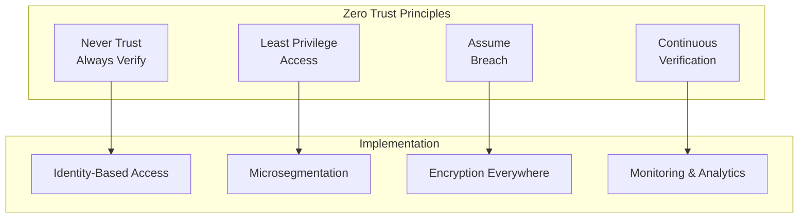

# How to Implement Zero Trust Networking

Author: [nawazdhandala](https://www.github.com/nawazdhandala)

Tags: Zero Trust, Security, Networking, Authentication, Kubernetes, DevOps

Description: A practical guide to implementing zero trust networking principles, covering identity-based access, microsegmentation, continuous verification, and practical implementations with modern tools.

---

Zero trust is a security model that assumes no implicit trust. Every request must be verified, regardless of where it comes from. This guide covers how to implement zero trust networking in modern infrastructure.

## Zero Trust Principles



## Identity-Based Access Control

### SPIFFE/SPIRE for Workload Identity

```yaml
# spire-server.yaml
apiVersion: apps/v1
kind: StatefulSet
metadata:
  name: spire-server
  namespace: spire
spec:
  replicas: 1
  selector:
    matchLabels:
      app: spire-server
  template:
    metadata:
      labels:
        app: spire-server
    spec:
      containers:
        - name: spire-server
          image: ghcr.io/spiffe/spire-server:1.8.0
          args:
            - -config
            - /run/spire/config/server.conf
          ports:
            - containerPort: 8081
          volumeMounts:
            - name: spire-config
              mountPath: /run/spire/config
              readOnly: true
            - name: spire-data
              mountPath: /run/spire/data
      volumes:
        - name: spire-config
          configMap:
            name: spire-server-config
        - name: spire-data
          emptyDir: {}

---
apiVersion: v1
kind: ConfigMap
metadata:
  name: spire-server-config
  namespace: spire
data:
  server.conf: |
    server {
        bind_address = "0.0.0.0"
        bind_port = "8081"
        trust_domain = "example.org"
        data_dir = "/run/spire/data"
        log_level = "INFO"

        ca_ttl = "24h"
        default_svid_ttl = "1h"
    }

    plugins {
        DataStore "sql" {
            plugin_data {
                database_type = "sqlite3"
                connection_string = "/run/spire/data/datastore.sqlite3"
            }
        }

        NodeAttestor "k8s_psat" {
            plugin_data {
                clusters = {
                    "cluster1" = {
                        service_account_allow_list = ["spire:spire-agent"]
                    }
                }
            }
        }

        KeyManager "memory" {
            plugin_data {}
        }
    }
```

### SPIRE Agent Configuration

```yaml
# spire-agent.yaml
apiVersion: apps/v1
kind: DaemonSet
metadata:
  name: spire-agent
  namespace: spire
spec:
  selector:
    matchLabels:
      app: spire-agent
  template:
    metadata:
      labels:
        app: spire-agent
    spec:
      hostPID: true
      hostNetwork: true
      containers:
        - name: spire-agent
          image: ghcr.io/spiffe/spire-agent:1.8.0
          args:
            - -config
            - /run/spire/config/agent.conf
          volumeMounts:
            - name: spire-config
              mountPath: /run/spire/config
              readOnly: true
            - name: spire-sockets
              mountPath: /run/spire/sockets
            - name: spire-token
              mountPath: /var/run/secrets/tokens
      volumes:
        - name: spire-config
          configMap:
            name: spire-agent-config
        - name: spire-sockets
          hostPath:
            path: /run/spire/sockets
            type: DirectoryOrCreate
        - name: spire-token
          projected:
            sources:
              - serviceAccountToken:
                  path: spire-agent
                  expirationSeconds: 7200
                  audience: spire-server
```

## mTLS Everywhere

### Envoy Sidecar with mTLS

```yaml
# envoy-sidecar-config.yaml
apiVersion: v1
kind: ConfigMap
metadata:
  name: envoy-config
data:
  envoy.yaml: |
    static_resources:
      listeners:
        - name: listener_0
          address:
            socket_address:
              address: 0.0.0.0
              port_value: 8443
          filter_chains:
            - filters:
                - name: envoy.filters.network.http_connection_manager
                  typed_config:
                    "@type": type.googleapis.com/envoy.extensions.filters.network.http_connection_manager.v3.HttpConnectionManager
                    stat_prefix: ingress_http
                    route_config:
                      name: local_route
                      virtual_hosts:
                        - name: local_service
                          domains: ["*"]
                          routes:
                            - match:
                                prefix: "/"
                              route:
                                cluster: local_service
                    http_filters:
                      - name: envoy.filters.http.router
                        typed_config:
                          "@type": type.googleapis.com/envoy.extensions.filters.http.router.v3.Router
              transport_socket:
                name: envoy.transport_sockets.tls
                typed_config:
                  "@type": type.googleapis.com/envoy.extensions.transport_sockets.tls.v3.DownstreamTlsContext
                  require_client_certificate: true
                  common_tls_context:
                    tls_certificate_sds_secret_configs:
                      - name: server_cert
                        sds_config:
                          api_config_source:
                            api_type: GRPC
                            grpc_services:
                              - envoy_grpc:
                                  cluster_name: spire_agent
                    validation_context_sds_secret_config:
                      name: validation_context
                      sds_config:
                        api_config_source:
                          api_type: GRPC
                          grpc_services:
                            - envoy_grpc:
                                cluster_name: spire_agent

      clusters:
        - name: local_service
          connect_timeout: 5s
          type: STATIC
          load_assignment:
            cluster_name: local_service
            endpoints:
              - lb_endpoints:
                  - endpoint:
                      address:
                        socket_address:
                          address: 127.0.0.1
                          port_value: 8080

        - name: spire_agent
          connect_timeout: 5s
          type: STATIC
          http2_protocol_options: {}
          load_assignment:
            cluster_name: spire_agent
            endpoints:
              - lb_endpoints:
                  - endpoint:
                      address:
                        pipe:
                          path: /run/spire/sockets/agent.sock
```

## Policy-Based Access Control

### Open Policy Agent (OPA) Integration

```yaml
# opa-deployment.yaml
apiVersion: apps/v1
kind: Deployment
metadata:
  name: opa
  namespace: security
spec:
  replicas: 2
  selector:
    matchLabels:
      app: opa
  template:
    metadata:
      labels:
        app: opa
    spec:
      containers:
        - name: opa
          image: openpolicyagent/opa:latest
          args:
            - "run"
            - "--server"
            - "--addr=0.0.0.0:8181"
            - "--set=decision_logs.console=true"
            - "/policies"
          ports:
            - containerPort: 8181
          volumeMounts:
            - name: policies
              mountPath: /policies
      volumes:
        - name: policies
          configMap:
            name: opa-policies

---
apiVersion: v1
kind: ConfigMap
metadata:
  name: opa-policies
  namespace: security
data:
  authz.rego: |
    package authz

    default allow = false

    # Allow if the request has valid SPIFFE identity
    allow {
        valid_spiffe_id
        authorized_service
    }

    # Validate SPIFFE ID format
    valid_spiffe_id {
        input.spiffe_id
        startswith(input.spiffe_id, "spiffe://example.org/")
    }

    # Service-to-service authorization matrix
    authorized_service {
        service_permissions[input.source_service][_] == input.target_service
    }

    service_permissions := {
        "frontend": ["api", "auth"],
        "api": ["database", "cache", "auth"],
        "auth": ["database"],
    }

    # Deny requests from unknown services
    deny[msg] {
        not valid_spiffe_id
        msg := "Invalid or missing SPIFFE ID"
    }

    deny[msg] {
        not authorized_service
        msg := sprintf("Service %v not authorized to access %v", [input.source_service, input.target_service])
    }
```

## Continuous Verification

### Request Authentication Middleware

```go
package middleware

import (
    "context"
    "net/http"
    "time"

    "github.com/spiffe/go-spiffe/v2/spiffeid"
    "github.com/spiffe/go-spiffe/v2/svid/x509svid"
    "github.com/spiffe/go-spiffe/v2/workloadapi"
)

type ZeroTrustMiddleware struct {
    x509Source *workloadapi.X509Source
    opaClient  *OPAClient
    trustDomain spiffeid.TrustDomain
}

func NewZeroTrustMiddleware(ctx context.Context) (*ZeroTrustMiddleware, error) {
    td, _ := spiffeid.TrustDomainFromString("example.org")

    // Connect to SPIRE agent
    source, err := workloadapi.NewX509Source(ctx)
    if err != nil {
        return nil, err
    }

    return &ZeroTrustMiddleware{
        x509Source:  source,
        opaClient:   NewOPAClient("http://opa:8181"),
        trustDomain: td,
    }, nil
}

func (m *ZeroTrustMiddleware) Verify(next http.Handler) http.Handler {
    return http.HandlerFunc(func(w http.ResponseWriter, r *http.Request) {
        // Extract client certificate
        if r.TLS == nil || len(r.TLS.PeerCertificates) == 0 {
            http.Error(w, "Client certificate required", http.StatusUnauthorized)
            return
        }

        // Verify SPIFFE identity
        peerCert := r.TLS.PeerCertificates[0]
        peerID, err := x509svid.IDFromCert(peerCert)
        if err != nil {
            http.Error(w, "Invalid SPIFFE ID", http.StatusUnauthorized)
            return
        }

        // Verify trust domain
        if peerID.TrustDomain() != m.trustDomain {
            http.Error(w, "Untrusted domain", http.StatusForbidden)
            return
        }

        // Check with OPA for authorization
        authzRequest := AuthzRequest{
            SpiffeID:      peerID.String(),
            SourceService: extractServiceName(peerID),
            TargetService: r.Host,
            Method:        r.Method,
            Path:          r.URL.Path,
            Timestamp:     time.Now(),
        }

        allowed, err := m.opaClient.IsAllowed(r.Context(), authzRequest)
        if err != nil || !allowed {
            http.Error(w, "Access denied", http.StatusForbidden)
            return
        }

        // Add identity to context
        ctx := context.WithValue(r.Context(), "spiffe_id", peerID)
        next.ServeHTTP(w, r.WithContext(ctx))
    })
}

func extractServiceName(id spiffeid.ID) string {
    // Extract service name from SPIFFE ID path
    // spiffe://example.org/ns/default/sa/api -> api
    return id.Path()[len(id.Path())-1]
}
```

## Network Microsegmentation

```yaml
# zero-trust-network-policies.yaml

# Default deny all traffic
apiVersion: networking.k8s.io/v1
kind: NetworkPolicy
metadata:
  name: default-deny-all
  namespace: default
spec:
  podSelector: {}
  policyTypes:
    - Ingress
    - Egress

---
# Allow only verified traffic with specific labels
apiVersion: networking.k8s.io/v1
kind: NetworkPolicy
metadata:
  name: zero-trust-api
  namespace: default
spec:
  podSelector:
    matchLabels:
      app: api
      zero-trust: enabled
  policyTypes:
    - Ingress
    - Egress
  ingress:
    - from:
        - podSelector:
            matchLabels:
              app: frontend
              zero-trust: enabled
        - podSelector:
            matchLabels:
              app: gateway
              zero-trust: enabled
      ports:
        - protocol: TCP
          port: 8443  # mTLS only
  egress:
    - to:
        - podSelector:
            matchLabels:
              app: database
              zero-trust: enabled
      ports:
        - protocol: TCP
          port: 5432
    # DNS
    - to:
        - namespaceSelector: {}
          podSelector:
            matchLabels:
              k8s-app: kube-dns
      ports:
        - protocol: UDP
          port: 53
```

## Device Trust Verification

```python
# device_trust.py - Device attestation service

from flask import Flask, request, jsonify
import jwt
import hashlib

app = Flask(__name__)

TRUSTED_DEVICES = {}  # In production, use a database

@app.route('/attest', methods=['POST'])
def attest_device():
    """Verify device identity and issue access token"""
    data = request.json

    # Verify device certificate
    device_cert = data.get('device_certificate')
    if not verify_device_certificate(device_cert):
        return jsonify({'error': 'Invalid device certificate'}), 401

    # Check device posture
    posture = data.get('device_posture', {})
    if not check_device_posture(posture):
        return jsonify({'error': 'Device does not meet security requirements'}), 403

    # Generate device-bound token
    device_id = extract_device_id(device_cert)
    token = generate_device_token(device_id, posture)

    return jsonify({
        'access_token': token,
        'expires_in': 3600,
        'device_id': device_id
    })

def check_device_posture(posture):
    """Verify device meets security requirements"""
    required_checks = {
        'os_updated': True,
        'disk_encrypted': True,
        'firewall_enabled': True,
        'antivirus_active': True
    }

    for check, required in required_checks.items():
        if posture.get(check) != required:
            return False

    return True

def generate_device_token(device_id, posture):
    """Generate short-lived token bound to device"""
    payload = {
        'device_id': device_id,
        'posture_hash': hashlib.sha256(str(posture).encode()).hexdigest(),
        'iat': time.time(),
        'exp': time.time() + 3600
    }
    return jwt.encode(payload, SECRET_KEY, algorithm='HS256')

@app.route('/verify', methods=['POST'])
def verify_access():
    """Verify token and device binding"""
    token = request.headers.get('Authorization', '').replace('Bearer ', '')
    device_id = request.headers.get('X-Device-ID')

    try:
        payload = jwt.decode(token, SECRET_KEY, algorithms=['HS256'])

        # Verify device binding
        if payload['device_id'] != device_id:
            return jsonify({'allowed': False, 'reason': 'Device mismatch'}), 403

        return jsonify({'allowed': True, 'device_id': device_id})

    except jwt.ExpiredSignatureError:
        return jsonify({'allowed': False, 'reason': 'Token expired'}), 401
    except jwt.InvalidTokenError:
        return jsonify({'allowed': False, 'reason': 'Invalid token'}), 401
```

## Monitoring and Audit

```yaml
# audit-logging.yaml
apiVersion: v1
kind: ConfigMap
metadata:
  name: audit-policy
  namespace: kube-system
data:
  audit-policy.yaml: |
    apiVersion: audit.k8s.io/v1
    kind: Policy
    rules:
      # Log all authentication failures
      - level: Request
        resources:
          - group: ""
            resources: ["*"]
        verbs: ["*"]
        omitStages:
          - RequestReceived
        # Only failed requests
        nonResourceURLs:
          - "*"

      # Log all access to secrets
      - level: RequestResponse
        resources:
          - group: ""
            resources: ["secrets"]

      # Log all network policy changes
      - level: RequestResponse
        resources:
          - group: "networking.k8s.io"
            resources: ["networkpolicies"]

      # Log authentication events
      - level: Metadata
        users: ["system:anonymous"]
        verbs: ["*"]
```

## Zero Trust Checklist

```markdown
## Zero Trust Implementation Checklist

### Identity
- [ ] Workload identity (SPIFFE/SPIRE) deployed
- [ ] All services have unique identities
- [ ] Identity lifecycle management in place

### Network
- [ ] Default deny network policies
- [ ] mTLS for all service-to-service communication
- [ ] Network microsegmentation implemented

### Access Control
- [ ] Policy engine (OPA) deployed
- [ ] Least privilege policies defined
- [ ] Regular policy audits scheduled

### Verification
- [ ] Continuous authentication enabled
- [ ] Device trust verification
- [ ] Anomaly detection in place

### Monitoring
- [ ] All access attempts logged
- [ ] Security events correlated
- [ ] Alerts configured for violations
```

---

Zero trust is a journey, not a destination. Start by identifying your most critical assets, implement strong identity for workloads, and gradually expand microsegmentation. The goal is to make lateral movement as difficult as possible while maintaining operational efficiency.
