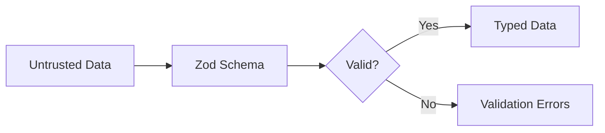

# How to Validate Data with Zod in TypeScript

Author: [nawazdhandala](https://www.github.com/nawazdhandala)

Tags: TypeScript, Zod, Validation, Schema, Type Safety, Node.js

Description: A practical guide to validating data with Zod in TypeScript, covering schema definitions, custom validators, error handling, and integration with Express and React applications.

---

> Runtime validation is essential for handling data from external sources. Zod provides TypeScript-first schema validation that keeps your types and validation rules in sync automatically.

When data crosses trust boundaries, whether from API requests, form submissions, or external services, you need to validate it. Zod makes this straightforward while maintaining full type safety. This guide covers everything from basic schemas to advanced validation patterns.

---

## Why Zod?

Zod stands out among validation libraries for several reasons:

1. **TypeScript-first**: Infer types from schemas, not the other way around
2. **Zero dependencies**: Lightweight and fast
3. **Composable**: Build complex schemas from simple ones
4. **Great error messages**: Clear, actionable validation errors



---

## Getting Started

Install Zod in your TypeScript project.

```bash
npm install zod
```

Here is a basic example.

```typescript
// basic-validation.ts
import { z } from 'zod';

// Define a schema for user data
const UserSchema = z.object({
  name: z.string().min(2, 'Name must be at least 2 characters'),
  email: z.string().email('Invalid email address'),
  age: z.number().int().positive().optional()
});

// Infer the TypeScript type from the schema
type User = z.infer<typeof UserSchema>;

// Validate data
const userData = {
  name: 'Alice',
  email: 'alice@example.com',
  age: 30
};

// parse() throws on invalid data
try {
  const user: User = UserSchema.parse(userData);
  console.log('Valid user:', user);
} catch (error) {
  if (error instanceof z.ZodError) {
    console.log('Validation errors:', error.errors);
  }
}

// safeParse() returns a result object instead of throwing
const result = UserSchema.safeParse(userData);

if (result.success) {
  console.log('Valid user:', result.data);
} else {
  console.log('Validation errors:', result.error.errors);
}
```

---

## Schema Types

Zod provides validators for all common data types.

```typescript
// schema-types.ts
import { z } from 'zod';

// Primitive types
const stringSchema = z.string();
const numberSchema = z.number();
const booleanSchema = z.boolean();
const dateSchema = z.date();
const bigintSchema = z.bigint();

// String validations
const emailSchema = z.string().email();
const urlSchema = z.string().url();
const uuidSchema = z.string().uuid();
const regexSchema = z.string().regex(/^[A-Z]{3}-\d{4}$/);
const lengthSchema = z.string().min(5).max(100);

// Number validations
const intSchema = z.number().int();
const positiveSchema = z.number().positive();
const rangeSchema = z.number().min(0).max(100);
const finiteSchema = z.number().finite();

// Array validations
const stringArraySchema = z.array(z.string());
const nonEmptySchema = z.array(z.number()).nonempty();
const fixedLengthSchema = z.array(z.string()).length(3);

// Object schema
const objectSchema = z.object({
  id: z.string().uuid(),
  name: z.string(),
  tags: z.array(z.string())
});

// Optional and nullable
const optionalSchema = z.string().optional();  // string | undefined
const nullableSchema = z.string().nullable();  // string | null
const nullishSchema = z.string().nullish();    // string | null | undefined

// Default values
const withDefaultSchema = z.string().default('anonymous');

// Literal types
const roleSchema = z.literal('admin');
const statusSchema = z.union([
  z.literal('pending'),
  z.literal('active'),
  z.literal('inactive')
]);

// Or use enum for multiple literals
const statusEnumSchema = z.enum(['pending', 'active', 'inactive']);
type Status = z.infer<typeof statusEnumSchema>; // 'pending' | 'active' | 'inactive'
```

---

## Building Complex Schemas

Combine simple schemas to build complex validation rules.

```typescript
// complex-schemas.ts
import { z } from 'zod';

// Address schema
const AddressSchema = z.object({
  street: z.string().min(1, 'Street is required'),
  city: z.string().min(1, 'City is required'),
  state: z.string().length(2, 'Use 2-letter state code'),
  zipCode: z.string().regex(/^\d{5}(-\d{4})?$/, 'Invalid ZIP code'),
  country: z.string().default('US')
});

// Order item schema
const OrderItemSchema = z.object({
  productId: z.string().uuid(),
  quantity: z.number().int().positive(),
  unitPrice: z.number().positive(),
  discount: z.number().min(0).max(1).default(0) // 0-100% as decimal
});

// Full order schema
const OrderSchema = z.object({
  id: z.string().uuid(),
  customerId: z.string().uuid(),
  items: z.array(OrderItemSchema).nonempty('Order must have at least one item'),
  shippingAddress: AddressSchema,
  billingAddress: AddressSchema.optional(),
  status: z.enum(['pending', 'processing', 'shipped', 'delivered', 'cancelled']),
  notes: z.string().max(500).optional(),
  createdAt: z.date(),
  updatedAt: z.date()
});

// Infer types
type Address = z.infer<typeof AddressSchema>;
type OrderItem = z.infer<typeof OrderItemSchema>;
type Order = z.infer<typeof OrderSchema>;

// Use the same billing address if not provided
const order: Order = {
  id: '123e4567-e89b-12d3-a456-426614174000',
  customerId: '123e4567-e89b-12d3-a456-426614174001',
  items: [{
    productId: '123e4567-e89b-12d3-a456-426614174002',
    quantity: 2,
    unitPrice: 29.99,
    discount: 0.1
  }],
  shippingAddress: {
    street: '123 Main St',
    city: 'Springfield',
    state: 'IL',
    zipCode: '62701',
    country: 'US'
  },
  status: 'pending',
  createdAt: new Date(),
  updatedAt: new Date()
};
```

---

## Custom Validation with Refine

Use `.refine()` for custom validation logic.

```typescript
// custom-validation.ts
import { z } from 'zod';

// Password with strength requirements
const PasswordSchema = z
  .string()
  .min(8, 'Password must be at least 8 characters')
  .refine(
    (password) => /[A-Z]/.test(password),
    'Password must contain at least one uppercase letter'
  )
  .refine(
    (password) => /[a-z]/.test(password),
    'Password must contain at least one lowercase letter'
  )
  .refine(
    (password) => /[0-9]/.test(password),
    'Password must contain at least one number'
  )
  .refine(
    (password) => /[^A-Za-z0-9]/.test(password),
    'Password must contain at least one special character'
  );

// Registration form with password confirmation
const RegistrationSchema = z
  .object({
    email: z.string().email(),
    password: PasswordSchema,
    confirmPassword: z.string()
  })
  .refine(
    (data) => data.password === data.confirmPassword,
    {
      message: 'Passwords do not match',
      path: ['confirmPassword'] // Path to the field with the error
    }
  );

// Date range validation
const DateRangeSchema = z
  .object({
    startDate: z.date(),
    endDate: z.date()
  })
  .refine(
    (data) => data.endDate > data.startDate,
    {
      message: 'End date must be after start date',
      path: ['endDate']
    }
  );

// Conditional validation
const PaymentSchema = z
  .object({
    method: z.enum(['credit_card', 'bank_transfer', 'paypal']),
    cardNumber: z.string().optional(),
    bankAccount: z.string().optional(),
    paypalEmail: z.string().email().optional()
  })
  .refine(
    (data) => {
      if (data.method === 'credit_card') {
        return !!data.cardNumber;
      }
      return true;
    },
    {
      message: 'Card number is required for credit card payments',
      path: ['cardNumber']
    }
  )
  .refine(
    (data) => {
      if (data.method === 'bank_transfer') {
        return !!data.bankAccount;
      }
      return true;
    },
    {
      message: 'Bank account is required for bank transfers',
      path: ['bankAccount']
    }
  )
  .refine(
    (data) => {
      if (data.method === 'paypal') {
        return !!data.paypalEmail;
      }
      return true;
    },
    {
      message: 'PayPal email is required for PayPal payments',
      path: ['paypalEmail']
    }
  );
```

---

## Transforming Data

Use `.transform()` to modify data during parsing.

```typescript
// data-transformation.ts
import { z } from 'zod';

// Normalize email to lowercase
const EmailSchema = z
  .string()
  .email()
  .transform((email) => email.toLowerCase().trim());

// Parse string to number
const NumericStringSchema = z
  .string()
  .transform((val) => parseInt(val, 10))
  .refine((val) => !isNaN(val), 'Must be a valid number');

// Parse date strings
const DateStringSchema = z
  .string()
  .transform((val) => new Date(val))
  .refine((date) => !isNaN(date.getTime()), 'Invalid date');

// Sanitize and transform user input
const UserInputSchema = z.object({
  name: z
    .string()
    .trim()
    .transform((name) => {
      // Capitalize first letter of each word
      return name
        .split(' ')
        .map(word => word.charAt(0).toUpperCase() + word.slice(1).toLowerCase())
        .join(' ');
    }),
  email: EmailSchema,
  phone: z
    .string()
    .transform((phone) => phone.replace(/\D/g, '')) // Remove non-digits
    .refine((phone) => phone.length === 10, 'Phone must be 10 digits')
});

// Coerce types from unknown input
const CoercionSchema = z.object({
  id: z.coerce.number(),      // Convert string to number
  active: z.coerce.boolean(), // Convert string to boolean
  date: z.coerce.date()       // Convert string to date
});

// Usage
const input = {
  id: '123',
  active: 'true',
  date: '2026-01-25'
};

const result = CoercionSchema.parse(input);
// result: { id: 123, active: true, date: Date }
```

---

## Express Integration

Integrate Zod with Express for request validation.

```typescript
// express-validation.ts
import express, { Request, Response, NextFunction } from 'express';
import { z, ZodSchema, ZodError } from 'zod';

// Validation middleware factory
function validate<T extends ZodSchema>(schema: T) {
  return (req: Request, res: Response, next: NextFunction) => {
    try {
      // Validate and replace body with parsed data
      req.body = schema.parse(req.body);
      next();
    } catch (error) {
      if (error instanceof ZodError) {
        res.status(400).json({
          error: 'Validation failed',
          details: error.errors.map((err) => ({
            field: err.path.join('.'),
            message: err.message
          }))
        });
        return;
      }
      next(error);
    }
  };
}

// Request schemas
const CreateUserSchema = z.object({
  name: z.string().min(2).max(100),
  email: z.string().email(),
  role: z.enum(['user', 'admin']).default('user')
});

const UpdateUserSchema = CreateUserSchema.partial(); // All fields optional

const QuerySchema = z.object({
  page: z.coerce.number().int().positive().default(1),
  limit: z.coerce.number().int().min(1).max(100).default(20),
  sortBy: z.enum(['name', 'email', 'createdAt']).default('createdAt'),
  order: z.enum(['asc', 'desc']).default('desc')
});

// Validate query parameters
function validateQuery<T extends ZodSchema>(schema: T) {
  return (req: Request, res: Response, next: NextFunction) => {
    try {
      req.query = schema.parse(req.query) as any;
      next();
    } catch (error) {
      if (error instanceof ZodError) {
        res.status(400).json({
          error: 'Invalid query parameters',
          details: error.errors
        });
        return;
      }
      next(error);
    }
  };
}

// Set up routes
const app = express();
app.use(express.json());

// Create user with body validation
app.post(
  '/users',
  validate(CreateUserSchema),
  (req: Request, res: Response) => {
    // req.body is now typed as z.infer<typeof CreateUserSchema>
    const user = req.body;
    res.json({ message: 'User created', user });
  }
);

// List users with query validation
app.get(
  '/users',
  validateQuery(QuerySchema),
  (req: Request, res: Response) => {
    const { page, limit, sortBy, order } = req.query;
    res.json({
      page,
      limit,
      sortBy,
      order,
      users: []
    });
  }
);

// Update user with partial validation
app.patch(
  '/users/:id',
  validate(UpdateUserSchema),
  (req: Request, res: Response) => {
    const updates = req.body;
    res.json({ message: 'User updated', updates });
  }
);

app.listen(3000);
```

---

## Error Formatting

Customize error messages for better user experience.

```typescript
// error-formatting.ts
import { z, ZodError } from 'zod';

// Format Zod errors into a flat object
function formatErrors(error: ZodError): Record<string, string> {
  const formatted: Record<string, string> = {};

  for (const issue of error.errors) {
    const path = issue.path.join('.');

    // Only keep the first error for each field
    if (!formatted[path]) {
      formatted[path] = issue.message;
    }
  }

  return formatted;
}

// Custom error map for localization or custom messages
const customErrorMap: z.ZodErrorMap = (issue, ctx) => {
  switch (issue.code) {
    case z.ZodIssueCode.invalid_type:
      if (issue.expected === 'string') {
        return { message: 'This field must be text' };
      }
      if (issue.expected === 'number') {
        return { message: 'This field must be a number' };
      }
      break;

    case z.ZodIssueCode.too_small:
      if (issue.type === 'string') {
        return { message: `Must be at least ${issue.minimum} characters` };
      }
      if (issue.type === 'array') {
        return { message: `Must have at least ${issue.minimum} items` };
      }
      break;

    case z.ZodIssueCode.too_big:
      if (issue.type === 'string') {
        return { message: `Must be no more than ${issue.maximum} characters` };
      }
      break;

    case z.ZodIssueCode.invalid_string:
      if (issue.validation === 'email') {
        return { message: 'Please enter a valid email address' };
      }
      break;
  }

  // Fall back to default message
  return { message: ctx.defaultError };
};

// Use custom error map globally
z.setErrorMap(customErrorMap);

// Or use per-schema
const FormSchema = z.object({
  email: z.string().email(),
  age: z.number().min(18)
});

const result = FormSchema.safeParse({ email: 'invalid', age: 15 });

if (!result.success) {
  console.log(formatErrors(result.error));
  // { email: 'Please enter a valid email address', age: 'Must be at least 18' }
}
```

---

## Reusable Schema Patterns

Create reusable schemas for common patterns.

```typescript
// reusable-schemas.ts
import { z } from 'zod';

// Pagination schema
const PaginationSchema = z.object({
  page: z.coerce.number().int().positive().default(1),
  limit: z.coerce.number().int().min(1).max(100).default(20)
});

// ID parameter schema
const IdSchema = z.object({
  id: z.string().uuid()
});

// Timestamp fields
const TimestampSchema = z.object({
  createdAt: z.date(),
  updatedAt: z.date()
});

// Soft delete field
const SoftDeleteSchema = z.object({
  deletedAt: z.date().nullable().default(null)
});

// Compose schemas
function createEntitySchema<T extends z.ZodRawShape>(shape: T) {
  return z
    .object({
      id: z.string().uuid()
    })
    .extend(shape)
    .merge(TimestampSchema)
    .merge(SoftDeleteSchema);
}

// Usage
const ProductSchema = createEntitySchema({
  name: z.string().min(1),
  price: z.number().positive(),
  stock: z.number().int().min(0)
});

type Product = z.infer<typeof ProductSchema>;
// Product includes id, name, price, stock, createdAt, updatedAt, deletedAt

// API response wrapper
function createResponseSchema<T extends z.ZodTypeAny>(dataSchema: T) {
  return z.object({
    success: z.literal(true),
    data: dataSchema,
    meta: z.object({
      requestId: z.string(),
      timestamp: z.string()
    }).optional()
  });
}

function createErrorResponseSchema() {
  return z.object({
    success: z.literal(false),
    error: z.object({
      code: z.string(),
      message: z.string(),
      details: z.array(z.object({
        field: z.string(),
        message: z.string()
      })).optional()
    })
  });
}
```

---

## Conclusion

Zod provides a powerful, type-safe way to validate data in TypeScript applications. By defining schemas that both validate data and infer types, you eliminate the disconnect between runtime validation and compile-time types.

Key takeaways:
- Use `safeParse()` for error handling without exceptions
- Combine simple schemas to build complex validation rules
- Use `.refine()` for custom validation logic
- Use `.transform()` to normalize and convert data
- Create reusable schema patterns for common fields

With Zod, your validation logic becomes self-documenting, and TypeScript catches type mismatches at compile time rather than runtime.

---

*Building APIs with TypeScript? [OneUptime](https://oneuptime.com) helps you monitor your services and catch validation errors before they impact users.*
