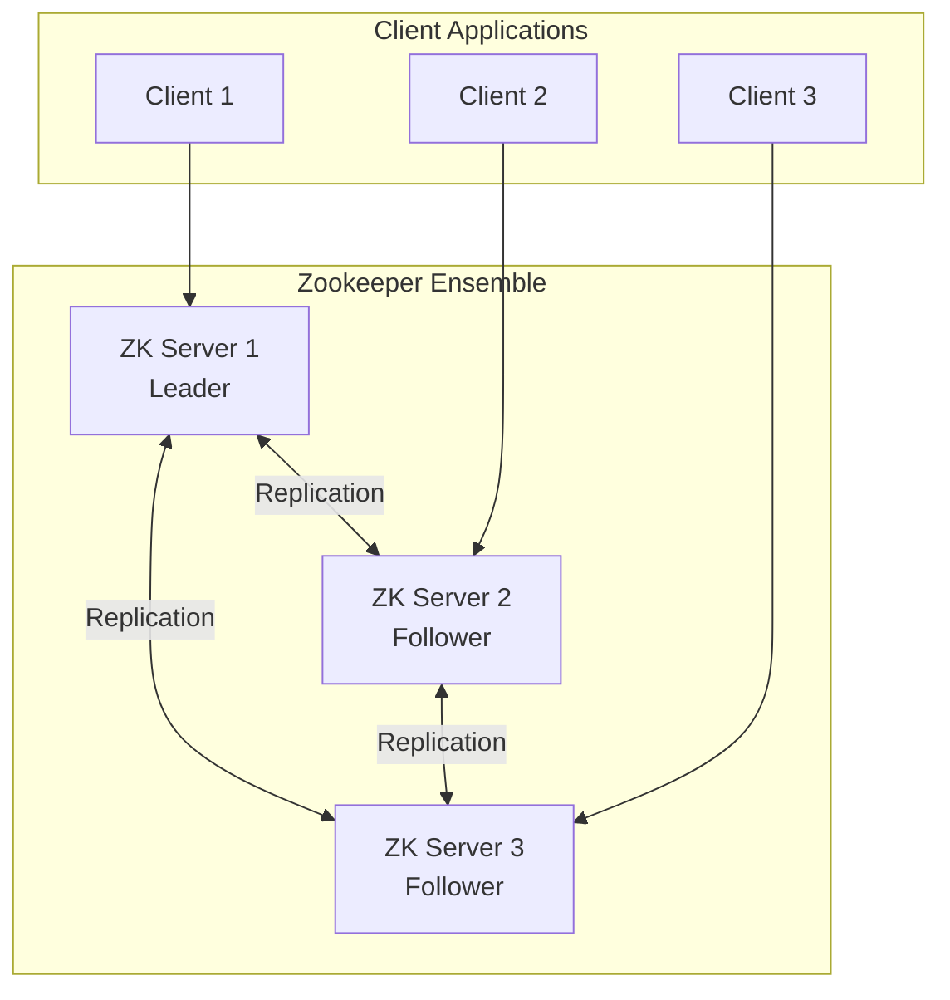

# How to Configure Zookeeper for Coordination

Author: [nawazdhandala](https://www.github.com/nawazdhandala)

Tags: Zookeeper, Apache Zookeeper, Distributed Systems, Coordination, Configuration, Kafka

Description: A practical guide to configuring Apache Zookeeper for distributed coordination. Learn how to set up Zookeeper ensembles, manage configuration, and implement common coordination patterns.

---

> Apache Zookeeper is a centralized service for maintaining configuration information, naming, and providing distributed synchronization. It powers critical infrastructure like Apache Kafka, Hadoop, and many other distributed systems.

Zookeeper provides a hierarchical namespace similar to a filesystem, where each node (called a znode) can store data and have children. This simple model supports complex coordination patterns like leader election, distributed locks, and configuration management.

---

## Prerequisites

Before we begin, ensure you have:
- Java 8 or higher installed
- At least three servers for production (one for development)
- Network connectivity between all Zookeeper nodes
- Sufficient disk space for transaction logs

---

## Installing Zookeeper

### Download and Extract

```bash
# Download Zookeeper (adjust version as needed)
wget https://downloads.apache.org/zookeeper/zookeeper-3.9.1/apache-zookeeper-3.9.1-bin.tar.gz

# Extract the archive
tar -xzf apache-zookeeper-3.9.1-bin.tar.gz

# Move to standard location
sudo mv apache-zookeeper-3.9.1-bin /opt/zookeeper

# Create symbolic link for easier upgrades
sudo ln -s /opt/zookeeper /opt/zookeeper-current
```

### Docker Installation

For quick setups, use the official Docker image:

```bash
# Single node for development
docker run -d \
  --name zookeeper \
  -p 2181:2181 \
  -e ZOO_MY_ID=1 \
  zookeeper:3.9

# Verify it's running
docker exec zookeeper zkCli.sh -server localhost:2181 stat
```

---

## Single Node Configuration

Create the configuration file for a standalone Zookeeper instance:

```properties
# /opt/zookeeper/conf/zoo.cfg
# Zookeeper standalone configuration

# The basic time unit in milliseconds
# Used for heartbeats and session timeouts
tickTime=2000

# Directory for storing in-memory database snapshots
# Also holds transaction logs unless dataLogDir is specified
dataDir=/var/lib/zookeeper/data

# Separate directory for transaction logs (recommended)
# Placing logs on a dedicated disk improves performance
dataLogDir=/var/lib/zookeeper/logs

# Port for client connections
clientPort=2181

# Maximum client connections per IP (0 = unlimited)
maxClientCnxns=60

# Disable admin server in standalone mode
admin.enableServer=false
```

Create the data directories and start Zookeeper:

```bash
# Create directories
sudo mkdir -p /var/lib/zookeeper/data
sudo mkdir -p /var/lib/zookeeper/logs

# Set ownership
sudo chown -R zookeeper:zookeeper /var/lib/zookeeper

# Start Zookeeper
/opt/zookeeper/bin/zkServer.sh start

# Check status
/opt/zookeeper/bin/zkServer.sh status
```

---

## Ensemble Configuration (Production)

For production, run a Zookeeper ensemble with an odd number of nodes (3, 5, or 7):

```properties
# /opt/zookeeper/conf/zoo.cfg
# Zookeeper ensemble configuration

tickTime=2000
dataDir=/var/lib/zookeeper/data
dataLogDir=/var/lib/zookeeper/logs
clientPort=2181

# Number of ticks for initial sync phase
# Followers must sync with leader within this time
initLimit=10

# Number of ticks for sync during operation
# If follower falls behind by more than this, it's dropped
syncLimit=5

# Ensemble members
# Format: server.id=hostname:peer_port:election_port
server.1=zk1.example.com:2888:3888
server.2=zk2.example.com:2888:3888
server.3=zk3.example.com:2888:3888

# Enable four-letter-word commands (needed for monitoring)
4lw.commands.whitelist=stat,ruok,conf,isro

# Autopurge settings for transaction log cleanup
autopurge.snapRetainCount=5
autopurge.purgeInterval=24
```

Each server needs a unique ID file:

```bash
# On server 1 (zk1.example.com)
echo "1" > /var/lib/zookeeper/data/myid

# On server 2 (zk2.example.com)
echo "2" > /var/lib/zookeeper/data/myid

# On server 3 (zk3.example.com)
echo "3" > /var/lib/zookeeper/data/myid
```

---

## Ensemble Architecture



---

## Creating a Systemd Service

```ini
# /etc/systemd/system/zookeeper.service
[Unit]
Description=Apache Zookeeper Server
Documentation=https://zookeeper.apache.org
After=network.target

[Service]
Type=forking
User=zookeeper
Group=zookeeper
Environment=JAVA_HOME=/usr/lib/jvm/java-11-openjdk
ExecStart=/opt/zookeeper/bin/zkServer.sh start
ExecStop=/opt/zookeeper/bin/zkServer.sh stop
ExecReload=/opt/zookeeper/bin/zkServer.sh restart
Restart=on-failure
RestartSec=10

[Install]
WantedBy=multi-user.target
```

Enable and start the service:

```bash
sudo systemctl daemon-reload
sudo systemctl enable zookeeper
sudo systemctl start zookeeper
sudo systemctl status zookeeper
```

---

## Using the Zookeeper CLI

Connect to Zookeeper and perform basic operations:

```bash
# Start the CLI
/opt/zookeeper/bin/zkCli.sh -server localhost:2181

# Inside the CLI:

# List root znodes
ls /

# Create a znode with data
create /myapp "application config"

# Create a child znode
create /myapp/database "host=db.example.com"

# Read znode data
get /myapp/database

# Update znode data
set /myapp/database "host=newdb.example.com"

# Check znode stats
stat /myapp

# Create an ephemeral node (deleted when session ends)
create -e /myapp/workers/worker1 "192.168.1.10"

# Create a sequential node (automatically numbered)
create -s /myapp/queue/item "task data"

# Delete a znode
delete /myapp/database

# Delete recursively
deleteall /myapp

# Quit the CLI
quit
```

---

## Java Client Example

```java
import org.apache.zookeeper.*;
import org.apache.zookeeper.data.Stat;
import java.util.concurrent.CountDownLatch;

public class ZookeeperClient {
    private static final String CONNECTION_STRING = "localhost:2181";
    private static final int SESSION_TIMEOUT = 5000;
    private ZooKeeper zookeeper;
    private CountDownLatch connectedSignal = new CountDownLatch(1);

    /**
     * Connect to the Zookeeper ensemble.
     * Waits for connection to be established before returning.
     */
    public void connect() throws Exception {
        zookeeper = new ZooKeeper(CONNECTION_STRING, SESSION_TIMEOUT,
            event -> {
                // Notify when connected
                if (event.getState() == Watcher.Event.KeeperState.SyncConnected) {
                    connectedSignal.countDown();
                }
            });

        // Wait for connection
        connectedSignal.await();
        System.out.println("Connected to Zookeeper");
    }

    /**
     * Create a persistent znode with the given path and data.
     */
    public String createNode(String path, byte[] data) throws Exception {
        return zookeeper.create(
            path,
            data,
            ZooDefs.Ids.OPEN_ACL_UNSAFE,  // No authentication required
            CreateMode.PERSISTENT          // Node survives session end
        );
    }

    /**
     * Create an ephemeral node that is deleted when session ends.
     * Useful for tracking active workers or sessions.
     */
    public String createEphemeralNode(String path, byte[] data) throws Exception {
        return zookeeper.create(
            path,
            data,
            ZooDefs.Ids.OPEN_ACL_UNSAFE,
            CreateMode.EPHEMERAL
        );
    }

    /**
     * Read data from a znode.
     * Returns null if node doesn't exist.
     */
    public byte[] getData(String path) throws Exception {
        Stat stat = zookeeper.exists(path, false);
        if (stat == null) {
            return null;
        }
        return zookeeper.getData(path, false, stat);
    }

    /**
     * Update data in an existing znode.
     * Uses version -1 to update regardless of current version.
     */
    public void setData(String path, byte[] data) throws Exception {
        zookeeper.setData(path, data, -1);
    }

    /**
     * Watch a znode for changes.
     * Callback is triggered once when data changes.
     */
    public void watchNode(String path, Watcher watcher) throws Exception {
        zookeeper.getData(path, watcher, null);
    }

    /**
     * Close the connection to Zookeeper.
     */
    public void close() throws Exception {
        if (zookeeper != null) {
            zookeeper.close();
        }
    }

    public static void main(String[] args) throws Exception {
        ZookeeperClient client = new ZookeeperClient();
        client.connect();

        // Create configuration node
        client.createNode("/config", "root".getBytes());
        client.createNode("/config/database", "host=localhost".getBytes());

        // Read configuration
        byte[] data = client.getData("/config/database");
        System.out.println("Database config: " + new String(data));

        // Watch for changes
        client.watchNode("/config/database", event -> {
            System.out.println("Config changed: " + event.getType());
        });

        // Update configuration
        client.setData("/config/database", "host=newhost.com".getBytes());

        client.close();
    }
}
```

---

## Python Client Example

```python
from kazoo.client import KazooClient
from kazoo.recipe.watchers import DataWatch
import logging

# Set up logging
logging.basicConfig(level=logging.INFO)

class ZookeeperConfig:
    """
    Configuration manager using Zookeeper for storage and distribution.
    """

    def __init__(self, hosts='localhost:2181'):
        self.zk = KazooClient(hosts=hosts)
        self.zk.start()

    def ensure_path(self, path):
        """Create path if it doesn't exist."""
        self.zk.ensure_path(path)

    def set_config(self, path, value):
        """
        Store configuration value at the given path.
        Creates the path if it doesn't exist.
        """
        # Ensure parent path exists
        self.ensure_path('/'.join(path.split('/')[:-1]))

        if self.zk.exists(path):
            self.zk.set(path, value.encode())
        else:
            self.zk.create(path, value.encode())

    def get_config(self, path):
        """
        Retrieve configuration value from path.
        Returns None if path doesn't exist.
        """
        if not self.zk.exists(path):
            return None

        data, stat = self.zk.get(path)
        return data.decode() if data else None

    def watch_config(self, path, callback):
        """
        Watch a configuration path for changes.
        Callback receives (data, stat) when path changes.
        """
        @DataWatch(self.zk, path)
        def watch_node(data, stat):
            if data:
                callback(data.decode(), stat)

    def list_children(self, path):
        """List all child nodes under path."""
        if not self.zk.exists(path):
            return []
        return self.zk.get_children(path)

    def close(self):
        """Close connection to Zookeeper."""
        self.zk.stop()
        self.zk.close()


# Usage example
config = ZookeeperConfig('localhost:2181')

# Store configuration
config.set_config('/app/settings/log_level', 'INFO')
config.set_config('/app/settings/max_connections', '100')
config.set_config('/app/settings/timeout', '30')

# Read configuration
log_level = config.get_config('/app/settings/log_level')
print(f"Log level: {log_level}")

# Watch for changes
def on_config_change(data, stat):
    print(f"Configuration changed to: {data}")

config.watch_config('/app/settings/log_level', on_config_change)

# List all settings
children = config.list_children('/app/settings')
print(f"Settings: {children}")

config.close()
```

---

## Monitoring Zookeeper

### Four Letter Words Commands

```bash
# Check if server is running
echo ruok | nc localhost 2181

# Get server stats
echo stat | nc localhost 2181

# Get configuration
echo conf | nc localhost 2181

# Check if read-only mode
echo isro | nc localhost 2181

# Monitor for changes
echo mntr | nc localhost 2181
```

### JMX Monitoring

Enable JMX for detailed metrics:

```bash
# Add to zookeeper-env.sh
export JVMFLAGS="-Dcom.sun.management.jmxremote \
  -Dcom.sun.management.jmxremote.port=9999 \
  -Dcom.sun.management.jmxremote.authenticate=false \
  -Dcom.sun.management.jmxremote.ssl=false"
```

---

## Best Practices

1. **Use odd number of nodes** (3, 5, or 7) for proper leader election
2. **Separate data and log directories** on different disks for performance
3. **Enable autopurge** to prevent disk space exhaustion
4. **Monitor session counts** and connection limits
5. **Set appropriate timeouts** based on network latency
6. **Use ephemeral nodes** for service registration and health tracking

---

## Conclusion

Zookeeper provides a reliable foundation for distributed coordination. While newer alternatives like etcd exist, Zookeeper remains widely used and battle-tested in production environments running Kafka, Hadoop, and many other systems.

Key takeaways:
- Use ensembles with odd numbers for fault tolerance
- Ephemeral nodes are great for tracking active services
- Watches enable reactive configuration management
- Proper monitoring prevents operational issues

With Zookeeper configured correctly, you have a solid foundation for building distributed systems that require coordination and configuration management.

---

*Running Zookeeper in production? [OneUptime](https://oneuptime.com) provides monitoring and alerting for your Zookeeper ensemble and the applications that depend on it.*
