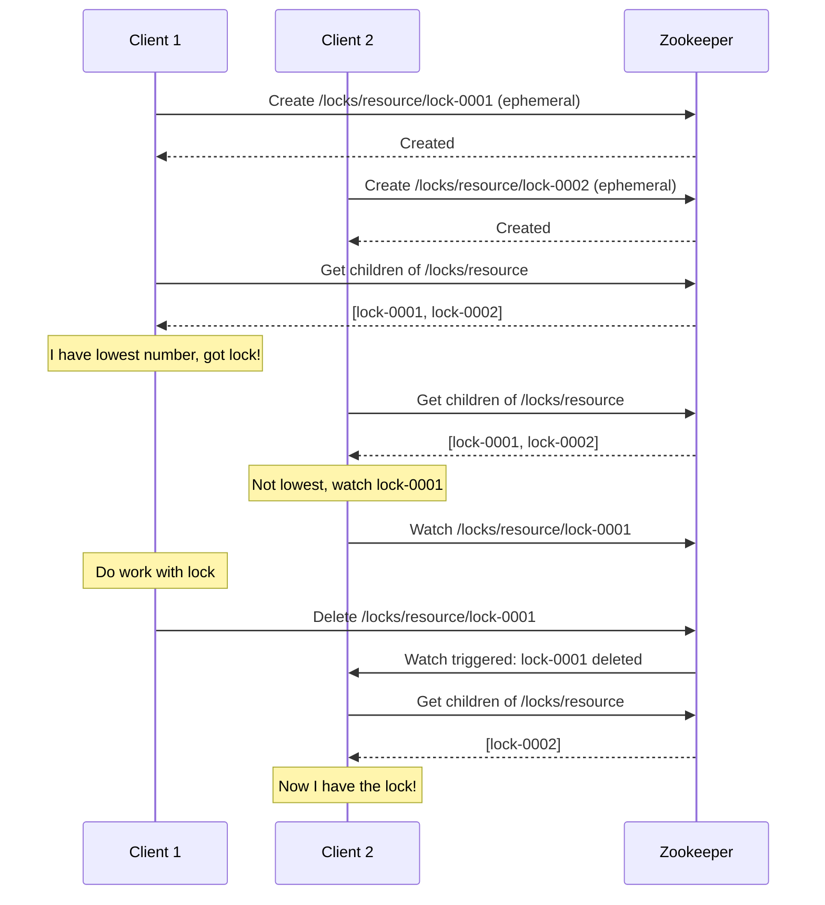

# How to Implement Distributed Locking with Zookeeper

Author: [nawazdhandala](https://www.github.com/nawazdhandala)

Tags: Zookeeper, Distributed Locking, Coordination, Apache Zookeeper, Java, Concurrency

Description: Learn how to implement distributed locks using Apache Zookeeper. This guide covers exclusive locks, read-write locks, and the recipes for building reliable distributed coordination.

---

> Distributed locking is essential when multiple processes across different machines need to coordinate access to shared resources. Zookeeper provides the primitives needed to build reliable distributed locks that survive failures.

Unlike local locks, distributed locks must handle network partitions, process crashes, and partial failures. Zookeeper's ephemeral nodes and sequential ordering make it well-suited for implementing locks that automatically release when the holding process fails.

---

## Prerequisites

Before we begin, ensure you have:
- Zookeeper cluster running
- Java or Python environment
- Basic understanding of Zookeeper znodes

---

## How Distributed Locking Works

Zookeeper distributed locks use these concepts:

1. **Ephemeral nodes** - Automatically deleted when session ends
2. **Sequential nodes** - Globally ordered creation
3. **Watches** - Notifications when nodes change

The lock algorithm:
1. Create an ephemeral sequential node under the lock path
2. Get all children and check if you have the lowest sequence number
3. If yes, you have the lock
4. If no, watch the node with the next lower sequence number
5. When notified, repeat from step 2

---

## Lock Flow Diagram



---

## Java Implementation with Curator

Apache Curator provides high-level recipes for Zookeeper, including distributed locks:

```java
package com.example.locks;

import org.apache.curator.framework.CuratorFramework;
import org.apache.curator.framework.CuratorFrameworkFactory;
import org.apache.curator.framework.recipes.locks.InterProcessMutex;
import org.apache.curator.retry.ExponentialBackoffRetry;

import java.util.concurrent.TimeUnit;

public class DistributedLockExample {

    private final CuratorFramework client;
    private final InterProcessMutex lock;
    private final String lockPath;

    public DistributedLockExample(String connectionString, String lockPath) {
        // Create Curator client with retry policy
        this.client = CuratorFrameworkFactory.newClient(
            connectionString,
            new ExponentialBackoffRetry(1000, 3)
        );
        this.client.start();

        this.lockPath = lockPath;
        // Create the distributed lock
        this.lock = new InterProcessMutex(client, lockPath);
    }

    /**
     * Acquire the lock, blocking until available.
     */
    public void acquire() throws Exception {
        lock.acquire();
        System.out.println("Lock acquired by " + Thread.currentThread().getName());
    }

    /**
     * Acquire the lock with a timeout.
     * Returns true if lock was acquired, false if timeout.
     */
    public boolean acquire(long time, TimeUnit unit) throws Exception {
        boolean acquired = lock.acquire(time, unit);
        if (acquired) {
            System.out.println("Lock acquired by " + Thread.currentThread().getName());
        } else {
            System.out.println("Failed to acquire lock within timeout");
        }
        return acquired;
    }

    /**
     * Release the lock.
     */
    public void release() throws Exception {
        lock.release();
        System.out.println("Lock released by " + Thread.currentThread().getName());
    }

    /**
     * Execute a task while holding the lock.
     */
    public void withLock(Runnable task) throws Exception {
        acquire();
        try {
            task.run();
        } finally {
            release();
        }
    }

    /**
     * Check if current thread holds the lock.
     */
    public boolean isHeldByCurrentThread() {
        return lock.isOwnedByCurrentThread();
    }

    public void close() {
        client.close();
    }

    public static void main(String[] args) throws Exception {
        DistributedLockExample lockExample = new DistributedLockExample(
            "localhost:2181",
            "/locks/my-resource"
        );

        // Use the lock
        lockExample.withLock(() -> {
            System.out.println("Executing critical section...");
            try {
                Thread.sleep(5000);
            } catch (InterruptedException e) {
                Thread.currentThread().interrupt();
            }
            System.out.println("Critical section complete");
        });

        lockExample.close();
    }
}
```

---

## Manual Lock Implementation (Java)

For understanding the algorithm, here's a manual implementation:

```java
package com.example.locks;

import org.apache.zookeeper.*;
import org.apache.zookeeper.data.Stat;

import java.util.Collections;
import java.util.List;
import java.util.concurrent.CountDownLatch;

public class SimpleDistributedLock implements Watcher {

    private final ZooKeeper zk;
    private final String lockPath;
    private String lockNode;
    private CountDownLatch lockLatch;

    public SimpleDistributedLock(ZooKeeper zk, String lockPath) throws Exception {
        this.zk = zk;
        this.lockPath = lockPath;

        // Ensure lock parent path exists
        ensurePath(lockPath);
    }

    private void ensurePath(String path) throws Exception {
        Stat stat = zk.exists(path, false);
        if (stat == null) {
            try {
                zk.create(path, new byte[0], ZooDefs.Ids.OPEN_ACL_UNSAFE, CreateMode.PERSISTENT);
            } catch (KeeperException.NodeExistsException e) {
                // Path was created by another process, that's fine
            }
        }
    }

    /**
     * Acquire the distributed lock.
     * Blocks until the lock is acquired.
     */
    public void acquire() throws Exception {
        // Create ephemeral sequential node
        lockNode = zk.create(
            lockPath + "/lock-",
            new byte[0],
            ZooDefs.Ids.OPEN_ACL_UNSAFE,
            CreateMode.EPHEMERAL_SEQUENTIAL
        );

        // Extract just the node name
        String lockNodeName = lockNode.substring(lockPath.length() + 1);

        while (true) {
            // Get all lock nodes
            List<String> children = zk.getChildren(lockPath, false);
            Collections.sort(children);

            // Check if we have the lowest sequence number
            if (lockNodeName.equals(children.get(0))) {
                // We have the lock!
                return;
            }

            // Find the node just before us
            int ourIndex = children.indexOf(lockNodeName);
            String nodeToWatch = children.get(ourIndex - 1);

            // Watch that node
            lockLatch = new CountDownLatch(1);
            Stat stat = zk.exists(lockPath + "/" + nodeToWatch, this);

            if (stat == null) {
                // Node was already deleted, try again
                continue;
            }

            // Wait for the watch to trigger
            lockLatch.await();
        }
    }

    /**
     * Release the lock.
     */
    public void release() throws Exception {
        if (lockNode != null) {
            zk.delete(lockNode, -1);
            lockNode = null;
        }
    }

    @Override
    public void process(WatchedEvent event) {
        if (event.getType() == Event.EventType.NodeDeleted) {
            // The node we were watching was deleted
            if (lockLatch != null) {
                lockLatch.countDown();
            }
        }
    }

    public static void main(String[] args) throws Exception {
        // Connect to Zookeeper
        CountDownLatch connectedLatch = new CountDownLatch(1);
        ZooKeeper zk = new ZooKeeper("localhost:2181", 5000, event -> {
            if (event.getState() == Watcher.Event.KeeperState.SyncConnected) {
                connectedLatch.countDown();
            }
        });
        connectedLatch.await();

        // Create and use the lock
        SimpleDistributedLock lock = new SimpleDistributedLock(zk, "/locks/mylock");

        try {
            System.out.println("Acquiring lock...");
            lock.acquire();
            System.out.println("Lock acquired!");

            // Critical section
            Thread.sleep(5000);

        } finally {
            System.out.println("Releasing lock...");
            lock.release();
        }

        zk.close();
    }
}
```

---

## Python Implementation with Kazoo

```python
from kazoo.client import KazooClient
from kazoo.recipe.lock import Lock
import time
import threading
import logging

logging.basicConfig(level=logging.INFO)
logger = logging.getLogger(__name__)

class DistributedLock:
    """
    Distributed lock implementation using Kazoo.
    Provides automatic lock release on session loss.
    """

    def __init__(self, hosts='localhost:2181', lock_path='/locks/default'):
        self.zk = KazooClient(hosts=hosts)
        self.zk.start()
        self.lock = Lock(self.zk, lock_path)
        self.lock_path = lock_path

    def acquire(self, timeout=None, blocking=True):
        """
        Acquire the lock.

        Args:
            timeout: Maximum seconds to wait (None for infinite)
            blocking: If False, return immediately if lock unavailable

        Returns:
            True if lock acquired, False otherwise
        """
        try:
            acquired = self.lock.acquire(blocking=blocking, timeout=timeout)
            if acquired:
                logger.info(f"Lock acquired: {self.lock_path}")
            return acquired
        except Exception as e:
            logger.error(f"Failed to acquire lock: {e}")
            return False

    def release(self):
        """Release the lock."""
        try:
            self.lock.release()
            logger.info(f"Lock released: {self.lock_path}")
        except Exception as e:
            logger.error(f"Failed to release lock: {e}")

    def is_acquired(self):
        """Check if lock is currently held."""
        return self.lock.is_acquired

    def __enter__(self):
        """Context manager entry."""
        self.acquire()
        return self

    def __exit__(self, exc_type, exc_val, exc_tb):
        """Context manager exit."""
        self.release()
        return False

    def close(self):
        """Close the Zookeeper connection."""
        self.zk.stop()
        self.zk.close()


def worker(worker_id, lock_path):
    """Worker function that uses the distributed lock."""
    lock = DistributedLock(lock_path=lock_path)

    for i in range(3):
        logger.info(f"Worker {worker_id}: Attempting to acquire lock...")

        with lock:
            logger.info(f"Worker {worker_id}: Got lock! Doing work...")
            time.sleep(2)
            logger.info(f"Worker {worker_id}: Work complete")

        time.sleep(1)

    lock.close()


if __name__ == '__main__':
    # Demonstrate multiple workers competing for the lock
    threads = []

    for i in range(3):
        t = threading.Thread(target=worker, args=(i, '/locks/shared-resource'))
        threads.append(t)
        t.start()

    for t in threads:
        t.join()

    logger.info("All workers complete")
```

---

## Read-Write Lock

For scenarios where multiple readers can hold the lock simultaneously:

```python
from kazoo.client import KazooClient
from kazoo.recipe.lock import Lock
import time

class ReadWriteLock:
    """
    Distributed read-write lock.
    Multiple readers can hold the lock simultaneously.
    Writers get exclusive access.
    """

    def __init__(self, zk, lock_path):
        self.zk = zk
        self.lock_path = lock_path
        self.read_lock = Lock(zk, f"{lock_path}/read")
        self.write_lock = Lock(zk, f"{lock_path}/write")

        # Ensure paths exist
        zk.ensure_path(lock_path)

    def acquire_read(self, timeout=None):
        """
        Acquire read lock.
        Blocks if a writer holds the lock.
        Multiple readers can hold simultaneously.
        """
        # Wait for no active writers
        while True:
            # Check if write lock is held
            write_children = self.zk.get_children(f"{self.lock_path}/write")
            if not write_children:
                break
            time.sleep(0.1)

        return self.read_lock.acquire(timeout=timeout)

    def release_read(self):
        """Release read lock."""
        self.read_lock.release()

    def acquire_write(self, timeout=None):
        """
        Acquire write lock.
        Blocks until all readers and writers release.
        """
        # First acquire write lock to block new readers
        if not self.write_lock.acquire(timeout=timeout):
            return False

        # Wait for all readers to finish
        while True:
            read_children = self.zk.get_children(f"{self.lock_path}/read")
            if not read_children:
                break
            time.sleep(0.1)

        return True

    def release_write(self):
        """Release write lock."""
        self.write_lock.release()


# Usage example
zk = KazooClient(hosts='localhost:2181')
zk.start()

rwlock = ReadWriteLock(zk, '/locks/database-table')

# Reader
def reader_task():
    rwlock.acquire_read()
    try:
        print("Reading data...")
        time.sleep(1)
    finally:
        rwlock.release_read()

# Writer
def writer_task():
    rwlock.acquire_write()
    try:
        print("Writing data...")
        time.sleep(2)
    finally:
        rwlock.release_write()
```

---

## Lock with Timeout and Retry

```java
package com.example.locks;

import org.apache.curator.framework.CuratorFramework;
import org.apache.curator.framework.recipes.locks.InterProcessMutex;

import java.util.concurrent.TimeUnit;

public class LockWithRetry {

    private final InterProcessMutex lock;
    private final int maxRetries;
    private final long retryDelay;

    public LockWithRetry(CuratorFramework client, String path, int maxRetries, long retryDelayMs) {
        this.lock = new InterProcessMutex(client, path);
        this.maxRetries = maxRetries;
        this.retryDelay = retryDelayMs;
    }

    /**
     * Acquire lock with retries on failure.
     */
    public boolean acquireWithRetry(long timeout, TimeUnit unit) throws Exception {
        int attempts = 0;

        while (attempts < maxRetries) {
            try {
                if (lock.acquire(timeout, unit)) {
                    return true;
                }
            } catch (Exception e) {
                System.err.println("Lock attempt " + (attempts + 1) + " failed: " + e.getMessage());
            }

            attempts++;
            if (attempts < maxRetries) {
                Thread.sleep(retryDelay);
            }
        }

        return false;
    }

    /**
     * Execute with lock and automatic cleanup.
     */
    public <T> T executeWithLock(LockTask<T> task, long timeout, TimeUnit unit) throws Exception {
        if (!acquireWithRetry(timeout, unit)) {
            throw new RuntimeException("Failed to acquire lock after " + maxRetries + " attempts");
        }

        try {
            return task.execute();
        } finally {
            lock.release();
        }
    }

    @FunctionalInterface
    public interface LockTask<T> {
        T execute() throws Exception;
    }
}
```

---

## Best Practices

1. **Always use ephemeral nodes** so locks release on process death
2. **Handle session expiration** by re-acquiring the lock
3. **Set appropriate timeouts** to avoid deadlocks
4. **Use Curator or Kazoo** instead of raw Zookeeper API
5. **Test failure scenarios** including network partitions
6. **Monitor lock contention** for performance tuning

---

## Conclusion

Distributed locking with Zookeeper provides reliable coordination for distributed systems. The combination of ephemeral nodes and sequential ordering ensures locks are released on failure and acquired fairly.

Key takeaways:
- Ephemeral sequential nodes form the basis of distributed locks
- Watches avoid polling and reduce latency
- Curator/Kazoo provide battle-tested implementations
- Read-write locks allow concurrent readers

With distributed locks in place, your applications can safely coordinate access to shared resources across multiple machines.

---

*Building distributed systems with Zookeeper? [OneUptime](https://oneuptime.com) provides monitoring for your coordination infrastructure and the applications that depend on it.*
