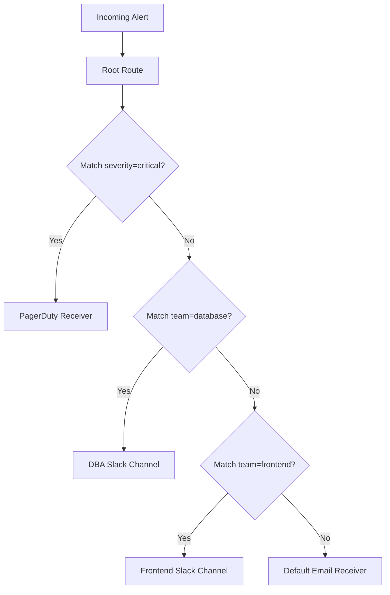
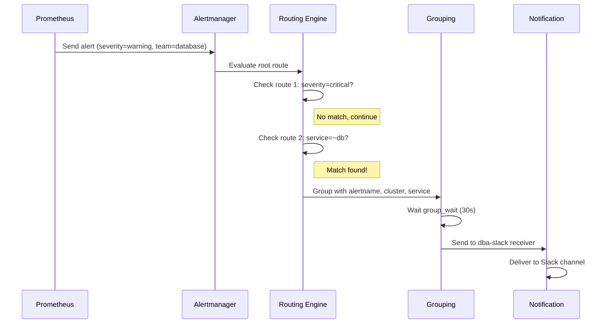
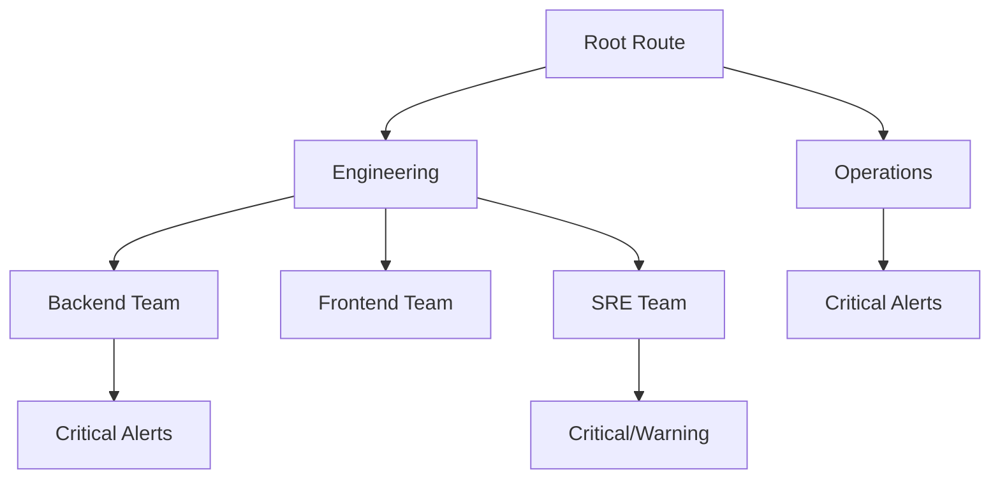
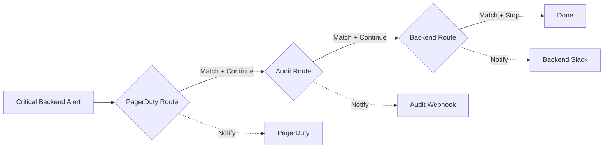

# How to Configure Alertmanager Routing

Author: [nawazdhandala](https://www.github.com/nawazdhandala)

Tags: Alertmanager, Prometheus, Monitoring, Alerting, DevOps

Description: Learn how to configure Alertmanager routing rules to send alerts to the right teams with grouping, throttling, and receiver configuration.

---

## Understanding Alertmanager Routing

Alertmanager routing determines which team or notification channel receives each alert. The routing configuration uses a tree structure where alerts flow through nodes until they match a route. Each route can have child routes, enabling complex routing logic based on alert labels.

The routing system handles three main concerns:

- **Matching**: Determining which alerts go to which receivers
- **Grouping**: Combining related alerts into single notifications
- **Throttling**: Controlling notification frequency to prevent alert fatigue

## How the Routing Tree Works

The routing tree starts with a root route that defines default behavior. Child routes inherit settings from their parent unless explicitly overridden. Alerts traverse the tree from top to bottom, and the first matching route handles the alert.



## Basic Routing Configuration

Here is a complete routing configuration that demonstrates the essential components:

```yaml
# alertmanager.yml
# This configuration routes alerts based on severity and team ownership

global:
  # Time to wait before marking an alert as resolved if no update received
  resolve_timeout: 5m

route:
  # Default receiver when no child routes match
  receiver: 'default-notifications'

  # Labels used to group alerts together
  # Alerts with the same values for these labels become one notification
  group_by: ['alertname', 'cluster', 'service']

  # Wait time before sending the first notification for a new group
  # Allows time for related alerts to arrive and be grouped together
  group_wait: 30s

  # Minimum time between notifications for the same group
  # Prevents flooding when new alerts join an existing group
  group_interval: 5m

  # Time to wait before re-sending a notification for an unchanged group
  # Controls how often teams get reminded about ongoing issues
  repeat_interval: 4h

  # Child routes evaluated in order (first match wins)
  routes:
    # Route 1: Critical production alerts need immediate attention
    - receiver: 'ops-pagerduty'
      matchers:
        - severity = critical
        - environment = production

    # Route 2: Database team handles all database-related alerts
    - receiver: 'dba-slack'
      matchers:
        - service =~ "postgres|mysql|redis|mongodb"

    # Route 3: Platform team alerts
    - receiver: 'platform-slack'
      matchers:
        - team = platform

receivers:
  - name: 'default-notifications'
    email_configs:
      - to: 'ops@example.com'

  - name: 'ops-pagerduty'
    pagerduty_configs:
      - routing_key: 'your-pagerduty-key'

  - name: 'dba-slack'
    slack_configs:
      - channel: '#dba-alerts'
        api_url: 'https://hooks.slack.com/services/XXX/YYY/ZZZ'

  - name: 'platform-slack'
    slack_configs:
      - channel: '#platform-alerts'
        api_url: 'https://hooks.slack.com/services/XXX/YYY/ZZZ'
```

## Routing Matchers Explained

Matchers determine which alerts a route handles. Alertmanager supports several matching operators:

```yaml
routes:
  # Exact match: severity must equal "critical"
  - receiver: 'critical-alerts'
    matchers:
      - severity = critical

  # Negation: severity must NOT equal "info"
  - receiver: 'important-alerts'
    matchers:
      - severity != info

  # Regex match: service name contains "db" anywhere
  - receiver: 'database-alerts'
    matchers:
      - service =~ ".*db.*"

  # Negative regex: service does NOT match pattern
  - receiver: 'non-database-alerts'
    matchers:
      - service !~ ".*db.*"

  # Multiple matchers: ALL conditions must be true (AND logic)
  - receiver: 'prod-critical'
    matchers:
      - severity = critical
      - environment = production
      - team = backend
```

## Alert Flow Through Routes

This diagram shows how a sample alert flows through the routing tree:



## Nested Routes for Complex Organizations

Large organizations often need hierarchical routing. Child routes can have their own child routes, creating a tree structure:

```yaml
route:
  receiver: 'default'
  group_by: ['alertname']
  routes:
    # Engineering department
    - receiver: 'engineering-default'
      matchers:
        - department = engineering
      routes:
        # Backend team within engineering
        - receiver: 'backend-slack'
          matchers:
            - team = backend
          routes:
            # Critical backend alerts also page
            - receiver: 'backend-pagerduty'
              matchers:
                - severity = critical

        # Frontend team within engineering
        - receiver: 'frontend-slack'
          matchers:
            - team = frontend

        # SRE team within engineering
        - receiver: 'sre-slack'
          matchers:
            - team = sre
          routes:
            - receiver: 'sre-pagerduty'
              matchers:
                - severity =~ "critical|warning"

    # Operations department
    - receiver: 'ops-default'
      matchers:
        - department = operations
      routes:
        - receiver: 'ops-pagerduty'
          matchers:
            - severity = critical
```

This structure creates the following routing hierarchy:



## The Continue Flag

By default, routing stops at the first matching route. The `continue` flag changes this behavior, allowing an alert to match multiple routes:

```yaml
route:
  receiver: 'default'
  routes:
    # Send all critical alerts to PagerDuty
    - receiver: 'pagerduty-critical'
      matchers:
        - severity = critical
      continue: true  # Keep evaluating more routes

    # Also send critical alerts to the audit log
    - receiver: 'audit-webhook'
      matchers:
        - severity = critical
      continue: true  # Keep evaluating

    # Team-specific routing (alert ends up here too)
    - receiver: 'backend-slack'
      matchers:
        - team = backend

    - receiver: 'frontend-slack'
      matchers:
        - team = frontend
```

With `continue: true`, a critical backend alert will:

1. Match the PagerDuty route (continue)
2. Match the audit webhook route (continue)
3. Match the backend-slack route (stop)



## Grouping Strategies

Effective grouping reduces notification volume while preserving context. Choose group labels based on how your team responds to incidents:

```yaml
route:
  receiver: 'default'

  # Group by alertname and service
  # All "HighMemory" alerts for "api-gateway" become one notification
  group_by: ['alertname', 'service']

  routes:
    # Database alerts: include instance for targeted response
    - receiver: 'dba-team'
      matchers:
        - service =~ "postgres|mysql"
      group_by: ['alertname', 'service', 'instance']

    # Infrastructure alerts: group by cluster for broad view
    - receiver: 'infra-team'
      matchers:
        - category = infrastructure
      group_by: ['alertname', 'cluster']

    # Business metrics: group loosely to see patterns
    - receiver: 'business-team'
      matchers:
        - category = business
      group_by: ['alertname']
```

## Timing Configuration

The timing parameters control notification behavior:

```yaml
route:
  receiver: 'default'

  # group_wait: How long to buffer alerts before first notification
  # Short value (10s): Faster notifications but potentially incomplete groups
  # Long value (60s): Complete groups but delayed response
  group_wait: 30s

  # group_interval: Minimum time between updates to the same group
  # Controls how quickly new alerts trigger additional notifications
  group_interval: 5m

  # repeat_interval: How often to resend for unchanged alerts
  # Balance between reminders and noise
  repeat_interval: 4h

  routes:
    # Critical alerts: Fast notification, frequent reminders
    - receiver: 'critical-pagerduty'
      matchers:
        - severity = critical
      group_wait: 10s
      group_interval: 1m
      repeat_interval: 1h

    # Info alerts: Batch together, infrequent reminders
    - receiver: 'info-email'
      matchers:
        - severity = info
      group_wait: 5m
      group_interval: 30m
      repeat_interval: 24h
```

## Time-Based Routing

Route alerts differently based on time of day or day of week using time intervals:

```yaml
# Define time intervals for routing decisions
time_intervals:
  - name: business-hours
    time_intervals:
      - weekdays: ['monday:friday']
        times:
          - start_time: '09:00'
            end_time: '17:00'

  - name: after-hours
    time_intervals:
      - weekdays: ['monday:friday']
        times:
          - start_time: '17:00'
            end_time: '09:00'
      - weekdays: ['saturday', 'sunday']

route:
  receiver: 'default'
  routes:
    # During business hours: route to team Slack
    - receiver: 'team-slack'
      matchers:
        - severity =~ "warning|critical"
      active_time_intervals:
        - business-hours

    # After hours: only page for critical
    - receiver: 'oncall-pagerduty'
      matchers:
        - severity = critical
      active_time_intervals:
        - after-hours

    # Mute non-critical after hours
    - receiver: 'null'
      matchers:
        - severity != critical
      mute_time_intervals:
        - business-hours
```

## Testing Your Routing Configuration

Before deploying, validate your routing logic using the Alertmanager API:

```bash
# Check configuration syntax
./amtool check-config alertmanager.yml

# Test which route an alert would match
./amtool config routes test \
  --config.file=alertmanager.yml \
  severity=critical \
  team=backend \
  environment=production

# Expected output:
# Routing tree:
# .
# └── default-receiver
#     ├── ops-pagerduty (match)
#     └── backend-slack
```

You can also send test alerts through the API:

```bash
# Send a test alert to verify routing
curl -X POST http://localhost:9093/api/v2/alerts \
  -H "Content-Type: application/json" \
  -d '[
    {
      "labels": {
        "alertname": "TestRoutingAlert",
        "severity": "warning",
        "team": "backend",
        "service": "api-gateway"
      },
      "annotations": {
        "summary": "This is a test alert for routing verification"
      },
      "startsAt": "2026-01-26T10:00:00Z"
    }
  ]'

# Check which alerts are active
curl http://localhost:9093/api/v2/alerts | jq '.'

# View current alert groups
curl http://localhost:9093/api/v2/alerts/groups | jq '.'
```

## Common Routing Patterns

### Pattern 1: Severity-Based Escalation

```yaml
route:
  receiver: 'default-email'
  routes:
    - receiver: 'slack-warnings'
      matchers:
        - severity = warning

    - receiver: 'slack-critical'
      matchers:
        - severity = critical
      continue: true

    - receiver: 'pagerduty-critical'
      matchers:
        - severity = critical
```

### Pattern 2: Service Ownership

```yaml
route:
  receiver: 'platform-default'
  routes:
    - receiver: 'team-payments'
      matchers:
        - service =~ "payments|billing|subscriptions"

    - receiver: 'team-auth'
      matchers:
        - service =~ "auth|identity|sso"

    - receiver: 'team-data'
      matchers:
        - service =~ "analytics|warehouse|etl"
```

### Pattern 3: Environment Separation

```yaml
route:
  receiver: 'dev-alerts'
  routes:
    - receiver: 'staging-slack'
      matchers:
        - environment = staging

    - receiver: 'production-slack'
      matchers:
        - environment = production
        - severity = warning

    - receiver: 'production-pagerduty'
      matchers:
        - environment = production
        - severity = critical
```

## Debugging Routing Issues

When alerts do not reach the expected receiver, follow these steps:

```bash
# 1. View active alerts and their labels
curl http://localhost:9093/api/v2/alerts | jq '.[] | {alertname: .labels.alertname, labels: .labels}'

# 2. Check how alerts are grouped
curl http://localhost:9093/api/v2/alerts/groups | jq '.[] | {receiver: .receiver.name, alerts: [.alerts[].labels.alertname]}'

# 3. View the routing tree
./amtool config routes show --config.file=alertmanager.yml

# 4. Test specific label combinations
./amtool config routes test --config.file=alertmanager.yml \
  alertname=HighCPU \
  severity=warning \
  team=backend
```

## Conclusion

Alertmanager routing enables precise control over alert delivery. Start with a simple configuration matching your team structure, then add complexity as needed. Test your routing rules before deployment, and regularly review whether alerts reach the right people. Good routing reduces noise while ensuring critical issues get immediate attention.

Key takeaways:

- Use the routing tree structure to match your organization
- Configure grouping to balance context with notification volume
- Set timing parameters based on alert urgency
- Test routing changes before deploying to production
- Use the continue flag when alerts need multiple receivers
