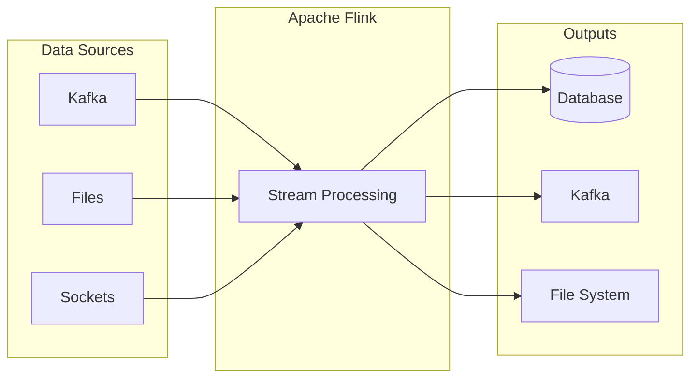
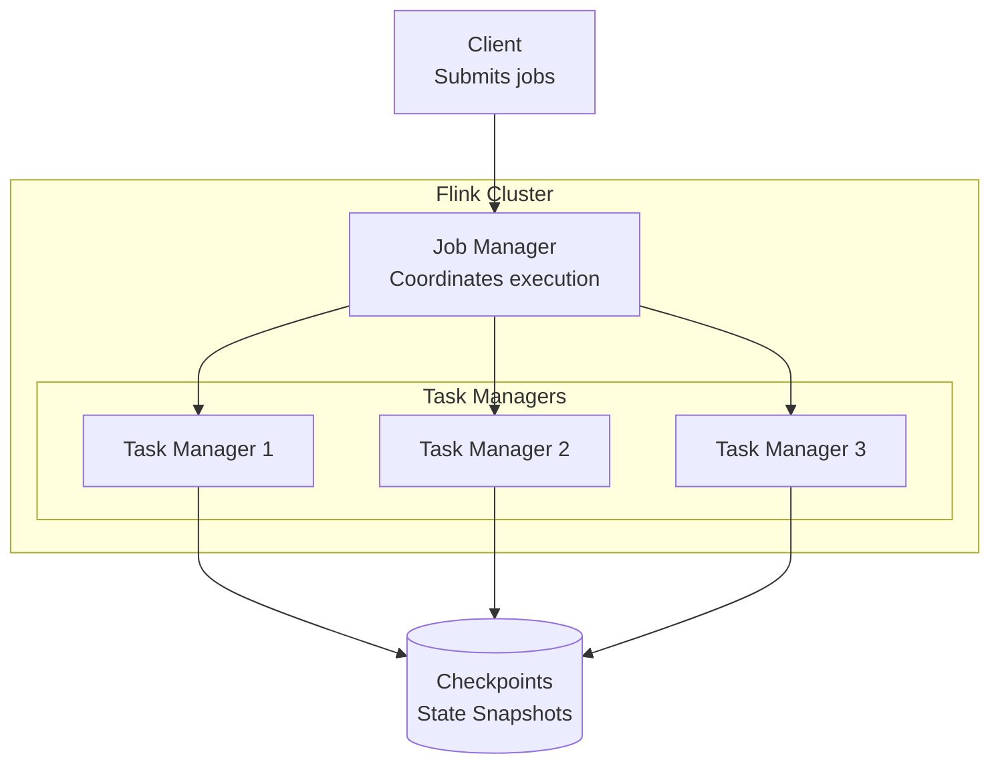
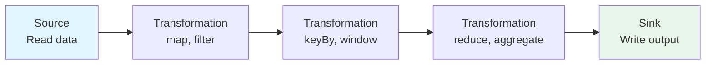
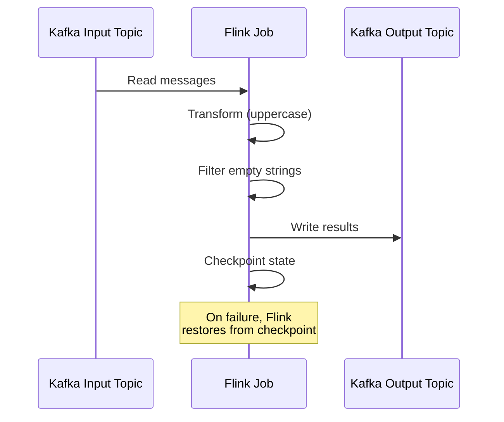
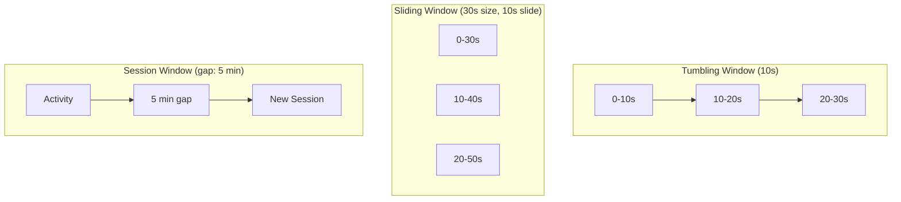

# How to Get Started with Apache Flink

Author: [nawazdhandala](https://www.github.com/nawazdhandala)

Tags: Apache Flink, Stream Processing, Real-Time, Big Data, Data Engineering

Description: A beginner's guide to Apache Flink for stream processing, covering DataStream API, windowing, state management, and Kafka integration.

---

Apache Flink is a distributed stream processing framework that handles both batch and real-time data. If you need to process millions of events per second with low latency and exactly-once guarantees, Flink is an excellent choice. This guide walks you through everything you need to know to get started.

---

## What is Apache Flink?

Flink is a framework for stateful computations over unbounded and bounded data streams. Unlike batch processing systems that wait for all data to arrive, Flink processes events as they happen.



### Key Features

- **True streaming**: Processes events one at a time, not in micro-batches
- **Exactly-once semantics**: Guarantees each event is processed exactly once
- **Event time processing**: Handles out-of-order events correctly
- **Stateful computations**: Maintains state across events efficiently
- **Fault tolerance**: Recovers from failures without data loss

---

## Flink Architecture

Before writing code, it helps to understand how Flink works under the hood.



- **Job Manager**: The coordinator that schedules tasks and manages checkpoints
- **Task Managers**: Worker nodes that execute the actual data processing
- **Checkpoints**: Periodic snapshots of state for fault tolerance

---

## Setting Up Your Development Environment

### Prerequisites

- Java 11 or higher
- Maven or Gradle
- An IDE (IntelliJ IDEA recommended)

### Maven Project Setup

Create a new Maven project with the following `pom.xml`:

```xml
<?xml version="1.0" encoding="UTF-8"?>
<project xmlns="http://maven.apache.org/POM/4.0.0"
         xmlns:xsi="http://www.w3.org/2001/XMLSchema-instance"
         xsi:schemaLocation="http://maven.apache.org/POM/4.0.0
         http://maven.apache.org/xsd/maven-4.0.0.xsd">
    <modelVersion>4.0.0</modelVersion>

    <groupId>com.example</groupId>
    <artifactId>flink-quickstart</artifactId>
    <version>1.0.0</version>
    <packaging>jar</packaging>

    <properties>
        <flink.version>1.18.1</flink.version>
        <java.version>11</java.version>
        <maven.compiler.source>${java.version}</maven.compiler.source>
        <maven.compiler.target>${java.version}</maven.compiler.target>
    </properties>

    <dependencies>
        <!-- Flink core dependencies -->
        <dependency>
            <groupId>org.apache.flink</groupId>
            <artifactId>flink-streaming-java</artifactId>
            <version>${flink.version}</version>
            <scope>provided</scope>
        </dependency>

        <dependency>
            <groupId>org.apache.flink</groupId>
            <artifactId>flink-clients</artifactId>
            <version>${flink.version}</version>
            <scope>provided</scope>
        </dependency>

        <!-- Kafka connector -->
        <dependency>
            <groupId>org.apache.flink</groupId>
            <artifactId>flink-connector-kafka</artifactId>
            <version>3.1.0-1.18</version>
        </dependency>

        <!-- JSON processing -->
        <dependency>
            <groupId>com.fasterxml.jackson.core</groupId>
            <artifactId>jackson-databind</artifactId>
            <version>2.15.3</version>
        </dependency>

        <!-- Logging -->
        <dependency>
            <groupId>org.slf4j</groupId>
            <artifactId>slf4j-simple</artifactId>
            <version>2.0.9</version>
            <scope>runtime</scope>
        </dependency>
    </dependencies>

    <build>
        <plugins>
            <!-- Build fat JAR for deployment -->
            <plugin>
                <groupId>org.apache.maven.plugins</groupId>
                <artifactId>maven-shade-plugin</artifactId>
                <version>3.5.1</version>
                <executions>
                    <execution>
                        <phase>package</phase>
                        <goals>
                            <goal>shade</goal>
                        </goals>
                        <configuration>
                            <transformers>
                                <transformer implementation="org.apache.maven.plugins.shade.resource.ManifestResourceTransformer">
                                    <mainClass>com.example.WordCount</mainClass>
                                </transformer>
                            </transformers>
                        </configuration>
                    </execution>
                </executions>
            </plugin>
        </plugins>
    </build>
</project>
```

---

## Your First Flink Program: Word Count

Let's start with a classic example that counts words from a text stream.

```java
// WordCount.java
package com.example;

import org.apache.flink.api.common.functions.FlatMapFunction;
import org.apache.flink.api.java.tuple.Tuple2;
import org.apache.flink.streaming.api.datastream.DataStream;
import org.apache.flink.streaming.api.environment.StreamExecutionEnvironment;
import org.apache.flink.util.Collector;

public class WordCount {

    public static void main(String[] args) throws Exception {

        // Step 1: Create the execution environment
        // This is the entry point for all Flink programs
        StreamExecutionEnvironment env = StreamExecutionEnvironment.getExecutionEnvironment();

        // Step 2: Create a source (reading from a socket on port 9999)
        // Run 'nc -lk 9999' in terminal to send text
        DataStream<String> text = env.socketTextStream("localhost", 9999);

        // Step 3: Transform the data
        DataStream<Tuple2<String, Integer>> counts = text
            // Split each line into words
            .flatMap(new Tokenizer())
            // Group by the word (first element of tuple)
            .keyBy(value -> value.f0)
            // Sum up the counts (second element of tuple)
            .sum(1);

        // Step 4: Print results to console
        counts.print();

        // Step 5: Execute the program
        // Nothing happens until this is called
        env.execute("Word Count Example");
    }

    // Custom function to split lines into words
    public static class Tokenizer implements FlatMapFunction<String, Tuple2<String, Integer>> {

        @Override
        public void flatMap(String line, Collector<Tuple2<String, Integer>> out) {
            // Normalize and split the line
            String[] words = line.toLowerCase().split("\\W+");

            // Emit each word with count of 1
            for (String word : words) {
                if (word.length() > 0) {
                    out.collect(new Tuple2<>(word, 1));
                }
            }
        }
    }
}
```

### Running the Example

1. Open a terminal and start a netcat server:
   ```bash
   nc -lk 9999
   ```

2. Run the Flink program from your IDE

3. Type words in the netcat terminal:
   ```
   hello world
   hello flink
   ```

4. Watch the counts appear in your IDE console:
   ```
   (hello,1)
   (world,1)
   (hello,2)
   (flink,1)
   ```

---

## Understanding the DataStream API

The DataStream API is the core of Flink streaming. Here's how data flows through a Flink program:



### Common Transformations

```java
// CommonTransformations.java
package com.example;

import org.apache.flink.api.common.functions.FilterFunction;
import org.apache.flink.api.common.functions.MapFunction;
import org.apache.flink.api.common.functions.ReduceFunction;
import org.apache.flink.streaming.api.datastream.DataStream;
import org.apache.flink.streaming.api.environment.StreamExecutionEnvironment;

public class CommonTransformations {

    public static void main(String[] args) throws Exception {
        StreamExecutionEnvironment env = StreamExecutionEnvironment.getExecutionEnvironment();

        // Create a stream of numbers
        DataStream<Integer> numbers = env.fromElements(1, 2, 3, 4, 5, 6, 7, 8, 9, 10);

        // MAP: Transform each element
        // Doubles every number: 1 -> 2, 2 -> 4, etc.
        DataStream<Integer> doubled = numbers.map(new MapFunction<Integer, Integer>() {
            @Override
            public Integer map(Integer value) {
                return value * 2;
            }
        });

        // FILTER: Keep only elements matching a condition
        // Keeps only even numbers
        DataStream<Integer> evenOnly = numbers.filter(new FilterFunction<Integer>() {
            @Override
            public boolean filter(Integer value) {
                return value % 2 == 0;
            }
        });

        // Using lambda expressions (Java 8+)
        DataStream<Integer> tripled = numbers.map(n -> n * 3);
        DataStream<Integer> greaterThanFive = numbers.filter(n -> n > 5);

        // KEYBY + REDUCE: Group and aggregate
        DataStream<Event> events = getEventStream(env);

        DataStream<Event> maxPerUser = events
            // Group events by userId
            .keyBy(event -> event.userId)
            // Keep the event with maximum value for each user
            .reduce(new ReduceFunction<Event>() {
                @Override
                public Event reduce(Event e1, Event e2) {
                    return e1.value > e2.value ? e1 : e2;
                }
            });

        doubled.print("doubled");
        evenOnly.print("even");

        env.execute("Common Transformations");
    }

    private static DataStream<Event> getEventStream(StreamExecutionEnvironment env) {
        return env.fromElements(
            new Event("user1", 100),
            new Event("user2", 200),
            new Event("user1", 150),
            new Event("user2", 50)
        );
    }

    // Simple event class
    public static class Event {
        public String userId;
        public int value;

        public Event() {}

        public Event(String userId, int value) {
            this.userId = userId;
            this.value = value;
        }

        @Override
        public String toString() {
            return "Event{userId='" + userId + "', value=" + value + "}";
        }
    }
}
```

---

## Working with Kafka

Most production Flink applications read from and write to Apache Kafka. Here's a complete example:

```java
// KafkaStreamingJob.java
package com.example;

import org.apache.flink.api.common.eventtime.WatermarkStrategy;
import org.apache.flink.api.common.serialization.SimpleStringSchema;
import org.apache.flink.connector.kafka.source.KafkaSource;
import org.apache.flink.connector.kafka.source.enumerator.initializer.OffsetsInitializer;
import org.apache.flink.connector.kafka.sink.KafkaSink;
import org.apache.flink.connector.kafka.sink.KafkaRecordSerializationSchema;
import org.apache.flink.streaming.api.datastream.DataStream;
import org.apache.flink.streaming.api.environment.StreamExecutionEnvironment;

public class KafkaStreamingJob {

    public static void main(String[] args) throws Exception {
        StreamExecutionEnvironment env = StreamExecutionEnvironment.getExecutionEnvironment();

        // Configure the Kafka source
        KafkaSource<String> source = KafkaSource.<String>builder()
            // Kafka broker address
            .setBootstrapServers("localhost:9092")
            // Topic to consume from
            .setTopics("input-topic")
            // Consumer group ID
            .setGroupId("flink-consumer-group")
            // Start from earliest available offset
            .setStartingOffsets(OffsetsInitializer.earliest())
            // Deserialize messages as strings
            .setValueOnlyDeserializer(new SimpleStringSchema())
            .build();

        // Create the data stream from Kafka
        DataStream<String> stream = env.fromSource(
            source,
            WatermarkStrategy.noWatermarks(),
            "Kafka Source"
        );

        // Process the stream (convert to uppercase)
        DataStream<String> processed = stream
            .map(String::toUpperCase)
            .filter(s -> s.length() > 0);

        // Configure the Kafka sink
        KafkaSink<String> sink = KafkaSink.<String>builder()
            .setBootstrapServers("localhost:9092")
            .setRecordSerializer(
                KafkaRecordSerializationSchema.builder()
                    .setTopic("output-topic")
                    .setValueSerializationSchema(new SimpleStringSchema())
                    .build()
            )
            .build();

        // Write results to Kafka
        processed.sinkTo(sink);

        // Also print to console for debugging
        processed.print();

        env.execute("Kafka Streaming Job");
    }
}
```

### Kafka Integration Flow



---

## Introduction to Windowing

Windowing lets you group events by time for aggregations like "count events per minute."

```java
// WindowingBasics.java
package com.example;

import org.apache.flink.api.common.functions.AggregateFunction;
import org.apache.flink.api.java.tuple.Tuple2;
import org.apache.flink.streaming.api.datastream.DataStream;
import org.apache.flink.streaming.api.environment.StreamExecutionEnvironment;
import org.apache.flink.streaming.api.windowing.assigners.TumblingProcessingTimeWindows;
import org.apache.flink.streaming.api.windowing.assigners.SlidingProcessingTimeWindows;
import org.apache.flink.streaming.api.windowing.time.Time;

public class WindowingBasics {

    public static void main(String[] args) throws Exception {
        StreamExecutionEnvironment env = StreamExecutionEnvironment.getExecutionEnvironment();

        // Simulate a stream of page views
        DataStream<PageView> pageViews = getPageViewStream(env);

        // TUMBLING WINDOW: Fixed-size, non-overlapping windows
        // Count page views per page, every 10 seconds
        DataStream<Tuple2<String, Long>> tumblingCounts = pageViews
            .keyBy(pv -> pv.page)
            .window(TumblingProcessingTimeWindows.of(Time.seconds(10)))
            .aggregate(new CountAggregator());

        // SLIDING WINDOW: Fixed-size, overlapping windows
        // Count page views per page over 30 seconds, updated every 10 seconds
        DataStream<Tuple2<String, Long>> slidingCounts = pageViews
            .keyBy(pv -> pv.page)
            .window(SlidingProcessingTimeWindows.of(
                Time.seconds(30),  // Window size
                Time.seconds(10)   // Slide interval
            ))
            .aggregate(new CountAggregator());

        tumblingCounts.print("tumbling");
        slidingCounts.print("sliding");

        env.execute("Windowing Basics");
    }

    // Aggregator that counts elements in the window
    public static class CountAggregator
            implements AggregateFunction<PageView, Long, Tuple2<String, Long>> {

        private String currentPage;

        @Override
        public Long createAccumulator() {
            return 0L;
        }

        @Override
        public Long add(PageView value, Long accumulator) {
            currentPage = value.page;
            return accumulator + 1;
        }

        @Override
        public Tuple2<String, Long> getResult(Long accumulator) {
            return new Tuple2<>(currentPage, accumulator);
        }

        @Override
        public Long merge(Long a, Long b) {
            return a + b;
        }
    }

    public static class PageView {
        public String page;
        public String userId;
        public long timestamp;

        public PageView() {}

        public PageView(String page, String userId) {
            this.page = page;
            this.userId = userId;
            this.timestamp = System.currentTimeMillis();
        }
    }

    private static DataStream<PageView> getPageViewStream(StreamExecutionEnvironment env) {
        // In production, this would come from Kafka or another source
        return env.fromElements(
            new PageView("/home", "user1"),
            new PageView("/products", "user2"),
            new PageView("/home", "user3"),
            new PageView("/checkout", "user1")
        );
    }
}
```

### Window Types Explained



---

## Running Flink in Production

### Installing Flink Locally

Download and extract Flink:

```bash
# Download Flink 1.18.1
wget https://archive.apache.org/dist/flink/flink-1.18.1/flink-1.18.1-bin-scala_2.12.tgz

# Extract
tar -xzf flink-1.18.1-bin-scala_2.12.tgz
cd flink-1.18.1

# Start local cluster
./bin/start-cluster.sh

# Check the web UI at http://localhost:8081
```

### Submitting a Job

```bash
# Build your project
mvn clean package

# Submit to Flink cluster
./bin/flink run -c com.example.WordCount target/flink-quickstart-1.0.0.jar
```

### Docker Compose Setup

For local development with Kafka:

```yaml
# docker-compose.yml
version: '3.8'

services:
  jobmanager:
    image: flink:1.18.1-java11
    ports:
      - "8081:8081"
    command: jobmanager
    environment:
      - JOB_MANAGER_RPC_ADDRESS=jobmanager

  taskmanager:
    image: flink:1.18.1-java11
    depends_on:
      - jobmanager
    command: taskmanager
    environment:
      - JOB_MANAGER_RPC_ADDRESS=jobmanager
    deploy:
      replicas: 2

  kafka:
    image: confluentinc/cp-kafka:7.5.0
    ports:
      - "9092:9092"
    environment:
      KAFKA_NODE_ID: 1
      KAFKA_LISTENER_SECURITY_PROTOCOL_MAP: CONTROLLER:PLAINTEXT,PLAINTEXT:PLAINTEXT
      KAFKA_ADVERTISED_LISTENERS: PLAINTEXT://localhost:9092
      KAFKA_PROCESS_ROLES: broker,controller
      KAFKA_CONTROLLER_QUORUM_VOTERS: 1@kafka:29093
      KAFKA_LISTENERS: PLAINTEXT://0.0.0.0:9092,CONTROLLER://0.0.0.0:29093
      KAFKA_CONTROLLER_LISTENER_NAMES: CONTROLLER
      KAFKA_OFFSETS_TOPIC_REPLICATION_FACTOR: 1
      CLUSTER_ID: MkU3OEVBNTcwNTJENDM2Qk
```

Start everything:

```bash
docker-compose up -d
```

---

## Enabling Checkpointing

Checkpointing is how Flink achieves fault tolerance. Enable it for production jobs:

```java
// CheckpointingSetup.java
package com.example;

import org.apache.flink.streaming.api.CheckpointingMode;
import org.apache.flink.streaming.api.environment.CheckpointConfig;
import org.apache.flink.streaming.api.environment.StreamExecutionEnvironment;

public class CheckpointingSetup {

    public static void main(String[] args) throws Exception {
        StreamExecutionEnvironment env = StreamExecutionEnvironment.getExecutionEnvironment();

        // Enable checkpointing every 60 seconds
        env.enableCheckpointing(60000);

        // Configure checkpoint settings
        CheckpointConfig config = env.getCheckpointConfig();

        // Use exactly-once semantics
        config.setCheckpointingMode(CheckpointingMode.EXACTLY_ONCE);

        // Minimum time between checkpoints (30 seconds)
        config.setMinPauseBetweenCheckpoints(30000);

        // Checkpoint must complete within 10 minutes
        config.setCheckpointTimeout(600000);

        // Allow only one checkpoint at a time
        config.setMaxConcurrentCheckpoints(1);

        // Keep checkpoints after job cancellation for recovery
        config.setExternalizedCheckpointCleanup(
            CheckpointConfig.ExternalizedCheckpointCleanup.RETAIN_ON_CANCELLATION
        );

        // Your job logic here
        // ...

        env.execute("Checkpointed Job");
    }
}
```

---

## Common Pitfalls and Tips

### 1. Serialization Issues

All objects in Flink must be serializable. Use POJOs with public fields or implement `Serializable`:

```java
// Good: POJO with public fields
public class Event {
    public String id;
    public long timestamp;

    // Required: empty constructor
    public Event() {}
}

// Also good: implements Serializable
public class Event implements Serializable {
    private String id;
    private long timestamp;

    // Getters and setters
}
```

### 2. Memory Management

Configure memory properly for large state:

```java
// Use RocksDB for large state
env.setStateBackend(new EmbeddedRocksDBStateBackend());
```

### 3. Parallelism

Set parallelism based on your data volume:

```java
// Global parallelism
env.setParallelism(4);

// Per-operator parallelism
stream.map(x -> x).setParallelism(8);
```

---

## Next Steps

Now that you understand the basics, here are some topics to explore:

1. **Event time processing** - Handle late and out-of-order events
2. **State management** - Build stateful applications with ValueState and MapState
3. **Complex event processing** - Detect patterns in event streams
4. **Table API and SQL** - Write streaming queries in SQL

---

*Building streaming applications? [OneUptime](https://oneuptime.com) provides monitoring and alerting for your Flink jobs, helping you track processing lag, detect failures, and maintain reliable data pipelines.*
