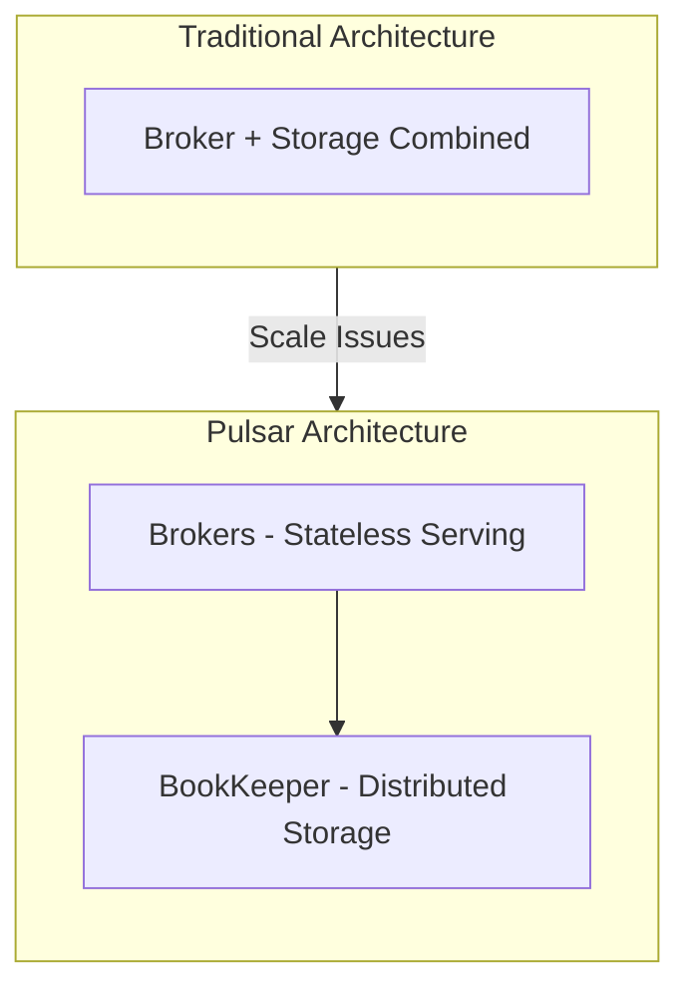
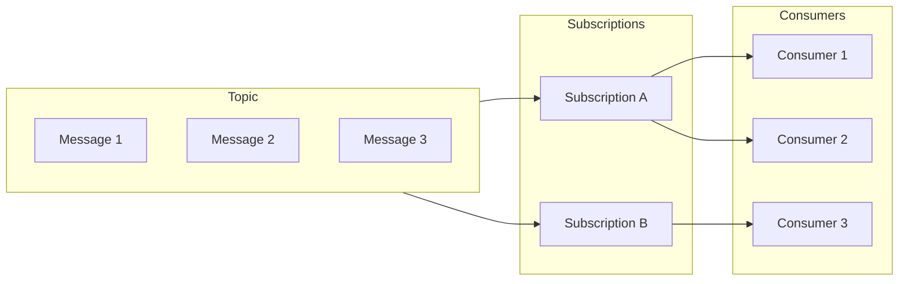
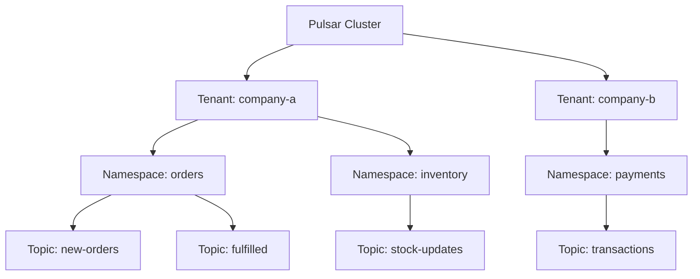
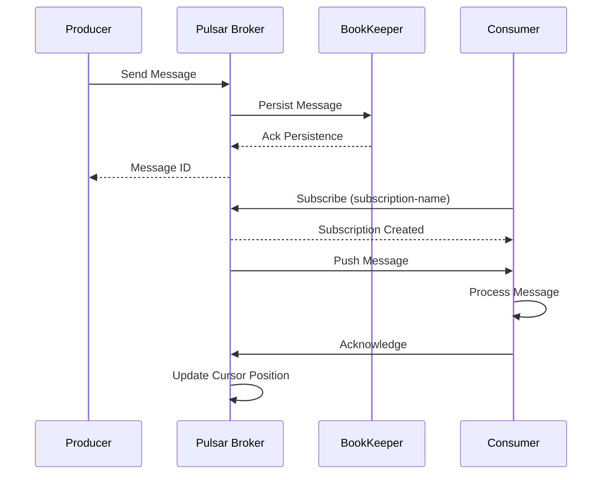
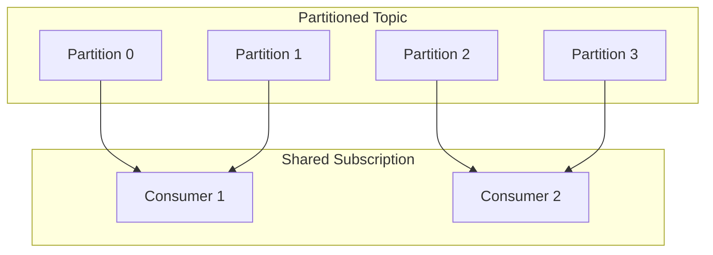
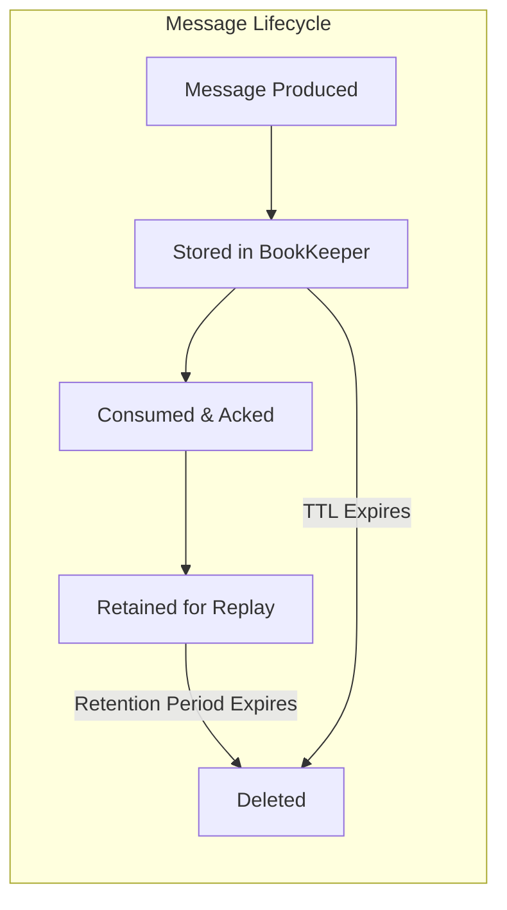

# How to Get Started with Apache Pulsar

Author: [nawazdhandala](https://www.github.com/nawazdhandala)

Tags: Apache Pulsar, Message Queue, Distributed Systems, Streaming, Backend Development

Description: A beginner's guide to Apache Pulsar covering installation, producers, consumers, topics, and subscriptions for building event-driven applications.

---

Apache Pulsar is a distributed messaging and streaming platform that has been gaining popularity as an alternative to traditional message brokers. Originally developed at Yahoo for handling massive scale messaging, Pulsar is now an Apache Software Foundation top-level project used by companies like Splunk, Verizon, and Comcast.

This guide will walk you through the fundamentals of Apache Pulsar, from running your first instance to building producers and consumers that can power event-driven applications.

## What Makes Apache Pulsar Different

Before diving into code, it helps to understand why Pulsar exists and what problems it solves.

Traditional message brokers like RabbitMQ work well for smaller deployments but can struggle at massive scale. Apache Kafka solved the scale problem but comes with operational complexity around partition management and rebalancing. Pulsar takes a different approach by separating the message serving layer from the storage layer.



This separation means you can scale compute and storage independently. Need more throughput? Add brokers. Need more storage? Add BookKeeper nodes. Neither operation requires rebalancing data across the cluster.

## Core Concepts

Before writing any code, let us establish the vocabulary you will encounter throughout this guide.

### Topics

Topics are named channels where messages flow. Producers write messages to topics, and consumers read from them. In Pulsar, topics follow a hierarchical naming scheme:

```
persistent://tenant/namespace/topic-name
```

For example: `persistent://my-app/orders/new-orders`

The `persistent` prefix indicates messages are stored durably. You can also use `non-persistent` for scenarios where message loss is acceptable in exchange for lower latency.

### Subscriptions

Subscriptions define how consumers receive messages from a topic. Unlike some message brokers where consumers connect directly to topics, Pulsar introduces subscriptions as a middle layer that controls message delivery patterns.



Pulsar supports four subscription types:

- **Exclusive**: Only one consumer can attach. Good for ordered processing.
- **Failover**: Multiple consumers can attach, but only one receives messages. Others are standby.
- **Shared**: Messages are distributed round-robin across consumers. Great for parallel processing.
- **Key_Shared**: Messages with the same key always go to the same consumer.

### Tenants and Namespaces

Pulsar organizes topics hierarchically using tenants and namespaces. This structure enables multi-tenancy and makes it easier to apply policies to groups of topics.



## Running Pulsar Locally

The fastest way to get started is using Docker. If you do not have Docker installed, grab it from [docker.com](https://docker.com).

```bash
# Pull the official Apache Pulsar image
docker pull apachepulsar/pulsar:3.3.0

# Run Pulsar in standalone mode
# This starts all components (broker, BookKeeper, ZooKeeper) in a single container
docker run -d \
  --name pulsar-standalone \
  -p 6650:6650 \
  -p 8080:8080 \
  apachepulsar/pulsar:3.3.0 \
  bin/pulsar standalone
```

Port 6650 is the binary protocol port for producers and consumers. Port 8080 is the HTTP admin API.

Verify Pulsar is running:

```bash
# Check the cluster status using the admin API
curl http://localhost:8080/admin/v2/clusters

# Expected output: ["standalone"]
```

If you see `["standalone"]` in the response, Pulsar is ready to accept connections.

## Your First Producer and Consumer

Let us start with the command-line tools to understand message flow before writing code.

### Using the CLI Tools

Open two terminal windows. In the first, start a consumer:

```bash
# Start a consumer that listens for messages
# The subscription name "my-subscription" identifies this consumer group
docker exec -it pulsar-standalone bin/pulsar-client consume \
  persistent://public/default/my-first-topic \
  --subscription-name my-subscription \
  --num-messages 0
```

The `--num-messages 0` flag tells the consumer to keep running and receive messages indefinitely.

In the second terminal, send some messages:

```bash
# Send a test message to the topic
docker exec -it pulsar-standalone bin/pulsar-client produce \
  persistent://public/default/my-first-topic \
  --messages "Hello from Pulsar!"

# Send multiple messages
docker exec -it pulsar-standalone bin/pulsar-client produce \
  persistent://public/default/my-first-topic \
  --messages "Message 1,Message 2,Message 3" \
  --separator ","
```

You should see the messages appear in your consumer terminal. This demonstrates the basic pub/sub pattern: producers publish to a topic, consumers subscribe and receive.

## Building a Python Producer

Now let us write actual code. We will use Python, but Pulsar has clients for Java, Go, Node.js, C++, and more.

First, install the Pulsar Python client:

```bash
pip install pulsar-client
```

Here is a producer that sends order events:

```python
# producer.py
# A simple Apache Pulsar producer that sends order events

import pulsar
import json
import time
from datetime import datetime

def create_order_event(order_id: int, customer_id: str, amount: float) -> dict:
    """
    Create an order event payload.
    In a real application, this would come from your order service.
    """
    return {
        "order_id": order_id,
        "customer_id": customer_id,
        "amount": amount,
        "currency": "USD",
        "timestamp": datetime.utcnow().isoformat(),
        "status": "created"
    }

def main():
    # Create a Pulsar client
    # The service URL points to the Pulsar broker
    client = pulsar.Client(
        service_url='pulsar://localhost:6650',
        operation_timeout_seconds=30
    )

    # Create a producer for the orders topic
    # Pulsar will auto-create the topic if it does not exist
    producer = client.create_producer(
        topic='persistent://public/default/orders',
        producer_name='order-service-producer',
        # Batching improves throughput by grouping messages
        batching_enabled=True,
        batching_max_publish_delay_ms=10
    )

    print("Producer started. Sending order events...")

    try:
        # Send 10 sample orders
        for i in range(10):
            # Create an order event
            order = create_order_event(
                order_id=1000 + i,
                customer_id=f"CUST-{i % 3}",  # Simulate 3 different customers
                amount=99.99 + (i * 10)
            )

            # Convert to JSON bytes
            message_bytes = json.dumps(order).encode('utf-8')

            # Send the message
            # The partition_key ensures orders from the same customer
            # go to the same partition (useful for ordering)
            message_id = producer.send(
                content=message_bytes,
                partition_key=order["customer_id"],
                properties={
                    "event_type": "order_created",
                    "version": "1.0"
                }
            )

            print(f"Sent order {order['order_id']} - Message ID: {message_id}")

            # Small delay between messages for demo purposes
            time.sleep(0.5)

        # Ensure all batched messages are sent
        producer.flush()
        print("All orders sent successfully!")

    finally:
        # Always close resources
        producer.close()
        client.close()

if __name__ == "__main__":
    main()
```

Run the producer:

```bash
python producer.py
```

You should see output showing each order being sent with its message ID.

## Building a Python Consumer

Now let us build a consumer to process those orders:

```python
# consumer.py
# A Pulsar consumer that processes order events

import pulsar
import json
from datetime import datetime

def process_order(order: dict) -> bool:
    """
    Process an order event.
    In a real application, this might update a database,
    trigger fulfillment, or send notifications.

    Returns True if processing succeeded, False otherwise.
    """
    order_id = order.get("order_id")
    amount = order.get("amount")
    customer = order.get("customer_id")

    print(f"  Processing order {order_id} for customer {customer}")
    print(f"  Amount: ${amount:.2f}")

    # Simulate processing logic
    # In reality, you would do actual work here
    if amount > 500:
        print(f"  High-value order detected! Flagging for review.")

    return True

def main():
    # Create a Pulsar client
    client = pulsar.Client('pulsar://localhost:6650')

    # Create a consumer with a shared subscription
    # Shared subscriptions allow multiple consumers to process messages in parallel
    consumer = client.subscribe(
        topic='persistent://public/default/orders',
        subscription_name='order-processor',
        # Shared mode distributes messages across all consumers
        consumer_type=pulsar.ConsumerType.Shared,
        # Start from the earliest available message
        initial_position=pulsar.InitialPosition.Earliest,
        # Unique name for this consumer instance
        consumer_name='processor-1',
        # How long to wait before redelivering unacknowledged messages
        negative_ack_redelivery_delay_ms=1000
    )

    print("Consumer started. Waiting for orders...")
    print("Press Ctrl+C to stop.\n")

    try:
        while True:
            # Receive a message with a 5-second timeout
            # Returns None if no message is available within the timeout
            try:
                msg = consumer.receive(timeout_millis=5000)
            except pulsar.Timeout:
                # No message available, continue waiting
                continue

            try:
                # Parse the message payload
                payload = json.loads(msg.data().decode('utf-8'))

                # Log receipt
                msg_id = msg.message_id()
                publish_time = datetime.fromtimestamp(msg.publish_timestamp() / 1000)
                print(f"Received message: {msg_id}")
                print(f"  Published at: {publish_time}")
                print(f"  Properties: {msg.properties()}")

                # Process the order
                success = process_order(payload)

                if success:
                    # Acknowledge the message
                    # Pulsar will not redeliver acknowledged messages
                    consumer.acknowledge(msg)
                    print(f"  Order processed and acknowledged.\n")
                else:
                    # Negative acknowledge triggers redelivery
                    consumer.negative_acknowledge(msg)
                    print(f"  Processing failed. Will retry.\n")

            except json.JSONDecodeError as e:
                print(f"  Failed to parse message: {e}")
                # Acknowledge bad messages to avoid infinite redelivery
                consumer.acknowledge(msg)

            except Exception as e:
                print(f"  Error processing message: {e}")
                consumer.negative_acknowledge(msg)

    except KeyboardInterrupt:
        print("\nShutting down consumer...")

    finally:
        consumer.close()
        client.close()
        print("Consumer stopped.")

if __name__ == "__main__":
    main()
```

Run the consumer:

```bash
python consumer.py
```

The consumer will receive and process all the orders sent by the producer. Notice how each message is acknowledged after successful processing. This acknowledgment tells Pulsar not to redeliver that message.

## Understanding Message Flow

Let us visualize what happens when producers and consumers interact:



Key points to understand:

1. **Messages are persisted before acknowledgment**: When a producer sends a message, Pulsar stores it in BookKeeper before returning success. This ensures durability.

2. **Cursors track progress**: Each subscription maintains a cursor that tracks which messages have been acknowledged. If a consumer restarts, it resumes from where it left off.

3. **Unacknowledged messages are redelivered**: If a consumer crashes without acknowledging, Pulsar will redeliver those messages to another consumer (in shared mode) or the same consumer when it reconnects.

## Working with Partitioned Topics

For high-throughput scenarios, you can partition topics across multiple brokers. Each partition can handle messages independently, enabling parallel processing.

Create a partitioned topic using the admin API:

```bash
# Create a topic with 4 partitions
docker exec -it pulsar-standalone bin/pulsar-admin topics create-partitioned-topic \
  persistent://public/default/high-volume-events \
  --partitions 4

# Verify the partitions were created
docker exec -it pulsar-standalone bin/pulsar-admin topics list-partitioned-topics public/default
```

Here is how to produce to a partitioned topic:

```python
# partitioned_producer.py
# Producing to a partitioned topic in Apache Pulsar

import pulsar
import json
import random

def main():
    client = pulsar.Client('pulsar://localhost:6650')

    # Create a producer for the partitioned topic
    # Pulsar automatically handles routing to partitions
    producer = client.create_producer(
        topic='persistent://public/default/high-volume-events',
        # Round-robin routing distributes messages evenly across partitions
        # Alternatively, use SinglePartition or CustomPartition
        batching_enabled=True
    )

    event_types = ["click", "view", "purchase", "signup"]

    try:
        for i in range(100):
            event = {
                "event_id": i,
                "event_type": random.choice(event_types),
                "user_id": f"user-{i % 10}",
                "value": random.randint(1, 100)
            }

            # Using partition_key ensures events from the same user
            # always go to the same partition, maintaining order per user
            producer.send(
                content=json.dumps(event).encode('utf-8'),
                partition_key=event["user_id"]
            )

        producer.flush()
        print("Sent 100 events to partitioned topic")

    finally:
        producer.close()
        client.close()

if __name__ == "__main__":
    main()
```

When consuming from partitioned topics, Pulsar distributes partitions among consumers in the same subscription:



## Implementing Dead Letter Queues

When message processing fails repeatedly, you do not want to block the queue forever. Dead letter queues (DLQ) provide a place for problematic messages after a configured number of retries.

```python
# consumer_with_dlq.py
# Consumer with dead letter queue configuration

import pulsar
import json

def main():
    client = pulsar.Client('pulsar://localhost:6650')

    # Configure dead letter policy
    # After 3 failed attempts, messages go to the DLQ topic
    dead_letter_policy = pulsar.ConsumerDeadLetterPolicy(
        max_redeliver_count=3,
        dead_letter_topic='persistent://public/default/orders-dlq'
    )

    consumer = client.subscribe(
        topic='persistent://public/default/orders',
        subscription_name='order-processor-with-dlq',
        consumer_type=pulsar.ConsumerType.Shared,
        initial_position=pulsar.InitialPosition.Earliest,
        # Attach the dead letter policy
        dead_letter_policy=dead_letter_policy,
        # Time before negative-acked messages are redelivered
        negative_ack_redelivery_delay_ms=1000
    )

    print("Consumer with DLQ started...")

    try:
        while True:
            try:
                msg = consumer.receive(timeout_millis=5000)
            except pulsar.Timeout:
                continue

            try:
                payload = json.loads(msg.data().decode('utf-8'))

                # Simulate a processing failure for demonstration
                if payload.get("amount", 0) > 150:
                    raise ValueError("Amount too high - simulated failure")

                print(f"Processed order {payload.get('order_id')}")
                consumer.acknowledge(msg)

            except Exception as e:
                print(f"Processing failed: {e}")
                print(f"Redelivery count: {msg.redelivery_count()}")

                # Negative acknowledge triggers redelivery
                # After max_redeliver_count failures, message goes to DLQ
                consumer.negative_acknowledge(msg)

    except KeyboardInterrupt:
        print("Shutting down...")

    finally:
        consumer.close()
        client.close()

if __name__ == "__main__":
    main()
```

You can then create a separate consumer to monitor and handle DLQ messages:

```python
# dlq_consumer.py
# Monitor and handle messages that failed processing

import pulsar
import json

def main():
    client = pulsar.Client('pulsar://localhost:6650')

    # Subscribe to the dead letter queue topic
    consumer = client.subscribe(
        topic='persistent://public/default/orders-dlq',
        subscription_name='dlq-handler',
        consumer_type=pulsar.ConsumerType.Exclusive,
        initial_position=pulsar.InitialPosition.Earliest
    )

    print("DLQ consumer started. Monitoring failed messages...")

    try:
        while True:
            try:
                msg = consumer.receive(timeout_millis=5000)
            except pulsar.Timeout:
                continue

            payload = json.loads(msg.data().decode('utf-8'))

            # Log the failed message for investigation
            print(f"DLQ Message received:")
            print(f"  Original topic: {msg.properties().get('ORIGIN_TOPIC', 'unknown')}")
            print(f"  Order ID: {payload.get('order_id')}")
            print(f"  Payload: {json.dumps(payload, indent=2)}")

            # In a real application, you might:
            # - Store in a database for manual review
            # - Send an alert to operations team
            # - Attempt alternative processing logic

            consumer.acknowledge(msg)

    except KeyboardInterrupt:
        print("Shutting down DLQ consumer...")

    finally:
        consumer.close()
        client.close()

if __name__ == "__main__":
    main()
```

## Message Retention and TTL

By default, Pulsar deletes messages after all subscriptions have acknowledged them. You can configure retention policies to keep messages longer for replay or auditing purposes.

```bash
# Set retention policy on a namespace
# Keep messages for 7 days or 10GB, whichever comes first
docker exec -it pulsar-standalone bin/pulsar-admin namespaces set-retention \
  public/default \
  --size 10G \
  --time 7d

# Set message TTL (time-to-live)
# Automatically acknowledge messages older than 1 hour if not consumed
docker exec -it pulsar-standalone bin/pulsar-admin namespaces set-message-ttl \
  public/default \
  --messageTTL 3600
```

The difference between retention and TTL:

- **Retention**: How long to keep messages after acknowledgment. Useful for replay.
- **TTL**: How long before unacknowledged messages are automatically discarded.



## Schema Registry

Pulsar includes a built-in schema registry that enforces message structure and handles schema evolution. This prevents producers from sending malformed data.

```python
# producer_with_schema.py
# Using Pulsar schemas for type-safe messaging

import pulsar
from pulsar.schema import Record, String, Integer, Float

# Define a schema using Pulsar's schema classes
class OrderEvent(Record):
    order_id = Integer()
    customer_id = String()
    amount = Float()
    currency = String()
    status = String()

def main():
    client = pulsar.Client('pulsar://localhost:6650')

    # Create a producer with schema enforcement
    # Pulsar will reject messages that do not match the schema
    producer = client.create_producer(
        topic='persistent://public/default/orders-typed',
        schema=pulsar.schema.AvroSchema(OrderEvent)
    )

    try:
        # Create and send a typed message
        order = OrderEvent(
            order_id=12345,
            customer_id="CUST-001",
            amount=199.99,
            currency="USD",
            status="created"
        )

        # Pulsar serializes using Avro automatically
        message_id = producer.send(order)
        print(f"Sent typed order: {message_id}")

        # This would fail at runtime because the schema requires all fields
        # invalid_order = OrderEvent(order_id=123)  # Missing required fields

    finally:
        producer.close()
        client.close()

if __name__ == "__main__":
    main()
```

Consumer with schema:

```python
# consumer_with_schema.py
# Consuming schema-enforced messages

import pulsar
from pulsar.schema import Record, String, Integer, Float

class OrderEvent(Record):
    order_id = Integer()
    customer_id = String()
    amount = Float()
    currency = String()
    status = String()

def main():
    client = pulsar.Client('pulsar://localhost:6650')

    consumer = client.subscribe(
        topic='persistent://public/default/orders-typed',
        subscription_name='typed-processor',
        # Use the same schema as the producer
        schema=pulsar.schema.AvroSchema(OrderEvent)
    )

    try:
        while True:
            try:
                msg = consumer.receive(timeout_millis=5000)
            except pulsar.Timeout:
                continue

            # Message value is automatically deserialized to OrderEvent
            order = msg.value()

            # Access typed fields directly
            print(f"Order {order.order_id}: ${order.amount} {order.currency}")

            consumer.acknowledge(msg)

    except KeyboardInterrupt:
        pass

    finally:
        consumer.close()
        client.close()

if __name__ == "__main__":
    main()
```

## Monitoring Your Pulsar Instance

Pulsar exposes metrics via the admin API. Here are useful commands for monitoring:

```bash
# Get cluster health
docker exec -it pulsar-standalone bin/pulsar-admin brokers healthcheck

# List all topics
docker exec -it pulsar-standalone bin/pulsar-admin topics list public/default

# Get topic stats including message counts and rates
docker exec -it pulsar-standalone bin/pulsar-admin topics stats \
  persistent://public/default/orders

# Check subscription backlog (unprocessed messages)
docker exec -it pulsar-standalone bin/pulsar-admin topics stats \
  persistent://public/default/orders | grep -A5 "subscriptions"

# Get namespace-level statistics
docker exec -it pulsar-standalone bin/pulsar-admin namespaces stats public/default
```

For production deployments, you would typically scrape metrics from the `/metrics` endpoint and visualize them in Grafana:

```bash
# Fetch Prometheus-format metrics
curl http://localhost:8080/metrics
```

## Best Practices for Getting Started

As you begin building with Pulsar, keep these practices in mind:

**Use meaningful subscription names.** Subscriptions persist even when consumers disconnect. Use names that describe the consumer's purpose, like `order-fulfillment-service` instead of `sub1`.

**Start with Shared subscriptions.** Unless you need strict ordering, Shared subscriptions give you horizontal scalability out of the box.

**Implement idempotent consumers.** Messages may be delivered more than once in failure scenarios. Design your processing logic to handle duplicates safely.

**Configure dead letter queues.** Do not let poison messages block your queues. Set up DLQs and monitor them.

**Use partition keys for related messages.** When message order matters within a group (like all events for a user), use partition keys to ensure they go to the same partition.

**Close resources properly.** Always close producers, consumers, and clients in finally blocks or using context managers to avoid resource leaks.

## Next Steps

You now have the foundation to build event-driven applications with Apache Pulsar. From here, you might explore:

- **Pulsar Functions** for serverless stream processing directly within Pulsar
- **Geo-replication** for multi-datacenter deployments
- **Tiered storage** for offloading old messages to cheaper object storage
- **Transaction support** for exactly-once processing semantics

The official [Apache Pulsar documentation](https://pulsar.apache.org/docs) covers these advanced topics in depth.

---

Building distributed messaging systems requires visibility into what is happening across your infrastructure. As your Pulsar deployment grows, monitoring message throughput, consumer lag, and system health becomes essential. [OneUptime](https://oneuptime.com) provides comprehensive monitoring for distributed systems like Apache Pulsar, with metrics collection, alerting, and dashboards that help you keep your event-driven applications running smoothly.
